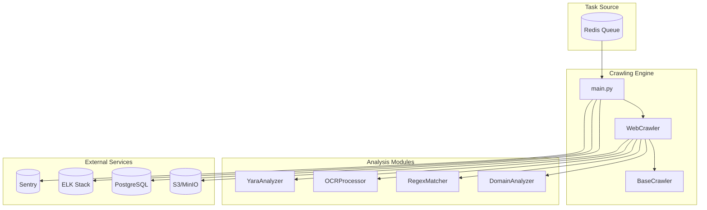
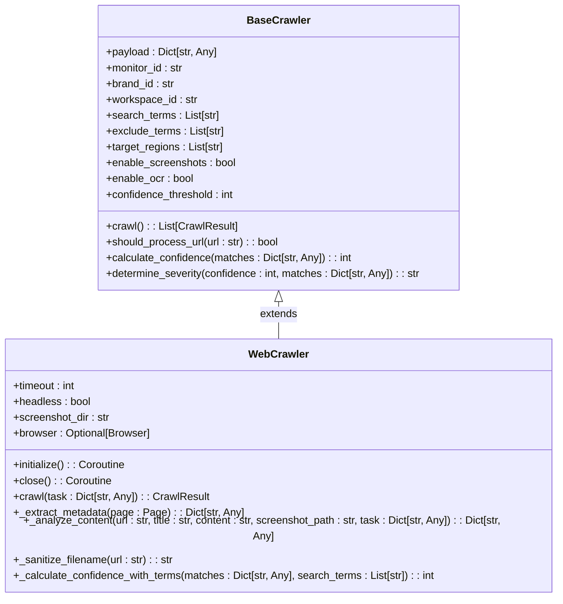
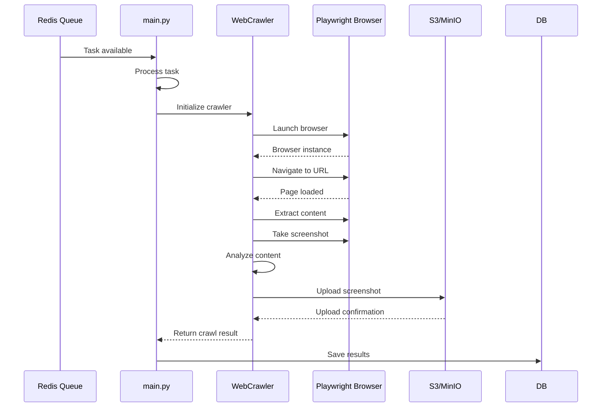
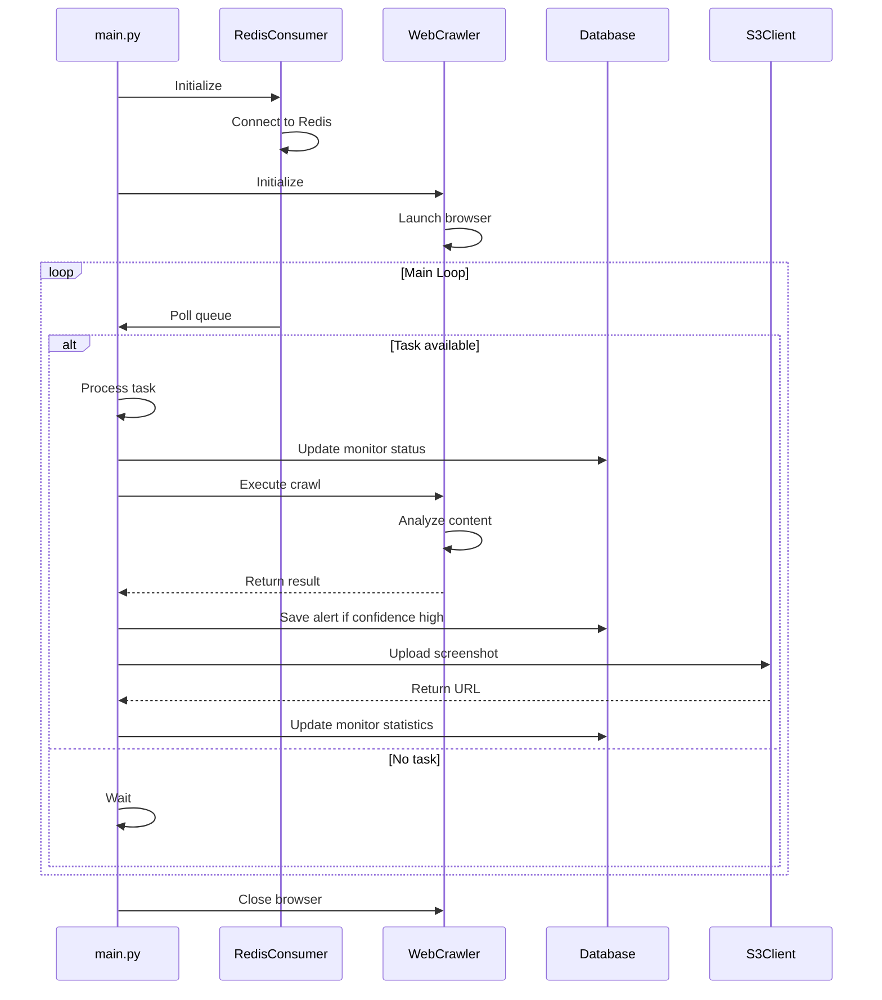

# Crawling System

<cite>
**Referenced Files in This Document**   
- [web_crawler.py](file://services/engine/crawlers/web_crawler.py)
- [base_crawler.py](file://services/engine/crawlers/base_crawler.py)
- [config.py](file://services/engine/config.py)
- [main.py](file://services/engine/main.py)
- [redis_client.py](file://services/engine/utils/redis_client.py)
- [logger.py](file://services/engine/utils/logger.py)
- [domain_analyzer.py](file://services/engine/analyzers/domain_analyzer.py)
- [regex_matcher.py](file://services/engine/analyzers/regex_matcher.py)
- [ocr_processor.py](file://services/engine/analyzers/ocr_processor.py)
- [yara_analyzer.py](file://services/engine/analyzers/yara_analyzer.py)
- [db_client.py](file://services/engine/utils/db_client.py)
- [s3_client.py](file://services/engine/utils/s3_client.py)
</cite>

## Table of Contents
1. [Introduction](#introduction)
2. [Architecture Overview](#architecture-overview)
3. [Core Components](#core-components)
4. [Crawler Inheritance and Extension](#crawler-inheritance-and-extension)
5. [Data Discovery and Ingestion](#data-discovery-and-ingestion)
6. [Error Handling and Resilience](#error-handling-and-resilience)
7. [Configuration Management](#configuration-management)
8. [Task Processing and Integration](#task-processing-and-integration)
9. [Common Challenges and Solutions](#common-challenges-and-solutions)
10. [Performance and Scaling](#performance-and-scaling)

## Introduction
The crawling system is a critical component of the data processing engine, responsible for discovering and ingesting data from external sources to detect brand infringements. This document provides a comprehensive analysis of the web crawling architecture, implementation details, and operational characteristics. The system is designed to handle dynamic web content, perform sophisticated analysis, and integrate seamlessly with the broader data processing pipeline.

## Architecture Overview

**Diagram sources**
- [main.py](file://services/engine/main.py#L1-L284)
- [web_crawler.py](file://services/engine/crawlers/web_crawler.py#L1-L358)
- [base_crawler.py](file://services/engine/crawlers/base_crawler.py#L1-L159)

## Core Components

The crawling system consists of several interconnected components that work together to discover, analyze, and process web content for brand infringement detection. The architecture follows a modular design with clear separation of concerns, enabling extensibility and maintainability.

### Web Crawler Implementation
The `WebCrawler` class is the primary implementation for web content crawling, built on top of Playwright for browser automation. It handles the complete lifecycle of crawling operations, from browser initialization to page navigation, content extraction, and result processing. The crawler is designed to execute asynchronously, allowing for efficient resource utilization and concurrent processing of multiple tasks.

### Analysis Modules
The system incorporates multiple analysis modules that work in concert to detect brand infringements:
- **DomainAnalyzer**: Identifies suspicious domain patterns using wildcard-based matching and typosquatting detection
- **RegexMatcher**: Performs content analysis using regular expressions to identify brand-related patterns
- **OCRProcessor**: Extracts text from screenshots to detect brand mentions in images
- **YaraAnalyzer**: Applies advanced pattern matching rules for sophisticated threat detection

These modules are integrated into the crawling process to provide comprehensive analysis of both textual and visual content.

**Section sources**
- [web_crawler.py](file://services/engine/crawlers/web_crawler.py#L14-L358)
- [domain_analyzer.py](file://services/engine/analyzers/domain_analyzer.py#L1-L120)
- [regex_matcher.py](file://services/engine/analyzers/regex_matcher.py#L1-L70)
- [ocr_processor.py](file://services/engine/analyzers/ocr_processor.py#L1-L150)
- [yara_analyzer.py](file://services/engine/analyzers/yara_analyzer.py#L1-L95)

## Crawler Inheritance and Extension

**Diagram sources**
- [base_crawler.py](file://services/engine/crawlers/base_crawler.py#L50-L159)
- [web_crawler.py](file://services/engine/crawlers/web_crawler.py#L14-L358)

The crawling system employs an inheritance-based architecture with `BaseCrawler` serving as the abstract base class and `WebCrawler` as its concrete implementation. This design pattern enables code reuse, consistent interface definition, and extensibility for future crawler types.

The `BaseCrawler` class defines the fundamental structure and shared functionality for all crawler implementations. It handles task payload parsing, configuration extraction, and common utility methods such as URL filtering and confidence calculation. The abstract `crawl()` method enforces a consistent interface across all crawler types.

The `WebCrawler` class extends `BaseCrawler` to provide a concrete implementation for web content crawling. It adds browser-specific functionality, including Playwright integration, page navigation, and screenshot capture. The inheritance relationship allows `WebCrawler` to inherit the configuration management and utility methods from `BaseCrawler` while implementing specialized web crawling logic.

This extension pattern enables the system to support multiple crawler types in the future, such as API crawlers, file system crawlers, or specialized content crawlers, all sharing the same configuration and result processing infrastructure.

**Section sources**
- [base_crawler.py](file://services/engine/crawlers/base_crawler.py#L50-L159)
- [web_crawler.py](file://services/engine/crawlers/web_crawler.py#L14-L358)

## Data Discovery and Ingestion

**Diagram sources**
- [main.py](file://services/engine/main.py#L44-L267)
- [web_crawler.py](file://services/engine/crawlers/web_crawler.py#L70-L174)
- [s3_client.py](file://services/engine/utils/s3_client.py#L42-L128)

The data discovery and ingestion process follows a structured workflow that ensures reliable and comprehensive content analysis. The crawler discovers data through task-driven execution, where each crawling operation is initiated by a task from the Redis queue containing specific crawling parameters.

The ingestion process begins with URL navigation using Playwright, which renders the web page in a full browser environment. This approach enables the crawler to handle JavaScript-heavy websites and dynamic content that would be inaccessible through simple HTTP requests. The crawler waits for network idle state to ensure all content is loaded before proceeding with analysis.

During ingestion, the crawler extracts multiple types of data from the web page:
- HTML content for text-based analysis
- Page metadata (title, meta tags, links)
- Full-page screenshots for visual analysis
- Dynamic content generated by JavaScript

The extracted data is then processed by multiple analysis modules in parallel to detect brand infringements. The system captures both textual and visual evidence, ensuring comprehensive coverage of potential infringement types. Screenshots are stored in S3/MinIO for long-term retention and further analysis, while the extracted content is analyzed immediately for infringement detection.

**Section sources**
- [web_crawler.py](file://services/engine/crawlers/web_crawler.py#L70-L174)
- [main.py](file://services/engine/main.py#L44-L267)
- [s3_client.py](file://services/engine/utils/s3_client.py#L42-L128)

## Error Handling and Resilience

The crawling system implements comprehensive error handling and resilience mechanisms to ensure reliable operation in the face of various challenges. The system is designed to gracefully handle network issues, browser errors, and content processing failures while maintaining data integrity and operational continuity.

### HTTP and Browser Error Handling
The `WebCrawler` class includes specific exception handling for Playwright timeout errors, which are common when dealing with slow-loading or unresponsive websites. When a timeout occurs, the crawler logs the error and returns a structured failure result, allowing the system to track and analyze failure patterns without crashing.

For other exceptions, the system captures the full stack trace and returns a generic error result. This approach prevents individual task failures from affecting the overall operation of the crawling engine. The main loop continues processing subsequent tasks, ensuring that isolated failures do not halt the entire system.

### Graceful Shutdown
The system implements signal handlers for SIGINT and SIGTERM, enabling graceful shutdown when the container is stopped. During shutdown, the crawler completes any ongoing tasks, closes the browser instance properly, and performs cleanup operations. This ensures that resources are released correctly and prevents potential issues with browser instances left running.

### Database Transaction Management
The system uses context managers for database operations, ensuring that transactions are properly committed or rolled back in case of errors. This prevents data corruption and maintains consistency in the database, even when processing failures occur.

**Section sources**
- [web_crawler.py](file://services/engine/crawlers/web_crawler.py#L161-L174)
- [main.py](file://services/engine/main.py#L37-L42)
- [db_client.py](file://services/engine/utils/db_client.py#L59-L76)

## Configuration Management

```mermaid
flowchart TD
Config[config.py] --> Redis["Redis Configuration"]
Config --> Database["Database Configuration"]
Config --> Crawler["Crawler Configuration"]
Config --> Playwright["Playwright Configuration"]
Config --> OCR["OCR Configuration"]
Config --> Performance["Performance Configuration"]
Config --> Logging["Logging Configuration"]
Config --> ELK["ELK Integration"]
Config --> Sentry["Sentry Integration"]
Config --> S3["S3/MinIO Configuration"]
Redis --> REDIS_URL
Redis --> REDIS_QUEUE_NAME
Redis --> REDIS_POLL_INTERVAL
Database --> DATABASE_URL
Crawler --> CRAWLER_TIMEOUT
Crawler --> MAX_CONCURRENT_CRAWLS
Playwright --> PLAYWRIGHT_HEADLESS
Playwright --> SCREENSHOT_DIR
OCR --> TESSERACT_LANG
Performance --> MIN_CONFIDENCE
Performance --> LOG_RETENTION_DAYS
Logging --> LOG_LEVEL
Logging --> LOG_FILE
ELK --> ELK_ENABLED
ELK --> LOGSTASH_HOST
ELK --> LOGSTASH_PORT
Sentry --> SENTRY_DSN
Sentry --> SENTRY_ENVIRONMENT
Sentry --> SENTRY_TRACES_SAMPLE_RATE
S3 --> S3_ENDPOINT
S3 --> S3_REGION
S3 --> S3_ACCESS_KEY
S3 --> S3_SECRET_KEY
S3 --> S3_BUCKET_DEV
S3 --> S3_BUCKET_PROD
S3 --> S3_PUBLIC_URL
```

**Diagram sources**
- [config.py](file://services/engine/config.py#L1-L78)

The configuration system is centralized in the `config.py` file, which reads settings from environment variables to support different deployment environments. This approach enables flexible configuration management across development, testing, and production environments without code changes.

Key configuration categories include:
- **Crawler Configuration**: Controls crawling behavior such as timeout duration and maximum concurrent crawls
- **Playwright Configuration**: Manages browser behavior, including headless mode and screenshot directory
- **Performance Configuration**: Sets thresholds for confidence scoring and log retention
- **Integration Configuration**: Configures connections to external services like Redis, PostgreSQL, S3/MinIO, ELK, and Sentry

The system uses sensible defaults for all configuration values, ensuring that the crawler can operate even when specific environment variables are not set. This design promotes ease of deployment and reduces configuration errors.

**Section sources**
- [config.py](file://services/engine/config.py#L1-L78)

## Task Processing and Integration

**Diagram sources**
- [main.py](file://services/engine/main.py#L195-L267)
- [redis_client.py](file://services/engine/utils/redis_client.py#L10-L89)
- [db_client.py](file://services/engine/utils/db_client.py#L59-L76)
- [s3_client.py](file://services/engine/utils/s3_client.py#L17-L160)

The task processing workflow is orchestrated by the `main.py` module, which implements a continuous consumer loop that processes crawling tasks from the Redis queue. The integration between components follows a producer-consumer pattern, with external systems adding tasks to the queue and the crawling engine consuming and processing them.

The main loop initializes all required components, including the Redis consumer, web crawler, and database connections. It then enters a continuous processing cycle where it polls the Redis queue for new tasks at regular intervals defined by `REDIS_POLL_INTERVAL`.

When a task is received, the system updates the monitor status in the database to reflect the current processing activity. The crawler executes the crawling operation and returns a structured result containing the analysis data. Based on the confidence score, the system may create a brand alert in the database and upload the screenshot to S3/MinIO for long-term storage.

The integration with Redis enables distributed task queuing, allowing multiple crawler instances to process tasks in parallel. The database integration ensures that all crawling results are persisted for further analysis and reporting. The S3/MinIO integration provides scalable storage for screenshots and other binary data.

**Section sources**
- [main.py](file://services/engine/main.py#L195-L267)
- [redis_client.py](file://services/engine/utils/redis_client.py#L10-L89)
- [db_client.py](file://services/engine/utils/db_client.py#L59-L76)
- [s3_client.py](file://services/engine/utils/s3_client.py#L17-L160)

## Common Challenges and Solutions

The crawling system addresses several common challenges encountered in web crawling and brand infringement detection through specialized implementations and architectural decisions.

### Blocked IPs and Rate Limiting
The system handles rate limiting through configuration-driven timeouts and retry mechanisms. While explicit rate limiting logic is not shown in the provided code, the asynchronous nature of the crawler and the task queue architecture naturally provide rate limiting by controlling the number of concurrent crawls through the `MAX_CONCURRENT_CRAWLS` configuration parameter.

### CAPTCHA Handling
The current implementation does not include specific CAPTCHA handling mechanisms. However, the use of Playwright with a full browser environment provides a foundation for implementing CAPTCHA solving solutions, such as integrating with CAPTCHA solving services or implementing automated solving techniques.

### Dynamic Content Loading
The system effectively handles dynamic content loading through Playwright's ability to execute JavaScript and wait for network idle state. By using `wait_until='networkidle'` in the `page.goto()` call, the crawler ensures that all AJAX requests and dynamic content have loaded before proceeding with analysis.

### Headless Browser Detection
The crawler mitigates headless browser detection by launching Chromium with common sandbox disabling arguments (`--no-sandbox`, `--disable-setuid-sandbox`). These arguments help prevent websites from detecting the automated nature of the browser, although more sophisticated detection methods may still identify the crawler.

**Section sources**
- [web_crawler.py](file://services/engine/crawlers/web_crawler.py#L54-L57)
- [web_crawler.py](file://services/engine/crawlers/web_crawler.py#L102)
- [config.py](file://services/engine/config.py#L28)

## Performance and Scaling

The crawling system incorporates several performance and scaling considerations to handle large volumes of crawling tasks efficiently.

### Concurrency Management
The system manages concurrency through the `MAX_CONCURRENT_CRAWLS` configuration parameter, which limits the number of simultaneous crawling operations. This prevents resource exhaustion and ensures stable operation under heavy load. The asynchronous design using asyncio enables efficient resource utilization, allowing multiple crawling operations to proceed concurrently without blocking.

### Resource Optimization
The crawler optimizes resource usage by reusing the browser instance across multiple crawling tasks. The browser is initialized once and maintained throughout the lifecycle of the crawler, reducing the overhead of launching and closing browser instances for each task. Screenshots are stored locally during processing and uploaded to S3/MinIO, with local files deleted after successful upload to conserve disk space.

### Horizontal Scaling
The architecture supports horizontal scaling through the Redis-based task queue. Multiple crawler instances can connect to the same Redis queue, automatically distributing the workload across available resources. This enables the system to scale out by adding additional crawler instances as needed to handle increased crawling demands.

### Monitoring and Observability
The system integrates with multiple monitoring and observability tools:
- **Sentry**: Provides error tracking and performance monitoring
- **ELK Stack**: Enables centralized logging and log analysis
- **Redis**: Offers queue metrics and health monitoring
- **Database**: Tracks processing statistics and success rates

These integrations provide comprehensive visibility into system performance, enabling proactive issue detection and capacity planning.

**Section sources**
- [config.py](file://services/engine/config.py#L28)
- [main.py](file://services/engine/main.py#L209)
- [web_crawler.py](file://services/engine/crawlers/web_crawler.py#L47-L68)
- [s3_client.py](file://services/engine/utils/s3_client.py#L117-L119)