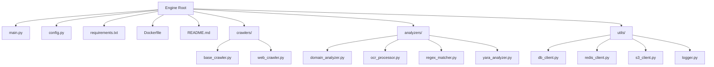
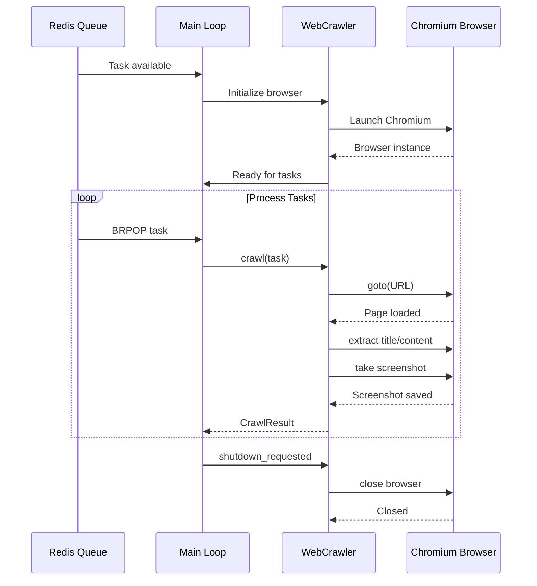
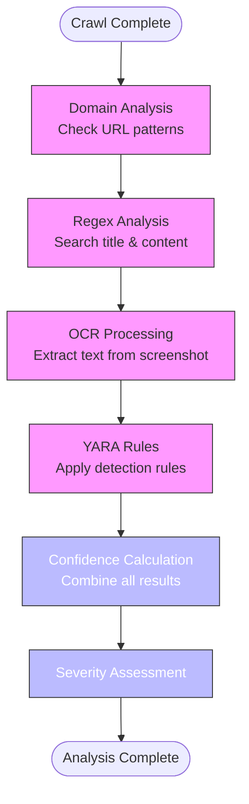
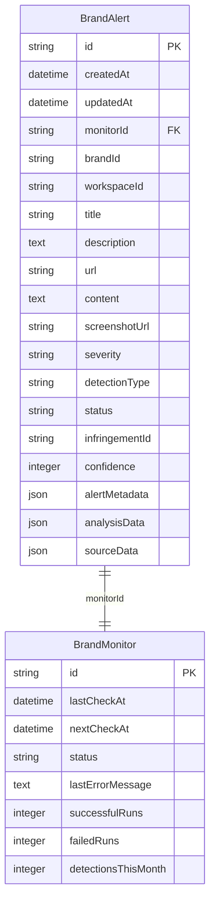
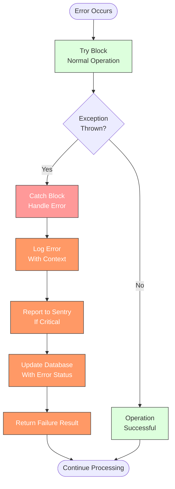

# Data Processing Engine

<cite>
**Referenced Files in This Document**   
- [main.py](file://services/engine/main.py)
- [config.py](file://services/engine/config.py)
- [web_crawler.py](file://services/engine/crawlers/web_crawler.py)
- [base_crawler.py](file://services/engine/crawlers/base_crawler.py)
- [domain_analyzer.py](file://services/engine/analyzers/domain_analyzer.py)
- [ocr_processor.py](file://services/engine/analyzers/ocr_processor.py)
- [regex_matcher.py](file://services/engine/analyzers/regex_matcher.py)
- [yara_analyzer.py](file://services/engine/analyzers/yara_analyzer.py)
- [db_client.py](file://services/engine/utils/db_client.py)
- [redis_client.py](file://services/engine/utils/redis_client.py)
- [s3_client.py](file://services/engine/utils/s3_client.py)
- [logger.py](file://services/engine/utils/logger.py)
- [Dockerfile](file://services/engine/Dockerfile)
- [requirements.txt](file://services/engine/requirements.txt)
- [README.md](file://services/engine/README.md)
</cite>

## Table of Contents
1. [Introduction](#introduction)
2. [Project Structure](#project-structure)
3. [Crawling System](#crawling-system)
4. [Analysis Pipeline](#analysis-pipeline)
5. [Data Persistence](#data-persistence)
6. [Configuration Management](#configuration-management)
7. [Error Handling](#error-handling)
8. [Docker Deployment](#docker-deployment)
9. [Performance and Scalability](#performance-and-scalability)
10. [Architecture Overview](#architecture-overview)

## Introduction

The Data Processing Engine is a Python-based system designed for brand protection and monitoring. It collects data from external sources through web crawling, analyzes the content using multiple detection methods, and persists findings to a database for further action. The engine is specifically built for the SentinelIQ Eclipse module and operates as a consumer in a distributed system architecture.

The core functionality revolves around detecting brand infringements by analyzing web content for specific patterns, domain characteristics, and visual elements. The system processes tasks from a Redis queue, performs comprehensive analysis on target URLs, and creates alerts when confidence thresholds are met. It integrates with various external services including PostgreSQL for data storage, S3/MinIO for file storage, and Sentry for error monitoring.

This documentation provides a comprehensive overview of the engine's architecture, components, and operational characteristics, focusing on the crawling system, analysis pipeline, data persistence mechanisms, configuration management, error handling, deployment strategy, and performance considerations.

## Project Structure

The Data Processing Engine follows a modular structure with clearly defined components organized in dedicated directories. The main components are organized as follows:



**Diagram sources**
- [main.py](file://services/engine/main.py)
- [config.py](file://services/engine/config.py)

**Section sources**
- [main.py](file://services/engine/main.py)
- [README.md](file://services/engine/README.md)

## Crawling System

The crawling system is implemented in the `web_crawler.py` file and uses Playwright with Chromium for browser automation. The `WebCrawler` class extends the `BaseCrawler` abstract class and provides the core functionality for navigating to URLs, extracting content, and capturing screenshots.

The crawler operates in an asynchronous manner using Python's asyncio framework, allowing for efficient handling of I/O operations. It initializes a browser instance upon startup and reuses it for multiple crawl operations to minimize overhead. The crawling process involves navigating to a specified URL with a configurable timeout, extracting page content (HTML, title, metadata), and taking a full-page screenshot that is saved to a local directory.

The system supports both headless and non-headless operation modes, configurable through environment variables. When processing a task, the crawler receives a configuration payload from the Redis queue that includes the target URL, search terms, domain patterns, and other parameters that guide the analysis process. The crawler also implements graceful shutdown handling to ensure proper cleanup of browser resources.



**Diagram sources**
- [main.py](file://services/engine/main.py#L194-L266)
- [web_crawler.py](file://services/engine/crawlers/web_crawler.py#L70-L174)

**Section sources**
- [web_crawler.py](file://services/engine/crawlers/web_crawler.py)
- [base_crawler.py](file://services/engine/crawlers/base_crawler.py)

## Analysis Pipeline

The analysis pipeline consists of multiple specialized analyzers that work together to detect brand infringements through different detection methods. These analyzers are orchestrated by the `WebCrawler` class and include domain analysis, regex matching, OCR processing, and optional YARA rule matching.

The `DomainAnalyzer` examines URLs for suspicious domain patterns using wildcard-to-regex conversion. It can detect typosquatting attempts and other domain-based infringements by comparing the target domain against configured patterns. The `RegexMatcher` searches for specific text patterns in both the page title and content, supporting case-insensitive matching with configurable regex patterns.

The `OCRProcessor` extracts text from screenshots using Tesseract OCR, enabling the detection of brand references that may be present in images rather than HTML text. This is particularly important for identifying logo usage or text embedded in images. The `YaraAnalyzer` provides advanced pattern detection capabilities through YARA rules, allowing for sophisticated signature-based detection of malicious content or specific file patterns.

These analyzers work in concert to provide a comprehensive detection system. The results from each analyzer are combined to calculate an overall confidence score, which determines whether an alert should be created. The analysis pipeline is designed to be extensible, allowing for the addition of new analyzer types without modifying the core crawling logic.



**Diagram sources**
- [web_crawler.py](file://services/engine/crawlers/web_crawler.py#L214-L357)
- [domain_analyzer.py](file://services/engine/analyzers/domain_analyzer.py)
- [regex_matcher.py](file://services/engine/analyzers/regex_matcher.py)
- [ocr_processor.py](file://services/engine/analyzers/ocr_processor.py)
- [yara_analyzer.py](file://services/engine/analyzers/yara_analyzer.py)

**Section sources**
- [domain_analyzer.py](file://services/engine/analyzers/domain_analyzer.py)
- [ocr_processor.py](file://services/engine/analyzers/ocr_processor.py)
- [regex_matcher.py](file://services/engine/analyzers/regex_matcher.py)
- [yara_analyzer.py](file://services/engine/analyzers/yara_analyzer.py)

## Data Persistence

The data persistence mechanism is implemented through the `db_client.py` file, which provides an interface to the PostgreSQL database using SQLAlchemy. The system uses two primary models: `BrandAlert` for storing detection results and `BrandMonitor` for tracking monitor status and statistics.

The `BrandAlert` model stores comprehensive information about detected infringements, including the URL, title, content snippet, screenshot URL, severity level, confidence score, and detailed analysis data in JSON format. This allows for rich querying and reporting capabilities. The `BrandMonitor` model tracks the operational status of each monitoring configuration, including success/failure counts, last check timestamp, and error messages.

Database operations are managed through a context manager (`get_db_session`) that ensures proper session handling, transaction management, and error recovery. The system follows a pattern of creating a database session for each task processing operation, committing changes when successful, and rolling back in case of errors. This approach ensures data consistency while maintaining performance.

The persistence layer also integrates with S3/MinIO storage for managing screenshots. When a detection occurs, the local screenshot is uploaded to object storage, and the resulting public URL is stored in the database. This decouples the engine from local storage requirements and enables scalable storage of binary assets.



**Diagram sources**
- [db_client.py](file://services/engine/utils/db_client.py)
- [main.py](file://services/engine/main.py#L81-L163)

**Section sources**
- [db_client.py](file://services/engine/utils/db_client.py)
- [s3_client.py](file://services/engine/utils/s3_client.py)

## Configuration Management

Configuration management is handled through the `config.py` file, which reads settings from environment variables. The system uses the python-dotenv library to load variables from a `.env` file during local development, while in production these variables are provided through the container environment or orchestration platform.

The configuration is organized into logical sections including Redis, database, crawler, Playwright, OCR, performance, logging, ELK stack integration, Sentry, and S3/MinIO settings. Each configuration parameter has a sensible default value to facilitate local development and testing, while production deployments are expected to override these defaults with appropriate values.

Key configuration parameters include connection strings for Redis and PostgreSQL, timeout values for crawler operations, concurrency limits, logging levels, and storage endpoints. The system also supports environment-specific configuration through the `NODE_ENV` variable, which determines which S3 bucket to use (development vs. production).

The configuration approach follows the twelve-factor app methodology, treating config as environment variables. This enables the same codebase to be deployed across different environments (development, staging, production) without code changes, simply by adjusting the environment variables.

```mermaid
graph TD
Config[Configuration System]
Config --> EnvVars[Environment Variables]
Config --> Dotenv[.env File]
Config --> Defaults[Default Values]
EnvVars --> Redis[Redis Configuration]
EnvVars --> Database[Database Configuration]
EnvVars --> Crawler[Crawler Configuration]
EnvVars --> Playwright[Playwright Configuration]
EnvVars --> OCR[OCR Configuration]
EnvVars --> Logging[Logging Configuration]
EnvVars --> Sentry[Sentry Configuration]
EnvVars --> S3[S3/MinIO Configuration]
Dotenv --> |Development| EnvVars
Defaults --> |Fallback| EnvVars
Redis --> REDIS_URL[REDIS_URL]
Redis --> REDIS_QUEUE_NAME[REDIS_QUEUE_NAME]
Redis --> REDIS_POLL_INTERVAL[REDIS_POLL_INTERVAL]
Database --> DATABASE_URL[DATABASE_URL]
Crawler --> CRAWLER_TIMEOUT[CRAWLER_TIMEOUT]
Crawler --> MAX_CONCURRENT_CRAWLS[MAX_CONCURRENT_CRAWLS]
Playwright --> PLAYWRIGHT_HEADLESS[PLAYWRIGHT_HEADLESS]
Playwright --> SCREENSHOT_DIR[SCREENSHOT_DIR]
OCR --> TESSERACT_LANG[TESSERACT_LANG]
Logging --> LOG_LEVEL[LOG_LEVEL]
Logging --> LOG_FILE[LOG_FILE]
Logging --> ELK_ENABLED[ELK_ENABLED]
Logging --> LOGSTASH_HOST[LOGSTASH_HOST]
Logging --> LOGSTASH_PORT[LOGSTASH_PORT]
Sentry --> SENTRY_DSN[SENTRY_DSN]
Sentry --> SENTRY_ENVIRONMENT[SENTRY_ENVIRONMENT]
Sentry --> SENTRY_TRACES_SAMPLE_RATE[SENTRY_TRACES_SAMPLE_RATE]
S3 --> S3_ENDPOINT[S3_ENDPOINT]
S3 --> S3_REGION[S3_REGION]
S3 --> S3_ACCESS_KEY[S3_ACCESS_KEY]
S3 --> S3_SECRET_KEY[S3_SECRET_KEY]
S3 --> S3_BUCKET_DEV[S3_BUCKET_DEV]
S3 --> S3_BUCKET_PROD[S3_BUCKET_PROD]
S3 --> S3_PUBLIC_URL[S3_PUBLIC_URL]
```



**Diagram sources**
- [config.py](file://services/engine/config.py)
- [main.py](file://services/engine/main.py#L18-L27)

**Section sources**
- [config.py](file://services/engine/config.py)

## Error Handling

The system implements comprehensive error handling at multiple levels to ensure reliability and graceful degradation. Errors are handled through a combination of try-except blocks, logging, and error tracking with Sentry.

In the main processing loop, exceptions are caught and logged, with the system attempting to update the monitor status in the database to reflect the failure. If database operations fail during error handling, these are caught separately to prevent cascading failures. The system also implements signal handlers for SIGINT and SIGTERM to enable graceful shutdown when the container is stopped.

Each component has its own error handling mechanisms. The `WebCrawler` handles Playwright-specific exceptions like timeouts, as well as general exceptions during page navigation and content extraction. The `RedisConsumer` handles connection errors, JSON decoding errors, and Redis-specific exceptions, returning None when a task cannot be consumed rather than crashing.

The `S3Client` handles AWS SDK exceptions during upload operations, logging detailed error information and returning None when uploads fail, allowing the system to continue with local screenshot references. The `OCRProcessor` gracefully handles missing dependencies by disabling OCR functionality and logging a warning rather than preventing the entire engine from starting.

All errors are logged using the `logger.py` module, which provides structured logging with context information. Critical errors are also reported to Sentry for monitoring and alerting, with appropriate sampling rates configured for different environments.



**Diagram sources**
- [main.py](file://services/engine/main.py#L177-L192)
- [web_crawler.py](file://services/engine/crawlers/web_crawler.py#L161-L174)
- [redis_client.py](file://services/engine/utils/redis_client.py#L38-L46)
- [s3_client.py](file://services/engine/utils/s3_client.py#L106-L127)
- [logger.py](file://services/engine/utils/logger.py)

**Section sources**
- [main.py](file://services/engine/main.py)
- [web_crawler.py](file://services/engine/crawlers/web_crawler.py)
- [redis_client.py](file://services/engine/utils/redis_client.py)
- [s3_client.py](file://services/engine/utils/s3_client.py)

## Docker Deployment

The engine is containerized using Docker, with a `Dockerfile` that defines the complete build process and runtime environment. The container is based on the official Python 3.11-slim image, providing a lightweight and secure foundation.

The Docker build process installs all necessary system dependencies, including Tesseract OCR, image processing libraries, and Playwright/Chromium dependencies. It creates a non-root user for security and sets up the appropriate directory structure with write permissions for screenshots and logs.

During the build, Python dependencies are installed from `requirements.txt`, and Playwright browsers are installed specifically for Chromium. The container is configured with health checks that verify Redis connectivity, ensuring that orchestrators can detect and restart unhealthy instances.

The container exposes no network ports as it operates as a background consumer, connecting to Redis, PostgreSQL, and S3/MinIO services through configured endpoints. Runtime configuration is provided through environment variables, with support for `.env` files in development and direct environment variable injection in production.

The deployment strategy supports both single-instance and scaled deployments, with multiple containers able to consume from the same Redis queue for horizontal scaling. Persistent storage for screenshots and logs is managed through volume mounts, allowing data to persist beyond container lifecycles.

```mermaid
graph TD
Dockerfile[Dockerfile] --> BaseImage[python:3.11-slim-bookworm]
Dockerfile --> SystemDeps[Install System Dependencies]
Dockerfile --> CreateUser[Create sentinel User]
Dockerfile --> CopyFiles[Copy Code & Requirements]
Dockerfile --> InstallPython[Install Python Dependencies]
Dockerfile --> InstallPlaywright[Install Playwright & Chromium]
Dockerfile --> SetupDirs[Create App Directories]
Dockerfile --> SetEnv[Set Environment Variables]
Dockerfile --> SetOwnership[Set File Ownership]
Dockerfile --> SwitchUser[Switch to sentinel User]
Dockerfile --> HealthCheck[Configure Health Check]
Dockerfile --> CMD[Set Command: python main.py]
SystemDeps --> Tesseract[Tesseract OCR]
SystemDeps --> ImageLibs[Image Processing Libraries]
SystemDeps --> ChromiumDeps[Chromium Dependencies]
SystemDeps --> Fonts[Font Packages]
InstallPython --> requirements.txt[requirements.txt]
SetupDirs --> screenshots[/app/screenshots]
SetupDirs --> logs[/app/logs]
HealthCheck --> RedisCheck[Check Redis Connection]
CMD --> main.py[main.py]
```

**Diagram sources**
- [Dockerfile](file://services/engine/Dockerfile)
- [requirements.txt](file://services/engine/requirements.txt)

**Section sources**
- [Dockerfile](file://services/engine/Dockerfile)
- [requirements.txt](file://services/engine/requirements.txt)

## Performance and Scalability

The system is designed with performance and scalability considerations in mind, balancing resource usage with detection accuracy. The engine operates as a single-threaded asyncio application, processing one task at a time by default, but can be scaled horizontally by running multiple container instances.

Resource requirements are primarily driven by the browser instances, with each Chromium instance consuming approximately 500MB of memory. CPU usage is highest during page loading and OCR processing. Disk usage accumulates from screenshots, with each screenshot typically around 100KB in size.

Performance can be optimized through configuration parameters such as `CRAWLER_TIMEOUT`, `MAX_CONCURRENT_CRAWLS`, and `REDIS_POLL_INTERVAL`. The system recommends running 1-3 concurrent crawlers per container to balance resource usage and throughput. For high-volume processing, multiple container instances can be deployed to consume from the same Redis queue.

The analysis pipeline is designed to be efficient, with early termination of unnecessary processing when confidence thresholds are not met. The system also implements batch operations where appropriate, such as periodic queue length checks every 10 processed tasks to reduce Redis overhead.

For large-scale deployments, the system can be integrated with orchestration platforms like Kubernetes, which can autoscale the number of engine instances based on queue length. S3/MinIO storage provides scalable object storage for screenshots, while PostgreSQL can be scaled with read replicas for reporting queries.

```mermaid
graph TD
Performance[Performance Characteristics]
Performance --> Resources[Resource Requirements]
Performance --> Limits[Resource Limits]
Performance --> Optimization[Optimization Options]
Performance --> Scaling[Scaling Options]
Resources --> Memory["Memory: ~500MB per browser instance"]
Resources --> CPU["CPU: High during page load/OCR"]
Resources --> Disk["Disk: Screenshots accumulate (~100KB each)"]
Limits --> ConcurrentCrawls["MAX_CONCURRENT_CRAWLS: 3 recommended"]
Limits --> CrawlerTimeout["CRAWLER_TIMEOUT: 30s default"]
Limits --> PollInterval["REDIS_POLL_INTERVAL: 5s default"]
Optimization --> WorkerPool["Implement worker pool for parallel processing"]
Optimization --> ScreenshotCleanup["Implement screenshot cleanup job"]
Optimization --> RedisDistribution["Use Redis for distributed task queue"]
Optimization --> ConfigTuning["Tune configuration parameters for workload"]
Scaling --> Horizontal["Horizontal Scaling: Multiple containers"]
Scaling --> Orchestration["Orchestration: Kubernetes/Docker Swarm"]
Scaling --> QueueBased["Queue-based Load Balancing"]
Scaling --> AutoScaling["Autoscaling based on queue length"]
```



**Diagram sources**
- [config.py](file://services/engine/config.py)
- [main.py](file://services/engine/main.py)
- [README.md](file://services/engine/README.md#L277-L298)

**Section sources**
- [config.py](file://services/engine/config.py)
- [main.py](file://services/engine/main.py)
- [README.md](file://services/engine/README.md)

## Architecture Overview

The Data Processing Engine follows a consumer-based architecture where it processes tasks from a Redis queue, performs analysis on web content, and persists results to a database. The system is designed as a microservice that integrates with a larger application ecosystem through shared data stores and message queues.

The architecture consists of several key components working together: the main consumer loop that manages the processing lifecycle, the web crawler that navigates and extracts content from websites, multiple analyzers that detect brand infringements through different methods, utility clients for external services, and configuration management for runtime settings.

The engine operates in a continuous loop, polling the Redis queue for new tasks. When a task is received, it processes the specified URL through the analysis pipeline, creates alerts when confidence thresholds are met, and updates the monitor status in the database. The system is designed to be resilient, with comprehensive error handling and graceful shutdown capabilities.

Integration with the main application occurs through the shared PostgreSQL database, where alerts are stored for display in the frontend, and through the Redis queue, which is populated by the main application when new monitoring tasks are created. This decoupled architecture allows the engine to scale independently of the main application.

```mermaid
graph TD
subgraph "External Services"
Redis[(Redis<br/>Task Queue)]
PostgreSQL[(PostgreSQL<br/>Database)]
S3[(S3/MinIO<br/>Storage)]
Sentry[(Sentry<br/>Error Tracking)]
ELK[(ELK Stack<br/>Logging)]
end
subgraph "Data Processing Engine"
MainLoop[Main Consumer Loop]
WebCrawler[Web Crawler<br/>(Playwright)]
Analyzers[Analysis Pipeline]
Utils[Utility Clients]
MainLoop --> WebCrawler
WebCrawler --> Analyzers
MainLoop --> Utils
Utils --> RedisClient[Redis Client]
Utils --> DBClient[Database Client]
Utils --> S3Client[S3 Client]
Utils --> Logger[Logger]
end
MainApp[Main Application] --> Redis
Redis --> MainLoop
MainLoop --> PostgreSQL
MainLoop --> S3
MainLoop --> Sentry
MainLoop --> ELK
PostgreSQL --> MainApp
S3 --> MainApp
style MainLoop fill:#4CAF50,stroke:#333,color:#fff
style WebCrawler fill:#2196F3,stroke:#333,color:#fff
style Analyzers fill:#9C27B0,stroke:#333,color:#fff
style Utils fill:#FF9800,stroke:#333,color:#fff
style Redis fill:#f44336,stroke:#333,color:#fff
style PostgreSQL fill:#607D8B,stroke:#333,color:#fff
style S3 fill:#795548,stroke:#333,color:#fff
style Sentry fill:#673AB7,stroke:#333,color:#fff
style ELK fill:#00BCD4,stroke:#333,color:#fff
style MainApp fill:#009688,stroke:#333,color:#fff
```

**Diagram sources**
- [main.py](file://services/engine/main.py)
- [web_crawler.py](file://services/engine/crawlers/web_crawler.py)
- [db_client.py](file://services/engine/utils/db_client.py)
- [redis_client.py](file://services/engine/utils/redis_client.py)
- [s3_client.py](file://services/engine/utils/s3_client.py)

**Section sources**
- [main.py](file://services/engine/main.py)
- [README.md](file://services/engine/README.md)