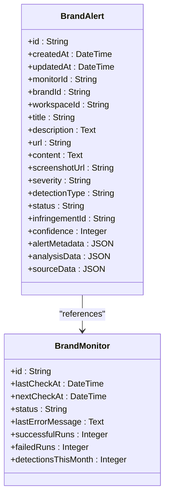
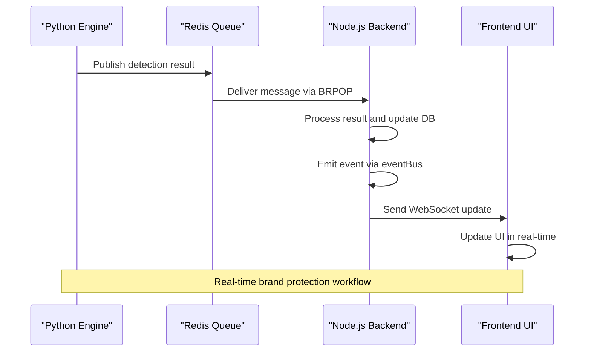
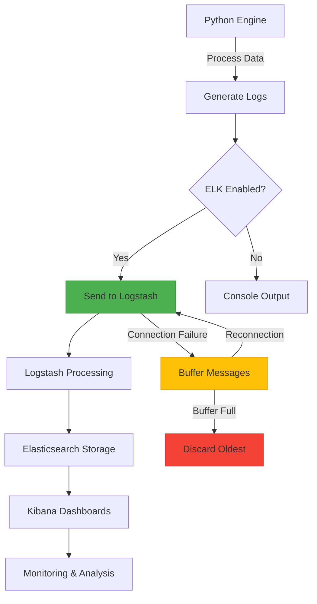
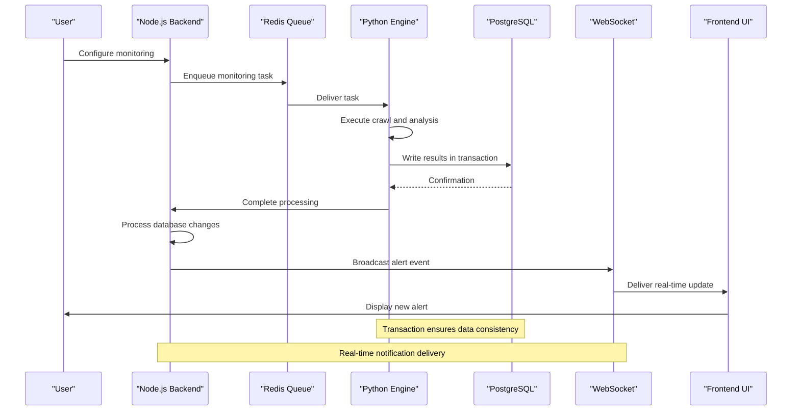
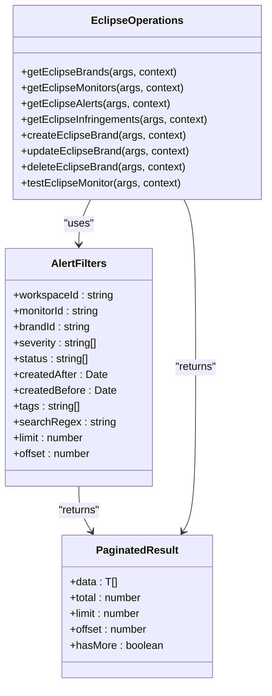
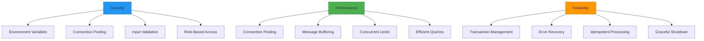

# Integration with Core System

<cite>
**Referenced Files in This Document**   
- [db_client.py](file://services/engine/utils/db_client.py)
- [redis_client.py](file://services/engine/utils/redis_client.py)
- [elkLogger.ts](file://src/server/elkLogger.ts)
- [main.py](file://services/engine/main.py)
- [config.py](file://services/engine/config.py)
- [operations.ts](file://src/core/modules/eclipse/operations.ts)
- [types.ts](file://src/core/modules/eclipse/types.ts)
- [eventBus.ts](file://src/core/modules/eclipse/eventBus.ts)
- [notificationWebSocket.ts](file://src/server/notificationWebSocket.ts)
- [websocketSetup.ts](file://src/server/websocketSetup.ts)
- [migration.sql](file://migrations/20251117160957_websock_push/migration.sql)
</cite>

## Table of Contents
1. [Introduction](#introduction)
2. [Database Integration](#database-integration)
3. [Redis Event Propagation](#redis-event-propagation)
4. [ELK Logging Integration](#elk-logging-integration)
5. [End-to-End Data Flow](#end-to-end-data-flow)
6. [Backend Consumption of Engine Data](#backend-consumption-of-engine-data)
7. [Security and Performance Considerations](#security-and-performance-considerations)

## Introduction
This document details the integration layer between the Python data processing engine and the core Node.js application in the SentinelIQ platform. The system enables real-time brand protection through a distributed architecture where the Python engine processes web content and communicates results to the Node.js backend via PostgreSQL and Redis. The integration ensures data consistency, schema compliance, and real-time notification delivery through WebSocket connections. The ELK stack provides centralized logging and monitoring capabilities, while the system implements robust transaction management, error recovery, and idempotency mechanisms to ensure reliability in high-throughput scenarios.

## Database Integration
The Python data processing engine writes processed results to PostgreSQL through the `db_client.py` module, which implements a robust ORM-based interface using SQLAlchemy. The integration ensures data consistency and schema compliance through transaction management and proper error handling.

The database client defines two primary models that map to the application's domain: `BrandAlert` and `BrandMonitor`. The `BrandAlert` model captures detection events with comprehensive metadata including title, description, URL, content, screenshot URL, severity, detection type, status, confidence score, and structured JSON fields for alert metadata, analysis data, and source data. The `BrandMonitor` model tracks monitoring configuration and execution statistics including last check time, next check time, status, error messages, and run counters.

Transaction management is implemented through a context manager `get_db_session()` that provides automatic commit/rollback semantics. Each database operation is wrapped in a try-except block that ensures transaction rollback on failure and proper session cleanup. The context manager handles connection pooling and session lifecycle management, ensuring efficient resource utilization.

**Diagram sources**
- [db_client.py](file://services/engine/utils/db_client.py#L17-L57)

**Section sources**
- [db_client.py](file://services/engine/utils/db_client.py#L1-L100)
- [main.py](file://services/engine/main.py#L14-L15)

## Redis Event Propagation
The integration layer uses Redis as a message broker to propagate events from the Python engine to the Node.js application, enabling real-time updates to the frontend through WebSocket connections. The `redis_client.py` module implements a consumer pattern that listens to a task queue and processes messages asynchronously.

The `RedisConsumer` class provides a blocking interface `consume_task()` that retrieves messages from the Redis queue using BRPOP with a configurable timeout. This ensures efficient resource utilization by avoiding busy-waiting. The consumer deserializes JSON payloads and returns structured data to the processing pipeline. The implementation includes comprehensive error handling for JSON decoding errors, Redis connectivity issues, and unexpected exceptions, ensuring system resilience.

Event propagation occurs through a publish-subscribe pattern where the Python engine writes detection results to the database and the Node.js backend listens for changes. When a new `BrandAlert` is created, the backend operations in `src/core/modules/eclipse/operations.ts` trigger real-time notifications through the event bus system. The `notifyAlertCreated` function broadcasts the event to all relevant workspace members, updating their UIs in real time.

**Diagram sources**
- [redis_client.py](file://services/engine/utils/redis_client.py#L10-L89)
- [eventBus.ts](file://src/core/modules/eclipse/eventBus.ts#L1-L359)
- [websocketSetup.ts](file://src/server/websocketSetup.ts#L1-L31)

**Section sources**
- [redis_client.py](file://services/engine/utils/redis_client.py#L1-L89)
- [main.py](file://services/engine/main.py#L14-L15)
- [eventBus.ts](file://src/core/modules/eclipse/eventBus.ts#L1-L359)

## ELK Logging Integration
The system integrates with the ELK (Elasticsearch, Logstash, Kibana) stack for centralized logging and monitoring of engine activity. The `elkLogger.ts` module implements a TCP-based client that sends structured logs to Logstash for aggregation in Elasticsearch, enabling comprehensive monitoring and analysis through Kibana dashboards.

The ELK logger is implemented as a singleton class with connection resilience features including automatic reconnection with exponential backoff and message buffering during connectivity outages. When the connection to Logstash is unavailable, messages are stored in an in-memory buffer with a configurable maximum size (default 1000 entries). When the connection is restored, the buffer is flushed to ensure no log data is lost.

Log entries are structured as JSON objects with standardized fields including timestamp, log level, message, component, workspace ID, user ID, metadata, environment, and error details. This structured format enables powerful querying and visualization in Kibana. The logger extracts common fields from metadata such as workspace ID, user ID, request ID, IP address, and user agent, ensuring consistent data collection across the system.

**Diagram sources**
- [elkLogger.ts](file://src/server/elkLogger.ts#L47-L270)
- [config.py](file://services/engine/config.py#L56-L58)

**Section sources**
- [elkLogger.ts](file://src/server/elkLogger.ts#L1-L270)
- [config.py](file://services/engine/config.py#L56-L58)

## End-to-End Data Flow
The integration layer implements a comprehensive end-to-end data flow from crawler output to database persistence to notification delivery. This flow ensures reliable processing of brand protection data while maintaining system performance and data integrity.

The process begins when a monitoring task is enqueued in Redis by the Node.js application, typically triggered by user actions or scheduled jobs. The Python engine's main loop, implemented in `main.py`, continuously polls the Redis queue for new tasks. When a task is received, it is processed by the `process_task()` function, which executes the web crawling and analysis logic.

After successful crawling, the engine processes the results and determines whether to create a brand alert based on the confidence threshold configured for the monitor. If the confidence score meets or exceeds the threshold, a new `BrandAlert` record is created and written to PostgreSQL within a database transaction. The transaction also updates the associated `BrandMonitor` statistics, including incrementing the successful runs counter and detections this month counter.

Upon successful database persistence, the system triggers real-time notifications through multiple channels. The event bus system emits a `eclipse.alert.created` event that is broadcast to all connected clients via WebSocket. This enables immediate UI updates in the frontend without requiring polling. Additionally, the system creates persistent notifications in the database for users who are not currently online.

**Diagram sources**
- [main.py](file://services/engine/main.py#L195-L267)
- [db_client.py](file://services/engine/utils/db_client.py#L59-L76)
- [eventBus.ts](file://src/core/modules/eclipse/eventBus.ts#L1-L359)

**Section sources**
- [main.py](file://services/engine/main.py#L1-L284)
- [db_client.py](file://services/engine/utils/db_client.py#L1-L100)
- [eventBus.ts](file://src/core/modules/eclipse/eventBus.ts#L1-L359)

## Backend Consumption of Engine Data
The Node.js backend consumes engine-generated data through a well-defined API in the `src/core/modules/eclipse/operations.ts` file. This module provides a comprehensive set of operations for retrieving, filtering, and manipulating brand protection data, enabling rich user experiences in the frontend application.

The backend operations implement a robust permission system that checks workspace access and role-based permissions before allowing any data access or modification. Functions like `checkWorkspaceAccess()`, `canManageBrand()`, and `canManageMonitor()` ensure that users can only access data within their authorized workspaces and with appropriate privileges.

Data retrieval operations support comprehensive filtering and pagination. The `getEclipseAlerts()` function accepts a rich set of filter parameters including workspace ID, monitor ID, brand ID, severity, status, date ranges, tags, and regex search patterns. Results are returned with pagination metadata including total count, limit, offset, and a flag indicating whether more results are available.

The system also implements advanced features such as saved filters, date range presets, and bulk operations. The `SavedFilter` interface allows users to save complex query configurations for reuse, while the `DATE_RANGE_PRESETS` constant provides convenient time-based filters like "last 24 hours" and "last 30 days". Bulk operations enable efficient processing of multiple records with a single API call, improving performance for common workflows.

**Diagram sources**
- [operations.ts](file://src/core/modules/eclipse/operations.ts#L1-L2403)
- [types.ts](file://src/core/modules/eclipse/types.ts#L1-L395)

**Section sources**
- [operations.ts](file://src/core/modules/eclipse/operations.ts#L1-L2403)
- [types.ts](file://src/core/modules/eclipse/types.ts#L1-L395)

## Security and Performance Considerations
The integration layer implements comprehensive security and performance optimizations to ensure reliable operation in high-throughput scenarios while protecting sensitive data.

Security considerations for inter-process communication include environment variable-based configuration of connection strings, with Redis and PostgreSQL URLs loaded from secure environment variables. The system uses Redis for task queuing with configurable poll intervals to balance responsiveness and resource utilization. Database connections use connection pooling with pre-connection validation to ensure reliability.

Performance optimization strategies include connection pooling, message buffering, and efficient resource management. The PostgreSQL integration uses SQLAlchemy's connection pooling with pre-connection validation (`pool_pre_ping=True`) to ensure connection health. The ELK logger implements message buffering with a maximum buffer size to prevent memory exhaustion during connectivity outages. The Python engine limits concurrent crawls through the `MAX_CONCURRENT_CRAWLS` configuration parameter, preventing resource exhaustion.

The system implements robust error recovery and idempotency mechanisms. Database operations are wrapped in transactions with automatic rollback on failure, ensuring data consistency. The Redis consumer implements idempotent message processing by using blocking operations (BRPOP) that guarantee at-least-once delivery semantics. The system also implements graceful shutdown handling through signal handlers that allow the engine to complete processing of the current task before terminating.

**Diagram sources**
- [config.py](file://services/engine/config.py#L1-L78)
- [db_client.py](file://services/engine/utils/db_client.py#L12-L13)
- [main.py](file://services/engine/main.py#L37-L42)

**Section sources**
- [config.py](file://services/engine/config.py#L1-L78)
- [db_client.py](file://services/engine/utils/db_client.py#L1-L100)
- [main.py](file://services/engine/main.py#L1-L284)