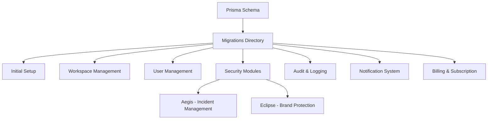
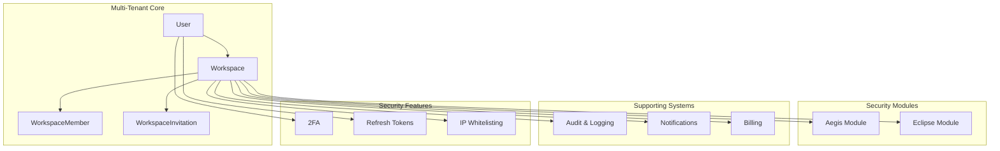
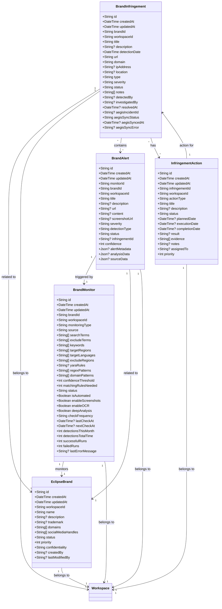
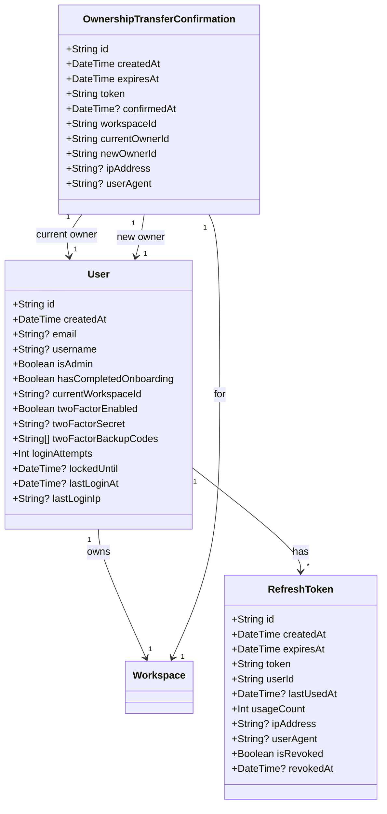
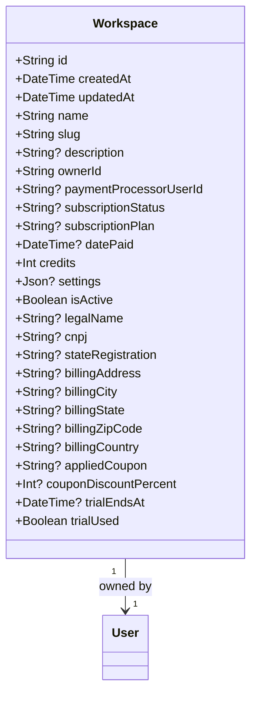
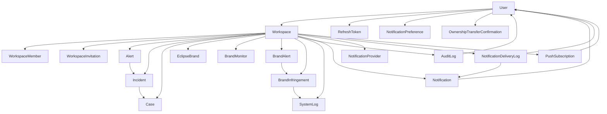

# Database Schema Design

<cite>
**Referenced Files in This Document**   
- [schema.prisma](file://schema.prisma)
- [20251116222007_init/migration.sql](file://migrations/20251116222007_init/migration.sql)
- [20251117002945_workspace_payment_migration/migration.sql](file://migrations/20251117002945_workspace_payment_migration/migration.sql)
- [20251117014807_add_logs_audit_notifications_system/migration.sql](file://migrations/20251117014807_add_logs_audit_notifications_system/migration.sql)
- [20251117101503_billingg/migration.sql](file://migrations/20251117101503_billingg/migration.sql)
- [20251117120405_add_workspace_branding_and_ownership/migration.sql](file://migrations/20251117120405_add_workspace_branding_and_ownership/migration.sql)
- [20251117142501_add_storage_quota/migration.sql](file://migrations/20251117142501_add_storage_quota/migration.sql)
- [20251117150008_add_notification_preferences_and_delivery_log/migration.sql](file://migrations/20251117150008_add_notification_preferences_and_delivery_log/migration.sql)
- [20251117165822_add_session_timeout/migration.sql](file://migrations/20251117165822_add_session_timeout/migration.sql)
- [20251118005713_add_aegis_module/migration.sql](file://migrations/20251118005713_add_aegis_module/migration.sql)
- [20251118015752_add_eclipse_module/migration.sql](file://migrations/20251118015752_add_eclipse_module/migration.sql)
- [20251120052630_add_brand_alert_fields/migration.sql](file://migrations/20251120052630_add_brand_alert_fields/migration.sql)
</cite>

## Table of Contents
1. [Introduction](#introduction)
2. [Project Structure](#project-structure)
3. [Core Components](#core-components)
4. [Architecture Overview](#architecture-overview)
5. [Detailed Component Analysis](#detailed-component-analysis)
6. [Dependency Analysis](#dependency-analysis)
7. [Performance Considerations](#performance-considerations)
8. [Troubleshooting Guide](#troubleshooting-guide)
9. [Conclusion](#conclusion)

## Introduction
This document provides comprehensive documentation for the PostgreSQL database schema of the Sentineliq application. The schema is designed to support a multi-tenant security monitoring platform with two primary modules: Aegis for security incident management and Eclipse for brand protection and monitoring. The database structure is implemented using Prisma ORM with a series of migration files that evolve the schema over time. The design emphasizes data isolation between workspaces, comprehensive audit logging, and flexible notification systems.

## Project Structure
The database schema is defined in the Prisma schema file with migrations stored in a dedicated directory. The migrations are timestamped to ensure proper ordering and represent incremental changes to the database structure. The schema supports a multi-tenant architecture where all data is scoped to a workspace, enabling data isolation between different organizations or teams using the platform.



**Diagram sources**
- [schema.prisma](file://schema.prisma)
- [migrations/](file://migrations/)

**Section sources**
- [schema.prisma](file://schema.prisma)
- [migrations/](file://migrations/)

## Core Components
The database schema consists of several core components that work together to provide a comprehensive security monitoring platform. These include user and workspace management, security incident handling through the Aegis module, brand protection through the Eclipse module, comprehensive logging and auditing, and a flexible notification system. The schema is designed with multi-tenancy in mind, ensuring data isolation between different workspaces while allowing for shared resources and configurations.

**Section sources**
- [schema.prisma](file://schema.prisma)
- [migrations/20251116222007_init/migration.sql](file://migrations/20251116222007_init/migration.sql)
- [migrations/20251117002945_workspace_payment_migration/migration.sql](file://migrations/20251117002945_workspace_payment_migration/migration.sql)

## Architecture Overview
The database architecture follows a multi-tenant model with workspace-based data isolation. All entities are associated with a workspace, ensuring that data from different organizations or teams remains separated. The schema is divided into several functional areas: user management, workspace management, security incident management (Aegis), brand protection (Eclipse), logging and auditing, notifications, and billing. The architecture supports complex relationships between entities while maintaining data integrity through foreign key constraints and appropriate indexing.



**Diagram sources**
- [schema.prisma](file://schema.prisma)
- [migrations/20251117002945_workspace_payment_migration/migration.sql](file://migrations/20251117002945_workspace_payment_migration/migration.sql)

## Detailed Component Analysis

### User and Workspace Management
The user and workspace management system forms the foundation of the multi-tenant architecture. Users can belong to multiple workspaces, and each workspace has an owner and members with different roles. The system supports workspace branding, ownership transfer, and various security features.

```mermaid
classDiagram
class User {
+String id
+DateTime createdAt
+String? email
+String? username
+Boolean isAdmin
+Boolean hasCompletedOnboarding
+String? currentWorkspaceId
+Boolean twoFactorEnabled
+String? twoFactorSecret
+String[] twoFactorBackupCodes
+Int loginAttempts
+DateTime? lockedUntil
+DateTime? lastLoginAt
+String? lastLoginIp
}
class Workspace {
+String id
+DateTime createdAt
+DateTime updatedAt
+String name
+String slug
+String? description
+String ownerId
+String? paymentProcessorUserId
+String? subscriptionStatus
+String? subscriptionPlan
+DateTime? datePaid
+Int credits
+Json? settings
+Boolean isActive
+String[] ipWhitelist
+Boolean ipWhitelistEnabled
+String? logoUrl
+String? primaryColor
+String? secondaryColor
+BigInt storageUsed
+BigInt storageQuota
+Int sessionTimeout
+DateTime? deletedAt
}
class WorkspaceMember {
+String id
+DateTime createdAt
+String userId
+String workspaceId
+WorkspaceRole role
}
enum WorkspaceRole {
OWNER
ADMIN
MEMBER
}
User "1" --> "*" WorkspaceMember : owns
User "1" --> "*" Workspace : owns
User "1" --> "0..1" Workspace : current
Workspace "1" --> "*" WorkspaceMember : has
Workspace "1" --> "1" User : owned by
WorkspaceMember "1" --> "1" User : references
WorkspaceMember "1" --> "1" Workspace : references
```

**Diagram sources**
- [schema.prisma](file://schema.prisma#L10-L118)
- [migrations/20251117002945_workspace_payment_migration/migration.sql](file://migrations/20251117002945_workspace_payment_migration/migration.sql#L29-L47)

### Aegis Module - Security Incident Management
The Aegis module provides comprehensive security incident management capabilities, including alert handling, incident response, case management, and forensic investigation. The module supports the full lifecycle of security incidents from detection to resolution.

```mermaid
classDiagram
class Alert {
+String id
+DateTime createdAt
+DateTime updatedAt
+String workspaceId
+String title
+String description
+String source
+Severity severity
+AlertStatus status
+DateTime detectedAt
+String? category
+Int? threatScore
+String[] affectedAssets
+String[] tags
+String? assignedToId
+DateTime? assignedAt
+Json? threatAnalysis
+Json? technicalDetails
+Json? metadata
}
class Incident {
+String id
+DateTime createdAt
+DateTime updatedAt
+String workspaceId
+String title
+String description
+Severity severity
+IncidentStatus status
+Priority priority
+DateTime? slaDeadline
+Boolean slaBreached
+String? assignedToId
+String? team
+String[] affectedSystems
+Int progress
+String? playbookId
+Json? playbookData
+DateTime? resolvedAt
+String? resolutionSummary
+Json? metadata
}
class Case {
+String id
+DateTime createdAt
+DateTime updatedAt
+String workspaceId
+String title
+String description
+Priority priority
+CaseStatus status
+String? caseType
+String confidentiality
+String? investigatorId
+String? team
+String? findings
+String? recommendations
+DateTime? closedAt
+String? closedBy
+Json? finalReport
+String? templateId
+Json? metadata
}
enum Severity {
CRITICAL
HIGH
MEDIUM
LOW
}
enum AlertStatus {
NEW
ACKNOWLEDGED
INVESTIGATING
RESOLVED
DISMISSED
}
enum IncidentStatus {
ACTIVE
INVESTIGATING
CONTAINMENT
ERADICATION
RECOVERY
RESOLVED
CLOSED
}
enum CaseStatus {
ACTIVE
REVIEW
CLOSED
ARCHIVED
}
enum Priority {
CRITICAL
HIGH
MEDIUM
LOW
}
Alert "1" --> "1" Workspace : belongs to
Incident "1" --> "1" Workspace : belongs to
Case "1" --> "1" Workspace : belongs to
Alert "1" --> "0..1" User : assigned to
Incident "1" --> "0..1" User : assigned to
Case "1" --> "0..1" User : investigator
Alert "*" --> "*" Observable : contains
Incident "*" --> "*" Alert : contains
Incident "*" --> "*" Task : has
Case "*" --> "*" Incident : contains
Case "*" --> "*" Evidence : contains
Case "*" --> "*" TTP : contains
Case "*" --> "*" TimelineEvent : has
Case "*" --> "*" InvestigationNote : has
```

**Diagram sources**
- [schema.prisma](file://schema.prisma#L709-L1084)
- [migrations/20251118005713_add_aegis_module/migration.sql](file://migrations/20251118005713_add_aegis_module/migration.sql)

### Eclipse Module - Brand Protection and Monitoring
The Eclipse module provides brand protection and monitoring capabilities, allowing organizations to track and respond to potential brand infringements across various digital channels. The module supports monitoring of domains, social media, and other online content for potential brand violations.



**Diagram sources**
- [schema.prisma](file://schema.prisma#L1172-L1407)
- [migrations/20251118015752_add_eclipse_module/migration.sql](file://migrations/20251118015752_add_eclipse_module/migration.sql)

### Logging, Auditing, and Notifications
The system includes comprehensive logging, auditing, and notification capabilities to ensure security, compliance, and user engagement. These components track system events, user actions, and provide timely notifications through multiple channels.

```mermaid
classDiagram
class SystemLog {
+Int id
+DateTime createdAt
+LogLevel level
+String message
+String component
+Json? metadata
}
class AuditLog {
+String id
+DateTime createdAt
+String workspaceId
+String? userId
+AuditAction action
+String resource
+String? resourceId
+String description
+Json? metadata
+String? ipAddress
+String? userAgent
}
class Notification {
+String id
+DateTime createdAt
+NotificationType type
+String title
+String message
+String? link
+Boolean isRead
+DateTime? readAt
+String userId
+String workspaceId
+String eventType
+Json? metadata
}
class NotificationProvider {
+String id
+DateTime createdAt
+DateTime updatedAt
+String workspaceId
+NotificationProviderType provider
+Boolean isEnabled
+Json config
+String[] eventTypes
}
class NotificationPreference {
+String id
+DateTime createdAt
+DateTime updatedAt
+String userId
+Boolean emailEnabled
+Boolean inAppEnabled
+String[] disabledEventTypes
+Boolean slackEnabled
+Boolean discordEnabled
+Boolean webhookEnabled
+Boolean telegramEnabled
+Boolean teamsEnabled
+Boolean digestEnabled
+DigestFrequency digestFrequency
+String digestTime
+DateTime? lastDigestSentAt
+Boolean dndEnabled
+String? dndStartTime
+String? dndEndTime
+Boolean pushEnabled
}
class NotificationDeliveryLog {
+String id
+DateTime createdAt
+DateTime updatedAt
+String? notificationId
+NotificationProviderType provider
+String eventType
+String workspaceId
+String? userId
+DeliveryStatus status
+Int attempts
+Int maxAttempts
+String? lastError
+DateTime? lastAttemptAt
+DateTime? nextRetryAt
+DateTime? deliveredAt
+Json? payload
}
enum LogLevel {
DEBUG
INFO
WARN
ERROR
CRITICAL
}
enum AuditAction {
WORKSPACE_CREATED
WORKSPACE_UPDATED
WORKSPACE_DELETED
MEMBER_ADDED
MEMBER_REMOVED
MEMBER_ROLE_CHANGED
OWNERSHIP_TRANSFERRED
PAYMENT_SUCCEEDED
PAYMENT_FAILED
SUBSCRIPTION_CHANGED
PROVIDER_CONFIGURED
ALERT_CREATED
INCIDENT_CREATED
SETTINGS_UPDATED
}
enum NotificationType {
INFO
SUCCESS
WARNING
ERROR
CRITICAL
}
enum NotificationProviderType {
EMAIL
SLACK
DISCORD
WEBHOOK
TELEGRAM
TEAMS
}
enum DigestFrequency {
DAILY
WEEKLY
MONTHLY
}
enum DeliveryStatus {
PENDING
SENT
FAILED
RETRYING
MAX_RETRIES_REACHED
}
SystemLog "1" --> "1" Workspace : belongs to
AuditLog "1" --> "1" Workspace : belongs to
AuditLog "1" --> "0..1" User : by user
Notification "1" --> "1" User : for user
Notification "1" --> "1" Workspace : belongs to
NotificationProvider "1" --> "1" Workspace : belongs to
NotificationPreference "1" --> "1" User : for user
NotificationDeliveryLog "1" --> "1" Workspace : belongs to
NotificationDeliveryLog "1" --> "0..1" User : for user
NotificationDeliveryLog "1" --> "0..1" Notification : delivery for
```

**Diagram sources**
- [schema.prisma](file://schema.prisma#L213-L569)
- [migrations/20251117014807_add_logs_audit_notifications_system/migration.sql](file://migrations/20251117014807_add_logs_audit_notifications_system/migration.sql)

### Security and Authentication
The security and authentication system provides robust user management with multi-factor authentication, refresh token rotation, and IP whitelisting capabilities. These features ensure that user accounts are protected and that access to the system is secure.



**Diagram sources**
- [schema.prisma](file://schema.prisma#L404-L450)
- [migrations/20251117041409_add_2fa_security_redis/migration.sql](file://migrations/20251117041409_add_2fa_security_redis/migration.sql)

### Billing and Subscription Management
The billing and subscription management system handles workspace-level payment processing, subscription status tracking, and billing information management. This allows organizations to manage their subscriptions and billing details at the workspace level.



**Diagram sources**
- [schema.prisma](file://schema.prisma#L81-L104)
- [migrations/20251117101503_billingg/migration.sql](file://migrations/20251117101503_billingg/migration.sql)

## Dependency Analysis
The database schema has a well-defined dependency structure with clear relationships between entities. The primary dependency is the workspace, which serves as the root for most other entities. All security-related data (alerts, incidents, cases, brand monitoring data) is scoped to a workspace, ensuring data isolation between different organizations or teams. User management is independent of workspaces, allowing users to belong to multiple workspaces. The notification system depends on both users and workspaces, as notifications are targeted to specific users within specific workspaces. The audit logging system depends on all other components, as it tracks actions across the entire system.



**Diagram sources**
- [schema.prisma](file://schema.prisma)
- [migrations/](file://migrations/)

## Performance Considerations
The database schema includes several performance optimizations to ensure efficient querying and data retrieval. These include appropriate indexing on frequently queried fields, use of UUIDs for primary keys to distribute writes across storage, and careful consideration of data types to minimize storage requirements. The schema also includes fields for soft deletion (deletedAt) which allows for data retention while removing items from regular views. For large text fields, the schema uses appropriate types like TEXT or JSONB depending on the use case. The indexing strategy focuses on fields used in WHERE clauses, JOIN conditions, and ORDER BY operations to ensure optimal query performance.

**Section sources**
- [schema.prisma](file://schema.prisma)
- [migrations/](file://migrations/)

## Troubleshooting Guide
When troubleshooting issues with the database schema, consider the following common scenarios:

1. **Data Isolation Issues**: Ensure that all queries include the workspaceId filter to maintain multi-tenancy. Missing workspace filters can lead to data leakage between organizations.

2. **Performance Problems**: Check that appropriate indexes exist for the queried fields. The schema includes many indexes, but additional ones may be needed for specific query patterns.

3. **Migration Failures**: When applying migrations, ensure that the database is in a consistent state. The migration files are designed to be applied in order, and skipping or reordering them can lead to errors.

4. **Foreign Key Violations**: Ensure that referenced entities exist before creating records that depend on them. For example, a workspace must exist before creating a workspace member.

5. **Unique Constraint Violations**: Check for duplicate values in fields with unique constraints, such as email addresses, usernames, and workspace slugs.

6. **Storage Quota Issues**: Monitor the storageUsed and storageQuota fields in the Workspace table to ensure that workspaces do not exceed their allocated storage.

**Section sources**
- [schema.prisma](file://schema.prisma)
- [migrations/](file://migrations/)

## Conclusion
The PostgreSQL database schema for the Sentineliq application is a comprehensive, multi-tenant design that supports both security incident management (Aegis) and brand protection (Eclipse) functionalities. The schema emphasizes data isolation through workspace scoping, provides robust security features including multi-factor authentication and IP whitelisting, and includes comprehensive logging and auditing capabilities. The use of Prisma ORM with incremental migrations allows for safe and reliable schema evolution. The design supports the complex relationships between users, workspaces, and security entities while maintaining data integrity and performance. This schema provides a solid foundation for a scalable security monitoring platform that can serve multiple organizations with strict data isolation requirements.