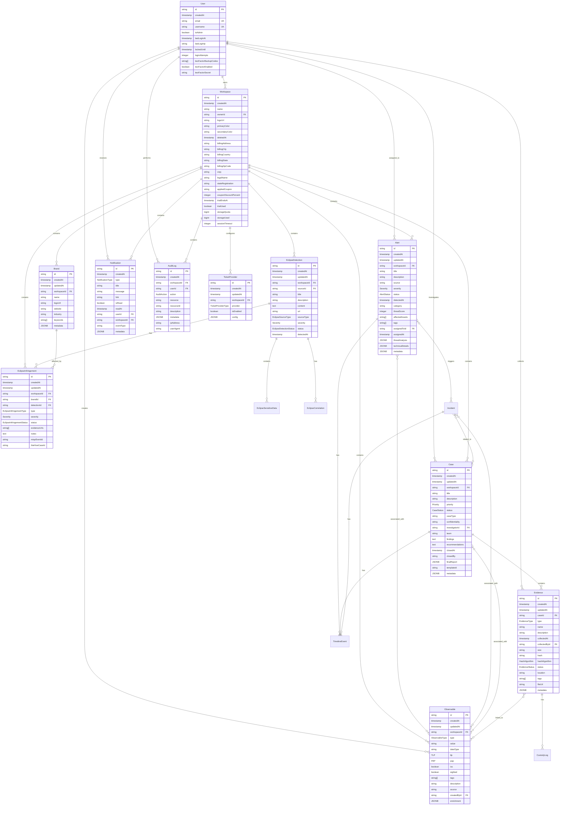

# Entity Relationships

<cite>
**Referenced Files in This Document**   
- [20251116222007_init/migration.sql](file://migrations/20251116222007_init/migration.sql)
- [20251117014807_add_logs_audit_notifications_system/migration.sql](file://migrations/20251117014807_add_logs_audit_notifications_system/migration.sql)
- [20251117120405_add_workspace_branding_and_ownership/migration.sql](file://migrations/20251117120405_add_workspace_branding_and_ownership/migration.sql)
- [20251117002945_workspace_payment_migration/migration.sql](file://migrations/20251117002945_workspace_payment_migration/migration.sql)
- [20251118005713_add_aegis_module/migration.sql](file://migrations/20251118005713_add_aegis_module/migration.sql)
- [20251118015752_add_eclipse_module/migration.sql](file://migrations/20251118015752_add_eclipse_module/migration.sql)
- [20251117231659_add_ticket_providers/migration.sql](file://migrations/20251117231659_add_ticket_providers/migration.sql)
- [20251117150008_add_notification_preferences_and_delivery_log/migration.sql](file://migrations/20251117150008_add_notification_preferences_and_delivery_log/migration.sql)
</cite>

## Table of Contents
1. [Introduction](#introduction)
2. [Core Entity Relationships](#core-entity-relationships)
3. [Referential Integrity and Cascading Behaviors](#referential-integrity-and-cascading-behaviors)
4. [Many-to-One and One-to-Many Relationships](#many-to-one-and-one-to-many-relationships)
5. [Many-to-Many Relationships](#many-to-many-relationships)
6. [Data Consistency in Multi-Tenant Environment](#data-consistency-in-multi-tenant-environment)
7. [Visual Schema Diagram](#visual-schema-diagram)
8. [Common Access Patterns and JOIN Queries](#common-access-patterns-and-join-queries)
9. [Conclusion](#conclusion)

## Introduction

This document provides comprehensive documentation of the core entity relationships in the PostgreSQL schema for the SentinelIQ application. The system is designed as a multi-tenant security intelligence platform with a focus on threat detection, incident response, and brand protection. The data model centers around the Workspace entity, which serves as the primary isolation boundary for tenant data.

The schema includes several key modules: Aegis for alert management and incident response, Eclipse for brand protection and dark web monitoring, comprehensive audit logging, notification systems, and integration with external ticket providers. All entities are organized within a workspace context to ensure data isolation between tenants while maintaining referential integrity within each workspace.

**Section sources**
- [20251116222007_init/migration.sql](file://migrations/20251116222007_init/migration.sql#L2-L173)
- [20251117014807_add_logs_audit_notifications_system/migration.sql](file://migrations/20251117014807_add_logs_audit_notifications_system/migration.sql#L1-L139)

## Core Entity Relationships

The data model is built around a multi-tenant architecture where all sensitive data is scoped to a Workspace. The User entity exists at the system level and can be associated with multiple workspaces through implicit relationships. Each workspace contains security entities such as Alerts (Aegis module), Detections (Eclipse module), Cases, and related artifacts.

The primary relationship pattern is a hierarchical structure where Users belong to Workspaces, and all security entities (Alerts, Detections, Cases, etc.) belong to a specific Workspace. This ensures data isolation between tenants while allowing users to participate in multiple workspaces. The relationships are enforced through foreign key constraints with cascading updates and deletions to maintain referential integrity.

**Section sources**
- [20251118005713_add_aegis_module/migration.sql](file://migrations/20251118005713_add_aegis_module/migration.sql#L62-L528)
- [20251118015752_add_eclipse_module/migration.sql](file://migrations/20251118015752_add_eclipse_module/migration.sql#L32-L429)

## Referential Integrity and Cascading Behaviors

The schema enforces strict referential integrity through foreign key constraints with specific cascading behaviors designed to maintain data consistency while preventing orphaned records. The cascading behaviors follow a consistent pattern across the system:

- **CASCADE on UPDATE**: When a referenced record is updated (typically the primary key), the change is cascaded to all referencing records to maintain referential integrity.
- **CASCADE on DELETE**: When a parent record is deleted, all dependent child records are automatically deleted to prevent orphaned records.
- **SET NULL on DELETE**: In cases where a relationship is optional, deleting the referenced record sets the foreign key to NULL rather than deleting the referencing record.
- **RESTRICT on DELETE**: Prevents deletion of a record if it is referenced by other records, ensuring data integrity.

For example, when a Workspace is deleted, all associated entities such as Alerts, Detections, Audit Logs, and Notifications are automatically deleted due to the CASCADE DELETE constraint. However, when a User is deleted, references from Audit Logs are set to NULL (via SET NULL) to preserve the audit trail while removing the user reference.

**Section sources**
- [20251118005713_add_aegis_module/migration.sql](file://migrations/20251118005713_add_aegis_module/migration.sql#L425-L528)
- [20251118015752_add_eclipse_module/migration.sql](file://migrations/20251118015752_add_eclipse_module/migration.sql#L377-L429)

## Many-to-One and One-to-Many Relationships

The data model implements numerous many-to-one and one-to-many relationships that establish the hierarchical structure of the system. These relationships are fundamental to the multi-tenant architecture and ensure proper data organization and access control.

### Workspace to Security Entities (One-to-Many)
The Workspace entity serves as the parent for most security-related entities, establishing a one-to-many relationship:
- One Workspace → Many Alerts (Aegis)
- One Workspace → Many Detections (Eclipse)
- One Workspace → Many Cases (Aegis)
- One Workspace → Many Audit Logs
- One Workspace → Many Notifications

This relationship is implemented with a foreign key (`workspaceId`) in each child table that references the Workspace primary key. The CASCADE DELETE behavior ensures that when a workspace is deleted, all associated security data is automatically cleaned up.

### Alert to Case Relationship (One-to-Many)
The Aegis module implements a relationship where one Alert can lead to the creation of multiple Cases:
- One Alert → Many Cases
- Foreign key: `alertId` in TimelineEvent table

This allows security analysts to create multiple investigation cases from a single alert, each focusing on different aspects of the potential threat.

### Detection to Infringement Relationship (One-to-Many)
In the Eclipse module, one Detection can be associated with multiple Infringements:
- One Detection → Many Infringements
- Foreign key: `detectionId` in EclipseInfringement table

This allows a single detection of brand exposure to be categorized as multiple types of infringement (e.g., counterfeiting, domain squatting, social media impersonation).

**Section sources**
- [20251118005713_add_aegis_module/migration.sql](file://migrations/20251118005713_add_aegis_module/migration.sql#L62-L528)
- [20251118015752_add_eclipse_module/migration.sql](file://migrations/20251118015752_add_eclipse_module/migration.sql#L32-L429)

## Many-to-Many Relationships

The schema implements several many-to-many relationships using junction tables (also known as associative entities) to represent complex associations between security entities. These relationships enable flexible data modeling for security investigations.

### Alert to Observable (Many-to-Many)
The relationship between Alerts and Observables is implemented as many-to-many:
- Many Alerts → Many Observables
- Junction table: `_AlertToObservable`
- Foreign keys: `A` references Alert.id, `B` references Observable.id

This allows a single alert to be associated with multiple observables (IP addresses, domains, hashes) and enables the same observable to be linked to multiple alerts over time, supporting threat intelligence correlation.

### Incident to Case (Many-to-Many)
Incidents and Cases have a many-to-many relationship:
- Many Incidents → Many Cases
- Junction table: `_IncidentToCase`
- Foreign keys: `A` references Case.id, `B` references Incident.id

This relationship supports complex incident response scenarios where a single incident may spawn multiple investigation cases, and a single case may encompass multiple related incidents.

### Case to Observable (Many-to-Many)
Similar to the Alert-Observable relationship, Cases can be associated with multiple observables:
- Many Cases → Many Observables
- Junction table: `_CaseToObservable`
- Foreign keys: `A` references Case.id, `B` references Observable.id

This enables comprehensive investigation tracking where evidence (observables) can be shared across multiple cases.

### Observable to Evidence (Many-to-Many)
The relationship between Observables and Evidence supports flexible evidence management:
- Many Observables → Many Evidence items
- Junction table: `_ObservableToEvidence`
- Foreign keys: `A` references Evidence.id, `B` references Observable.id

This allows a single piece of evidence to be linked to multiple observables and enables comprehensive chain of custody tracking.

**Section sources**
- [20251118005713_add_aegis_module/migration.sql](file://migrations/20251118005713_add_aegis_module/migration.sql#L275-L308)
- [20251118005713_add_aegis_module/migration.sql](file://migrations/20251118005713_add_aegis_module/migration.sql#L494-L527)

## Data Consistency in Multi-Tenant Environment

The data model is designed to maintain data consistency in a multi-tenant environment through several key mechanisms:

### Workspace-Based Data Isolation
All tenant-specific data is explicitly scoped to a Workspace through the `workspaceId` foreign key. This ensures that queries within a workspace context can only access data belonging to that workspace, preventing cross-tenant data leakage.

### Transactional Integrity
Critical operations that affect multiple related entities are performed within database transactions to ensure atomicity. For example, creating an Alert with associated Observables is done in a single transaction to prevent partial data creation.

### Cascading Operations
The CASCADE DELETE behavior on workspace relationships ensures that when a workspace is deleted, all associated data is automatically cleaned up, preventing orphaned records and maintaining database consistency.

### Unique Constraints
The schema includes unique constraints where appropriate to prevent duplicate data. For example, the `NotificationProvider` table has a unique constraint on the combination of `workspaceId` and `provider` to prevent duplicate notification provider configurations within a workspace.

### Audit Trail Preservation
While maintaining data isolation, the system preserves audit trails even when users are deleted. This is achieved through the SET NULL onDelete behavior for user references in audit logs, which removes the user reference but preserves the audit record.

**Section sources**
- [20251117014807_add_logs_audit_notifications_system/migration.sql](file://migrations/20251117014807_add_logs_audit_notifications_system/migration.sql#L26-L139)
- [20251118005713_add_aegis_module/migration.sql](file://migrations/20251118005713_add_aegis_module/migration.sql#L27-L528)

## Visual Schema Diagram



**Diagram sources**
- [20251118005713_add_aegis_module/migration.sql](file://migrations/20251118005713_add_aegis_module/migration.sql#L62-L528)
- [20251118015752_add_eclipse_module/migration.sql](file://migrations/20251118015752_add_eclipse_module/migration.sql#L32-L429)
- [20251117014807_add_logs_audit_notifications_system/migration.sql](file://migrations/20251117014807_add_logs_audit_notifications_system/migration.sql#L26-L139)

## Common Access Patterns and JOIN Queries

The data model supports several common access patterns for security operations. Below are example JOIN queries demonstrating these patterns:

### Retrieve All Alerts with Associated Observables for a Workspace
```sql
SELECT a.*, o.value, o.type 
FROM "Alert" a 
LEFT JOIN "_AlertToObservable" ao ON a."id" = ao."A"
LEFT JOIN "Observable" o ON ao."B" = o."id"
WHERE a."workspaceId" = 'workspace-123'
ORDER BY a."createdAt" DESC;
```

### Find All Cases with Evidence and Observables
```sql
SELECT c.*, e.name as evidence_name, e.type as evidence_type, o.value as observable_value, o.type as observable_type
FROM "Case" c
LEFT JOIN "Evidence" e ON c."id" = e."caseId"
LEFT JOIN "_CaseToObservable" co ON c."id" = co."A"
LEFT JOIN "Observable" o ON co."B" = o."id"
WHERE c."workspaceId" = 'workspace-123'
ORDER BY c."createdAt" DESC;
```

### Get All Detections with Infringements and Brands
```sql
SELECT ed.*, ei.type as infringement_type, ei.status as infringement_status, b.name as brand_name
FROM "EclipseDetection" ed
LEFT JOIN "EclipseInfringement" ei ON ed."id" = ei."detectionId"
LEFT JOIN "Brand" b ON ei."brandId" = b."id"
WHERE ed."workspaceId" = 'workspace-123'
ORDER BY ed."detectedAt" DESC;
```

### Retrieve Audit Logs with User Information
```sql
SELECT al.*, u.email as user_email, u.username as user_username
FROM "AuditLog" al
LEFT JOIN "User" u ON al."userId" = u."id"
WHERE al."workspaceId" = 'workspace-123'
ORDER BY al."createdAt" DESC;
```

### Find All Notifications with User Preferences
```sql
SELECT n.*, np.emailEnabled, np.slackEnabled, np.digestEnabled
FROM "Notification" n
JOIN "NotificationPreference" np ON n."userId" = np."userId"
WHERE n."workspaceId" = 'workspace-123'
AND n."isRead" = false
ORDER BY n."createdAt" DESC;
```

**Section sources**
- [20251118005713_add_aegis_module/migration.sql](file://migrations/20251118005713_add_aegis_module/migration.sql#L62-L528)
- [20251118015752_add_eclipse_module/migration.sql](file://migrations/20251118015752_add_eclipse_module/migration.sql#L32-L429)
- [20251117150008_add_notification_preferences_and_delivery_log/migration.sql](file://migrations/20251117150008_add_notification_preferences_and_delivery_log/migration.sql#L8-L71)

## Conclusion

The PostgreSQL schema for SentinelIQ implements a robust data model for a multi-tenant security intelligence platform. The entity relationships are designed to support complex security operations while maintaining data isolation between tenants. The use of foreign key constraints with appropriate cascading behaviors ensures referential integrity and prevents orphaned records.

The schema effectively models the relationships between Users, Workspaces, Alerts (Aegis), Detections (Eclipse), Cases, Brands, Notifications, Audit Logs, and Ticket Providers. Many-to-many relationships through junction tables provide flexibility for security investigations, while the workspace-based scoping ensures data consistency in a multi-tenant environment.

The comprehensive audit logging and notification systems are integrated throughout the data model, providing visibility into system activities and enabling timely response to security events. The schema design supports the platform's core functionality while maintaining data integrity and security.