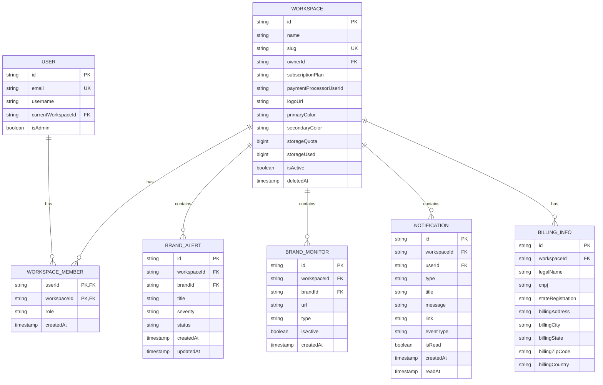
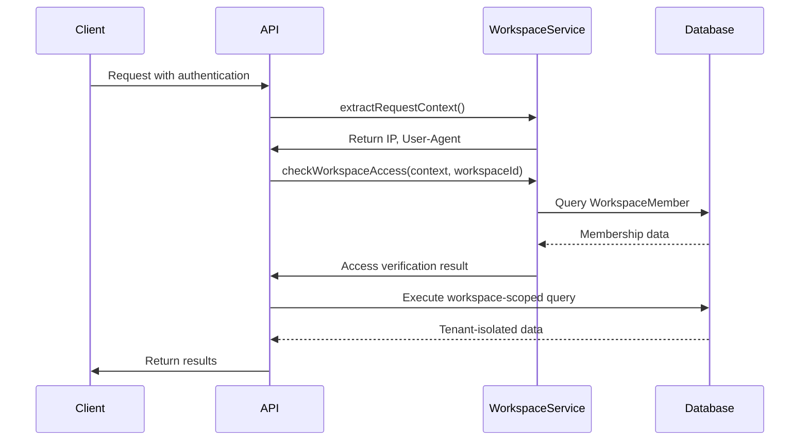
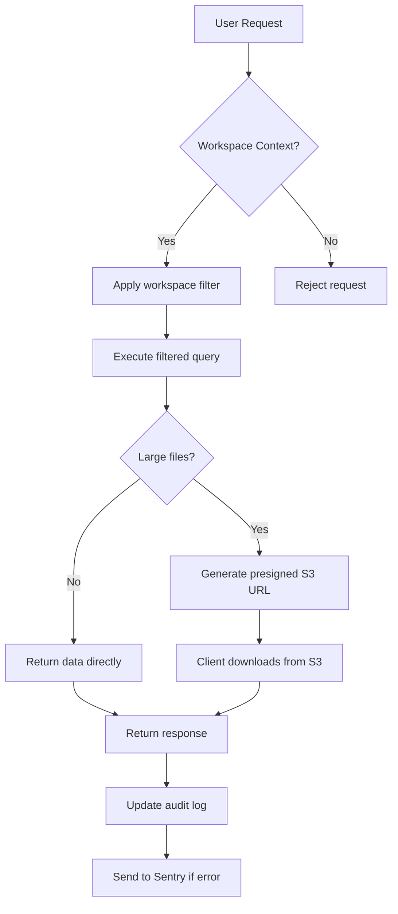
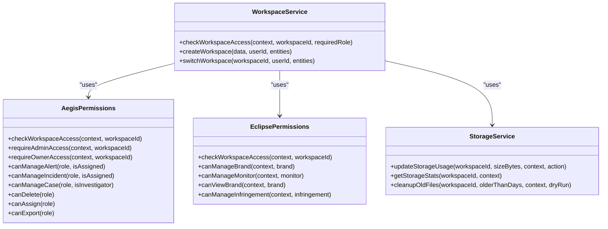

# Multi-tenancy Implementation

<cite>
**Referenced Files in This Document**   
- [workspace.ts](file://src/core/workspace/services.ts)
- [operations.ts](file://src/core/workspace/operations.ts)
- [quotas.ts](file://src/core/workspace/quotas.ts)
- [storage.ts](file://src/core/modules/aegis/services/storage.ts)
- [permissions.ts](file://src/core/modules/aegis/utils/permissions.ts)
- [permissions.ts](file://src/core/modules/eclipse/utils/permissions.ts)
- [notifications.ts](file://src/core/modules/eclipse/utils/notifications.ts)
- [operations.ts](file://src/core/notifications/operations.ts)
- [workspace.sql](file://migrations/20251117002945_workspace_payment_migration/migration.sql)
- [branding.sql](file://migrations/20251117120405_add_workspace_branding_and_ownership/migration.sql)
- [quota.sql](file://migrations/20251117142501_add_storage_quota/migration.sql)
- [preferences.sql](file://migrations/20251117150008_add_notification_preferences_and_delivery_log/migration.sql)
- [requestContext.ts](file://src/server/requestContext.ts)
- [sentryContext.ts](file://src/server/sentryContext.ts)
- [sentryMiddleware.ts](file://src/server/sentryMiddleware.ts)
</cite>

## Table of Contents
1. [Introduction](#introduction)
2. [Core Entity Relationships](#core-entity-relationships)
3. [Database Layer Enforcement](#database-layer-enforcement)
4. [Application Layer Enforcement](#application-layer-enforcement)
5. [Tenant-Specific Features](#tenant-specific-features)
6. [Security Considerations](#security-considerations)
7. [Performance Implications](#performance-implications)
8. [Code Examples](#code-examples)
9. [Conclusion](#conclusion)

## Introduction

The multi-tenancy architecture in this application is implemented through workspace-based data isolation, where all core entities are scoped to Workspaces via foreign key relationships. This design ensures complete data separation between tenants while allowing for shared infrastructure and efficient resource utilization. The system enforces tenant isolation at both the database and application layers through a combination of foreign key constraints, query filtering, access control checks, and workspace context propagation. Each workspace operates as an independent tenant with its own branding, storage quotas, payment configurations, and notification preferences, providing a customized experience while maintaining security and compliance.

**Section sources**
- [workspace.ts](file://src/core/workspace/services.ts#L1-L42)
- [operations.ts](file://src/core/workspace/operations.ts#L1-L800)

## Core Entity Relationships

The multi-tenancy model is centered around the Workspace entity, which serves as the primary tenant boundary. All core entities maintain a foreign key relationship to the Workspace table, ensuring data isolation at the database level. The WorkspaceMember table establishes the many-to-many relationship between Users and Workspaces, tracking user roles (OWNER, ADMIN, MEMBER) and access permissions. This relationship structure enables fine-grained access control and role-based authorization across all tenant-scoped resources.

The entity relationships follow a hierarchical pattern where the Workspace acts as the parent entity for all tenant-specific data. Entities such as Alerts, Brands, Notifications, and Billing information all contain a workspaceId foreign key that references the Workspace table. This design ensures that queries for these entities can be efficiently filtered by workspace context, preventing cross-tenant data access. The WorkspaceMember table serves as the authorization bridge, verifying that users have appropriate access to specific workspaces before allowing operations on tenant-scoped data.

**Diagram sources**
- [workspace.sql](file://migrations/20251117002945_workspace_payment_migration/migration.sql#L72-L82)
- [branding.sql](file://migrations/20251117120405_add_workspace_branding_and_ownership/migration.sql#L1-L34)
- [quota.sql](file://migrations/20251117142501_add_storage_quota/migration.sql#L1-L4)
- [preferences.sql](file://migrations/20251117150008_add_notification_preferences_and_delivery_log/migration.sql#L1-L71)

## Database Layer Enforcement

The database layer enforces multi-tenancy through comprehensive foreign key constraints and referential integrity rules. Each tenant-scoped entity contains a workspaceId column that references the Workspace table, creating a hard boundary for data isolation. These foreign key constraints ensure that records cannot exist without a valid workspace association, preventing orphaned data and maintaining referential integrity across the tenant boundary.

The migration files reveal a systematic approach to implementing these constraints, with dedicated migrations adding workspace relationships to core entities. For example, the workspace_payment_migration.sql file establishes foreign key relationships between Workspace and User entities, while subsequent migrations add workspaceId fields to notification, audit log, and invitation entities. These constraints are defined with CASCADE update and DELETE rules, ensuring that changes to workspace membership are automatically propagated throughout the related data.

The database schema also includes soft delete mechanisms for tenant data, as evidenced by the deletedAt timestamp field in the Workspace table. This approach allows for data recovery and audit trail preservation while marking workspaces as inactive. The garbage collection process, triggered after a 30-day period, permanently removes these soft-deleted workspaces and their associated data, ensuring compliance with data retention policies while maintaining system performance.

**Section sources**
- [workspace.sql](file://migrations/20251117002945_workspace_payment_migration/migration.sql#L72-L82)
- [branding.sql](file://migrations/20251117120405_add_workspace_branding_and_ownership/migration.sql#L1-L34)
- [quota.sql](file://migrations/20251117142501_add_storage_quota/migration.sql#L1-L4)

## Application Layer Enforcement

The application layer enforces multi-tenancy through a combination of workspace context propagation, access control checks, and query filtering. The WorkspaceService class provides reusable methods for verifying user access to workspaces, checking role requirements, and managing workspace membership. These methods are used consistently across all modules to ensure uniform enforcement of tenant isolation rules.

Access control is implemented through a role-based permission system with three distinct roles: OWNER, ADMIN, and MEMBER. The checkWorkspaceAccess method verifies that users have access to a specific workspace by checking their membership in the WorkspaceMember table. For operations requiring elevated privileges, the system validates that users have the appropriate role level, with a hierarchical relationship where OWNER > ADMIN > MEMBER.

Workspace context is propagated through the application context, which contains information about the authenticated user and their current workspace. This context is automatically enriched with Sentry monitoring for audit purposes, capturing user, subscription, and workspace information for every operation. The request context extraction system captures additional metadata such as IP address and user agent, providing a complete audit trail for security monitoring and compliance.

**Diagram sources**
- [workspace.ts](file://src/core/workspace/services.ts#L1-L42)
- [requestContext.ts](file://src/server/requestContext.ts#L1-L56)
- [sentryContext.ts](file://src/server/sentryContext.ts#L99-L150)

## Tenant-Specific Features

The multi-tenancy architecture supports a range of tenant-specific features that provide customized experiences for each workspace. Branding customization allows workspaces to set their own logo, primary color, and secondary color, creating a personalized interface that reflects their organizational identity. These branding elements are stored as fields in the Workspace table and are automatically applied throughout the application based on the current workspace context.

Storage quotas are implemented to manage resource allocation across tenants, with different limits based on subscription plans. The system tracks storage usage at the workspace level, updating the storageUsed field whenever files are uploaded or deleted. The StorageService class enforces these quotas by validating that new uploads do not exceed the allocated limit, providing real-time feedback when quotas are approached or exceeded.

Notification preferences allow users to customize how they receive alerts and updates, with options for email, in-app notifications, Slack, Discord, and other channels. These preferences are stored in the NotificationPreference table with a one-to-one relationship to users, enabling personalized notification settings within the tenant context. The system also supports digest frequency settings (DAILY, WEEKLY, MONTHLY) and do-not-disturb periods, giving users control over their notification experience.

Billing configurations are fully tenant-scoped, with each workspace maintaining its own payment processor user ID, subscription plan, and billing information. The system supports comprehensive billing details including legal name, CNPJ (Brazilian corporate tax ID), state registration, and full billing address, accommodating regional requirements for financial transactions.

**Section sources**
- [branding.sql](file://migrations/20251117120405_add_workspace_branding_and_ownership/migration.sql#L1-L34)
- [quota.sql](file://migrations/20251117142501_add_storage_quota/migration.sql#L1-L4)
- [preferences.sql](file://migrations/20251117150008_add_notification_preferences_and_delivery_log/migration.sql#L1-L71)
- [billing.sql](file://migrations/20251117101503_billingg/migration.sql#L1-L9)

## Security Considerations

The multi-tenancy implementation includes comprehensive security measures to prevent cross-tenant data leaks and unauthorized access. The primary defense mechanism is the consistent enforcement of workspace context in all data access operations, ensuring that queries are always filtered by the current workspace ID. This pattern is implemented through reusable access control methods that verify user membership and permissions before allowing any data operations.

Role-based access control (RBAC) provides granular permission management within each tenant, with three distinct roles that define the scope of user capabilities. The OWNER role has complete control over the workspace, including membership management and billing configuration. The ADMIN role has extensive permissions but cannot transfer ownership or delete the workspace. The MEMBER role has limited permissions focused on day-to-day operations within their assigned responsibilities.

The system implements defense in depth through multiple layers of validation and auditing. All operations are logged through the audit bus, capturing detailed information about user actions, including IP address, user agent, and timestamp. The Sentry integration provides additional monitoring and error tracking, enriching error reports with user and workspace context for faster incident response. The ownership transfer process includes email confirmation with a 24-hour expiration, preventing unauthorized ownership changes.

Data isolation is further strengthened by the use of parameterized queries and input validation, preventing SQL injection and other common web vulnerabilities. The system validates all user inputs against defined schemas, rejecting malformed or potentially malicious data. The notification system includes safeguards to prevent spam and abuse, with rate limiting on invitation and notification operations.

**Section sources**
- [workspace.ts](file://src/core/workspace/services.ts#L1-L42)
- [permissions.ts](file://src/core/modules/aegis/utils/permissions.ts#L1-L189)
- [permissions.ts](file://src/core/modules/eclipse/utils/permissions.ts#L1-L60)
- [sentryContext.ts](file://src/server/sentryContext.ts#L1-L150)
- [sentryMiddleware.ts](file://src/server/sentryMiddleware.ts#L1-L88)

## Performance Implications

The workspace-based multi-tenancy architecture has several performance implications that are addressed through careful design and optimization. The foreign key relationships between entities and workspaces enable efficient query filtering, allowing the database to quickly narrow results to the relevant tenant data. Indexes on workspaceId fields across all tenant-scoped tables ensure that these filters perform optimally, even as data volumes grow.

The system implements rate limiting on workspace operations to prevent abuse and maintain performance for all tenants. Operations such as workspace creation, member invitations, and ownership transfers are subject to rate limits that prevent excessive usage while allowing normal operational activities. These limits are defined in the RATE_LIMITS configuration and enforced through the checkRateLimit utility.

Storage management is optimized through the use of S3-compatible object storage for large files and attachments. The EvidenceStorageService class handles file uploads and downloads, generating presigned URLs for secure access without requiring application-level data transfer. This approach reduces database load and improves performance for file-intensive operations while maintaining security through hash verification and access controls.

The notification system uses WebSocket integration for real-time updates, reducing the need for polling and improving responsiveness. The getUnreadCount operation is optimized to return results quickly, supporting efficient UI updates. For high-volume notification scenarios, the system supports digest emails that batch multiple notifications into a single message, reducing email volume and improving user experience.

**Diagram sources**
- [storage.ts](file://src/core/modules/aegis/services/storage.ts#L1-L531)
- [operations.ts](file://src/core/notifications/operations.ts#L1-L753)
- [operations.ts](file://src/core/workspace/operations.ts#L1-L800)

## Code Examples

The multi-tenancy implementation is demonstrated through consistent patterns in the codebase. Workspace access verification is implemented as a reusable method in the WorkspaceService class, which checks both user authentication and workspace membership before allowing operations. This method is used across all modules to ensure consistent enforcement of tenant isolation rules.

**Diagram sources**
- [workspace.ts](file://src/core/workspace/services.ts#L1-L98)
- [permissions.ts](file://src/core/modules/aegis/utils/permissions.ts#L1-L189)
- [permissions.ts](file://src/core/modules/eclipse/utils/permissions.ts#L1-L60)
- [storage.ts](file://src/core/modules/aegis/services/storage.ts#L219-L290)

## Conclusion

The workspace-based multi-tenancy architecture provides a robust foundation for data isolation and tenant management. By implementing foreign key relationships at the database level and consistent access control at the application layer, the system ensures complete separation between tenants while maintaining performance and scalability. The comprehensive feature set, including branding customization, storage quotas, and notification preferences, delivers a personalized experience for each workspace.

The security model, built on role-based access control and workspace context propagation, effectively prevents cross-tenant data leaks and unauthorized access. The integration of audit logging and monitoring provides visibility into user activities and system performance, supporting compliance and incident response. As the system scales, the architecture demonstrates strong performance characteristics through optimized queries, efficient storage management, and thoughtful rate limiting.

This implementation strikes a balance between security, functionality, and performance, providing a solid foundation for a multi-tenant application that can grow to support thousands of workspaces while maintaining data integrity and user privacy.