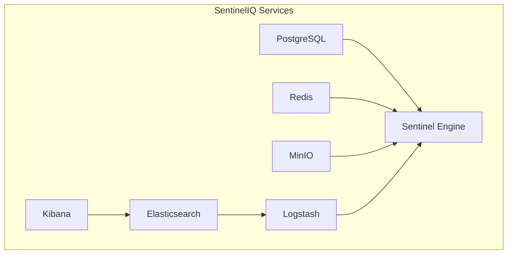
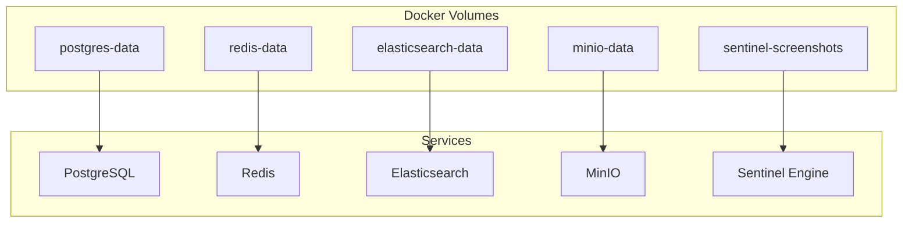
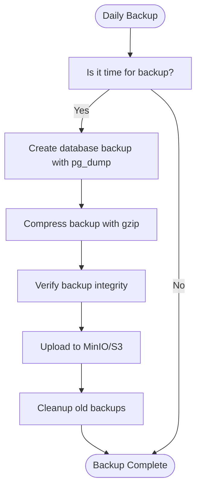
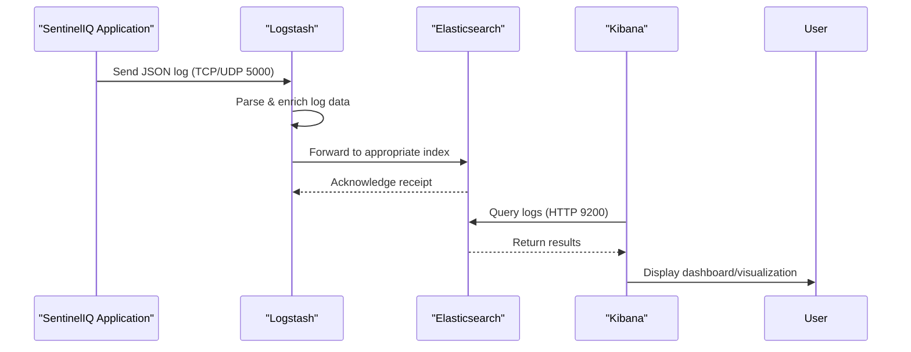
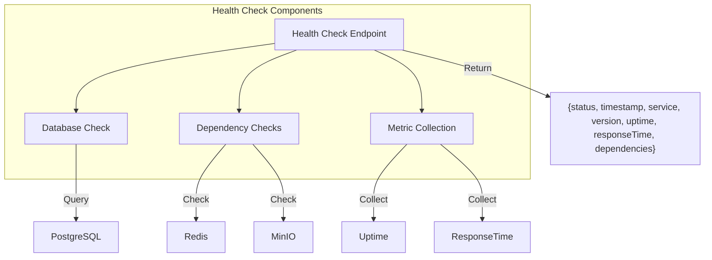
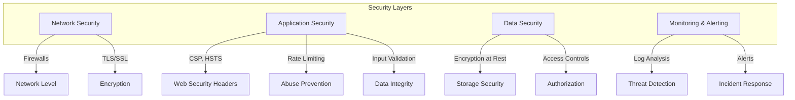

# Deployment and Operations

<cite>
**Referenced Files in This Document**   
- [docker-compose.yml](file://docker-compose.yml)
- [elk/README.md](file://elk/README.md)
- [scripts/start-elk.sh](file://scripts/start-elk.sh)
- [scripts/setup-minio.sh](file://scripts/setup-minio.sh)
- [src/server/healthCheck.ts](file://src/server/healthCheck.ts)
- [src/core/database/backup.ts](file://src/core/database/backup.ts)
- [src/core/database/recovery.ts](file://src/core/database/recovery.ts)
- [elk/kibana/setup.sh](file://elk/kibana/setup.sh)
- [elk/logstash/config/logstash.yml](file://elk/logstash/config/logstash.yml)
- [elk/logstash/pipeline/logstash.conf](file://elk/logstash/pipeline/logstash.conf)
- [src/core/database/backupJob.ts](file://src/core/database/backupJob.ts)
- [src/server/security.ts](file://src/server/security.ts)
- [src/server/rateLimit.ts](file://src/server/rateLimit.ts)
</cite>

## Table of Contents
1. [Docker Compose Setup](#docker-compose-setup)
2. [Environment Configuration](#environment-configuration)
3. [Network and Volume Configuration](#network-and-volume-configuration)
4. [Backup and Recovery](#backup-and-recovery)
5. [Monitoring and Log Analysis](#monitoring-and-log-analysis)
6. [Health Checks and Scaling](#health-checks-and-scaling)
7. [CI/CD Pipeline Considerations](#cicd-pipeline-considerations)
8. [Production Security Hardening](#production-security-hardening)
9. [Performance Tuning](#performance-tuning)

## Docker Compose Setup

The SentinelIQ platform uses Docker Compose to orchestrate multiple services required for both local development and production environments. The `docker-compose.yml` file defines services for PostgreSQL, Redis, Elasticsearch, Logstash, Kibana, MinIO, and the Sentinel Engine.

The Docker Compose configuration includes health checks for all critical services, ensuring that dependent services only start when their dependencies are healthy. For example, the Kibana service depends on Elasticsearch being healthy before starting.

**Diagram sources**
- [docker-compose.yml](file://docker-compose.yml#L1-L236)

**Section sources**
- [docker-compose.yml](file://docker-compose.yml#L1-L236)

## Environment Configuration

Environment variables are used extensively throughout the SentinelIQ platform to configure service behavior across different environments. The Docker Compose file uses environment variables for configuration, with sensible defaults for development environments.

Key environment variables include:
- `NODE_ENV`: Specifies the environment (development, production)
- `DATABASE_URL`: Connection string for PostgreSQL
- `REDIS_URL`: Connection string for Redis
- `S3_ENDPOINT`, `S3_ACCESS_KEY`, `S3_SECRET_KEY`: MinIO/S3 configuration
- `ELK_ENABLED`, `LOGSTASH_HOST`, `LOGSTASH_PORT`: ELK stack integration
- `SENTRY_DSN_PYTHON`: Error tracking configuration

The Sentinel Engine service uses environment variables to configure its behavior, including crawler settings, logging levels, and integration points with other services.

**Section sources**
- [docker-compose.yml](file://docker-compose.yml#L179-L212)

## Network and Volume Configuration

The Docker Compose setup automatically creates a default network that allows services to communicate with each other using service names as hostnames. This enables services to connect to each other without requiring explicit network configuration.

Persistent data storage is managed through Docker volumes, which ensure data persists across container restarts and updates. The following volumes are defined:

- `postgres-data`: Stores PostgreSQL database files
- `redis-data`: Stores Redis data with append-only file persistence
- `elasticsearch-data`: Stores Elasticsearch indices and data
- `minio-data`: Stores files uploaded to MinIO
- `sentinel-screenshots`: Stores screenshots captured by the Sentinel Engine

These volumes are declared in the `volumes` section of the Docker Compose file and mounted to appropriate paths within each container.

**Diagram sources**
- [docker-compose.yml](file://docker-compose.yml#L230-L235)

**Section sources**
- [docker-compose.yml](file://docker-compose.yml#L16-L17)

## Backup and Recovery

SentinelIQ includes a comprehensive backup and recovery system for the PostgreSQL database. The backup system is implemented in `src/core/database/backup.ts` and provides automated daily backups with configurable retention policies.

The backup service supports:
- Daily, weekly, and monthly retention policies
- Gzip compression of backup files
- Upload of backups to MinIO/S3 storage
- Verification of backup integrity
- Automated cleanup of old backups

Backups are performed using `pg_dump` and stored in the configured backup directory. The system automatically compresses backup files and uploads them to MinIO with appropriate metadata. The default retention policy keeps 7 daily backups, 4 weekly backups, and 3 monthly backups.

Disaster recovery is handled by the `DisasterRecoveryService` in `src/core/database/recovery.ts`, which can restore the database from backup files. The recovery process includes:
- Verification of backup integrity
- Decompression of backup files if needed
- Optional dropping and recreation of the target database
- Restoration using `psql`

A scheduled job in `src/core/database/backupJob.ts` runs daily to perform automated backups using the backup service.

**Diagram sources**
- [src/core/database/backup.ts](file://src/core/database/backup.ts#L48-L407)
- [src/core/database/recovery.ts](file://src/core/database/recovery.ts#L36-L515)
- [src/core/database/backupJob.ts](file://src/core/database/backupJob.ts#L9-L34)

**Section sources**
- [src/core/database/backup.ts](file://src/core/database/backup.ts#L1-L408)
- [src/core/database/recovery.ts](file://src/core/database/recovery.ts#L1-L516)
- [src/core/database/backupJob.ts](file://src/core/database/backupJob.ts#L1-L35)

## Monitoring and Log Analysis

SentinelIQ uses an ELK (Elasticsearch, Logstash, Kibana) stack for centralized logging, monitoring, and analysis. The ELK stack is configured in the `elk/` directory and integrated with the application through structured JSON logging.

Logstash receives JSON logs via TCP/UDP on port 5000, processes them, and forwards them to Elasticsearch. The Logstash configuration in `elk/logstash/pipeline/logstash.conf` includes filters to:
- Parse timestamps
- Normalize environment values
- Extract workspace and user information
- Enrich error logs with geo-IP data
- Route logs to environment-specific indices

Elasticsearch stores logs in daily indices following the pattern `sentineliq-logs-{environment}-{YYYY.MM.dd}`. The system includes Index Lifecycle Management (ILM) policies to automatically manage index retention, with logs retained for 90 days by default.

Kibana provides visualization and dashboard capabilities. The `elk/kibana/setup.sh` script automatically configures Kibana with:
- Index patterns for log discovery
- Saved searches for common queries
- Visualizations for error rates and log distributions
- Dashboards for monitoring system health

The `scripts/start-elk.sh` script provides a convenient way to start and verify the ELK stack, including waiting for services to be healthy and running the Kibana setup script automatically.

**Diagram sources**
- [elk/README.md](file://elk/README.md#L1-L348)
- [elk/logstash/pipeline/logstash.conf](file://elk/logstash/pipeline/logstash.conf#L1-L125)
- [elk/kibana/setup.sh](file://elk/kibana/setup.sh#L1-L253)
- [scripts/start-elk.sh](file://scripts/start-elk.sh#L1-L114)

**Section sources**
- [elk/README.md](file://elk/README.md#L1-L348)
- [elk/logstash/config/logstash.yml](file://elk/logstash/config/logstash.yml#L1-L16)
- [elk/logstash/pipeline/logstash.conf](file://elk/logstash/pipeline/logstash.conf#L1-L125)
- [scripts/start-elk.sh](file://scripts/start-elk.sh#L1-L114)
- [elk/kibana/setup.sh](file://elk/kibana/setup.sh#L1-L253)

## Health Checks and Scaling

The SentinelIQ platform includes comprehensive health checks for monitoring and ensuring service reliability. The backend exposes a health check endpoint at `/health` implemented in `src/server/healthCheck.ts`, which verifies the database connection and returns detailed service status.

Each service in the Docker Compose configuration includes health checks that are used by Docker to determine service status:
- PostgreSQL: Uses `pg_isready` to verify database readiness
- Redis: Uses `redis-cli ping` to verify connectivity
- Elasticsearch: Checks cluster health via HTTP API
- Logstash: Verifies node statistics endpoint
- Kibana: Checks status API
- MinIO: Checks health live endpoint
- Sentinel Engine: Custom health check that verifies Redis connection

The health check for the Sentinel Engine service uses a Python script to verify connectivity to Redis, ensuring that the service can process tasks from the queue.

For scaling considerations, the current configuration supports horizontal scaling of stateless services. The Sentinel Engine could be scaled horizontally to process more tasks in parallel, with Redis managing the task queue distribution. The ELK stack components can also be scaled, with Elasticsearch supporting clustering for high availability and increased capacity.

**Diagram sources**
- [src/server/healthCheck.ts](file://src/server/healthCheck.ts#L1-L45)
- [docker-compose.yml](file://docker-compose.yml#L17-L228)

**Section sources**
- [src/server/healthCheck.ts](file://src/server/healthCheck.ts#L1-L45)
- [docker-compose.yml](file://docker-compose.yml#L17-L228)

## CI/CD Pipeline Considerations

The deployment architecture of SentinelIQ supports integration with CI/CD pipelines for automated testing, building, and deployment. The Docker-based architecture allows for consistent environments from development to production.

Key considerations for CI/CD integration include:
- Building and pushing Docker images to a registry
- Running automated tests against the complete stack
- Managing environment-specific configuration
- Implementing zero-downtime deployments
- Rolling back failed deployments

The platform's use of environment variables for configuration enables easy adaptation to different deployment environments. Secrets management should be implemented to securely handle credentials for database, Redis, MinIO, and other services.

Database migrations are managed through the migration files in the `migrations/` directory, which should be applied as part of the deployment process. The CI/CD pipeline should ensure that migrations are tested and applied in the correct order.

Health checks can be used in the CI/CD pipeline to verify that services are running correctly after deployment. Automated tests should verify that the ELK stack is receiving logs and that backup processes are functioning correctly.

## Production Security Hardening

The SentinelIQ platform includes several security measures for production deployment. The `src/server/security.ts` file configures security middleware using Helmet and CORS to protect against common web vulnerabilities.

Key security features include:
- Content Security Policy (CSP) to prevent XSS attacks
- HTTP Strict Transport Security (HSTS) to enforce HTTPS
- CORS configuration with strict origin controls
- Rate limiting using Redis to prevent abuse
- Request size limits to prevent DoS attacks

The rate limiting system in `src/server/rateLimit.ts` uses Redis to track request counts and prevent abuse of API endpoints. Predefined rate limits are configured for sensitive operations like workspace creation and member invitations.

For production deployment, additional security hardening should be applied:
- Enable X-Pack security in Elasticsearch with strong passwords
- Configure TLS for all external communications
- Use production-grade secrets management
- Implement network segmentation
- Regular security audits and penetration testing
- Monitoring for suspicious activity

The platform should also implement proper logging and monitoring of security events, with alerts configured for suspicious activities like multiple failed login attempts or unauthorized access attempts.

**Diagram sources**
- [src/server/security.ts](file://src/server/security.ts#L1-L268)
- [src/server/rateLimit.ts](file://src/server/rateLimit.ts#L1-L85)

**Section sources**
- [src/server/security.ts](file://src/server/security.ts#L1-L268)
- [src/server/rateLimit.ts](file://src/server/rateLimit.ts#L1-L85)

## Performance Tuning

The SentinelIQ platform can be tuned for optimal performance in production environments. The ELK stack configuration provides several performance tuning options.

For Logstash, performance can be improved by:
- Increasing `pipeline.workers` to match CPU cores
- Adjusting `pipeline.batch.size` for throughput optimization
- Reducing `pipeline.batch.delay` for lower latency

Elasticsearch performance can be enhanced by:
- Increasing JVM heap size (ES_JAVA_OPTS)
- Configuring appropriate shard and replica counts
- Using dedicated master and data nodes in a cluster
- Implementing index lifecycle management

The `scripts/setup-minio.sh` script configures MinIO with optimal settings for the application, including public read access for workspace logos. The script also provides test upload instructions to verify storage functionality.

Database performance can be optimized by:
- Configuring appropriate connection pooling
- Implementing read replicas for high-read workloads
- Using the `scripts/setup-read-replicas.sh` script when available
- Monitoring slow queries with the database slow query monitor

The Sentinel Engine performance can be tuned by adjusting configuration parameters like `SENTINEL_MAX_CONCURRENT_CRAWLS` and `SENTINEL_CRAWLER_TIMEOUT` based on available resources and workload requirements.