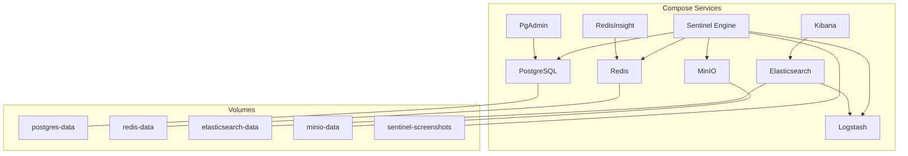
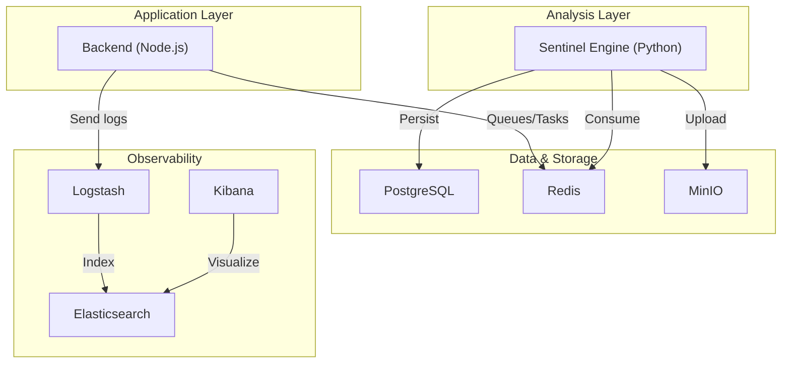
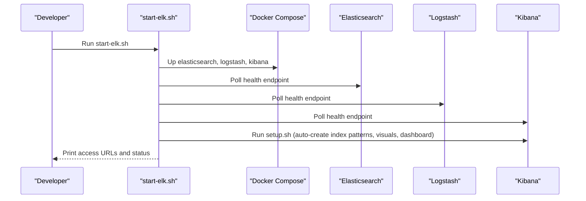
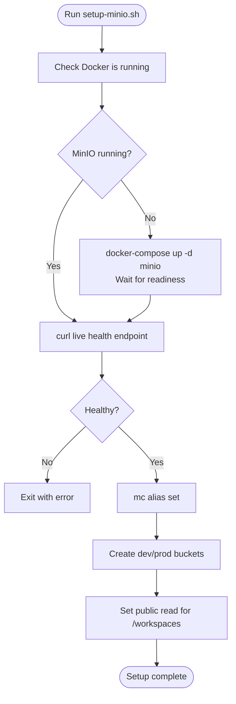
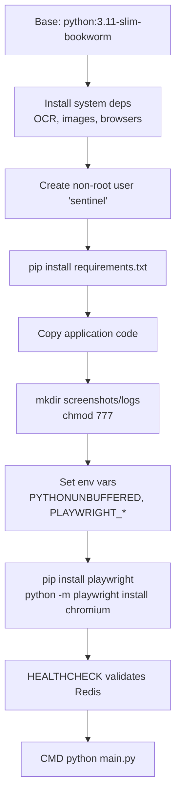
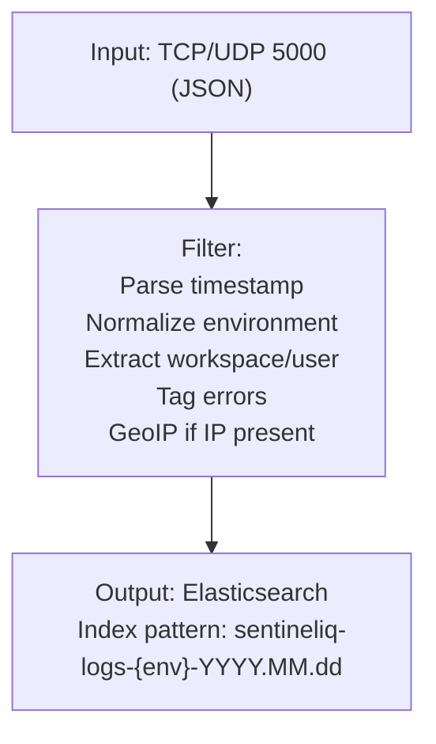
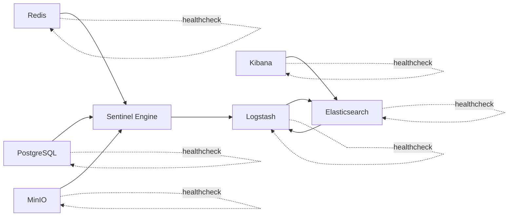

# Infrastructure Setup

<cite>
**Referenced Files in This Document**
- [docker-compose.yml](file://docker-compose.yml)
- [README.md](file://README.md)
- [scripts/start-elk.sh](file://scripts/start-elk.sh)
- [scripts/setup-minio.sh](file://scripts/setup-minio.sh)
- [elk/README.md](file://elk/README.md)
- [elk/logstash/config/logstash.yml](file://elk/logstash/config/logstash.yml)
- [elk/logstash/pipeline/logstash.conf](file://elk/logstash/pipeline/logstash.conf)
- [elk/kibana/setup.sh](file://elk/kibana/setup.sh)
- [services/engine/Dockerfile](file://services/engine/Dockerfile)
- [services/engine/config.py](file://services/engine/config.py)
- [services/engine/requirements.txt](file://services/engine/requirements.txt)
- [services/engine/main.py](file://services/engine/main.py)
</cite>

## Table of Contents
1. [Introduction](#introduction)
2. [Project Structure](#project-structure)
3. [Core Components](#core-components)
4. [Architecture Overview](#architecture-overview)
5. [Detailed Component Analysis](#detailed-component-analysis)
6. [Dependency Analysis](#dependency-analysis)
7. [Performance Considerations](#performance-considerations)
8. [Troubleshooting Guide](#troubleshooting-guide)
9. [Conclusion](#conclusion)
10. [Appendices](#appendices)

## Introduction
This document provides a comprehensive guide to deploy and operate the SentinelIQ infrastructure stack using the provided docker-compose configuration. It explains the purpose and configuration of each container, service dependencies, networking, volume persistence, port mappings, and initialization steps. It also covers the MinIO object storage setup and the ELK stack automation via shell scripts, and details how to build and customize the Python analysis engine Docker image.

## Project Structure
The infrastructure is orchestrated by a single docker-compose file that defines all services, volumes, and environment variables. Supporting scripts automate ELK startup and MinIO initialization. The Python analysis engine is packaged in its own Dockerfile and runs as a dedicated service.

**Diagram sources**
- [docker-compose.yml](file://docker-compose.yml#L1-L236)

**Section sources**
- [docker-compose.yml](file://docker-compose.yml#L1-L236)
- [README.md](file://README.md#L1-L17)

## Core Components
This section describes each container’s role, configuration, and runtime behavior.

- PostgreSQL
  - Purpose: Primary relational database for application data.
  - Ports: 5432/tcp mapped.
  - Persistence: Volume mounted at the container’s data directory.
  - Health check: Uses pg_isready against the configured user/db.
  - Dependencies: Required by the Sentinel Engine.

- Redis
  - Purpose: Task queue and caching for the analysis engine.
  - Ports: 6379/tcp mapped.
  - Persistence: Append-only enabled; volume mounted for durability.
  - Health check: ping via redis-cli.
  - Dependencies: Required by the Sentinel Engine.

- RedisInsight
  - Purpose: GUI for Redis administration.
  - Ports: 8001/tcp mapped.
  - Depends on: Redis service health.

- PgAdmin
  - Purpose: Optional GUI for PostgreSQL administration.
  - Ports: 5050/tcp mapped.
  - Depends on: PostgreSQL service health.

- Elasticsearch
  - Purpose: Centralized log storage and indexing for the ELK stack.
  - Ports: 9200/tcp, 9300/tcp mapped.
  - Persistence: Volume mounted at the container’s data directory.
  - Health check: Cluster health endpoint.
  - Security: Disabled by default in development; can be enabled for production.

- Logstash
  - Purpose: Ingests JSON logs from the application, enriches, and writes to Elasticsearch.
  - Ports: 5000/tcp and 5000/udp mapped; 9600/tcp for monitoring.
  - Config: Pipeline and YAML loaded from host paths.
  - Depends on: Elasticsearch health.
  - Health check: Node stats endpoint.

- Kibana
  - Purpose: Visualization and dashboard for logs.
  - Ports: 5601/tcp mapped.
  - Depends on: Elasticsearch health.
  - Health check: API status endpoint.

- MinIO
  - Purpose: S3-compatible object storage for screenshots and branding assets.
  - Ports: 9000/tcp (API), 9001/tcp (Console).
  - Persistence: Volume mounted at the data directory.
  - Health check: Live endpoint.
  - Dependencies: Required by the Sentinel Engine.

- Sentinel Engine (Python)
  - Purpose: Background crawler and analyzer that consumes tasks from Redis, performs analysis, persists results to PostgreSQL, uploads screenshots to MinIO, and integrates with ELK/Sentry.
  - Build: Built from the engine’s Dockerfile under services/engine.
  - Environment: Reads configuration from environment variables injected by docker-compose.
  - Dependencies: PostgreSQL, Redis, MinIO, Logstash, Elasticsearch (via Logstash).
  - Health check: Validates Redis connectivity.

**Section sources**
- [docker-compose.yml](file://docker-compose.yml#L1-L236)
- [services/engine/Dockerfile](file://services/engine/Dockerfile#L1-L79)
- [services/engine/config.py](file://services/engine/config.py#L1-L78)
- [elk/logstash/config/logstash.yml](file://elk/logstash/config/logstash.yml#L1-L16)
- [elk/logstash/pipeline/logstash.conf](file://elk/logstash/pipeline/logstash.conf#L1-L125)

## Architecture Overview
The system is composed of a backend application and several infrastructure services. The Python analysis engine consumes tasks from Redis, interacts with PostgreSQL for persistence, uploads artifacts to MinIO, and emits logs to the ELK stack for centralized monitoring.

**Diagram sources**
- [docker-compose.yml](file://docker-compose.yml#L1-L236)
- [services/engine/main.py](file://services/engine/main.py#L1-L284)
- [elk/logstash/pipeline/logstash.conf](file://elk/logstash/pipeline/logstash.conf#L1-L125)

## Detailed Component Analysis

### ELK Stack Setup and Automation
The ELK stack is started and verified via a dedicated script. It launches Elasticsearch, Logstash, and Kibana, waits for health, and optionally runs an automatic Kibana setup to create index patterns, saved searches, visualizations, and a dashboard.

Key behaviors:
- Starts services in detached mode.
- Waits for health checks on Elasticsearch, Logstash, and Kibana.
- Provides access URLs and cluster health details.
- Sends a test log to Logstash on port 5000.
- Runs Kibana setup script to create index patterns and dashboards based on environment.

**Diagram sources**
- [scripts/start-elk.sh](file://scripts/start-elk.sh#L1-L114)
- [elk/kibana/setup.sh](file://elk/kibana/setup.sh#L1-L253)

**Section sources**
- [scripts/start-elk.sh](file://scripts/start-elk.sh#L1-L114)
- [elk/README.md](file://elk/README.md#L1-L348)
- [elk/kibana/setup.sh](file://elk/kibana/setup.sh#L1-L253)

### MinIO Object Storage Setup
The MinIO setup script ensures the container is running, checks health, configures the MinIO client alias, and creates development and production buckets. It sets a public read policy for workspace logos and prints helpful access and environment information.

Highlights:
- Creates two buckets: development and production.
- Sets public read policy for the workspaces path.
- Prints console and API endpoints, credentials, and environment variables for configuration.

**Diagram sources**
- [scripts/setup-minio.sh](file://scripts/setup-minio.sh#L1-L156)

**Section sources**
- [scripts/setup-minio.sh](file://scripts/setup-minio.sh#L1-L156)
- [docker-compose.yml](file://docker-compose.yml#L148-L169)

### Python Analysis Engine Docker Image
The engine’s Dockerfile defines a slim Python base, installs system dependencies for OCR and browser automation, sets up a non-root user, installs Python dependencies, prepares directories, configures Playwright, and sets a health check that validates Redis connectivity.

Key points:
- Installs Tesseract languages and Playwright Chromium.
- Creates non-root user and switches to it.
- Health check validates Redis connectivity.
- Entrypoint runs the main Python consumer loop.

**Diagram sources**
- [services/engine/Dockerfile](file://services/engine/Dockerfile#L1-L79)
- [services/engine/requirements.txt](file://services/engine/requirements.txt#L1-L39)

**Section sources**
- [services/engine/Dockerfile](file://services/engine/Dockerfile#L1-L79)
- [services/engine/requirements.txt](file://services/engine/requirements.txt#L1-L39)
- [services/engine/config.py](file://services/engine/config.py#L1-L78)
- [services/engine/main.py](file://services/engine/main.py#L1-L284)

### Log Processing Pipeline (Logstash)
Logstash receives JSON logs over TCP/UDP on port 5000, parses timestamps, normalizes environment values, enriches error logs, extracts workspace/user identifiers, and writes to Elasticsearch with environment-specific daily indices.

**Diagram sources**
- [elk/logstash/pipeline/logstash.conf](file://elk/logstash/pipeline/logstash.conf#L1-L125)
- [elk/logstash/config/logstash.yml](file://elk/logstash/config/logstash.yml#L1-L16)

**Section sources**
- [elk/logstash/pipeline/logstash.conf](file://elk/logstash/pipeline/logstash.conf#L1-L125)
- [elk/logstash/config/logstash.yml](file://elk/logstash/config/logstash.yml#L1-L16)

## Dependency Analysis
Service dependencies and health checks define the operational order during startup.

**Diagram sources**
- [docker-compose.yml](file://docker-compose.yml#L1-L236)

**Section sources**
- [docker-compose.yml](file://docker-compose.yml#L1-L236)

## Performance Considerations
- Elasticsearch memory: Adjust JVM heap via environment variables in docker-compose for higher throughput.
- Logstash tuning: Increase pipeline workers and batch size in the Logstash YAML for high-volume ingestion.
- Redis queue sizing: Monitor queue length and adjust concurrency and polling intervals in the engine configuration.
- MinIO capacity: Scale volumes and consider lifecycle policies for long-term storage.
- Network: Ensure containers communicate over internal networks; avoid exposing unnecessary ports externally.

[No sources needed since this section provides general guidance]

## Troubleshooting Guide
Common issues and remedies:

- ELK not receiving logs
  - Verify Logstash is healthy and listening on port 5000.
  - Send a test JSON log to the Logstash host/port and confirm it appears in Elasticsearch indices.

- Elasticsearch connection problems
  - Check cluster health and indices; ensure the correct host/port is configured in Kibana.

- Kibana not loading
  - Confirm Elasticsearch is reachable and Kibana’s health endpoint responds.

- MinIO not responding
  - Check container logs and health endpoint; ensure the console and API ports are mapped.

- Redis connectivity failures
  - Validate Redis health and that the engine’s Redis URL is correct.

- Engine health check failing
  - Confirm Redis is healthy and the engine can connect; inspect engine logs.

**Section sources**
- [elk/README.md](file://elk/README.md#L238-L273)
- [scripts/start-elk.sh](file://scripts/start-elk.sh#L1-L114)
- [scripts/setup-minio.sh](file://scripts/setup-minio.sh#L1-L156)
- [docker-compose.yml](file://docker-compose.yml#L1-L236)

## Conclusion
The SentinelIQ infrastructure is designed for easy local deployment using docker-compose. The ELK stack centralizes logging, MinIO provides object storage, Redis powers the analysis engine, and PostgreSQL persists application data. The provided scripts streamline ELK startup and MinIO initialization. The Python analysis engine is built as a self-contained Docker image with explicit health checks and environment-driven configuration.

[No sources needed since this section summarizes without analyzing specific files]

## Appendices

### Step-by-Step Deployment Instructions
- Prerequisites
  - Ensure Docker is installed and running.
  - Prepare environment files for the application as indicated in the project’s development notes.

- Start the ELK stack
  - Run the ELK startup script to launch Elasticsearch, Logstash, and Kibana, wait for health, and optionally run the automatic Kibana setup.
  - Access Elasticsearch, Logstash, and Kibana using the printed URLs.

- Initialize MinIO
  - Run the MinIO setup script to start the container, configure the client alias, create development and production buckets, and apply public read policy for workspace logos.

- Bring up the full stack
  - Start all services defined in the docker-compose file. The engine depends on PostgreSQL, Redis, MinIO, and Logstash; the compose file ensures health checks and ordering.

- Verify services
  - Check service statuses and logs for each component.
  - Confirm the engine health check passes and that tasks are being consumed from Redis.

- Optional GUIs
  - Access RedisInsight at the mapped port for Redis administration.
  - Access PgAdmin at the mapped port for PostgreSQL administration.

**Section sources**
- [scripts/start-elk.sh](file://scripts/start-elk.sh#L1-L114)
- [scripts/setup-minio.sh](file://scripts/setup-minio.sh#L1-L156)
- [docker-compose.yml](file://docker-compose.yml#L1-L236)
- [README.md](file://README.md#L9-L17)

### Volume Persistence and Port Mappings
- Volumes
  - PostgreSQL: persistent data directory.
  - Redis: append-only data directory.
  - Elasticsearch: persistent data directory.
  - MinIO: persistent data directory.
  - Sentinel Engine: screenshots directory mounted for artifact storage.

- Ports
  - PostgreSQL: 5432/tcp.
  - Redis: 6379/tcp.
  - RedisInsight: 8001/tcp.
  - PgAdmin: 5050/tcp.
  - Elasticsearch: 9200/tcp, 9300/tcp.
  - Logstash: 5000/tcp and 5000/udp, 9600/tcp.
  - Kibana: 5601/tcp.
  - MinIO: 9000/tcp (API), 9001/tcp (Console).

**Section sources**
- [docker-compose.yml](file://docker-compose.yml#L1-L236)

### Building and Customizing the Python Analysis Engine
- Build
  - The engine service is built from the Dockerfile located under services/engine. The compose file triggers the build with the provided Dockerfile path.

- Customize
  - Modify the Dockerfile to add system packages or change Python dependencies.
  - Update environment variables in the compose file to tune Redis, database, S3/MinIO, ELK, and Sentry settings.
  - Adjust the engine’s configuration module to change defaults for queues, timeouts, concurrency, OCR, and logging.

**Section sources**
- [docker-compose.yml](file://docker-compose.yml#L170-L229)
- [services/engine/Dockerfile](file://services/engine/Dockerfile#L1-L79)
- [services/engine/config.py](file://services/engine/config.py#L1-L78)
- [services/engine/requirements.txt](file://services/engine/requirements.txt#L1-L39)