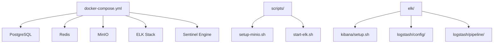
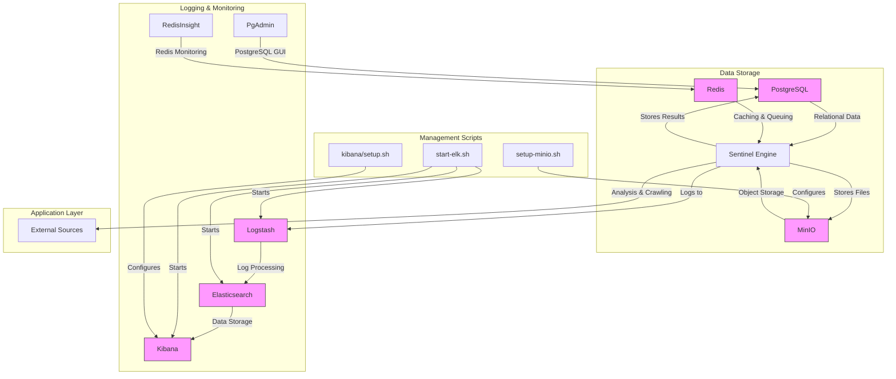
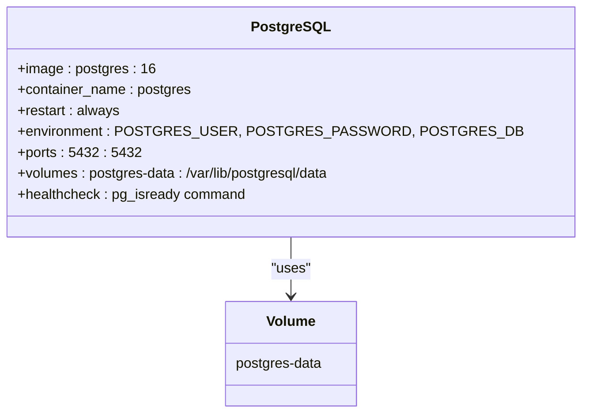
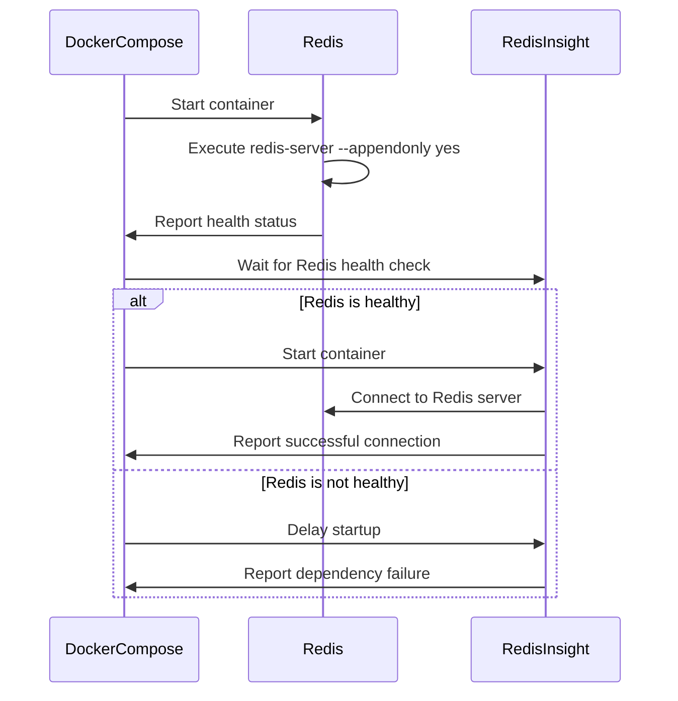
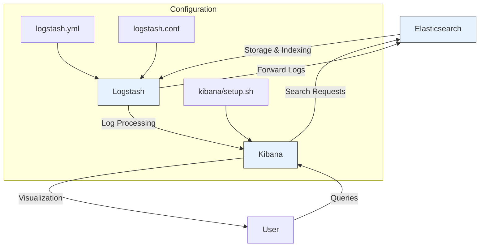
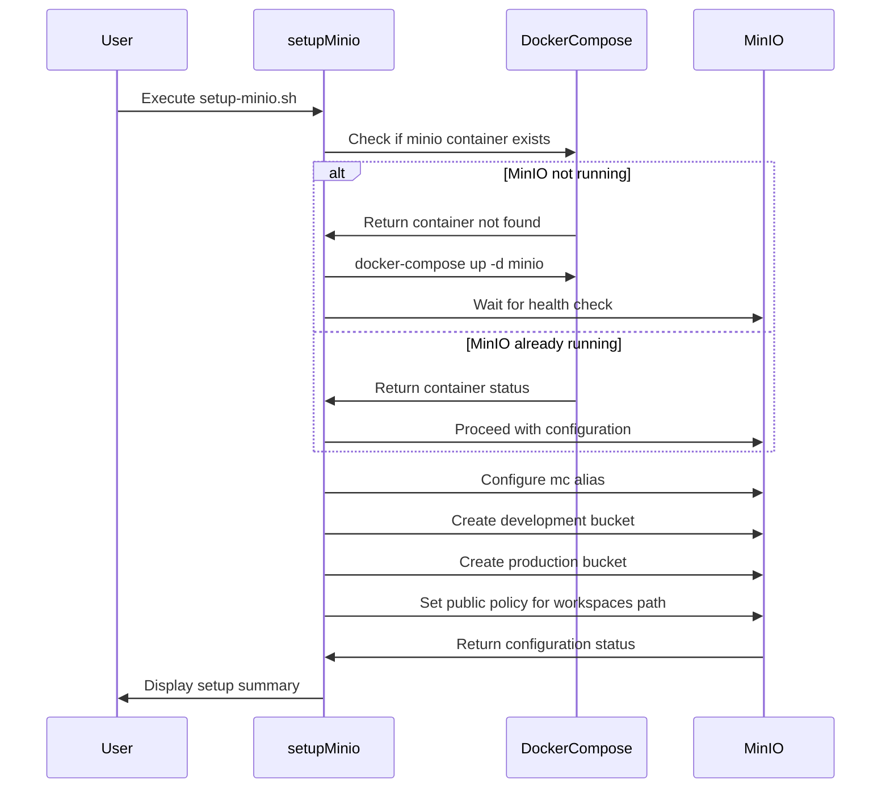
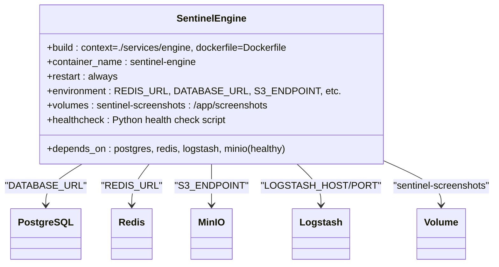
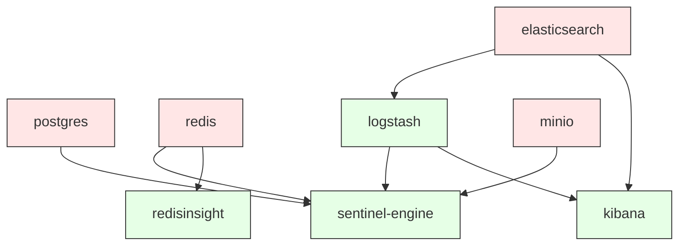

# Container Orchestration

<cite>
**Referenced Files in This Document**   
- [docker-compose.yml](file://docker-compose.yml)
- [scripts/setup-minio.sh](file://scripts/setup-minio.sh)
- [elk/kibana/setup.sh](file://elk/kibana/setup.sh)
- [scripts/start-elk.sh](file://scripts/start-elk.sh)
- [elk/logstash/config/logstash.yml](file://elk/logstash/config/logstash.yml)
- [elk/logstash/pipeline/logstash.conf](file://elk/logstash/pipeline/logstash.conf)
- [elk/README.md](file://elk/README.md)
- [docker-compose.prod.yml](file://docker-compose.prod.yml)
</cite>

## Table of Contents
1. [Introduction](#introduction)
2. [Project Structure](#project-structure)
3. [Core Components](#core-components)
4. [Architecture Overview](#architecture-overview)
5. [Detailed Component Analysis](#detailed-component-analysis)
6. [Dependency Analysis](#dependency-analysis)
7. [Performance Considerations](#performance-considerations)
8. [Troubleshooting Guide](#troubleshooting-guide)
9. [Conclusion](#conclusion)

## Introduction
This document provides comprehensive documentation for orchestrating SentinelIQ's containerized services using docker-compose.yml. It details the service definitions for PostgreSQL, Redis, MinIO, ELK stack, and the Python analysis engine, including network configurations, volume mounts, and dependency ordering. The integration between docker-compose.yml and setup-minio.sh is explained, along with configuration of environment variables, port mappings, and health checks for each service. The document also covers customization of the compose file for different environments, scaling services, debugging container interdependencies, and addressing common orchestration issues.

## Project Structure
The SentinelIQ application is organized with a clear separation of concerns, containing directories for the ELK stack, database migrations, public assets, scripts, services, and source code. The docker-compose.yml file orchestrates the containerized services, while various scripts handle setup and configuration tasks.

**Diagram sources**
- [docker-compose.yml](file://docker-compose.yml)
- [scripts/setup-minio.sh](file://scripts/setup-minio.sh)
- [elk/kibana/setup.sh](file://elk/kibana/setup.sh)

**Section sources**
- [docker-compose.yml](file://docker-compose.yml)
- [scripts/setup-minio.sh](file://scripts/setup-minio.sh)
- [elk/kibana/setup.sh](file://elk/kibana/setup.sh)

## Core Components
The core components of the SentinelIQ orchestration system include PostgreSQL for relational data storage, Redis for caching and message queuing, MinIO for object storage, the ELK stack (Elasticsearch, Logstash, Kibana) for log aggregation and visualization, and the Python-based Sentinel Engine for analysis and crawling. These components are orchestrated through docker-compose.yml with proper dependency management, health checks, and volume configurations to ensure reliable operation.

**Section sources**
- [docker-compose.yml](file://docker-compose.yml)
- [elk/README.md](file://elk/README.md)

## Architecture Overview
The SentinelIQ container orchestration architecture follows a microservices pattern with specialized containers for different functions. The architecture ensures proper service isolation while enabling seamless communication between components through Docker networks and well-defined interfaces.

**Diagram sources**
- [docker-compose.yml](file://docker-compose.yml)
- [scripts/setup-minio.sh](file://scripts/setup-minio.sh)
- [scripts/start-elk.sh](file://scripts/start-elk.sh)
- [elk/kibana/setup.sh](file://elk/kibana/setup.sh)

## Detailed Component Analysis

### PostgreSQL Service Configuration
The PostgreSQL service is configured as a critical data storage component with persistent volume mounting, health checks, and environment variable configuration for database credentials. The service exposes port 5432 for external access and uses a named volume for data persistence across container restarts.

**Diagram sources**
- [docker-compose.yml](file://docker-compose.yml#L5-L22)

**Section sources**
- [docker-compose.yml](file://docker-compose.yml#L5-L22)

### Redis and RedisInsight Configuration
The Redis service provides caching and message queuing capabilities with append-only file persistence enabled. RedisInsight is configured as a GUI management tool that depends on the Redis service being healthy before starting. Both services use named volumes for data persistence and expose their respective ports for external access.

**Diagram sources**
- [docker-compose.yml](file://docker-compose.yml#L26-L53)

**Section sources**
- [docker-compose.yml](file://docker-compose.yml#L26-L53)

### ELK Stack Configuration
The ELK stack consists of Elasticsearch, Logstash, and Kibana services configured to work together for log aggregation, processing, and visualization. The services are configured with proper dependencies, health checks, and environment variables to ensure they start in the correct order and can communicate with each other.

**Diagram sources**
- [docker-compose.yml](file://docker-compose.yml#L73-L147)
- [elk/logstash/config/logstash.yml](file://elk/logstash/config/logstash.yml)
- [elk/logstash/pipeline/logstash.conf](file://elk/logstash/pipeline/logstash.conf)
- [elk/kibana/setup.sh](file://elk/kibana/setup.sh)

**Section sources**
- [docker-compose.yml](file://docker-compose.yml#L73-L147)
- [elk/logstash/config/logstash.yml](file://elk/logstash/config/logstash.yml)
- [elk/logstash/pipeline/logstash.conf](file://elk/logstash/pipeline/logstash.conf)
- [elk/kibana/setup.sh](file://elk/kibana/setup.sh)

### MinIO Service and Setup Integration
The MinIO service provides S3-compatible object storage for the application. The setup-minio.sh script ensures MinIO is running before creating necessary buckets and configuring access policies. This integration prevents race conditions during the initial setup process.

**Diagram sources**
- [docker-compose.yml](file://docker-compose.yml#L151-L169)
- [scripts/setup-minio.sh](file://scripts/setup-minio.sh)

**Section sources**
- [docker-compose.yml](file://docker-compose.yml#L151-L169)
- [scripts/setup-minio.sh](file://scripts/setup-minio.sh)

### Sentinel Engine Configuration
The Sentinel Engine is a Python-based service responsible for analysis and crawling tasks. It depends on multiple services being healthy before starting and is configured with environment variables for connecting to databases, caches, and storage systems. The service uses a custom Docker build process and includes health checks to verify connectivity to its dependencies.

**Diagram sources**
- [docker-compose.yml](file://docker-compose.yml#L173-L228)

**Section sources**
- [docker-compose.yml](file://docker-compose.yml#L173-L228)

## Dependency Analysis
The container orchestration system has a well-defined dependency graph that ensures services start in the correct order and are healthy before dependent services start. This prevents race conditions and ensures reliable application startup.

**Diagram sources**
- [docker-compose.yml](file://docker-compose.yml)

**Section sources**
- [docker-compose.yml](file://docker-compose.yml)

## Performance Considerations
The container orchestration configuration includes several performance considerations such as resource limits, health check intervals, and volume mounting for persistent data. The ELK stack components are configured with appropriate JVM heap settings and pipeline configurations to handle log processing efficiently. The Redis service uses append-only file persistence for durability while maintaining good performance. The PostgreSQL service benefits from volume mounting to ensure data persistence and performance across container restarts.

**Section sources**
- [docker-compose.yml](file://docker-compose.yml)
- [elk/logstash/config/logstash.yml](file://elk/logstash/config/logstash.yml)

## Troubleshooting Guide
Common orchestration issues include startup race conditions, volume permission errors, and network isolation. The health check configuration in docker-compose.yml helps prevent race conditions by ensuring services are fully operational before dependent services start. Volume permission issues can be addressed by ensuring proper ownership and permissions on host-mounted volumes. Network isolation issues can be resolved by verifying Docker network configurations and service dependencies.

For MinIO setup issues, the setup-minio.sh script provides comprehensive error checking and reporting. If MinIO fails to start, the script checks Docker availability and container status before proceeding with configuration. For ELK stack issues, the start-elk.sh script verifies service health and provides access to logs for troubleshooting.

**Section sources**
- [docker-compose.yml](file://docker-compose.yml)
- [scripts/setup-minio.sh](file://scripts/setup-minio.sh)
- [scripts/start-elk.sh](file://scripts/start-elk.sh)
- [elk/README.md](file://elk/README.md)

## Conclusion
The SentinelIQ container orchestration system provides a robust foundation for running the application's various services in a coordinated manner. The docker-compose.yml file defines all necessary services with appropriate configurations for production use, while supporting development workflows through environment variables and script integration. The system demonstrates best practices in container orchestration, including proper dependency management, health checks, and volume configuration. The integration between docker-compose.yml and setup scripts ensures reliable initialization of services, particularly for MinIO bucket creation. This orchestration approach enables easy scaling, debugging, and maintenance of the application's infrastructure.