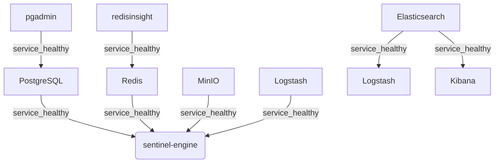
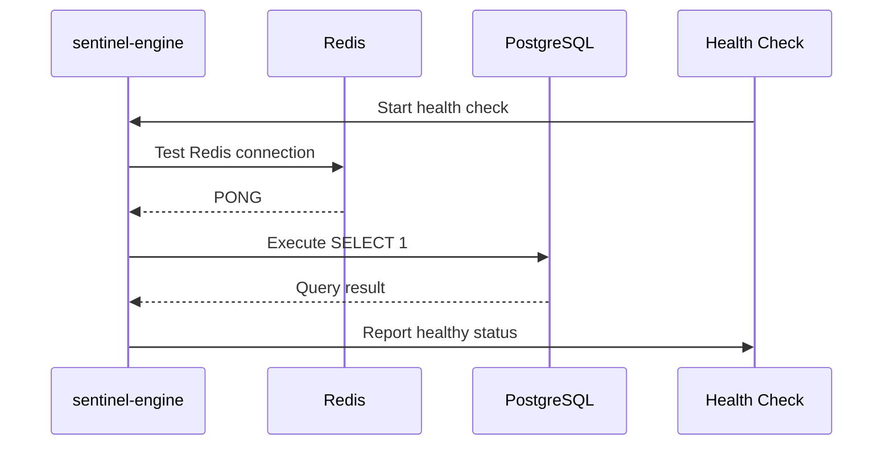
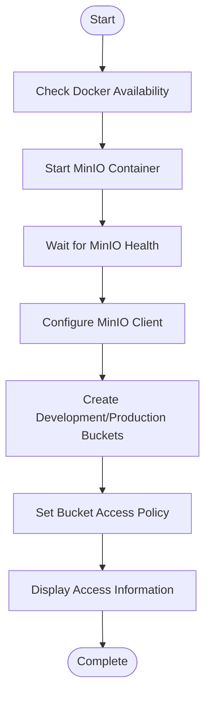
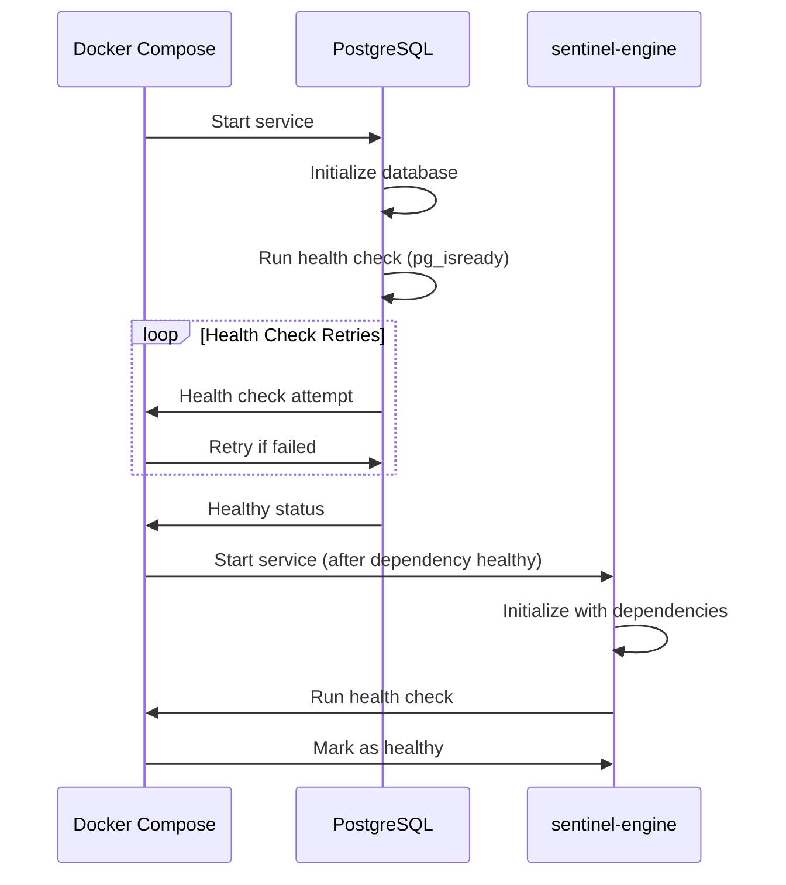
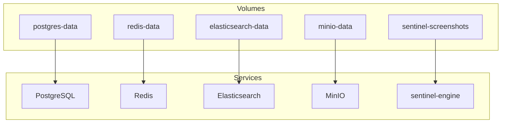
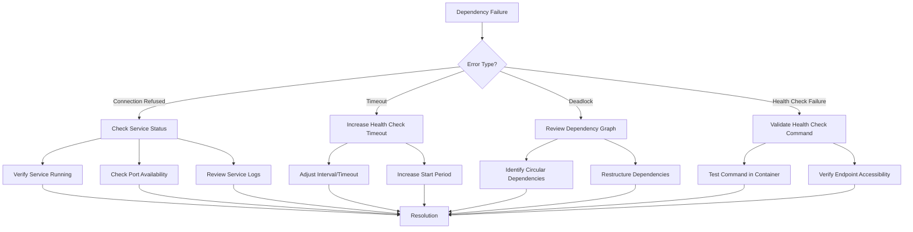

# Dependency Management

<cite>
**Referenced Files in This Document**   
- [docker-compose.yml](file://docker-compose.yml)
- [docker-compose.prod.yml](file://docker-compose.prod.yml)
- [scripts/setup-minio.sh](file://scripts/setup-minio.sh)
- [scripts/start-elk.sh](file://scripts/start-elk.sh)
- [elk/kibana/setup.sh](file://elk/kibana/setup.sh)
- [src/server/healthCheck.ts](file://src/server/healthCheck.ts)
- [services/engine/src/sentineliq_engine/config.py](file://services/engine/src/sentineliq_engine/config.py)
</cite>

## Table of Contents
1. [Introduction](#introduction)
2. [Service Dependency Orchestration](#service-dependency-orchestration)
3. [Health Check Implementation](#health-check-implementation)
4. [External Setup Scripts Integration](#external-setup-scripts-integration)
5. [Startup Race Condition Handling](#startup-race-condition-handling)
6. [Data Volume Initialization](#data-volume-initialization)
7. [Troubleshooting Dependency Failures](#troubleshooting-dependency-failures)
8. [Conclusion](#conclusion)

## Introduction
This document provides comprehensive guidance on managing service dependencies within the docker-compose.yml orchestration for the SentinelIQ application. It details the implementation of dependency management patterns, including condition-based startup sequencing, health check configurations, and integration with external setup scripts. The documentation covers how database, cache, storage, and logging services are coordinated to ensure reliable application startup and operation.

## Service Dependency Orchestration
The docker-compose.yml file implements a sophisticated dependency management system using Docker Compose's `depends_on` directive with condition-based startup. This ensures that critical infrastructure services are fully operational before dependent application containers start processing requests.

The orchestration follows a hierarchical dependency model where application services like the sentinel-engine and server depend on multiple infrastructure services. The `depends_on` configuration with `condition: service_healthy` ensures that services only start after their dependencies have passed health checks, preventing race conditions during startup.

**Diagram sources**
- [docker-compose.yml](file://docker-compose.yml#L50-L53)
- [docker-compose.yml](file://docker-compose.yml#L66-L68)
- [docker-compose.yml](file://docker-compose.yml#L117-L120)
- [docker-compose.yml](file://docker-compose.yml#L139-L142)
- [docker-compose.yml](file://docker-compose.yml#L214-L223)

**Section sources**
- [docker-compose.yml](file://docker-compose.yml#L1-L236)
- [docker-compose.prod.yml](file://docker-compose.prod.yml#L1-L330)

## Health Check Implementation
The system implements comprehensive health checks for all critical services to ensure reliable dependency management. Each infrastructure service has a dedicated health check configuration that validates its operational status before allowing dependent services to start.

PostgreSQL uses the `pg_isready` command to verify database readiness, while Redis employs `redis-cli ping` to confirm connectivity. Elasticsearch, Logstash, and Kibana services use HTTP-based health checks that query their respective API endpoints. The MinIO service checks its health endpoint to ensure storage availability.

Application services implement custom health checks that validate connectivity to their dependencies. The Node.js server uses a dedicated health check endpoint that tests database connectivity, while the Python-based sentinel-engine verifies its ability to connect to Redis.

**Diagram sources**
- [docker-compose.yml](file://docker-compose.yml#L17-L21)
- [docker-compose.yml](file://docker-compose.yml#L35-L39)
- [docker-compose.yml](file://docker-compose.yml#L94-L98)
- [docker-compose.yml](file://docker-compose.yml#L120-L124)
- [docker-compose.yml](file://docker-compose.yml#L142-L146)
- [docker-compose.yml](file://docker-compose.yml#L164-L168)
- [src/server/healthCheck.ts](file://src/server/healthCheck.ts#L1-L44)

**Section sources**
- [docker-compose.yml](file://docker-compose.yml#L17-L228)
- [src/server/healthCheck.ts](file://src/server/healthCheck.ts#L1-L44)

## External Setup Scripts Integration
The system integrates external setup scripts to prepare infrastructure components before service initialization. These scripts handle complex initialization tasks that cannot be managed through docker-compose alone, ensuring that services start with properly configured environments.

The `setup-minio.sh` script initializes the MinIO object storage service by creating required buckets and configuring access policies. It checks for Docker availability, starts the MinIO container if necessary, verifies service health, configures the MinIO client, and creates development and production buckets with appropriate permissions.

The `start-elk.sh` script orchestrates the startup of the ELK (Elasticsearch, Logstash, Kibana) stack, waiting for each service to become healthy before proceeding. It displays service status, access URLs, and cluster health information, and automatically configures Kibana by running the `elk/kibana/setup.sh` script when available.

**Diagram sources**
- [scripts/setup-minio.sh](file://scripts/setup-minio.sh#L1-L156)
- [scripts/start-elk.sh](file://scripts/start-elk.sh#L1-L114)

**Section sources**
- [scripts/setup-minio.sh](file://scripts/setup-minio.sh#L1-L156)
- [scripts/start-elk.sh](file://scripts/start-elk.sh#L1-L114)
- [elk/kibana/setup.sh](file://elk/kibana/setup.sh#L1-L253)

## Startup Race Condition Handling
The system employs multiple strategies to handle startup race conditions and ensure reliable service initialization. The primary mechanism is the use of health check conditions in the `depends_on` directive, which prevents services from starting until their dependencies are fully operational.

For services with complex initialization requirements, the system implements additional safeguards. The sentinel-engine service includes a `start_period` of 40 seconds in its health check configuration, allowing time for initialization before health checks begin. This prevents premature failure detection during the startup phase.

The external setup scripts implement their own waiting mechanisms using retry loops with exponential backoff. The `start-elk.sh` script uses a 60-iteration loop with 3-second delays to wait for each ELK component to become healthy, providing up to 3 minutes for service initialization.

Application services also implement connection retry logic in their code. The Python engine service uses environment variables to configure connection parameters and implements retry mechanisms when connecting to Redis and PostgreSQL, as defined in the configuration files.

**Diagram sources**
- [docker-compose.yml](file://docker-compose.yml#L223-L228)
- [scripts/start-elk.sh](file://scripts/start-elk.sh#L25-L56)
- [services/engine/src/sentineliq_engine/config.py](file://services/engine/src/sentineliq_engine/config.py#L1-L82)

**Section sources**
- [docker-compose.yml](file://docker-compose.yml#L17-L228)
- [scripts/start-elk.sh](file://scripts/start-elk.sh#L1-L114)
- [services/engine/src/sentineliq_engine/config.py](file://services/engine/src/sentineliq_engine/config.py#L1-L82)

## Data Volume Initialization
The system implements persistent data volume management through Docker named volumes, ensuring data persistence across container restarts and deployments. The docker-compose.yml file defines named volumes for each service that requires persistent storage.

PostgreSQL data is stored in the `postgres-data` volume, preserving database state between container restarts. Redis data is persisted in the `redis-data` volume with append-only file (AOF) enabled for durability. Elasticsearch data is stored in the `elasticsearch-data` volume, maintaining the search index across restarts.

MinIO object storage uses the `minio-data` volume to store uploaded files and objects, ensuring that user data persists beyond container lifecycles. The sentinel-engine service uses the `sentinel-screenshots` volume to store screenshots captured during web crawling operations.

**Diagram sources**
- [docker-compose.yml](file://docker-compose.yml#L230-L235)

**Section sources**
- [docker-compose.yml](file://docker-compose.yml#L16-L17)
- [docker-compose.yml](file://docker-compose.yml#L34-L35)
- [docker-compose.yml](file://docker-compose.yml#L90-L91)
- [docker-compose.yml](file://docker-compose.yml#L163-L164)
- [docker-compose.yml](file://docker-compose.yml#L213-L214)

## Troubleshooting Dependency Failures
This section provides guidance for diagnosing and resolving common dependency-related failures in the SentinelIQ system. Understanding these issues and their solutions is critical for maintaining system reliability and uptime.

### Connection Refused Errors
Connection refused errors typically occur when a service attempts to connect to a dependency that is not yet running or listening on the expected port. To resolve these issues:

1. Verify that the dependent service is running: `docker compose ps`
2. Check service logs for startup errors: `docker logs <service-name>`
3. Ensure that the `depends_on` configuration includes the correct service names and health conditions
4. Verify that the service is listening on the expected port: `docker exec <container> netstat -tlnp`

### Timeout Issues
Timeout issues often indicate that a service is taking longer to initialize than expected. Solutions include:

1. Increase health check intervals and timeouts in docker-compose.yml
2. Extend the `start_period` for services with long initialization times
3. Verify that network connectivity exists between containers
4. Check for resource constraints (CPU, memory) that may slow initialization

### Initialization Deadlocks
Initialization deadlocks can occur when services have circular dependencies. Prevention strategies include:

1. Review the dependency graph to identify and eliminate circular dependencies
2. Use asynchronous initialization patterns where possible
3. Implement timeout mechanisms for dependency waiting
4. Consider using a service mesh or orchestration layer for complex dependency management

### Health Check Failures
When health checks fail, investigate using the following steps:

1. Verify the health check command executes successfully within the container
2. Check that required ports are exposed and accessible
3. Validate environment variables and configuration settings
4. Review service-specific logs for error messages

**Diagram sources**
- [docker-compose.yml](file://docker-compose.yml#L17-L228)
- [scripts/setup-minio.sh](file://scripts/setup-minio.sh#L1-L156)
- [scripts/start-elk.sh](file://scripts/start-elk.sh#L1-L114)

**Section sources**
- [docker-compose.yml](file://docker-compose.yml#L1-L236)
- [scripts/setup-minio.sh](file://scripts/setup-minio.sh#L1-L156)
- [scripts/start-elk.sh](file://scripts/start-elk.sh#L1-L114)

## Conclusion
The SentinelIQ application implements a robust dependency management system through Docker Compose orchestration, health checks, and external setup scripts. By using condition-based startup with `depends_on` and comprehensive health checks, the system ensures that services start only when their dependencies are fully operational, preventing race conditions and improving reliability.

The integration of external setup scripts like `setup-minio.sh` and `start-elk.sh` provides additional control over complex initialization processes that cannot be managed through docker-compose alone. These scripts prepare infrastructure components, create required resources, and verify service health before application startup.

Persistent data volumes ensure data persistence across container restarts, while comprehensive troubleshooting guidance helps resolve common dependency-related issues. This multi-layered approach to dependency management creates a reliable foundation for the application's operation in both development and production environments.