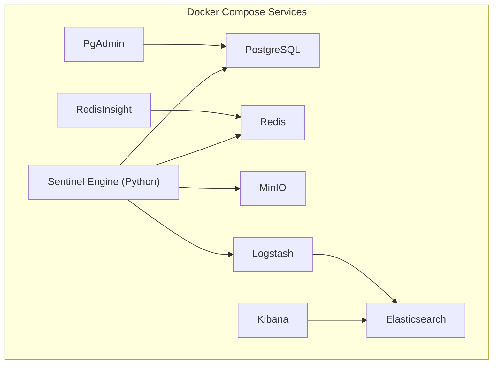
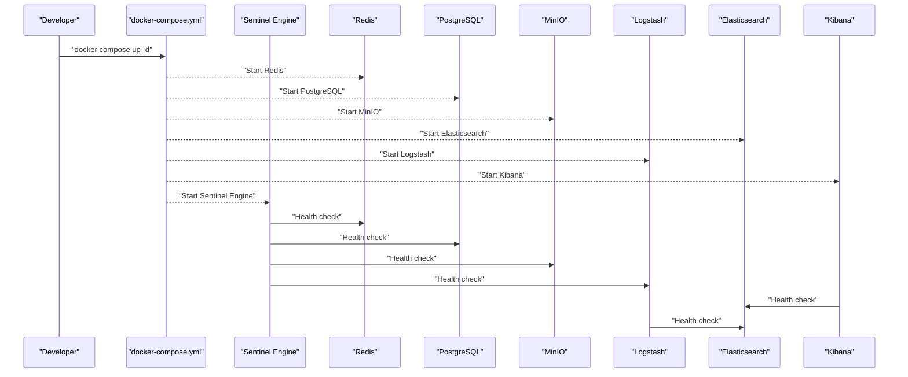
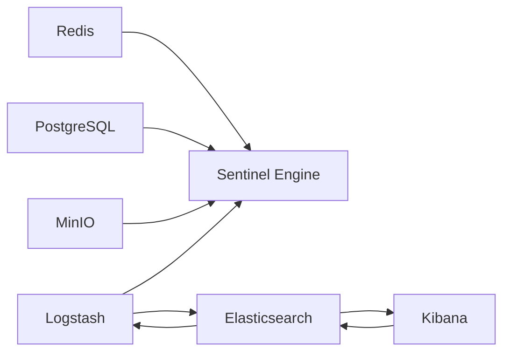

# Local Development Setup

<cite>
**Referenced Files in This Document**
- [docker-compose.yml](file://docker-compose.yml)
- [README.md](file://README.md)
- [scripts/start-elk.sh](file://scripts/start-elk.sh)
- [scripts/setup-minio.sh](file://scripts/setup-minio.sh)
- [elk/kibana/setup.sh](file://elk/kibana/setup.sh)
- [elk/logstash/pipeline/logstash.conf](file://elk/logstash/pipeline/logstash.conf)
- [elk/logstash/config/logstash.yml](file://elk/logstash/config/logstash.yml)
- [elk/README.md](file://elk/README.md)
- [services/engine/Dockerfile](file://services/engine/Dockerfile)
- [services/engine/config.py](file://services/engine/config.py)
- [services/engine/main.py](file://services/engine/main.py)
- [services/engine/requirements.txt](file://services/engine/requirements.txt)
- [src/server/healthCheck.ts](file://src/server/healthCheck.ts)
- [src/server/utils.ts](file://src/server/utils.ts)
</cite>

## Table of Contents
1. [Introduction](#introduction)
2. [Project Structure](#project-structure)
3. [Core Components](#core-components)
4. [Architecture Overview](#architecture-overview)
5. [Detailed Component Analysis](#detailed-component-analysis)
6. [Dependency Analysis](#dependency-analysis)
7. [Performance Considerations](#performance-considerations)
8. [Troubleshooting Guide](#troubleshooting-guide)
9. [Conclusion](#conclusion)
10. [Appendices](#appendices)

## Introduction
This document provides a complete, step-by-step guide to set up SentinelIQ’s local development environment using Docker Compose. It covers starting PostgreSQL, Redis, MinIO, the ELK stack (Elasticsearch, Logstash, Kibana), and the Python analysis engine. It also explains how to run the provided setup scripts for MinIO and ELK/Kibana, configure environment variables, verify service health, and troubleshoot common issues.

## Project Structure
The local development stack is orchestrated by a single Docker Compose file that defines all services and their interdependencies. Supporting scripts automate ELK and MinIO initialization. The Python analysis engine is built as a separate service with its own Dockerfile and runtime configuration.

**Diagram sources**
- [docker-compose.yml](file://docker-compose.yml#L1-L236)

**Section sources**
- [docker-compose.yml](file://docker-compose.yml#L1-L236)
- [README.md](file://README.md#L1-L17)

## Core Components
- PostgreSQL: Persistent relational database for application data.
- Redis: In-memory cache and task queue backend for the analysis engine.
- Elasticsearch: Centralized log storage and indexing for the ELK stack.
- Logstash: Ingestion and enrichment pipeline for logs.
- Kibana: Visualization and dashboard interface for logs.
- MinIO: S3-compatible object storage for screenshots and branding assets.
- Sentinel Engine (Python): Background worker that consumes tasks from Redis, crawls content, stores results, and uploads screenshots to MinIO.

Key environment variables and health checks are defined in the Compose file and the engine’s configuration.

**Section sources**
- [docker-compose.yml](file://docker-compose.yml#L1-L236)
- [services/engine/config.py](file://services/engine/config.py#L1-L78)
- [services/engine/Dockerfile](file://services/engine/Dockerfile#L1-L79)

## Architecture Overview
The full stack is composed of interconnected services with explicit dependencies and health checks. The Python engine depends on Redis, PostgreSQL, MinIO, and Logstash. ELK services depend on each other in a strict order.

**Diagram sources**
- [docker-compose.yml](file://docker-compose.yml#L1-L236)
- [services/engine/Dockerfile](file://services/engine/Dockerfile#L73-L79)

## Detailed Component Analysis

### PostgreSQL
- Purpose: Application data persistence.
- Ports: 5432 mapped to host.
- Volumes: Persists data under a named volume.
- Health check: Uses pg_isready to verify readiness.

Operational notes:
- Ensure the database is healthy before starting dependent services.
- Use the optional PgAdmin service for GUI access if needed.

**Section sources**
- [docker-compose.yml](file://docker-compose.yml#L1-L22)

### Redis
- Purpose: Task queue and caching for the analysis engine.
- Persistence: Append-only enabled.
- Ports: 6379 mapped to host.
- Health check: Uses redis-cli ping.

Optional GUI:
- RedisInsight is available on port 8001 and depends on Redis health.

**Section sources**
- [docker-compose.yml](file://docker-compose.yml#L23-L53)

### Elasticsearch
- Purpose: Log storage and indexing.
- Security: Disabled by default for local development.
- JVM memory: Configured via environment variables.
- Ports: 9200 (HTTP), 9300 (transport).
- Health check: Cluster health endpoint.

**Section sources**
- [docker-compose.yml](file://docker-compose.yml#L71-L99)

### Logstash
- Purpose: Ingests JSON logs from the application and enriches them.
- Ports: 5000/TCP and 5000/UDP for ingestion; 9600 for internal stats.
- Pipeline: Reads JSON from TCP/UDP, normalizes fields, and writes to Elasticsearch with environment-specific index naming.
- Health check: Internal stats endpoint.

**Section sources**
- [docker-compose.yml](file://docker-compose.yml#L100-L125)
- [elk/logstash/pipeline/logstash.conf](file://elk/logstash/pipeline/logstash.conf#L1-L125)
- [elk/logstash/config/logstash.yml](file://elk/logstash/config/logstash.yml#L1-L16)

### Kibana
- Purpose: Visualization and dashboards for logs.
- Ports: 5601 mapped to host.
- Depends on Elasticsearch health.
- Health check: API status endpoint.

**Section sources**
- [docker-compose.yml](file://docker-compose.yml#L126-L147)

### MinIO
- Purpose: S3-compatible object storage for screenshots and branding assets.
- Ports: 9000 (API), 9001 (Console).
- Health check: Live endpoint.
- Bucket policy: Public read configured for workspace logos path.

**Section sources**
- [docker-compose.yml](file://docker-compose.yml#L148-L169)

### Sentinel Engine (Python)
- Purpose: Consumes tasks from Redis, crawls content, stores results, and uploads screenshots to MinIO.
- Dependencies: Redis, PostgreSQL, MinIO, Logstash.
- Health check: Runs a Python health check against Redis.
- Environment variables: Comprehensive configuration for Redis, database, S3/MinIO, logging, ELK, and Sentry.

**Section sources**
- [docker-compose.yml](file://docker-compose.yml#L170-L236)
- [services/engine/Dockerfile](file://services/engine/Dockerfile#L1-L79)
- [services/engine/config.py](file://services/engine/config.py#L1-L78)
- [services/engine/main.py](file://services/engine/main.py#L1-L284)
- [services/engine/requirements.txt](file://services/engine/requirements.txt#L1-L39)

### ELK Initialization Scripts
- scripts/start-elk.sh: Starts Elasticsearch, Logstash, and Kibana; waits for health; optionally runs Kibana setup.
- elk/kibana/setup.sh: Creates index patterns, default index, saved searches, visualizations, and a dashboard.

**Section sources**
- [scripts/start-elk.sh](file://scripts/start-elk.sh#L1-L114)
- [elk/kibana/setup.sh](file://elk/kibana/setup.sh#L1-L253)

### MinIO Initialization Script
- scripts/setup-minio.sh: Ensures MinIO is running, configures aliases, creates buckets, and sets public policies for workspace logos.

**Section sources**
- [scripts/setup-minio.sh](file://scripts/setup-minio.sh#L1-L156)

## Dependency Analysis
Service dependencies and health checks are defined in the Compose file. The Sentinel Engine explicitly depends on PostgreSQL, Redis, Logstash, and MinIO. ELK services depend on each other in a strict order.

**Diagram sources**
- [docker-compose.yml](file://docker-compose.yml#L1-L236)

**Section sources**
- [docker-compose.yml](file://docker-compose.yml#L1-L236)

## Performance Considerations
- Elasticsearch memory: Adjust ES_JAVA_OPTS for larger workloads.
- Logstash throughput: Tune pipeline.workers, batch.size, and batch.delay.
- Redis memory: Ensure adequate memory for queues and caching.
- MinIO performance: Use appropriate disk I/O and CPU resources.

[No sources needed since this section provides general guidance]

## Troubleshooting Guide

### Container Startup Failures
- Symptoms: Containers fail to start or exit immediately.
- Checks:
  - Inspect logs for each service using Docker Compose logs.
  - Verify resource limits and port conflicts.
  - Ensure Docker daemon is running and healthy.

**Section sources**
- [docker-compose.yml](file://docker-compose.yml#L1-L236)

### Network Connectivity Problems
- Elasticsearch not reachable:
  - Confirm port 9200 is open and accessible.
  - Check firewall and Docker networking.
- Logstash not receiving logs:
  - Verify port 5000 is open and reachable.
  - Use netcat to test connectivity from the application host.
- Kibana not loading:
  - Confirm port 5601 is open and Elasticsearch is healthy.

**Section sources**
- [elk/README.md](file://elk/README.md#L238-L273)
- [scripts/start-elk.sh](file://scripts/start-elk.sh#L1-L114)

### Volume Mounting Errors
- Symptoms: Permission denied or empty data directories.
- Checks:
  - Ensure named volumes exist and are writable by the containers.
  - Verify host directory permissions if bind mounts are used elsewhere.

**Section sources**
- [docker-compose.yml](file://docker-compose.yml#L230-L236)

### MinIO Bucket and Policy Issues
- Symptoms: Uploads fail or public access denied.
- Checks:
  - Confirm buckets exist and policies are applied.
  - Validate S3 credentials and endpoint configuration.

**Section sources**
- [scripts/setup-minio.sh](file://scripts/setup-minio.sh#L1-L156)
- [services/engine/config.py](file://services/engine/config.py#L67-L78)

### ELK Stack Misconfiguration
- Symptoms: Missing index patterns, empty dashboards, or missing logs.
- Checks:
  - Run the ELK startup script to initialize services and Kibana setup.
  - Manually create index patterns if the automatic setup fails.

**Section sources**
- [scripts/start-elk.sh](file://scripts/start-elk.sh#L1-L114)
- [elk/kibana/setup.sh](file://elk/kibana/setup.sh#L1-L253)

### Verification Steps
- PostgreSQL: Health check via pg_isready.
- Redis: Health check via redis-cli ping.
- Elasticsearch: Cluster health endpoint.
- Logstash: Internal stats endpoint.
- Kibana: API status endpoint.
- MinIO: Live health endpoint.
- Sentinel Engine: Python health check against Redis.

**Section sources**
- [docker-compose.yml](file://docker-compose.yml#L1-L236)
- [services/engine/Dockerfile](file://services/engine/Dockerfile#L73-L79)

## Conclusion
By following the steps outlined here, you can reliably bring up the complete SentinelIQ local development stack. The provided scripts simplify ELK and MinIO setup, while the Compose file ensures proper service ordering and health checks. Use the verification steps to confirm each component is functioning and consult the troubleshooting section for common issues.

[No sources needed since this section summarizes without analyzing specific files]

## Appendices

### Step-by-Step Local Setup

1. Start the full stack
- Bring up all services defined in the Compose file.
- Ensure PostgreSQL, Redis, MinIO, Elasticsearch, Logstash, and Kibana are healthy.

2. Initialize MinIO
- Run the MinIO setup script to create buckets and configure policies.
- Confirm console and API endpoints are accessible.

3. Initialize ELK and Kibana
- Start ELK services and wait for health.
- Optionally run the Kibana setup script to create index patterns, saved searches, visualizations, and dashboards.

4. Verify the Python analysis engine
- Confirm the engine’s health check passes.
- Ensure it can connect to Redis, PostgreSQL, MinIO, and Logstash.

5. Environment variables
- Configure environment variables for the engine and application as needed.
- Validate critical environment variables during application startup.

**Section sources**
- [docker-compose.yml](file://docker-compose.yml#L1-L236)
- [scripts/setup-minio.sh](file://scripts/setup-minio.sh#L1-L156)
- [scripts/start-elk.sh](file://scripts/start-elk.sh#L1-L114)
- [elk/kibana/setup.sh](file://elk/kibana/setup.sh#L1-L253)
- [services/engine/config.py](file://services/engine/config.py#L1-L78)
- [src/server/utils.ts](file://src/server/utils.ts#L1-L45)

### Environment Variable Reference (Engine)
- Redis: REDIS_URL, SENTINEL_QUEUE_NAME, SENTINEL_POLL_INTERVAL
- Database: DATABASE_URL
- Crawler: SENTINEL_CRAWLER_TIMEOUT, SENTINEL_MAX_CONCURRENT_CRAWLS
- Playwright: SENTINEL_PLAYWRIGHT_HEADLESS, SENTINEL_SCREENSHOT_DIR
- OCR: SENTINEL_TESSERACT_LANG
- Performance: SENTINEL_MIN_CONFIDENCE, SENTINEL_LOG_RETENTION_DAYS
- Logging: LOG_LEVEL, LOG_FILE (console-only by default)
- ELK: ELK_ENABLED, LOGSTASH_HOST, LOGSTASH_PORT
- Sentry: SENTRY_DSN_PYTHON, SENTRY_ENVIRONMENT, SENTRY_TRACES_SAMPLE_RATE
- S3/MinIO: S3_ENDPOINT, S3_REGION, S3_ACCESS_KEY, S3_SECRET_KEY, S3_BUCKET_DEV, S3_BUCKET_PROD, S3_PUBLIC_URL, NODE_ENV

**Section sources**
- [services/engine/config.py](file://services/engine/config.py#L1-L78)

### Health Check Endpoints
- Application health: Implemented in the server health check handler.
- ELK services: Use the documented endpoints for Elasticsearch, Logstash, and Kibana.

**Section sources**
- [src/server/healthCheck.ts](file://src/server/healthCheck.ts#L1-L45)
- [elk/README.md](file://elk/README.md#L238-L273)