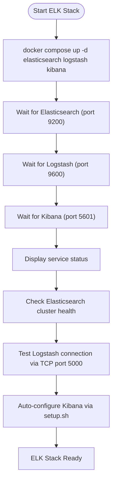
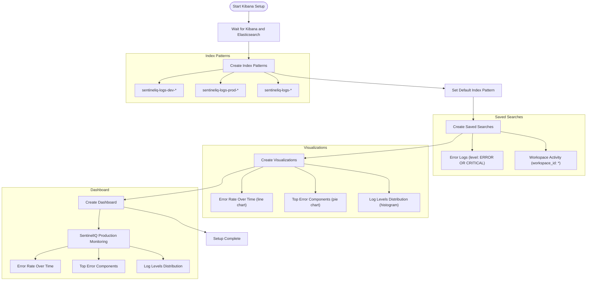
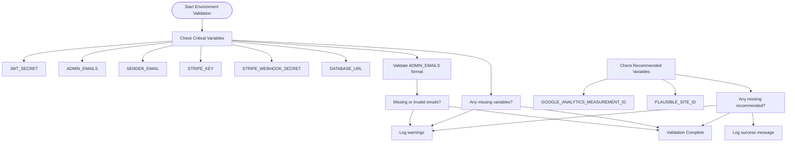

# Service Initialization

<cite>
**Referenced Files in This Document**   
- [start-elk.sh](file://scripts/start-elk.sh)
- [setup.sh](file://elk/kibana/setup.sh)
- [utils.ts](file://src/server/utils.ts)
- [docker-compose.yml](file://docker-compose.yml)
- [logstash.yml](file://elk/logstash/config/logstash.yml)
- [logstash.conf](file://elk/logstash/pipeline/logstash.conf)
- [healthCheck.ts](file://src/server/healthCheck.ts)
- [README.md](file://elk/README.md)
</cite>

## Table of Contents
1. [Introduction](#introduction)
2. [ELK Stack Initialization](#elk-stack-initialization)
3. [Kibana Configuration](#kibana-configuration)
4. [Environment Validation](#environment-validation)
5. [Service Health Verification](#service-health-verification)
6. [Troubleshooting Guide](#troubleshooting-guide)
7. [Best Practices](#best-practices)

## Introduction
This document provides comprehensive guidance on initializing core services in the SentinelIQ development environment. It covers the complete startup sequence for the ELK stack (Elasticsearch, Logstash, and Kibana), automatic Kibana configuration, environment validation, and service health verification. The documentation includes step-by-step initialization procedures, troubleshooting strategies for common issues, and best practices for service startup ordering and readiness probing.

## ELK Stack Initialization

The ELK stack initialization process is orchestrated through the `start-elk.sh` script, which automates the startup and health verification of Elasticsearch, Logstash, and Kibana services. The script follows a sequential execution flow to ensure proper service initialization and readiness.



**Diagram sources**
- [start-elk.sh](file://scripts/start-elk.sh#L1-L114)

**Section sources**
- [start-elk.sh](file://scripts/start-elk.sh#L1-L114)
- [docker-compose.yml](file://docker-compose.yml#L70-L147)

### Execution Flow of start-elk.sh

The `start-elk.sh` script executes the following sequence:

1. **Service Startup**: Initiates Elasticsearch, Logstash, and Kibana containers using Docker Compose in detached mode
2. **Health Probing**: Sequentially checks each service's health endpoint with a 60-second timeout
3. **Status Verification**: Displays the current status of all ELK services using `docker compose ps`
4. **Cluster Health Check**: Retrieves and displays Elasticsearch cluster health information
5. **Logstash Connectivity Test**: Sends a test JSON log message to Logstash via TCP port 5000
6. **Kibana Auto-configuration**: Executes the `elk/kibana/setup.sh` script to configure Kibana dashboards and index patterns

The script implements robust error handling with the `set -e` directive, ensuring immediate termination on any command failure. Each service is probed using its respective health endpoint:
- Elasticsearch: `http://localhost:9200/_cluster/health`
- Logstash: `http://localhost:9600/_node/stats`
- Kibana: `http://localhost:5601/api/status`

The initialization process typically takes 2-3 minutes to complete, depending on system resources and container startup times.

## Kibana Configuration

The Kibana configuration process is automated through the `elk/kibana/setup.sh` script, which creates essential index patterns, saved searches, visualizations, and dashboards for log visualization and analysis.



**Diagram sources**
- [setup.sh](file://elk/kibana/setup.sh#L1-L253)

**Section sources**
- [setup.sh](file://elk/kibana/setup.sh#L1-L253)
- [README.md](file://elk/README.md#L1-L348)

### Configuration Process

The Kibana setup script follows a structured configuration process:

1. **Environment Detection**: Determines the environment (development or production) from the `NODE_ENV` variable to create appropriate index patterns
2. **Index Pattern Creation**: Creates environment-specific index patterns with the naming convention `sentineliq-logs-{env}-*` and sets the default index pattern
3. **Saved Search Creation**: Defines reusable search queries for common log analysis scenarios:
   - Error Logs: Filters for ERROR and CRITICAL level logs
   - Workspace Activity: Identifies logs containing workspace identifiers
4. **Visualization Creation**: Builds three core visualizations:
   - Error Rate Over Time: Line chart showing error frequency over time
   - Top Error Components: Pie chart identifying components with the highest error rates
   - Log Levels Distribution: Histogram showing the distribution of different log levels
5. **Dashboard Assembly**: Combines the visualizations into a comprehensive "SentinelIQ Production Monitoring" dashboard

The script uses Kibana's Saved Objects API to create these components programmatically, ensuring consistent configuration across environments. It includes error handling for cases where components already exist, preventing conflicts during repeated executions.

## Environment Validation

The environment validation process is implemented in `src/server/utils.ts` through the `validateCriticalEnvVars()` function, which ensures all critical environment variables are properly configured before service startup.



**Diagram sources**
- [utils.ts](file://src/server/utils.ts#L1-L62)

**Section sources**
- [utils.ts](file://src/server/utils.ts#L1-L62)

### Validation Process

The environment validation process consists of the following steps:

1. **Critical Variable Check**: Verifies the presence of six essential environment variables:
   - `JWT_SECRET`: Secret key for JWT token generation and verification
   - `ADMIN_EMAILS`: Comma-separated list of administrator email addresses
   - `SENDER_EMAIL`: Email address for system notifications
   - `STRIPE_KEY`: API key for Stripe payment processing
   - `STRIPE_WEBHOOK_SECRET`: Secret for verifying Stripe webhook signatures
   - `DATABASE_URL`: Connection string for the PostgreSQL database

2. **Special Validation for ADMIN_EMAILS**: Performs additional validation on the `ADMIN_EMAILS` variable to ensure it contains at least one valid email address after parsing and trimming.

3. **Error Reporting**: If any critical variables are missing, the function logs detailed error messages and throws an exception to prevent application startup.

4. **Recommended Variable Check**: Validates optional but recommended variables (`GOOGLE_ANALYTICS_MEASUREMENT_ID` and `PLAUSIBLE_SITE_ID`) and logs warnings if they are missing, without preventing startup.

The validation function is designed to be called during application startup to catch configuration issues early. It provides clear feedback about missing variables and references the `.env.server.example` file for configuration guidance.

## Service Health Verification

Service health verification is implemented through multiple mechanisms, including Docker Compose health checks, direct HTTP probing, and application-level health endpoints.

```mermaid
flowchart TD
DockerHealthChecks --> Elasticsearch["Elasticsearch: curl -f http://localhost:9200/_cluster/health"]
DockerHealthChecks --> Logstash["Logstash: curl -f http://localhost:9600/_node/stats"]
DockerHealthChecks --> Kibana["Kibana: curl -f http://localhost:5601/api/status"]
ApplicationHealthCheck --> Endpoint["GET /health"]
Endpoint --> DatabaseCheck["Database: prisma.$queryRaw`SELECT 1`"]
DatabaseCheck --> Healthy["Return 200 with health details"]
DatabaseCheck --> Unhealthy["Return 503 with error details"]
ManualVerification --> ElasticsearchAPI["curl http://localhost:9200/_cat/indices?v"]
ManualVerification --> LogstashTest["echo '{\"level\":\"INFO\",\"message\":\"Test\"}' | nc localhost 5000"]
ManualVerification --> KibanaStatus["curl http://localhost:5601/api/status"]
```

**Diagram sources**
- [docker-compose.yml](file://docker-compose.yml#L94-L147)
- [healthCheck.ts](file://src/server/healthCheck.ts#L1-L45)

**Section sources**
- [docker-compose.yml](file://docker-compose.yml#L94-L147)
- [healthCheck.ts](file://src/server/healthCheck.ts#L1-L45)
- [start-elk.sh](file://scripts/start-elk.sh#L25-L56)

### Verification Methods

#### Docker Compose Health Checks
Each ELK service has built-in health checks defined in `docker-compose.yml`:
- **Elasticsearch**: Checks cluster health via `/_cluster/health` endpoint
- **Logstash**: Verifies node statistics via `/_node/stats` endpoint
- **Kibana**: Confirms service status via `/api/status` endpoint

These health checks run every 30 seconds with a 10-second timeout and require 5 consecutive successful checks.

#### Application Health Endpoint
The application exposes a health check endpoint at `/health` that:
- Tests database connectivity with a simple SQL query
- Measures response time
- Reports service status, version, uptime, and dependency health
- Returns HTTP 200 for healthy services or HTTP 503 for unhealthy services

#### Manual Verification Commands
Several manual verification commands are available:
- **Elasticsearch Indices**: `curl http://localhost:9200/_cat/indices?v` to list all indices
- **Logstash Connectivity**: `nc -zv localhost 5000` to test TCP connectivity
- **Kibana Status**: `curl http://localhost:5601/api/status` to check Kibana status

## Troubleshooting Guide

This section addresses common issues encountered during service initialization and provides resolution strategies.

**Section sources**
- [start-elk.sh](file://scripts/start-elk.sh#L1-L114)
- [setup.sh](file://elk/kibana/setup.sh#L1-L253)
- [utils.ts](file://src/server/utils.ts#L1-L62)
- [docker-compose.yml](file://docker-compose.yml#L1-L236)

### Failed Service Initialization

#### Misconfigured Environment Variables
**Symptoms**: Application fails to start with "Missing required environment variables" error
**Resolution**:
1. Verify all critical environment variables are set in `.env.server`
2. Check for proper formatting, especially for `ADMIN_EMAILS` (comma-separated list)
3. Ensure no trailing spaces or special characters in variable values
4. Reference `.env.server.example` for correct configuration

#### Missing Dependencies
**Symptoms**: Docker containers fail to start or report connection errors
**Resolution**:
1. Ensure Docker and Docker Compose are properly installed
2. Verify sufficient system resources (memory, CPU)
3. Check network connectivity between containers
4. Ensure required ports (9200, 9600, 5601, 5000) are not in use by other processes

#### Permission Issues
**Symptoms**: Permission denied errors when accessing volumes or ports
**Resolution**:
1. Run Docker commands with appropriate privileges
2. Ensure user has permission to access Docker daemon
3. Check file permissions for volume directories
4. Verify no firewall rules are blocking required ports

### ELK-Specific Issues

#### Logstash Not Receiving Logs
**Symptoms**: Logs are not appearing in Elasticsearch despite application sending them
**Diagnosis**:
```bash
# Check Logstash logs
docker compose logs -f logstash

# Test TCP connectivity
nc -zv localhost 5000

# Send test log
echo '{"level":"INFO","message":"Test log"}' | nc localhost 5000
```

#### Elasticsearch Connection Issues
**Symptoms**: Kibana cannot connect to Elasticsearch
**Diagnosis**:
```bash
# Check Elasticsearch health
curl http://localhost:9200/_cluster/health?pretty

# List indices
curl http://localhost:9200/_cat/indices?v

# Check disk space
df -h
```

#### Kibana Not Loading
**Symptoms**: Kibana web interface fails to load or shows connection errors
**Diagnosis**:
```bash
# Check Kibana logs
docker compose logs -f kibana

# Verify Elasticsearch connection
curl http://localhost:5601/api/status

# Check browser console for errors
```

## Best Practices

### Service Startup Ordering
1. **Database First**: Ensure PostgreSQL is fully operational before starting application services
2. **Message Queue Second**: Start Redis before services that depend on it
3. **ELK Stack Third**: Initialize Elasticsearch, Logstash, and Kibana in sequence
4. **Application Last**: Start the main application after all dependencies are ready

### Readiness Probing
1. **Implement Health Endpoints**: Expose `/health` endpoints that check critical dependencies
2. **Use Appropriate Timeouts**: Set reasonable timeouts for health checks (10-30 seconds)
3. **Avoid Overloading Checks**: Limit the scope of health checks to critical components
4. **Include Dependency Status**: Report the health status of key dependencies in responses

### Configuration Management
1. **Use Environment Variables**: Store configuration in environment variables rather than hardcoded values
2. **Validate Early**: Perform environment validation at application startup
3. **Provide Examples**: Include example configuration files (e.g., `.env.server.example`)
4. **Document Requirements**: Clearly document required and optional configuration variables

### Monitoring and Logging
1. **Centralize Logs**: Use ELK stack for centralized log aggregation
2. **Structure Logs**: Use JSON format with consistent field names
3. **Include Context**: Add relevant context (user ID, workspace ID, request ID) to logs
4. **Set Retention Policies**: Configure appropriate log retention periods based on requirements