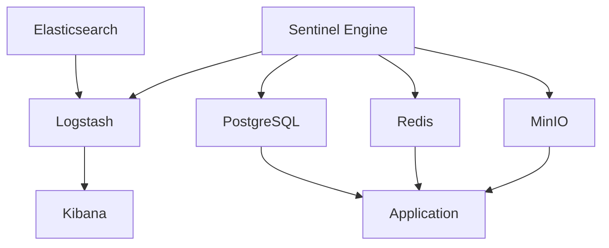
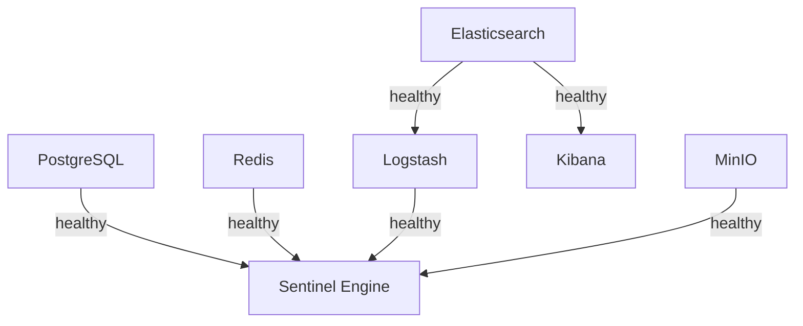
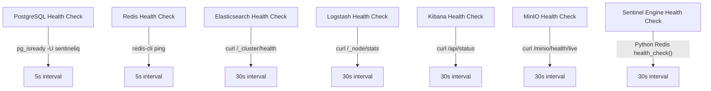

# Container Orchestration

<cite>
**Referenced Files in This Document**   
- [docker-compose.yml](file://docker-compose.yml)
- [elk/README.md](file://elk/README.md)
- [elk/logstash/config/logstash.yml](file://elk/logstash/config/logstash.yml)
- [elk/logstash/pipeline/logstash.conf](file://elk/logstash/pipeline/logstash.conf)
- [scripts/start-elk.sh](file://scripts/start-elk.sh)
- [scripts/setup-minio.sh](file://scripts/setup-minio.sh)
- [elk/kibana/setup.sh](file://elk/kibana/setup.sh)
- [src/server/redis.ts](file://src/server/redis.ts)
- [src/server/healthCheck.ts](file://src/server/healthCheck.ts)
</cite>

## Table of Contents
1. [Introduction](#introduction)
2. [Service Definitions](#service-definitions)
3. [Service Dependencies and Startup Ordering](#service-dependencies-and-startup-ordering)
4. [Resource Allocation and Environment Configuration](#resource-allocation-and-environment-configuration)
5. [Network Isolation and Service Communication](#network-isolation-and-service-communication)
6. [Health Check Configurations](#health-check-configurations)
7. [Service-Specific Parameters](#service-specific-parameters)
8. [Scaling Considerations](#scaling-considerations)
9. [Conclusion](#conclusion)

## Introduction
This document provides comprehensive documentation for container orchestration using Docker Compose in the SentinelIQ platform. The system orchestrates multiple services including PostgreSQL, Redis, Elasticsearch, Logstash, Kibana, MinIO, and the Python-based sentinel-engine. The orchestration ensures reliable initialization through health checks, proper resource allocation, and appropriate network isolation. The configuration supports both development and production environments with specific parameters for each service to ensure optimal performance and reliability.

## Service Definitions
The Docker Compose configuration defines multiple services that work together to provide the complete SentinelIQ platform functionality. Each service is configured with specific parameters for image, container name, restart policy, environment variables, ports, volumes, and health checks.

**Diagram sources**
- [docker-compose.yml](file://docker-compose.yml#L5-L223)

**Section sources**
- [docker-compose.yml](file://docker-compose.yml#L5-L223)

## Service Dependencies and Startup Ordering
The container orchestration implements a sophisticated dependency management system using Docker Compose's `depends_on` condition with `service_healthy` to ensure proper startup ordering. This prevents race conditions and ensures that services are fully operational before dependent services start.

The dependency chain follows a logical initialization sequence:
1. Database and cache services start first (PostgreSQL, Redis)
2. Search and analytics infrastructure follows (Elasticsearch)
3. Log processing services start after their dependencies (Logstash, Kibana)
4. Application services start last, after all infrastructure is ready

**Diagram sources**
- [docker-compose.yml](file://docker-compose.yml#L51-L53)
- [docker-compose.yml](file://docker-compose.yml#L67-L68)
- [docker-compose.yml](file://docker-compose.yml#L117-L120)
- [docker-compose.yml](file://docker-compose.yml#L139-L141)
- [docker-compose.yml](file://docker-compose.yml#L214-L222)

**Section sources**
- [docker-compose.yml](file://docker-compose.yml#L51-L53)
- [docker-compose.yml](file://docker-compose.yml#L67-L68)
- [docker-compose.yml](file://docker-compose.yml#L117-L120)
- [docker-compose.yml](file://docker-compose.yml#L139-L141)
- [docker-compose.yml](file://docker-compose.yml#L214-L222)

## Resource Allocation and Environment Configuration
The container orchestration includes comprehensive resource allocation and environment configuration for all services. Each service is configured with appropriate environment variables that define its behavior, connection parameters, and operational settings.

PostgreSQL is configured with essential database credentials and stores data in a named volume for persistence across container restarts. Redis enables append-only file persistence to ensure data durability. Elasticsearch is configured as a single-node cluster with memory locking enabled and 512MB of JVM heap space allocated.

The sentinel-engine service receives extensive configuration through environment variables that define connections to all dependent services, including database URLs, Redis connection strings, MinIO S3 endpoints, and ELK stack integration parameters.

**Section sources**
- [docker-compose.yml](file://docker-compose.yml#L9-L22)
- [docker-compose.yml](file://docker-compose.yml#L27-L40)
- [docker-compose.yml](file://docker-compose.yml#L77-L84)
- [docker-compose.yml](file://docker-compose.yml#L180-L209)

## Network Isolation and Service Communication
The Docker Compose configuration establishes a network environment where services can communicate securely while maintaining appropriate isolation. Services communicate using Docker's internal DNS resolution, referencing each other by service name rather than IP addresses.

The configuration exposes only necessary ports to the host system for development and administration purposes, while internal service-to-service communication occurs over Docker's internal network. For example, PostgreSQL exposes port 5432, Redis exposes port 6379, and various ELK stack components expose their management interfaces.

The sentinel-engine service connects to other services using their container names as hostnames (e.g., "postgres", "redis", "elasticsearch", "minio"), leveraging Docker's built-in service discovery. This approach simplifies configuration and enhances portability across different deployment environments.

**Section sources**
- [docker-compose.yml](file://docker-compose.yml#L13-L14)
- [docker-compose.yml](file://docker-compose.yml#L31-L32)
- [docker-compose.yml](file://docker-compose.yml#L91-L93)
- [docker-compose.yml](file://docker-compose.yml#L110-L113)
- [docker-compose.yml](file://docker-compose.yml#L134)
- [docker-compose.yml](file://docker-compose.yml#L160-L161)
- [docker-compose.yml](file://docker-compose.yml#L183-L188)
- [docker-compose.yml](file://docker-compose.yml#L207-L208)

## Health Check Configurations
Each service in the orchestration includes a health check configuration that determines when the container is considered healthy and ready to accept traffic or be used by dependent services. These health checks are critical for ensuring reliable initialization and proper startup ordering.

PostgreSQL uses the `pg_isready` command to verify database readiness. Redis uses `redis-cli ping` to confirm the server is responsive. Elasticsearch checks cluster health via HTTP API. Logstash verifies its monitoring API is available. Kibana confirms its status endpoint is accessible. MinIO checks its health live endpoint. The sentinel-engine performs a custom health check by testing Redis connectivity through its Python client.

The health check intervals and timeouts are tuned appropriately for each service, with more complex services like Elasticsearch having longer intervals (30 seconds) compared to simpler services like Redis (5 seconds).

**Diagram sources**
- [docker-compose.yml](file://docker-compose.yml#L17-L21)
- [docker-compose.yml](file://docker-compose.yml#L36-L40)
- [docker-compose.yml](file://docker-compose.yml#L95-L98)
- [docker-compose.yml](file://docker-compose.yml#L121-L124)
- [docker-compose.yml](file://docker-compose.yml#L143-L146)
- [docker-compose.yml](file://docker-compose.yml#L165-L168)
- [docker-compose.yml](file://docker-compose.yml#L224-L228)

**Section sources**
- [docker-compose.yml](file://docker-compose.yml#L17-L21)
- [docker-compose.yml](file://docker-compose.yml#L36-L40)
- [docker-compose.yml](file://docker-compose.yml#L95-L98)
- [docker-compose.yml](file://docker-compose.yml#L121-L124)
- [docker-compose.yml](file://docker-compose.yml#L143-L146)
- [docker-compose.yml](file://docker-compose.yml#L165-L168)
- [docker-compose.yml](file://docker-compose.yml#L224-L228)

## Service-Specific Parameters
Each service in the orchestration is configured with parameters specific to its function and operational requirements.

### Elasticsearch and Logstash JVM Options
Elasticsearch is configured with 512MB of JVM heap space using the `ES_JAVA_OPTS` environment variable with `-Xms512m -Xmx512m` settings. This ensures consistent memory usage and prevents heap size fluctuations. Logstash is configured with 256MB of JVM heap space using `LS_JAVA_OPTS` with `-Xmx256m -Xms256m`. The Logstash pipeline is configured with 2 workers, a batch size of 125, and a batch delay of 50 milliseconds for optimal performance.

### Redis Persistence Settings
Redis is configured with append-only file (AOF) persistence enabled using the `--appendonly yes` command line argument. This ensures that all write operations are logged to disk, providing durability in case of container restarts or failures.

### Python Engine Environment Variables
The sentinel-engine service is configured with numerous environment variables that control its behavior:
- Database connection via `DATABASE_URL`
- Redis connection via `REDIS_URL`
- MinIO/S3 configuration including endpoint, credentials, and bucket names
- ELK stack integration with Logstash host and port
- Engine-specific parameters like queue name, poll interval, crawler timeout, and concurrent crawl limits
- Logging configuration including log level and ELK integration flag

**Section sources**
- [docker-compose.yml](file://docker-compose.yml#L82)
- [docker-compose.yml](file://docker-compose.yml#L115)
- [elk/logstash/config/logstash.yml](file://elk/logstash/config/logstash.yml#L9-L11)
- [docker-compose.yml](file://docker-compose.yml#L30)
- [docker-compose.yml](file://docker-compose.yml#L180-L209)

## Scaling Considerations
The current container orchestration configuration provides a foundation for scaling the SentinelIQ platform. The service intercommunication patterns follow best practices for containerized applications, with stateless application components communicating with stateful backend services through well-defined interfaces.

For horizontal scaling, the sentinel-engine service could be scaled out by running multiple instances, potentially with a message queue to distribute workloads. The ELK stack can be scaled by adding additional Elasticsearch nodes to create a cluster, increasing Logstash pipeline workers, and adding Kibana instances behind a load balancer.

Resource allocation can be adjusted based on workload requirements, with Elasticsearch and the application services typically requiring the most memory. The health check mechanisms ensure that scaled services are properly initialized before being considered available, maintaining system reliability during scaling operations.

The configuration also supports environment-specific tuning, with different settings for development and production environments, allowing for appropriate resource allocation based on the deployment context.

**Section sources**
- [docker-compose.yml](file://docker-compose.yml)
- [elk/README.md](file://elk/README.md#L274-L292)
- [scripts/start-elk.sh](file://scripts/start-elk.sh)

## Conclusion
The container orchestration for SentinelIQ provides a robust, reliable, and maintainable infrastructure for the platform. By leveraging Docker Compose, the system ensures consistent deployment across environments while providing appropriate service isolation and dependency management. The comprehensive health check configurations guarantee proper startup ordering and service availability, while the detailed resource and environment configurations optimize performance for each component. This orchestration approach enables efficient development, testing, and production deployment of the SentinelIQ platform.