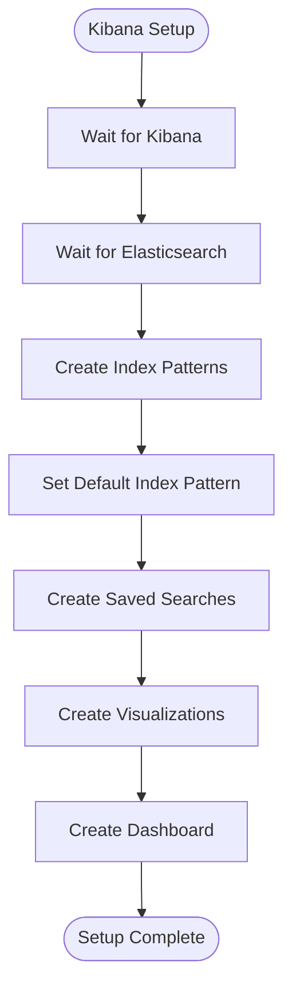

# Persistent Storage

<cite>
**Referenced Files in This Document**
- [docker-compose.yml](file://docker-compose.yml)
- [docker-compose.prod.yml](file://docker-compose.prod.yml)
- [scripts/setup-minio.sh](file://scripts/setup-minio.sh)
- [elk/kibana/setup.sh](file://elk/kibana/setup.sh)
- [elk/README.md](file://elk/README.md)
- [src/server/storage.ts](file://src/server/storage.ts)
- [src/server/api/upload.ts](file://src/server/api/upload.ts)
- [src/server/api/screenshot.ts](file://src/server/api/screenshot.ts)
- [src/core/modules/aegis/services/storage.ts](file://src/core/modules/aegis/services/storage.ts)
- [src/core/database/backup.ts](file://src/core/database/backup.ts)
- [migrations/20251117142501_add_storage_quota/migration.sql](file://migrations/20251117142501_add_storage_quota/migration.sql)
</cite>

## Table of Contents
1. [Introduction](#introduction)
2. [Project Structure](#project-structure)
3. [Core Components](#core-components)
4. [Architecture Overview](#architecture-overview)
5. [Detailed Component Analysis](#detailed-component-analysis)
6. [Dependency Analysis](#dependency-analysis)
7. [Performance Considerations](#performance-considerations)
8. [Troubleshooting Guide](#troubleshooting-guide)
9. [Conclusion](#conclusion)
10. [Appendices](#appendices)

## Introduction
This document explains persistent storage configuration across the infrastructure, focusing on Docker volume definitions for PostgreSQL, Redis, Elasticsearch, MinIO, and screenshot storage in the sentinel-engine service. It also documents MinIO bucket creation procedures, access policies, and S3 compatibility settings as implemented in the setup script, along with Elasticsearch data storage configuration and Kibana saved object persistence. Finally, it provides best practices for backup and recovery of persistent data volumes in production environments.

## Project Structure
The persistent storage stack is orchestrated via Docker Compose with dedicated volumes for each service and explicit mount points for data persistence. The sentinel-engine service mounts a volume for screenshots generated during alert processing.

**Diagram sources**
- [docker-compose.yml](file://docker-compose.yml#L1-L236)

**Section sources**
- [docker-compose.yml](file://docker-compose.yml#L1-L236)

## Core Components
- PostgreSQL: stores relational data for the platform. Persistent via a named volume mapped to the container’s data directory.
- Redis: in-memory cache and pub/sub. Persistent via append-only file mode with a named volume mapped to the container’s data directory.
- Elasticsearch: log indexing and search. Persistent via a named volume mapped to the container’s data directory.
- MinIO: S3-compatible object storage. Persistent via a named volume mapped to the container’s data directory.
- Sentinel Engine: generates screenshots and writes them to a mounted volume. These are later uploaded to MinIO for long-term storage and retrieval.

**Section sources**
- [docker-compose.yml](file://docker-compose.yml#L1-L236)

## Architecture Overview
The persistent storage architecture integrates:
- Relational data (PostgreSQL) for application state and metadata.
- Caching and queues (Redis) for performance and task coordination.
- Object storage (MinIO) for file uploads, logos, and screenshots.
- Log aggregation (Elasticsearch + Logstash + Kibana) for operational visibility.
- Screenshots produced by the sentinel-engine service stored locally and uploaded to MinIO.

**Diagram sources**
- [docker-compose.yml](file://docker-compose.yml#L1-L236)
- [src/server/storage.ts](file://src/server/storage.ts#L1-L220)
- [src/core/modules/aegis/services/storage.ts](file://src/core/modules/aegis/services/storage.ts#L1-L120)
- [elk/README.md](file://elk/README.md#L1-L120)

## Detailed Component Analysis

### PostgreSQL Volume and Persistence
- Purpose: Persist relational data across container restarts.
- Volume definition: Named volume mapped to the PostgreSQL data directory inside the container.
- Health checks: Container health checks ensure readiness before dependent services start.

Best practices:
- Use named volumes for durability.
- Back up regularly using logical dumps or managed services.
- Scale reads with read replicas when appropriate.

**Section sources**
- [docker-compose.yml](file://docker-compose.yml#L1-L236)

### Redis Volume and Persistence
- Purpose: Persist caching and queue data using AOF (append-only file).
- Volume definition: Named volume mapped to the Redis data directory.
- Health checks: Container health checks ensure readiness.

Best practices:
- Keep AOF enabled for durability.
- Monitor memory usage and eviction policies.
- Use read replicas for high availability in production.

**Section sources**
- [docker-compose.yml](file://docker-compose.yml#L1-L236)

### Elasticsearch Volume and Data Storage
- Purpose: Persist indices and operational data.
- Volume definition: Named volume mapped to the Elasticsearch data directory.
- Configuration: Single-node discovery and disabled security in development; adjust for production.

Operational notes:
- Elasticsearch health checks rely on HTTP cluster health.
- Logstash forwards logs to Elasticsearch; ensure connectivity and throughput.
- Kibana loads saved objects (index patterns, visualizations, dashboards) from Elasticsearch.

**Section sources**
- [docker-compose.yml](file://docker-compose.yml#L70-L147)
- [elk/kibana/setup.sh](file://elk/kibana/setup.sh#L1-L120)
- [elk/README.md](file://elk/README.md#L1-L120)

### MinIO Volume and S3-Compatible Storage
- Purpose: Provide S3-compatible object storage for file uploads, logos, and screenshots.
- Volume definition: Named volume mapped to the MinIO data directory.
- S3 compatibility: The application uses AWS SDK v3 with path-style addressing for MinIO compatibility.

MinIO bucket creation and policies:
- Buckets: Two buckets are created per environment (development and production).
- Access policy: Public read access is configured for workspace logos under a specific prefix.
- Setup script: Automates MinIO startup, bucket creation, and policy configuration.

**Section sources**
- [docker-compose.yml](file://docker-compose.yml#L148-L169)
- [scripts/setup-minio.sh](file://scripts/setup-minio.sh#L1-L156)
- [src/server/storage.ts](file://src/server/storage.ts#L1-L60)

### Sentinel Engine Screenshots Volume
- Purpose: Store screenshots generated by the sentinel-engine service during alert processing.
- Volume definition: Named volume mounted at the container’s screenshot directory.
- Integration: Screenshots are later uploaded to MinIO using the application’s storage service.

**Section sources**
- [docker-compose.yml](file://docker-compose.yml#L170-L235)
- [src/server/api/screenshot.ts](file://src/server/api/screenshot.ts#L1-L46)

### Application Storage Services and Policies
- Storage Service (frontend): Manages uploads to MinIO, including image optimization, public/private URLs, and signed URLs. It validates file types and sizes and enforces workspace isolation.
- Aegis Evidence Storage (frontend): Manages secure evidence uploads with integrity verification and metadata.
- Backend upload API: Validates user access, workspace membership, and storage quota before accepting uploads.

**Diagram sources**
- [src/server/api/upload.ts](file://src/server/api/upload.ts#L1-L229)
- [src/server/storage.ts](file://src/server/storage.ts#L100-L220)

**Section sources**
- [src/server/storage.ts](file://src/server/storage.ts#L1-L220)
- [src/core/modules/aegis/services/storage.ts](file://src/core/modules/aegis/services/storage.ts#L1-L120)
- [src/server/api/upload.ts](file://src/server/api/upload.ts#L1-L229)

### Elasticsearch Data Storage and Kibana Saved Objects
- Elasticsearch data persistence: Volume mounted to the data directory.
- Kibana saved objects: Index patterns, saved searches, visualizations, and dashboards are created programmatically by the Kibana setup script based on environment.

**Diagram sources**
- [elk/kibana/setup.sh](file://elk/kibana/setup.sh#L1-L253)

**Section sources**
- [elk/kibana/setup.sh](file://elk/kibana/setup.sh#L1-L253)
- [elk/README.md](file://elk/README.md#L1-L120)

## Dependency Analysis
- PostgreSQL depends on the postgres-data volume for durability.
- Redis depends on the redis-data volume and AOF persistence.
- Elasticsearch depends on the elasticsearch-data volume and health checks.
- MinIO depends on the minio-data volume and exposes API/console ports.
- Sentinel Engine depends on MinIO and Elasticsearch for screenshot storage and log forwarding.
- Application services depend on MinIO for file storage and on PostgreSQL for metadata.

**Diagram sources**
- [docker-compose.yml](file://docker-compose.yml#L1-L236)
- [src/server/storage.ts](file://src/server/storage.ts#L1-L220)
- [src/core/modules/aegis/services/storage.ts](file://src/core/modules/aegis/services/storage.ts#L1-L120)

**Section sources**
- [docker-compose.yml](file://docker-compose.yml#L1-L236)

## Performance Considerations
- PostgreSQL and Redis: Use appropriate sizing and consider read replicas for scaling reads.
- Elasticsearch: Tune JVM heap and pipeline workers; enable ILM for index lifecycle management.
- MinIO: Ensure adequate disk IOPS for high-throughput uploads; consider replication in production.
- Screenshots: Store temporarily in the sentinel-engine volume and upload promptly to MinIO to reduce local disk pressure.

[No sources needed since this section provides general guidance]

## Troubleshooting Guide
- MinIO health: Use the MinIO setup script to verify health and create buckets; confirm console and API endpoints.
- Elasticsearch/Kibana: Use the Kibana setup script to create index patterns and saved objects; verify cluster health and saved object endpoints.
- Storage initialization: The frontend storage service verifies bucket existence; if missing, create buckets manually in the MinIO console.

**Section sources**
- [scripts/setup-minio.sh](file://scripts/setup-minio.sh#L1-L156)
- [elk/kibana/setup.sh](file://elk/kibana/setup.sh#L1-L120)
- [src/server/storage.ts](file://src/server/storage.ts#L559-L600)

## Conclusion
The infrastructure defines clear, durable persistent volumes for PostgreSQL, Redis, Elasticsearch, and MinIO, with explicit integration points for the sentinel-engine screenshot storage. The MinIO setup script automates bucket creation and access policies, while the application storage services enforce workspace isolation and quota management. Elasticsearch and Kibana are configured for log aggregation and visualization, with saved objects provisioned automatically. For production, apply hardened security, replication, and robust backup/recovery procedures.

[No sources needed since this section summarizes without analyzing specific files]

## Appendices

### Backup and Recovery Best Practices
- PostgreSQL:
  - Use logical backups (e.g., pg_dump) and retain rotation schedules aligned with compliance requirements.
  - Optionally upload backups to MinIO for offsite storage.
- Redis:
  - Ensure AOF is enabled and monitor snapshotting strategy; back up the data directory.
- Elasticsearch:
  - Use ILM policies to manage index lifecycle and retention.
  - Back up indices periodically and store artifacts in MinIO.
- MinIO:
  - Maintain multiple buckets per environment; enforce access policies and consider replication.
  - Back up the minio-data volume snapshots or use MinIO snapshots if supported.
- Screenshots:
  - Ensure the sentinel-engine volume is backed up or replicated; confirm uploads to MinIO occur reliably.

**Section sources**
- [src/core/database/backup.ts](file://src/core/database/backup.ts#L1-L91)
- [elk/README.md](file://elk/README.md#L196-L236)
- [docker-compose.yml](file://docker-compose.yml#L1-L236)

### Production Docker Compose Notes
- Production compose files define environment variables for credentials and network segmentation.
- Ensure secrets are managed externally and not hardcoded in repository files.

**Section sources**
- [docker-compose.prod.yml](file://docker-compose.prod.yml#L1-L103)