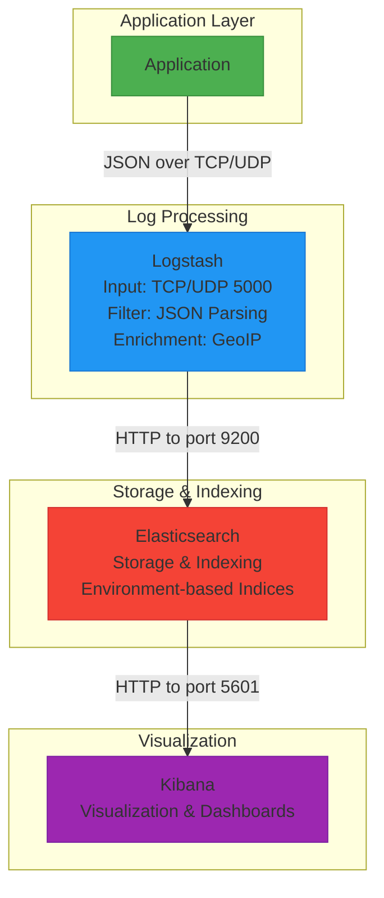
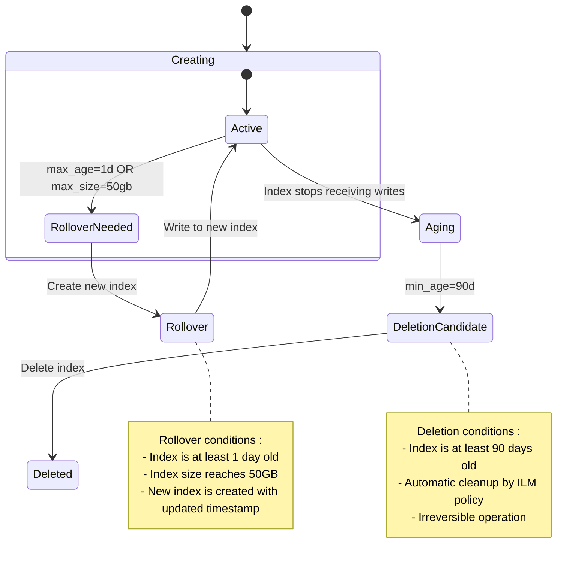
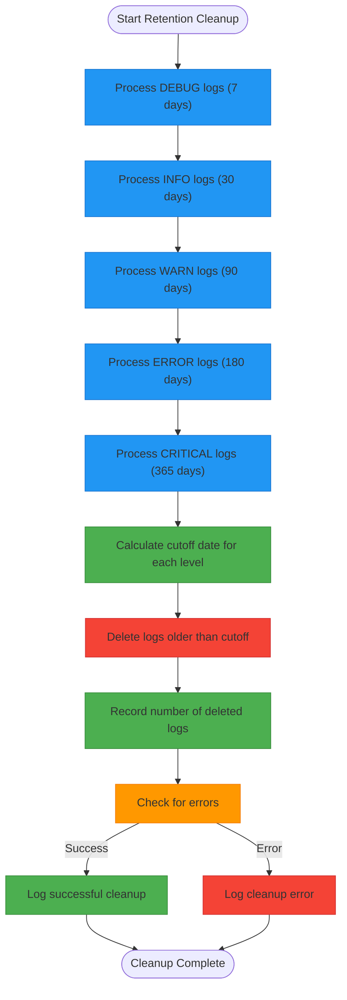
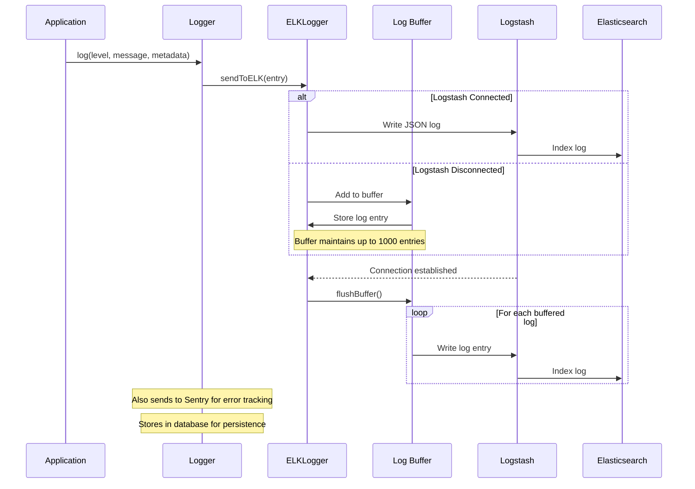
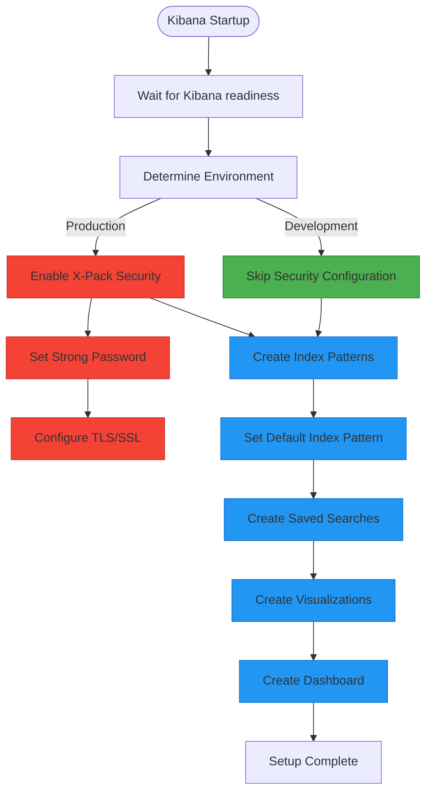

# Data Protection

<cite>
**Referenced Files in This Document**   
- [elk/README.md](file://elk/README.md)
- [elk/kibana/setup.sh](file://elk/kibana/setup.sh)
- [elk/logstash/config/logstash.yml](file://elk/logstash/config/logstash.yml)
- [elk/logstash/pipeline/logstash.conf](file://elk/logstash/pipeline/logstash.conf)
- [scripts/start-elk.sh](file://scripts/start-elk.sh)
- [src/server/elkLogger.ts](file://src/server/elkLogger.ts)
- [src/core/logs/logger.ts](file://src/core/logs/logger.ts)
- [src/core/logs/operations.ts](file://src/core/logs/operations.ts)
- [src/core/logs/types.ts](file://src/core/logs/types.ts)
- [src/core/logs/levels.ts](file://src/core/logs/levels.ts)
- [src/core/logs/retention.ts](file://src/core/logs/retention.ts)
- [docker-compose.yml](file://docker-compose.yml)
- [src/core/audit/auditor.ts](file://src/core/audit/auditor.ts)
- [src/core/audit/operations.ts](file://src/core/audit/operations.ts)
- [src/core/audit/types.ts](file://src/core/audit/types.ts)
- [src/server/security.ts](file://src/server/security.ts)
</cite>

## Table of Contents
1. [Introduction](#introduction)
2. [ELK Stack Security Configuration](#elk-stack-security-configuration)
3. [Role-Based Access Control](#role-based-access-control)
4. [Index Lifecycle Management](#index-lifecycle-management)
5. [Data Retention Policies](#data-retention-policies)
6. [Secure Logging Practices](#secure-logging-practices)
7. [Compliance with Data Protection Regulations](#compliance-with-data-protection-regulations)
8. [Secure Log Transmission](#secure-log-transmission)
9. [Protection of Log Data at Rest](#protection-of-log-data-at-rest)
10. [Kibana Security Setup](#kibana-security-setup)
11. [Dashboard Access Controls](#dashboard-access-controls)
12. [Prevention of Unauthorized Log Access](#prevention-of-unauthorized-log-access)
13. [Conclusion](#conclusion)

## Introduction

This document provides comprehensive guidance on data protection in production deployment for the SentinelIQ platform, focusing on the ELK (Elasticsearch, Logstash, Kibana) stack security configuration. The system implements a robust logging infrastructure that ensures secure collection, storage, and access to log data while maintaining compliance with data protection regulations.

The data protection framework encompasses multiple layers of security controls, including role-based access control, index lifecycle management, structured logging practices, and comprehensive audit trail preservation. The implementation ensures that sensitive information is properly protected throughout its lifecycle, from log generation to eventual deletion according to retention policies.

The ELK stack serves as the central component for log aggregation, analysis, and visualization, providing critical insights into system operations while maintaining strict security controls to prevent unauthorized access to log data.

**Section sources**
- [elk/README.md](file://elk/README.md)
- [docker-compose.yml](file://docker-compose.yml)

## ELK Stack Security Configuration

The ELK stack in SentinelIQ is configured with multiple security measures to protect log data throughout the collection and storage process. The architecture follows a secure pipeline from application to Elasticsearch, with Logstash serving as the intermediary log processor.

The current configuration in the docker-compose.yml file shows that X-Pack security is disabled by default (`xpack.security.enabled=false`), indicating that additional security configuration is required for production deployment. However, the README documentation provides guidance for enabling X-Pack security in production environments by setting `xpack.security.enabled=true` and configuring an appropriate password.

The Logstash configuration includes several security-relevant settings:
- Input on TCP/UDP port 5000 with JSON codec
- Automatic environment detection and normalization
- Field renaming for consistency (workspaceId to workspace_id, userId to user_id)
- GeoIP enrichment for IP addresses
- Error log tagging for alerting purposes

The system is designed to support TLS configuration for secure communication between components, with documentation indicating the process for generating certificates and configuring HTTPS for Logstash output to Elasticsearch.



**Diagram sources **
- [elk/README.md](file://elk/README.md#L9-L17)
- [elk/logstash/pipeline/logstash.conf](file://elk/logstash/pipeline/logstash.conf#L4-L125)
- [docker-compose.yml](file://docker-compose.yml#L73-L147)

**Section sources**
- [elk/README.md](file://elk/README.md)
- [elk/logstash/pipeline/logstash.conf](file://elk/logstash/pipeline/logstash.conf)
- [docker-compose.yml](file://docker-compose.yml)

## Role-Based Access Control

The SentinelIQ platform implements a comprehensive role-based access control (RBAC) system for log data access, ensuring that users can only access logs appropriate to their roles and permissions. The system distinguishes between different levels of access based on user roles, with specific controls for audit logs and system logs.

For system logs, access is restricted to administrators only. The `getSystemLogs` operation in the logs module explicitly checks if the requesting user is an admin before allowing access to system logs. This ensures that sensitive system-level information is only available to users with appropriate privileges.

For audit logs, access is more granular and follows workspace membership. Users can only access audit logs for workspaces they belong to, and the level of access depends on their role within the workspace. The `getAuditLogs` operation verifies workspace membership before returning any audit log data, preventing unauthorized cross-workspace access.

Administrative and ownership roles have additional privileges:
- Admins and owners can export audit logs
- Only admins can view system logs
- Workspace members can view audit logs for their workspace
- User access is validated through workspace membership checks

The system also implements proper authentication and authorization checks at the API level, throwing appropriate HTTP errors (401 for unauthenticated, 403 for unauthorized) when access is denied.

```mermaid
classDiagram
class User {
+id : string
+email : string
+isAdmin : boolean
}
class WorkspaceMember {
+userId : string
+workspaceId : string
+role : Role
}
class Role {
+OWNER
+ADMIN
+MEMBER
}
class AuditLog {
+workspaceId : string
+userId : string
+action : string
+resource : string
}
class SystemLog {
+level : LogLevel
+message : string
+component : string
}
class LogOperations {
+getAuditLogs(args, context) : Promise~AuditLogQueryResult~
+getSystemLogs(args, context) : Promise~LogQueryResult~
+exportAuditLogs(args, context) : Promise~ExportResult~
}
User "1" --> "0..*" WorkspaceMember : has role in
WorkspaceMember "1" --> "1" Role : has
User "1" --> "0..*" AuditLog : generates
WorkspaceMember "1" --> "0..*" AuditLog : can access
LogOperations "1" --> "1" AuditLog : queries
LogOperations "1" --> "1" SystemLog : queries
User "1" --> "0..*" SystemLog : can access if admin
note right of LogOperations
Access control logic :
- getSystemLogs : only if context.user.isAdmin
- getAuditLogs : only if user has workspace membership
- exportAuditLogs : only if user is admin or owner
end note
```

**Diagram sources **
- [src/core/logs/operations.ts](file://src/core/logs/operations.ts#L8-L64)
- [src/core/audit/operations.ts](file://src/core/audit/operations.ts#L7-L215)
- [src/core/audit/types.ts](file://src/core/audit/types.ts)

**Section sources**
- [src/core/logs/operations.ts](file://src/core/logs/operations.ts)
- [src/core/audit/operations.ts](file://src/core/audit/operations.ts)

## Index Lifecycle Management

The SentinelIQ platform implements Index Lifecycle Management (ILM) policies to automate the management of log indices in Elasticsearch, ensuring efficient storage utilization and compliance with data retention requirements. The ILM configuration is designed to handle the rollover and deletion of log indices based on age and size criteria.

The system uses environment-specific index patterns with the format `sentineliq-logs-{environment}-{date}`, where environment is normalized to values like "dev", "staging", or "prod". This allows for different retention policies to be applied based on the environment.

The ILM policy, as documented in the README, includes two main phases:
1. **Hot phase**: Indices are actively written to and rolled over when they reach either 1 day of age or 50GB in size
2. **Delete phase**: Indices are automatically deleted 90 days after creation

The rollover mechanism ensures that no single index becomes too large, which helps maintain query performance and prevents any single index from consuming excessive storage. The policy is configured via the Elasticsearch ILM API with the following settings:
- Maximum age of 1 day for rollover
- Maximum size of 50GB for rollover
- Minimum age of 90 days before deletion

This automated approach reduces the operational burden of manual index management while ensuring consistent application of retention policies across all environments.



**Diagram sources **
- [elk/README.md](file://elk/README.md#L198-L225)
- [elk/logstash/pipeline/logstash.conf](file://elk/logstash/pipeline/logstash.conf#L118)

**Section sources**
- [elk/README.md](file://elk/README.md)
- [elk/logstash/pipeline/logstash.conf](file://elk/logstash/pipeline/logstash.conf)

## Data Retention Policies

SentinelIQ implements comprehensive data retention policies that govern how long different types of log data are preserved before being automatically deleted. The system employs a tiered retention approach based on log severity levels, ensuring that more critical logs are retained for longer periods while less critical logs are rotated out more quickly.

The retention policy is implemented in two layers: application-level retention for database-stored logs and Elasticsearch-level retention for indexed logs. For database logs, the `LOG_RETENTION_DAYS` configuration defines different retention periods for each log level:

- DEBUG: 7 days
- INFO: 30 days  
- WARN: 90 days
- ERROR: 180 days
- CRITICAL: 365 days (1 year)

The retention cleanup process is automated through a scheduled job (`cleanupOldLogs`) that runs periodically to remove logs older than their respective retention periods. The process iterates through each log level, calculates the cutoff date based on the retention policy, and deletes all logs older than that date.

For Elasticsearch logs, the retention is controlled by the Index Lifecycle Management policy, which automatically deletes indices after 90 days. This creates a dual retention system where critical logs are preserved in the database for up to a year while all logs are available in Elasticsearch for 90 days for searching and analysis.

The system also includes monitoring and logging of the retention cleanup process, recording the number of deleted logs and any errors that occur during cleanup, ensuring transparency and auditability of the retention process.



**Diagram sources **
- [src/core/logs/retention.ts](file://src/core/logs/retention.ts#L6-L80)
- [elk/README.md](file://elk/README.md#L200-L225)

**Section sources**
- [src/core/logs/retention.ts](file://src/core/logs/retention.ts)

## Secure Logging Practices

SentinelIQ implements secure logging practices that ensure log data is structured, sanitized, and protected throughout its lifecycle. The system uses structured JSON logging with a consistent format that includes essential metadata for security and operational purposes.

The log format includes the following key fields:
- timestamp: ISO8601 formatted timestamp
- level: Log severity level (DEBUG, INFO, WARN, ERROR, CRITICAL)
- component: Application component generating the log
- message: Log message text
- workspaceId: Associated workspace identifier
- userId: Associated user identifier  
- metadata: Additional context-specific data
- environment: Deployment environment (development, staging, production)
- requestId: Request identifier for tracing
- ip: Client IP address
- duration: Operation duration in milliseconds

All logs are automatically enriched with additional security-relevant information:
- GeoIP data for IP addresses
- Environment normalization
- Field standardization (workspace_id, user_id)
- Error tagging for alerting

The system also implements proper error handling in the logging pipeline, with a buffer mechanism that stores logs temporarily when Logstash is unavailable. The ELKLogger class maintains an in-memory buffer with a maximum size of 1000 entries, ensuring that logs are not lost during temporary connectivity issues and are flushed to Logstash when the connection is restored.

Sensitive data redaction is implicitly handled through the structured logging approach, as the system does not log raw request/response bodies by default. Instead, it logs specific, sanitized fields that are necessary for operational and security monitoring.



**Diagram sources **
- [src/server/elkLogger.ts](file://src/server/elkLogger.ts)
- [src/core/logs/logger.ts](file://src/core/logs/logger.ts)
- [elk/logstash/pipeline/logstash.conf](file://elk/logstash/pipeline/logstash.conf)

**Section sources**
- [src/server/elkLogger.ts](file://src/server/elkLogger.ts)
- [src/core/logs/logger.ts](file://src/core/logs/logger.ts)
- [elk/logstash/pipeline/logstash.conf](file://elk/logstash/pipeline/logstash.conf)

## Compliance with Data Protection Regulations

SentinelIQ's logging infrastructure is designed to support compliance with data protection regulations through comprehensive audit trail preservation, access controls, and data retention policies. The system implements several features that align with regulatory requirements for data protection and privacy.

The audit logging system captures detailed records of user actions within workspaces, including:
- User identification (userId)
- Workspace context (workspaceId)
- Action performed (action)
- Resource affected (resource)
- Timestamp of the action
- IP address and user agent
- Descriptive information about the change

Audit logs are stored separately from system logs and have their own access controls, ensuring that audit trail integrity is maintained. The system requires users to have admin or owner privileges to export audit logs, preventing unauthorized data exfiltration while allowing authorized personnel to generate compliance reports.

The data retention policies are designed to balance operational needs with privacy requirements, automatically removing logs after specified periods based on their sensitivity. More severe logs are retained longer to support incident investigation, while less sensitive logs are rotated out more quickly.

The system also implements proper authentication and authorization checks on all log access endpoints, ensuring that users can only access logs they are authorized to view. This includes workspace-level isolation for audit logs and role-based access for system logs.

Additionally, the structured logging approach supports data minimization principles by only collecting necessary information for operational and security purposes, avoiding the logging of sensitive personal data unless required for specific functionality.

**Section sources**
- [src/core/audit/auditor.ts](file://src/core/audit/auditor.ts)
- [src/core/audit/operations.ts](file://src/core/audit/operations.ts)
- [src/core/logs/retention.ts](file://src/core/logs/retention.ts)

## Secure Log Transmission

The SentinelIQ platform implements secure log transmission from applications to the Logstash server, ensuring that log data is protected in transit. The system uses a TCP-based transmission protocol with built-in reliability features to ensure log delivery while maintaining security.

Logs are transmitted in JSON format over TCP port 5000, with both TCP and UDP inputs configured in Logstash to handle different throughput requirements. The ELKLogger class establishes a persistent TCP connection to Logstash, which provides several security advantages over UDP:

- Guaranteed delivery through TCP's acknowledgment mechanism
- Connection state tracking for monitoring
- Better protection against packet injection
- Stream-based transmission that's harder to intercept

The system implements connection resilience features to maintain secure transmission even during network disruptions:
- Automatic reconnection with exponential backoff
- In-memory buffering of logs during connectivity issues
- Graceful shutdown procedures that flush the buffer
- Health checks for the logging connection

When the connection to Logstash is lost, logs are stored in an in-memory buffer with a maximum size of 1000 entries. This prevents log loss during temporary outages while avoiding unbounded memory growth. Once the connection is restored, the buffered logs are automatically flushed to Logstash.

The system also supports the configuration of TLS/SSL for encrypted log transmission, as indicated in the documentation. This allows organizations to enable encrypted communication between applications and Logstash to prevent eavesdropping on log data in transit.

```mermaid
sequenceDiagram
participant App as Application
participant ELKLogger as ELKLogger
participant Logstash as Logstash
participant Network as Network
App->>ELKLogger : sendToELK()
ELKLogger->>Network : Establish TCP connection
Network->>Logstash : TCP SYN
Logstash->>Network : TCP SYN-ACK
Network->>ELKLogger : TCP ACK
ELKLogger->>Logstash : Send JSON log
alt Connection Stable
Logstash->>ELKLogger : ACK
ELKLogger->>App : Log sent
else Connection Lost
ELKLogger->>ELKLogger : Add to buffer
ELKLogger->>ELKLogger : Start reconnection
loop Exponential backoff
ELKLogger->>Network : Reconnect attempt
Network->>Logstash : TCP SYN
alt Connection restored
Logstash->>Network : TCP SYN-ACK
Network->>ELKLogger : TCP ACK
break
else Timeout
ELKLogger->>ELKLogger : Wait (2^n * 1s)
end
end
ELKLogger->>Logstash : Flush buffer
end
Note over ELKLogger : Buffer size : max 1000 entries
Note over ELKLogger : Reconnection : exponential backoff
Note over Logstash : Input : TCP/UDP 5000, JSON codec
```

**Diagram sources **
- [src/server/elkLogger.ts](file://src/server/elkLogger.ts)
- [elk/logstash/pipeline/logstash.conf](file://elk/logstash/pipeline/logstash.conf)

**Section sources**
- [src/server/elkLogger.ts](file://src/server/elkLogger.ts)
- [elk/logstash/pipeline/logstash.conf](file://elk/logstash/pipeline/logstash.conf)

## Protection of Log Data at Rest

SentinelIQ implements multiple layers of protection for log data at rest, ensuring that stored log information is secured against unauthorized access and data breaches. The system protects log data in both the primary database storage and the Elasticsearch index storage.

In the primary PostgreSQL database, log data is stored in the systemLog table with standard database security measures:
- Row-level security through application-level access controls
- Encryption at rest provided by the database infrastructure
- Regular backups with appropriate security controls
- Access limited to application service accounts

For Elasticsearch storage, the system uses environment-specific index naming patterns (sentineliq-logs-{environment}-*) that allow for different security policies to be applied based on the environment. Production logs are stored separately from development logs, enabling stricter access controls for production data.

The system implements automatic index deletion through Index Lifecycle Management policies, ensuring that logs are removed after their retention period expires. This data minimization approach reduces the amount of sensitive information stored at any given time, limiting the potential impact of data breaches.

While the current configuration shows X-Pack security disabled in Elasticsearch, the documentation provides guidance for enabling security features in production, including:
- Authentication and role-based access control
- Field and document level security
- Index encryption
- Audit logging of Elasticsearch access

The combination of application-level access controls, environment separation, retention policies, and documented security configuration options provides comprehensive protection for log data at rest.

**Section sources**
- [docker-compose.yml](file://docker-compose.yml)
- [elk/README.md](file://elk/README.md)
- [elk/logstash/pipeline/logstash.conf](file://elk/logstash/pipeline/logstash.conf)

## Kibana Security Setup

The Kibana security setup in SentinelIQ is designed to provide controlled access to log visualization and analysis capabilities while protecting sensitive log data. The system uses environment-based index patterns and automated configuration to ensure proper security settings are applied.

The Kibana setup script (setup.sh) automatically configures the Kibana instance with appropriate security settings based on the deployment environment:
- Creates environment-specific index patterns (sentineliq-logs-prod-* for production, sentineliq-logs-dev-* for development)
- Sets the default index pattern according to the environment
- Configures saved searches, visualizations, and dashboards with appropriate naming

For production deployments, the documentation specifies enabling X-Pack security with a strong password, which provides:
- User authentication for Kibana access
- Role-based access control for dashboards and visualizations
- Audit logging of user activities within Kibana
- Secure communication between Kibana and Elasticsearch

The system also implements proper network-level security by only exposing Kibana on port 5601 to authorized networks and using reverse proxies with authentication in production environments. The start-elk.sh script includes health checks and status reporting to ensure Kibana is properly secured before allowing access.

The automated setup process ensures consistent security configuration across deployments, reducing the risk of misconfiguration that could lead to unauthorized access to log data.



**Diagram sources **
- [elk/kibana/setup.sh](file://elk/kibana/setup.sh)
- [elk/README.md](file://elk/README.md)

**Section sources**
- [elk/kibana/setup.sh](file://elk/kibana/setup.sh)
- [elk/README.md](file://elk/README.md)

## Dashboard Access Controls

SentinelIQ implements strict dashboard access controls to prevent unauthorized access to log data through Kibana dashboards. The system uses a combination of environment separation, index pattern configuration, and role-based access to ensure that users can only access appropriate log data.

The access control model is based on the deployment environment:
- Production environments use the sentineliq-logs-prod-* index pattern
- Development environments use the sentineliq-logs-dev-* index pattern
- A general sentineliq-logs-* pattern is available for cross-environment analysis

The Kibana setup script automatically configures the default index pattern based on the environment, ensuring that users are directed to the appropriate log data by default. This prevents accidental access to production logs from development environments and vice versa.

For production deployments, X-Pack security should be enabled to provide granular access controls:
- Role-based access to dashboards and visualizations
- Field-level security to mask sensitive data
- Document-level security to restrict access to specific log entries
- Audit logging of dashboard access and modifications

The system also implements application-level controls that complement Kibana's security features:
- Environment variables control which logs are sent to which environment
- The start-elk.sh script verifies service health before allowing access
- Network-level controls restrict access to Kibana's port (5601)
- Reverse proxies can be configured with additional authentication

These layered controls ensure that only authorized personnel can access sensitive log data through the Kibana interface, maintaining the confidentiality and integrity of the logging system.

**Section sources**
- [elk/kibana/setup.sh](file://elk/kibana/setup.sh)
- [elk/README.md](file://elk/README.md)
- [scripts/start-elk.sh](file://scripts/start-elk.sh)

## Prevention of Unauthorized Log Access

SentinelIQ employs multiple strategies to prevent unauthorized access to log data throughout the system. The prevention mechanisms operate at multiple levels, from network access controls to application-level authorization checks.

Network-level protections include:
- Service isolation through Docker containers
- Port exposure limited to necessary interfaces
- Health checks before service availability
- Automated setup scripts that configure security settings

Application-level protections include:
- Role-based access control for system logs (admin only)
- Workspace-based access control for audit logs
- Authentication checks on all log access endpoints
- Proper error handling that doesn't expose sensitive information

The system implements defense in depth by combining these controls:
1. Network controls limit who can reach the logging services
2. Application controls verify user identity and permissions
3. Data controls ensure proper separation of environments
4. Operational controls automate secure configuration

The ELKLogger class includes connection monitoring and reconnection logic that helps prevent data loss during outages while maintaining security. The in-memory buffer is size-limited to prevent resource exhaustion attacks, and the exponential backoff reconnection strategy prevents overwhelming the Logstash service with reconnection attempts.

For production deployments, the system should enable X-Pack security features in Elasticsearch and Kibana, which provide additional layers of protection including:
- User authentication
- Role-based access control
- Audit logging of access attempts
- Encryption of data in transit

These comprehensive prevention measures ensure that log data remains protected from unauthorized access while maintaining the availability and reliability of the logging system.

**Section sources**
- [src/server/elkLogger.ts](file://src/server/elkLogger.ts)
- [src/core/logs/operations.ts](file://src/core/logs/operations.ts)
- [src/core/audit/operations.ts](file://src/core/audit/operations.ts)
- [elk/README.md](file://elk/README.md)

## Conclusion

The SentinelIQ platform implements a comprehensive data protection framework for its ELK stack deployment, addressing security concerns at multiple levels. The system combines secure logging practices, role-based access control, index lifecycle management, and data retention policies to create a robust logging infrastructure that protects sensitive information while providing valuable operational insights.

Key strengths of the implementation include:
- Structured JSON logging with consistent metadata
- Environment-specific index patterns for separation of concerns
- Automated index lifecycle management with rollover and deletion
- Tiered data retention policies based on log severity
- Comprehensive audit trail preservation
- Multiple layers of access control for log data

For production deployment, organizations should enable X-Pack security features in Elasticsearch and Kibana, configure TLS/SSL for encrypted log transmission, and implement network-level controls to restrict access to the logging services. The current configuration provides a solid foundation that can be enhanced with these additional security measures to meet stringent compliance requirements.

The system's design balances security, performance, and usability, ensuring that log data is protected throughout its lifecycle while remaining accessible to authorized personnel for troubleshooting, monitoring, and compliance purposes.