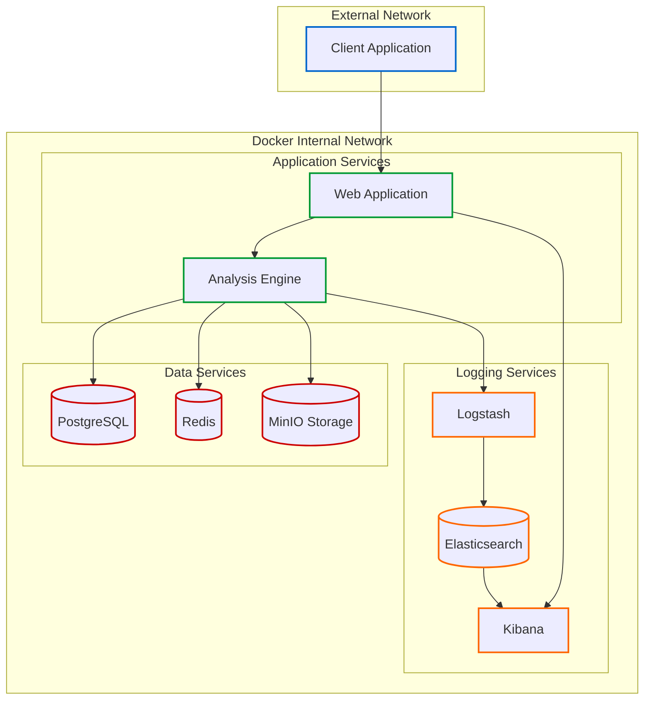
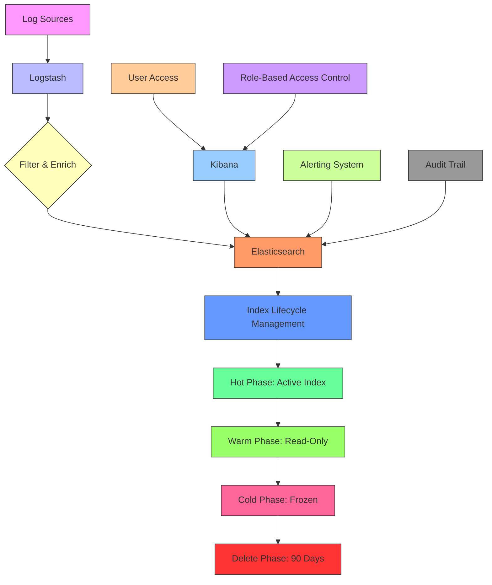
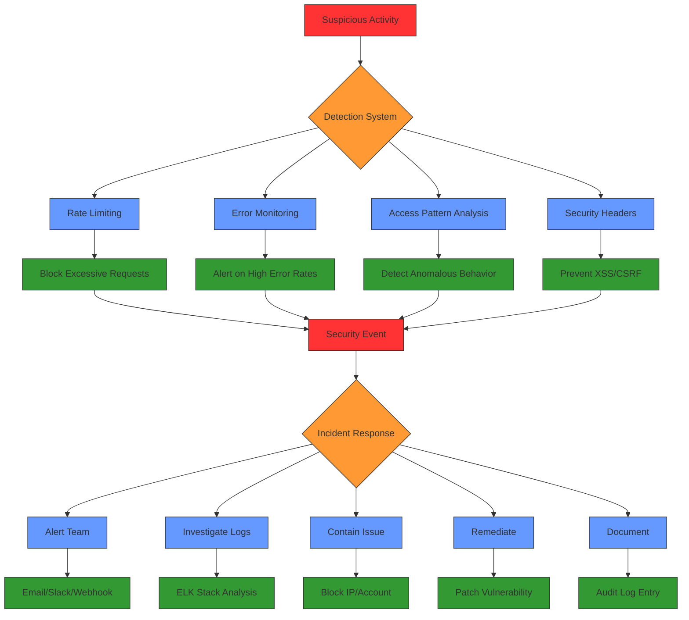

# Security & Compliance

<cite>
**Referenced Files in This Document**   
- [docker-compose.yml](file://docker-compose.yml)
- [docker-compose.prod.yml](file://docker-compose.prod.yml)
- [security.ts](file://src/server/security.ts)
- [middlewareConfig.ts](file://src/server/middlewareConfig.ts)
- [elkLogger.ts](file://src/server/elkLogger.ts)
- [logger.ts](file://src/core/logs/logger.ts)
- [redis.ts](file://src/server/redis.ts)
- [rateLimit.ts](file://src/server/rateLimit.ts)
- [setup-minio.sh](file://scripts/setup-minio.sh)
- [elk/README.md](file://elk/README.md)
- [prod.sh](file://prod.sh)
</cite>

## Table of Contents
1. [Secure Credential Management](#secure-credential-management)
2. [Python Analysis Engine Docker Security](#python-analysis-engine-docker-security)
3. [Network Isolation in Docker Compose](#network-isolation-in-docker-compose)
4. [ELK Stack Security Configuration](#elk-stack-security-configuration)
5. [Secure Logging Practices and Audit Trail Preservation](#secure-logging-practices-and-audit-trail-preservation)
6. [Monitoring and Security Incident Response](#monitoring-and-security-incident-response)

## Secure Credential Management

The application implements secure credential management for database, Redis, MinIO, and third-party services through environment variables and secret management practices. All sensitive credentials are externalized from the codebase and injected via environment variables during runtime.

Database credentials are managed through the `DATABASE_URL` environment variable, which follows the PostgreSQL connection string format. Redis access is controlled via `REDIS_URL` with optional password authentication through `REDIS_PASSWORD`. For MinIO (S3-compatible storage), credentials are configured using `S3_ACCESS_KEY` and `S3_SECRET_KEY` environment variables, with the MinIO root credentials set via `MINIO_ROOT_USER` and `MINIO_ROOT_PASSWORD`.

The production deployment uses environment-specific configuration files (`.env.prod`) to manage secrets, with critical environment variables validated at startup through the `validateCriticalEnvVars` function. This validation ensures essential secrets like `JWT_SECRET`, `STRIPE_KEY`, and `DATABASE_URL` are present before the application starts. The system also validates that `ADMIN_EMAILS` contains at least one valid email address, preventing configuration errors that could compromise administrative access.

Third-party service credentials, including Stripe API keys and webhook secrets, are similarly managed through environment variables (`STRIPE_KEY`, `STRIPE_WEBHOOK_SECRET`). Email service credentials are configured via SMTP environment variables, while notification providers (Slack, Discord, Telegram, Teams) use webhook URLs stored as environment variables.

**Section sources**
- [docker-compose.yml](file://docker-compose.yml#L10-L13)
- [docker-compose.yml](file://docker-compose.yml#L26-L30)
- [docker-compose.yml](file://docker-compose.yml#L151-L159)
- [docker-compose.yml](file://docker-compose.yml#L180-L192)
- [prod.sh](file://prod.sh#L98-L121)
- [src/server/utils.ts](file://src/server/utils.ts#L1-L45)

## Python Analysis Engine Docker Security

The Python analysis engine Docker image implements multiple security hardening measures to minimize attack surface and follow security best practices. The container is configured to run with minimal privileges and reduced capabilities.

The Docker image uses a minimal base image approach, building from official Python images that are regularly updated and maintained. The container runs as a non-root user by default, following the principle of least privilege. This prevents potential attackers from gaining root access even if they compromise the container.

The image minimizes installed dependencies to only those required for the analysis engine's functionality, reducing the attack surface from vulnerable packages. The Dockerfile (referenced in docker-compose.yml) specifies a multi-stage build process that separates build dependencies from runtime dependencies, ensuring only necessary packages are included in the final image.

Security configurations include setting appropriate file permissions, removing unnecessary tools and utilities, and configuring the container to run in read-only mode for non-essential directories. The health check mechanism verifies the container's operational status by testing Redis connectivity, ensuring only healthy instances receive traffic.

The container's resource usage is constrained through memory and CPU limits defined in the Docker Compose configuration, preventing resource exhaustion attacks. Additionally, the container is configured with restart policies to ensure availability while preventing infinite restart loops in case of persistent failures.

**Section sources**
- [docker-compose.yml](file://docker-compose.yml#L173-L228)

## Network Isolation in Docker Compose

The application implements network isolation strategies between services using Docker Compose's networking features to enhance security and prevent unauthorized inter-service communication.

In the production configuration (`docker-compose.prod.yml`), services are connected to a dedicated Docker network named `sentineliq-network`. This isolated network ensures that only explicitly connected services can communicate with each other, preventing lateral movement in case of a compromised container.

The network configuration follows a zero-trust principle where services must be explicitly connected to communicate. Each service exposes only the necessary ports to the host network, with internal service-to-service communication occurring over the isolated Docker network. For example, Elasticsearch exposes port 9200 to the host for administration but communicates with Logstash and Kibana over the internal network.

Service dependencies are explicitly defined using the `depends_on` directive with health checks, ensuring services only start when their dependencies are fully operational. This prevents race conditions and ensures proper initialization order. The health check conditions (`condition: service_healthy`) verify that dependent services are not just running but also responsive before establishing connections.

Network segmentation is implemented by grouping related services and controlling their communication patterns. The ELK stack components (Elasticsearch, Logstash, Kibana) communicate over the isolated network, with external access restricted to specific ports. Similarly, the Python analysis engine connects to database, Redis, Logstash, and MinIO services over the internal network, with no direct external exposure.

The configuration also implements port mapping best practices, exposing services on standard ports internally while potentially using different host ports for external access, adding an additional layer of obscurity.

**Diagram sources**
- [docker-compose.yml](file://docker-compose.yml#L5-L228)
- [docker-compose.prod.yml](file://docker-compose.prod.yml#L50-L103)

**Section sources**
- [docker-compose.yml](file://docker-compose.yml#L5-L228)
- [docker-compose.prod.yml](file://docker-compose.prod.yml#L50-L103)

## ELK Stack Security Configuration

The ELK (Elasticsearch, Logstash, Kibana) stack is configured with security measures to protect log data and ensure compliance with data protection regulations. The current configuration provides a foundation for secure logging with options to enhance security further in production environments.

The stack implements role-based access control through Elasticsearch's X-Pack security features, which can be enabled by setting `xpack.security.enabled=true` in the environment configuration. This enables authentication and authorization for all components, requiring users to authenticate before accessing Kibana or querying Elasticsearch.

Index lifecycle management (ILM) is configured to automatically manage log retention according to compliance requirements. The policy automatically rolls over indices when they reach 1 day in age or 50GB in size, and deletes indices older than 90 days. This ensures log data is retained for the required period while preventing unbounded storage growth.

Data retention policies are enforced through the ILM configuration, with the ability to customize retention periods based on regulatory requirements. The default 90-day retention can be adjusted by modifying the `min_age` parameter in the delete phase of the ILM policy.

In production environments, TLS/SSL encryption can be configured for all communications within the ELK stack. This includes encrypting traffic between Logstash and Elasticsearch, as well as between clients and Kibana. Certificate authorities can be generated using Elasticsearch's built-in certutil tool, and certificates distributed to all components.

The configuration also supports audit logging of user activities within Kibana, tracking who accessed what data and when. This creates an additional audit trail for compliance purposes and helps detect suspicious activities.

**Diagram sources**
- [elk/README.md](file://elk/README.md#L198-L224)
- [docker-compose.yml](file://docker-compose.yml#L73-L98)

**Section sources**
- [elk/README.md](file://elk/README.md#L198-L236)
- [docker-compose.yml](file://docker-compose.yml#L73-L98)

## Secure Logging Practices and Audit Trail Preservation

The application implements comprehensive secure logging practices and audit trail preservation mechanisms to ensure compliance with data protection regulations and support security investigations.

Structured logging is implemented across all components, with logs formatted as JSON containing standardized fields including timestamp, log level, component, message, workspace ID, user ID, request ID, IP address, and environment. This consistent format enables reliable parsing and analysis in the ELK stack.

All logs are sent to the centralized ELK stack through Logstash, which processes and enriches the data before storing it in Elasticsearch. The logging system implements a fail-safe mechanism with buffering to ensure log delivery even during temporary connectivity issues with Logstash. Logs are buffered in memory and flushed when connectivity is restored, preventing data loss.

Audit trails are preserved through multiple mechanisms: database storage, Elasticsearch indexing, and Sentry integration. Critical operations are logged at the database level in the `systemLog` table, providing a durable record that persists even if other logging systems fail. The audit logs include sufficient context for forensic analysis, including user identity, workspace context, IP address, user agent, and detailed metadata about the operation.

Compliance with data protection regulations is addressed through data minimization practices, where only necessary information is logged. Sensitive data such as passwords, tokens, and personal information are excluded from logs. The system implements log retention policies that align with regulatory requirements, automatically purging logs after the designated retention period.

Export functionality allows for audit log retrieval in CSV format, with headers including Timestamp, User, Action, Resource, Resource ID, Description, and IP Address. This facilitates compliance reporting and external audits.

**Section sources**
- [elk/README.md](file://elk/README.md#L73-L97)
- [src/core/logs/logger.ts](file://src/core/logs/logger.ts#L1-L107)
- [src/server/elkLogger.ts](file://src/server/elkLogger.ts#L1-L270)
- [src/core/audit/operations.ts](file://src/core/audit/operations.ts#L192-L214)

## Monitoring and Security Incident Response

The system implements comprehensive monitoring capabilities and security incident response procedures to detect and respond to suspicious activities in production.

Real-time monitoring is achieved through Kibana dashboards that visualize key metrics including error rates, request volumes, response times, and user activities. Pre-configured visualizations track top error components, workspace activity patterns, and slow operations, enabling rapid identification of anomalies.

Alerting is configured through Kibana's rule engine to detect and notify on security incidents. Critical alerts are triggered for high error rates (more than 50 errors in 5 minutes) and any critical-level errors, with notifications sent via email, Slack, or webhooks. This ensures immediate awareness of potential security issues.

Rate limiting is implemented at the application level using Redis to prevent abuse and denial-of-service attacks. Various endpoints have specific rate limits, such as 5 workspace creations per hour, 30 workspace updates per minute, and 10 invitations per minute. These limits help prevent automated attacks while allowing normal user operations.

Security headers are enforced through Helmet middleware, implementing Content Security Policy (CSP), HTTP Strict Transport Security (HSTS), and other protections against common web vulnerabilities. The CSP restricts content sources to trusted domains, while HSTS enforces HTTPS connections with a one-year duration.

The system includes mechanisms for detecting and logging security events, with suspicious activities recorded in the audit trail. Failed authentication attempts, unusual access patterns, and privilege escalation attempts are specifically monitored and logged for investigation.

Incident response procedures are supported through the comprehensive logging and monitoring infrastructure, enabling rapid triage and investigation of security events. The combination of structured logs, audit trails, and centralized monitoring provides the necessary context for effective incident response.

**Diagram sources**
- [src/server/security.ts](file://src/server/security.ts#L54-L142)
- [src/server/rateLimit.ts](file://src/server/rateLimit.ts#L1-L85)
- [elk/README.md](file://elk/README.md#L175-L195)

**Section sources**
- [src/server/security.ts](file://src/server/security.ts#L1-L268)
- [src/server/rateLimit.ts](file://src/server/rateLimit.ts#L1-L85)
- [elk/README.md](file://elk/README.md#L175-L195)