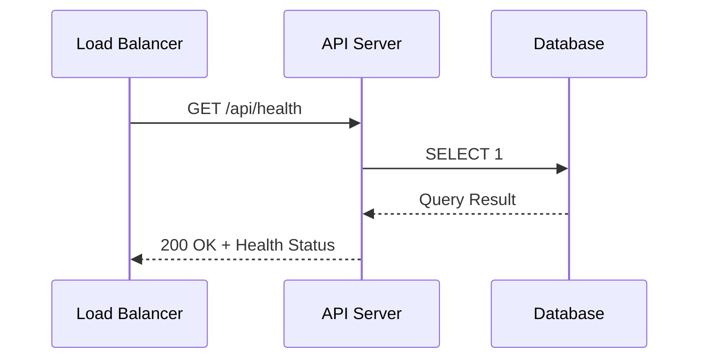
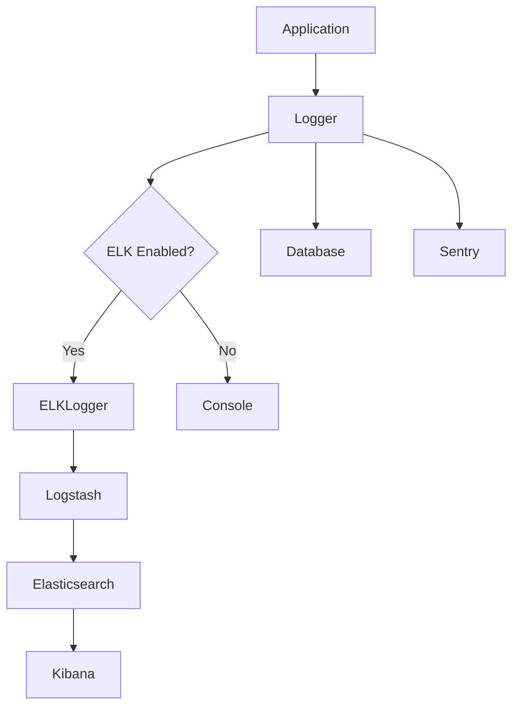
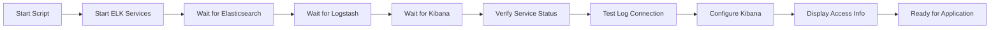
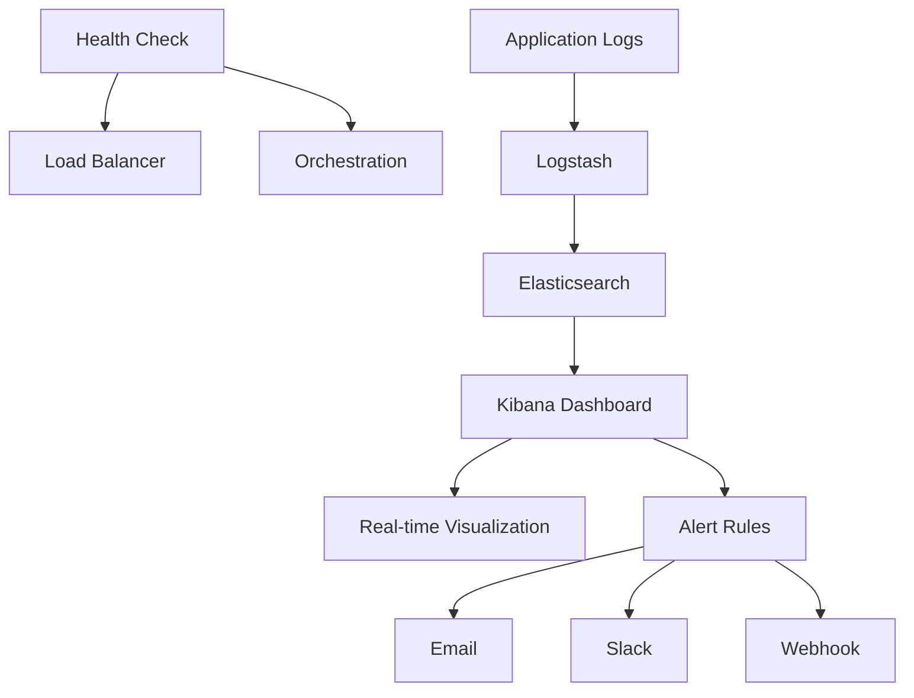
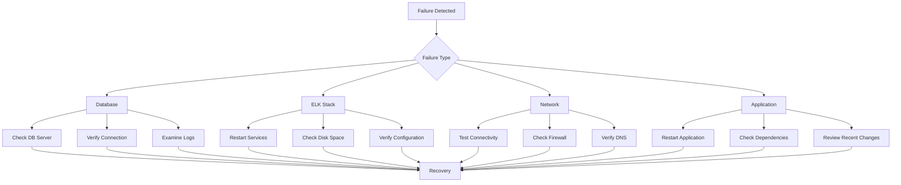

# Application Health Monitoring

<cite>
**Referenced Files in This Document**   
- [healthCheck.ts](file://src/server/healthCheck.ts)
- [elkLogger.ts](file://src/server/elkLogger.ts)
- [start-elk.sh](file://scripts/start-elk.sh)
- [logger.ts](file://src/core/logs/logger.ts)
- [redis.ts](file://src/server/redis.ts)
- [levels.ts](file://src/core/logs/levels.ts)
- [requestContext.ts](file://src/server/requestContext.ts)
- [docker-compose.yml](file://docker-compose.yml)
- [main.wasp](file://main.wasp)
- [README.md](file://elk/README.md)
</cite>

## Table of Contents
1. [Introduction](#introduction)
2. [Health Check Endpoint Implementation](#health-check-endpoint-implementation)
3. [ELK Logging System](#elk-logging-system)
4. [Monitoring Stack Initialization](#monitoring-stack-initialization)
5. [Real-time Monitoring and Alerting](#real-time-monitoring-and-alerting)
6. [Failure Scenarios and Recovery](#failure-scenarios-and-recovery)
7. [Conclusion](#conclusion)

## Introduction
The SentinelIQ application health monitoring system provides comprehensive visibility into service status, performance metrics, and system health. This documentation details the implementation of health checks, structured logging, and monitoring infrastructure that enables proactive detection of issues and rapid response to service degradation. The system integrates with load balancers and orchestration platforms to ensure high availability and reliability of the application.

## Health Check Endpoint Implementation

The health check endpoint in SentinelIQ serves as a critical component for monitoring system health and ensuring service availability. Implemented in `healthCheck.ts`, this endpoint provides a standardized interface for load balancers, orchestration platforms, and monitoring tools to assess the application's operational status.

The endpoint is configured through the Wasp framework in `main.wasp` to respond to GET requests at the `/api/health` route. When accessed, it performs a database connectivity check by executing a simple SQL query (`SELECT 1`) against the PostgreSQL database using Prisma ORM. This approach verifies not only that the application server is running but also that it can successfully communicate with its primary data store.

The health check response includes comprehensive system information such as service status, timestamp, service name, version, uptime, response time, and dependency status. When the database connection is successful, the endpoint returns a 200 OK status with a "healthy" status indicator. If the database check fails, it returns a 503 Service Unavailable status with detailed error information, allowing monitoring systems to distinguish between different types of failures.

The implementation follows best practices for health checks by keeping the check lightweight and focused on critical dependencies. Currently, the primary dependency monitored is the database connection, which represents the most essential external service for application functionality. The response time is measured and included in the output, providing valuable performance metrics for monitoring service degradation over time.

**Diagram sources**
- [healthCheck.ts](file://src/server/healthCheck.ts)
- [main.wasp](file://main.wasp)

**Section sources**
- [healthCheck.ts](file://src/server/healthCheck.ts)
- [main.wasp](file://main.wasp)

## ELK Logging System

The ELK (Elasticsearch, Logstash, Kibana) logging system in SentinelIQ provides centralized log aggregation, analysis, and visualization capabilities. The implementation in `elkLogger.ts` creates a robust logging pipeline that captures structured logs from Node.js services and routes them to the ELK stack for long-term storage and analysis.

The logging system is built around a singleton `ELKLogger` class that manages the TCP connection to Logstash. It includes sophisticated error handling and recovery mechanisms, such as automatic reconnection with exponential backoff and a message buffer that stores logs when the connection is unavailable. This ensures that log messages are not lost during temporary network outages or service restarts.

Logs are sent in structured JSON format with standardized fields including timestamp, log level, component, message, environment, and contextual metadata. The system extracts important contextual information such as workspace ID, user ID, request ID, IP address, and user agent from metadata, enabling powerful filtering and correlation capabilities in Kibana. Error information is specially formatted with message, stack trace, and error code for comprehensive error analysis.

The logging system integrates with multiple output destinations: logs are sent to Logstash for centralized aggregation, stored in the application database via Prisma, and forwarded to Sentry for error tracking. This multi-channel approach ensures redundancy and provides different tools for different monitoring needs. The logger also supports different log levels (DEBUG, INFO, WARN, ERROR, CRITICAL) with appropriate color coding for console output.

**Diagram sources**
- [elkLogger.ts](file://src/server/elkLogger.ts)
- [logger.ts](file://src/core/logs/logger.ts)

**Section sources**
- [elkLogger.ts](file://src/server/elkLogger.ts)
- [logger.ts](file://src/core/logs/logger.ts)
- [levels.ts](file://src/core/logs/levels.ts)

## Monitoring Stack Initialization

The monitoring stack initialization process is automated through the `start-elk.sh` script, which orchestrates the deployment and configuration of the complete ELK stack. This script provides a reliable and repeatable method for setting up the monitoring infrastructure during development, testing, and production deployments.

The initialization process begins by starting the core ELK services (Elasticsearch, Logstash, and Kibana) using Docker Compose. It then implements a comprehensive health check mechanism that waits for each service to become fully operational before proceeding. The script polls each service's health endpoint with a timeout mechanism, providing visual feedback with progress indicators and success/failure markers.

Once all services are confirmed healthy, the script displays detailed status information including service availability, access URLs, and Elasticsearch cluster health. It then performs a connectivity test by sending a sample log message to Logstash on port 5000, verifying that the logging pipeline is functioning correctly.

The initialization process includes automatic configuration of Kibana through the `setup.sh` script, which creates index patterns, visualizations, and dashboards. If the automatic setup script is not available, the script provides clear manual configuration instructions, including steps to create the `sentineliq-logs-*` index pattern and configure time-based searching.

The script is designed with user experience in mind, using colored output to distinguish between different types of messages (success, warnings, errors) and providing a clear summary of the setup status. It concludes by displaying the command needed to start the application, creating a seamless transition from infrastructure setup to application deployment.

**Diagram sources**
- [start-elk.sh](file://scripts/start-elk.sh)
- [docker-compose.yml](file://docker-compose.yml)

**Section sources**
- [start-elk.sh](file://scripts/start-elk.sh)
- [docker-compose.yml](file://docker-compose.yml)
- [README.md](file://elk/README.md)

## Real-time Monitoring and Alerting

SentinelIQ's real-time monitoring capabilities enable teams to detect service degradation and respond to issues before they impact users. The system combines health check monitoring with comprehensive log analysis to provide a complete picture of application health and performance.

The health check endpoint is designed to integrate seamlessly with load balancers and orchestration platforms. When a service instance becomes unhealthy (indicated by a 503 status from the health check), load balancers can automatically route traffic to healthy instances, ensuring high availability. Orchestration platforms like Kubernetes can use the health check status to restart unhealthy containers or scale services based on demand.

Kibana dashboards provide real-time visualization of system metrics, including error rates, performance trends, and resource utilization. Pre-configured visualizations such as error rate over time, top error components, and workspace activity enable quick identification of emerging issues. The system supports complex queries using KQL (Kibana Query Language) to filter logs by level, component, workspace, user, or custom metadata.

Alerting is configured through Kibana's rule and connector system, allowing teams to set up automated notifications based on specific conditions. For example, an alert can be configured to trigger when the error rate exceeds a threshold in a 5-minute window, or when critical errors are detected. Alerts can be delivered via email, Slack, or webhooks, ensuring that the appropriate team members are notified immediately.

The monitoring system also tracks performance metrics such as request duration, which can be used to detect service degradation before complete failure occurs. Slow operations (those exceeding a configurable threshold) are flagged for investigation, enabling proactive optimization of performance bottlenecks.

**Diagram sources**
- [healthCheck.ts](file://src/server/healthCheck.ts)
- [elkLogger.ts](file://src/server/elkLogger.ts)
- [README.md](file://elk/README.md)

**Section sources**
- [healthCheck.ts](file://src/server/healthCheck.ts)
- [elkLogger.ts](file://src/server/elkLogger.ts)
- [README.md](file://elk/README.md)

## Failure Scenarios and Recovery

The monitoring system in SentinelIQ is designed to handle various failure scenarios and provide clear recovery procedures. Understanding these scenarios is critical for maintaining system reliability and minimizing downtime.

One common failure scenario is database connectivity loss, which is detected by the health check endpoint. When the database becomes unavailable, the health check returns a 503 status, triggering failover mechanisms in load balancers and alerting operations teams. Recovery typically involves checking database server status, verifying network connectivity, and examining database logs for specific error messages.

Another potential failure point is the ELK stack itself. If Logstash becomes unavailable, the `ELKLogger` class automatically buffers log messages and attempts to reconnect with exponential backoff. This prevents log loss during temporary outages. If Elasticsearch becomes unavailable, Kibana will display appropriate error messages, and the system will continue to buffer logs until connectivity is restored.

Network partitioning between services can also cause monitoring issues. The system is designed to handle these scenarios gracefully, with each component having appropriate timeout and retry mechanisms. For example, the Redis client includes a retry strategy that increases delay between attempts, preventing overwhelming a recovering service with connection requests.

Recovery procedures are documented and automated where possible. The `start-elk.sh` script can be used to restart the monitoring stack, and the health check endpoint provides immediate feedback on whether recovery was successful. Regular maintenance tasks such as index cleanup and log rotation are automated through scheduled jobs to prevent storage-related failures.

**Diagram sources**
- [healthCheck.ts](file://src/server/healthCheck.ts)
- [elkLogger.ts](file://src/server/elkLogger.ts)
- [redis.ts](file://src/server/redis.ts)

**Section sources**
- [healthCheck.ts](file://src/server/healthCheck.ts)
- [elkLogger.ts](file://src/server/elkLogger.ts)
- [redis.ts](file://src/server/redis.ts)
- [README.md](file://elk/README.md)

## Conclusion
The application health monitoring system in SentinelIQ provides a comprehensive solution for ensuring service reliability and performance. By combining health check endpoints, structured logging, and real-time monitoring, the system enables proactive detection of issues and rapid response to service degradation. The integration with load balancers and orchestration platforms ensures high availability, while the ELK stack provides powerful log analysis and visualization capabilities. With automated initialization scripts and clear recovery procedures, the monitoring system is both robust and maintainable, forming a critical component of the application's overall reliability strategy.