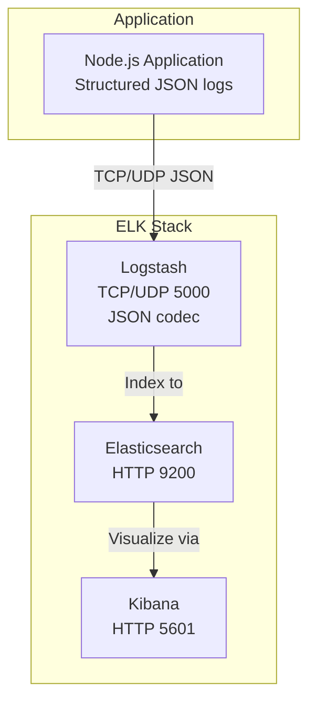
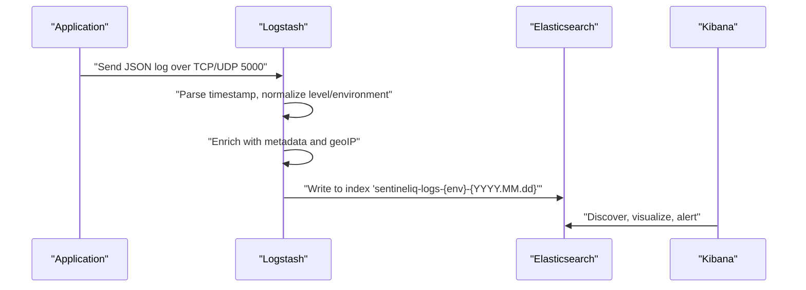
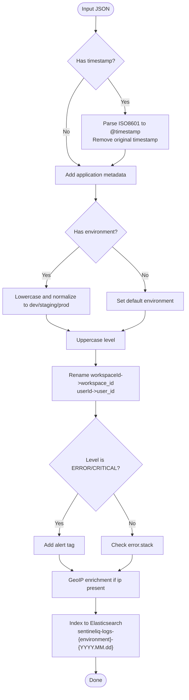
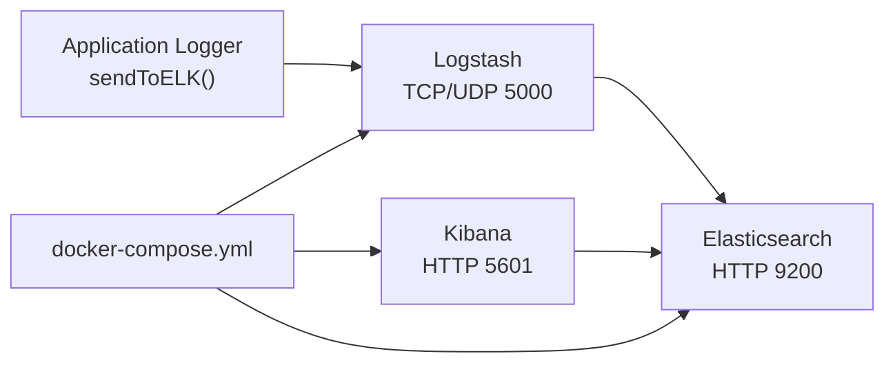

# ELK Stack Configuration

<cite>
**Referenced Files in This Document**
- [elk/README.md](file://elk/README.md)
- [elk/logstash/config/logstash.yml](file://elk/logstash/config/logstash.yml)
- [elk/logstash/pipeline/logstash.conf](file://elk/logstash/pipeline/logstash.conf)
- [elk/kibana/setup.sh](file://elk/kibana/setup.sh)
- [scripts/start-elk.sh](file://scripts/start-elk.sh)
- [docker-compose.yml](file://docker-compose.yml)
- [src/server/elkLogger.ts](file://src/server/elkLogger.ts)
- [src/core/logs/logger.ts](file://src/core/logs/logger.ts)
</cite>

## Table of Contents
1. [Introduction](#introduction)
2. [Project Structure](#project-structure)
3. [Core Components](#core-components)
4. [Architecture Overview](#architecture-overview)
5. [Detailed Component Analysis](#detailed-component-analysis)
6. [Dependency Analysis](#dependency-analysis)
7. [Performance Considerations](#performance-considerations)
8. [Troubleshooting Guide](#troubleshooting-guide)
9. [Conclusion](#conclusion)
10. [Appendices](#appendices)

## Introduction
This document explains the ELK stack configuration for SentinelIQ, detailing how Elasticsearch stores and indexes logs, how Logstash processes and enriches them, and how Kibana visualizes and organizes insights. It covers the Logstash configuration file, the Logstash pipeline, and the Kibana setup script. Guidance is also provided for customizing pipelines for new log formats, scaling Logstash workers, securing the stack, and troubleshooting common ingestion and performance issues.

## Project Structure
The ELK stack configuration is organized under the elk directory and integrates with the application’s logging subsystem. The application sends structured JSON logs to Logstash, which forwards them to Elasticsearch. Kibana is configured to visualize and manage dashboards and index patterns.

**Diagram sources**
- [elk/logstash/pipeline/logstash.conf](file://elk/logstash/pipeline/logstash.conf#L1-L20)
- [docker-compose.yml](file://docker-compose.yml#L100-L146)
- [elk/README.md](file://elk/README.md#L1-L67)

**Section sources**
- [elk/README.md](file://elk/README.md#L1-L67)
- [docker-compose.yml](file://docker-compose.yml#L100-L146)

## Core Components
- Elasticsearch: Centralized storage and indexing engine for logs. Indices are named by environment and date to support time-based rollover and lifecycle management.
- Logstash: Receives JSON logs over TCP/UDP, parses timestamps, normalizes levels and environments, enriches with metadata and geolocation, and writes to Elasticsearch.
- Kibana: Visualization and dashboard platform. A setup script automates index patterns, saved searches, visualizations, and dashboards creation.

**Section sources**
- [elk/README.md](file://elk/README.md#L1-L67)
- [elk/logstash/pipeline/logstash.conf](file://elk/logstash/pipeline/logstash.conf#L1-L125)
- [elk/kibana/setup.sh](file://elk/kibana/setup.sh#L1-L253)

## Architecture Overview
The application emits structured JSON logs enriched with environment, component, and optional identifiers. These logs are transmitted to Logstash over TCP/UDP on port 5000. Logstash applies filters to normalize and enrich the data, then indexes it into Elasticsearch with environment-aware index names. Kibana connects to Elasticsearch to discover, visualize, and alert on the indexed logs.

**Diagram sources**
- [src/server/elkLogger.ts](file://src/server/elkLogger.ts#L17-L21)
- [elk/logstash/pipeline/logstash.conf](file://elk/logstash/pipeline/logstash.conf#L1-L125)
- [docker-compose.yml](file://docker-compose.yml#L100-L146)

## Detailed Component Analysis

### Logstash Configuration (logstash.yml)
- HTTP API host/port: exposed for monitoring and health checks.
- Pipeline workers: controls parallelism for processing.
- Batch size and delay: tune throughput and latency.
- Elasticsearch monitoring: enables X-Pack monitoring to Elasticsearch.

Operational guidance:
- Increase pipeline.workers for high-volume ingestion.
- Adjust pipeline.batch.size and pipeline.batch.delay to balance throughput and latency.
- Ensure xpack.monitoring.elasticsearch.hosts points to a reachable Elasticsearch endpoint.

**Section sources**
- [elk/logstash/config/logstash.yml](file://elk/logstash/config/logstash.yml#L1-L16)

### Logstash Pipeline (logstash.conf)
Pipeline stages:
- Input:
  - TCP input on port 5000 with JSON codec.
  - UDP input on port 5000 with JSON codec.
- Filter:
  - Timestamp normalization: converts ISO8601 timestamp to @timestamp and removes original timestamp field.
  - Metadata enrichment: adds application identifier.
  - Environment detection and normalization: lowercases and normalizes values to dev, staging, prod.
  - Level normalization: uppercases level values.
  - Field renaming: workspaceId -> workspace_id; userId -> user_id.
  - Error enrichment: adds an alert tag for ERROR and CRITICAL levels.
  - Stack trace extraction: copies error.stack to a dedicated field.
  - GeoIP enrichment: enriches logs with IP geolocation when present.
- Output:
  - Elasticsearch output with environment-aware index naming and document type.

**Diagram sources**
- [elk/logstash/pipeline/logstash.conf](file://elk/logstash/pipeline/logstash.conf#L1-L125)

**Section sources**
- [elk/logstash/pipeline/logstash.conf](file://elk/logstash/pipeline/logstash.conf#L1-L125)

### Kibana Setup Script (setup.sh)
Automates Kibana initialization:
- Waits for Kibana and Elasticsearch readiness.
- Creates environment-specific index patterns (dev/prod/all).
- Sets default index pattern.
- Creates saved searches for errors and workspace activity.
- Creates visualizations for error rate over time, top error components, and log levels distribution.
- Creates a dashboard referencing the visualizations.

Operational guidance:
- Run the script after starting ELK services and verifying Elasticsearch availability.
- The script respects NODE_ENV to choose dev or prod index patterns.

**Section sources**
- [elk/kibana/setup.sh](file://elk/kibana/setup.sh#L1-L253)

### Application Logging Integration
The application’s logger:
- Emits structured logs with timestamp, level, component, message, and optional metadata.
- Sends logs to ELK via a TCP socket to Logstash when enabled.
- Retries on connection failures with exponential backoff and buffers logs when disconnected.
- Integrates with Sentry for error tracking alongside ELK.

Key behaviors:
- ELK_ENABLED toggles sending logs to Logstash.
- LOGSTASH_HOST and LOGSTASH_PORT define the destination.
- Environment is injected into each log entry.

**Section sources**
- [src/core/logs/logger.ts](file://src/core/logs/logger.ts#L1-L107)
- [src/server/elkLogger.ts](file://src/server/elkLogger.ts#L17-L21)
- [src/server/elkLogger.ts](file://src/server/elkLogger.ts#L54-L111)
- [src/server/elkLogger.ts](file://src/server/elkLogger.ts#L110-L171)
- [src/server/elkLogger.ts](file://src/server/elkLogger.ts#L125-L171)
- [src/server/elkLogger.ts](file://src/server/elkLogger.ts#L171-L209)
- [src/server/elkLogger.ts](file://src/server/elkLogger.ts#L209-L270)

## Dependency Analysis
- Application to Logstash: TCP/UDP transport with JSON codec.
- Logstash to Elasticsearch: HTTP output with environment-aware index naming.
- Kibana to Elasticsearch: HTTP client for visualization and management.
- docker-compose orchestrates services, exposes ports, and sets environment variables for ELK integration.

**Diagram sources**
- [src/server/elkLogger.ts](file://src/server/elkLogger.ts#L17-L21)
- [elk/logstash/pipeline/logstash.conf](file://elk/logstash/pipeline/logstash.conf#L1-L20)
- [docker-compose.yml](file://docker-compose.yml#L100-L146)

**Section sources**
- [docker-compose.yml](file://docker-compose.yml#L100-L146)
- [docker-compose.yml](file://docker-compose.yml#L200-L236)

## Performance Considerations
- Logstash:
  - Increase pipeline.workers for higher throughput.
  - Tune pipeline.batch.size and pipeline.batch.delay to balance latency and throughput.
  - Ensure adequate memory allocation via LS_JAVA_OPTS.
- Elasticsearch:
  - Scale horizontally by increasing replicas/nodes.
  - Configure Index Lifecycle Management (ILM) to roll over and delete old indices.
- Kibana:
  - Use saved searches and visualizations to reduce query overhead.
  - Limit time ranges and filters to improve responsiveness.

[No sources needed since this section provides general guidance]

## Troubleshooting Guide
Common issues and remedies:
- Logstash not receiving logs:
  - Verify Logstash is healthy and listening on port 5000.
  - Test connectivity from the application host.
  - Send a test JSON log to port 5000 to validate ingestion.
- Elasticsearch connection issues:
  - Check cluster health and indices.
  - Confirm Elasticsearch is reachable from Logstash/Kibana.
- Kibana not loading:
  - Check Kibana logs and verify Elasticsearch connectivity.
  - Ensure index patterns exist and default index is set.
- Performance bottlenecks:
  - Increase Logstash workers and adjust batch settings.
  - Review ILM policy and index sizes.
  - Optimize queries and filters in Kibana.

**Section sources**
- [elk/README.md](file://elk/README.md#L238-L348)

## Conclusion
The SentinelIQ ELK stack provides a robust, production-ready logging pipeline. Elasticsearch efficiently stores and indexes logs, Logstash normalizes and enriches them, and Kibana delivers powerful visualizations and dashboards. The included configuration files and setup scripts streamline deployment and maintenance, while the application’s logger ensures consistent, structured log emission with resilience against transient failures.

[No sources needed since this section summarizes without analyzing specific files]

## Appendices

### Customizing Pipelines for New Log Formats
- Extend the input section to accept additional codecs or ports.
- Add grok or mutate filters to parse new fields and normalize values.
- Introduce geoip enrichment for new IP sources.
- Update the Elasticsearch index naming strategy if needed.

**Section sources**
- [elk/logstash/pipeline/logstash.conf](file://elk/logstash/pipeline/logstash.conf#L1-L125)

### Scaling Logstash Workers
- Adjust pipeline.workers in the Logstash configuration.
- Increase pipeline.batch.size and reduce pipeline.batch.delay for lower latency.
- Ensure LS_JAVA_OPTS provides sufficient heap for increased concurrency.

**Section sources**
- [elk/logstash/config/logstash.yml](file://elk/logstash/config/logstash.yml#L1-L16)
- [elk/README.md](file://elk/README.md#L273-L317)

### Securing the ELK Stack
- Enable X-Pack security in Elasticsearch and configure credentials.
- Generate and apply TLS certificates for Elasticsearch and update Logstash output to HTTPS.
- Restrict network exposure of ports and use internal networks for service communication.

**Section sources**
- [elk/README.md](file://elk/README.md#L295-L348)

### Startup and Verification
- Use the startup script to launch ELK services, wait for health, and auto-run Kibana setup.
- Manually verify service endpoints and test ingestion.

**Section sources**
- [scripts/start-elk.sh](file://scripts/start-elk.sh#L1-L114)
- [docker-compose.yml](file://docker-compose.yml#L100-L146)