# Monitoring and Logging

<cite>
**Referenced Files in This Document**   
- [elk/README.md](file://elk/README.md)
- [elk/logstash/config/logstash.yml](file://elk/logstash/config/logstash.yml)
- [elk/logstash/pipeline/logstash.conf](file://elk/logstash/pipeline/logstash.conf)
- [elk/kibana/setup.sh](file://elk/kibana/setup.sh)
- [scripts/start-elk.sh](file://scripts/start-elk.sh)
- [src/server/elkLogger.ts](file://src/server/elkLogger.ts)
- [src/core/logs/logger.ts](file://src/core/logs/logger.ts)
- [src/core/logs/levels.ts](file://src/core/logs/levels.ts)
- [src/core/logs/types.ts](file://src/core/logs/types.ts)
- [src/core/logs/operations.ts](file://src/core/logs/operations.ts)
- [src/server/healthCheck.ts](file://src/server/healthCheck.ts)
- [src/server/sentry.ts](file://src/server/sentry.ts)
- [services/engine/utils/logger.py](file://services/engine/utils/logger.py)
- [services/engine/main.py](file://services/engine/main.py)
- [docker-compose.yml](file://docker-compose.yml)
</cite>

## Table of Contents
1. [Introduction](#introduction)
2. [ELK Stack Architecture](#elk-stack-architecture)
3. [Logstash Configuration](#logstash-configuration)
4. [Kibana Setup and Visualization](#kibana-setup-and-visualization)
5. [Application Logging Implementation](#application-logging-implementation)
6. [Health Checks and Performance Monitoring](#health-checks-and-performance-monitoring)
7. [Alerting Mechanisms](#alerting-mechanisms)
8. [Audit Logging](#audit-logging)
9. [Python Service Integration](#python-service-integration)
10. [Dashboard Creation](#dashboard-creation)

## Introduction

SentinelIQ implements a comprehensive monitoring and logging system centered around the ELK (Elasticsearch, Logstash, Kibana) stack for centralized log aggregation, analysis, and visualization. This documentation details the architecture, configuration, and integration of monitoring components across the application's Node.js and Python services. The system provides real-time insights into application health, performance metrics, security events, and user activities through structured logging, health checks, and alerting mechanisms.

The monitoring infrastructure enables developers and administrators to track system behavior, diagnose issues, and maintain compliance through audit trails. Logs from all components are collected, enriched, and stored in Elasticsearch, where they can be queried and visualized through Kibana dashboards. The system also integrates with Sentry for error tracking and implements health checks for monitoring service availability.

**Section sources**
- [elk/README.md](file://elk/README.md)
- [docker-compose.yml](file://docker-compose.yml)

## ELK Stack Architecture

The ELK stack in SentinelIQ follows a standard architecture pattern with specialized components for log collection, processing, storage, and visualization. The system is containerized using Docker Compose, ensuring consistent deployment across environments.

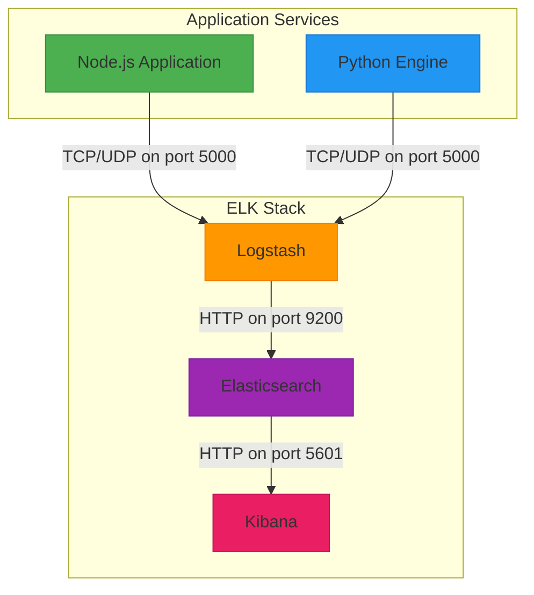

**Diagram sources**
- [elk/README.md](file://elk/README.md)
- [docker-compose.yml](file://docker-compose.yml)

The architecture consists of three main components:

1. **Logstash**: Acts as the log collector and processor, receiving structured JSON logs via TCP/UDP on port 5000 from both Node.js and Python services. It enriches the logs with metadata, parses timestamps, and forwards them to Elasticsearch.

2. **Elasticsearch**: Serves as the distributed search and analytics engine that stores all logs in time-based indices following the pattern `sentineliq-logs-{environment}-{YYYY.MM.dd}`. It provides fast search capabilities and scalable storage.

3. **Kibana**: Provides the visualization layer, allowing users to explore logs, create dashboards, and set up alerts based on log data.

The services are orchestrated through Docker Compose with proper health checks and startup dependencies. Logstash depends on Elasticsearch being healthy before starting, and Kibana depends on Elasticsearch. The Python engine service also depends on Logstash to ensure logs can be properly forwarded during operation.

**Section sources**
- [elk/README.md](file://elk/README.md)
- [docker-compose.yml](file://docker-compose.yml)

## Logstash Configuration

Logstash is configured to receive, process, and forward application logs through a pipeline defined in configuration files. The configuration consists of input, filter, and output sections that handle log ingestion, transformation, and indexing.

### Configuration Files

The Logstash configuration is split into two main files:

- **logstash.yml**: Contains global settings such as HTTP host, monitoring configuration, pipeline workers, and batch settings.
- **logstash.conf**: Defines the processing pipeline with input, filter, and output configurations.

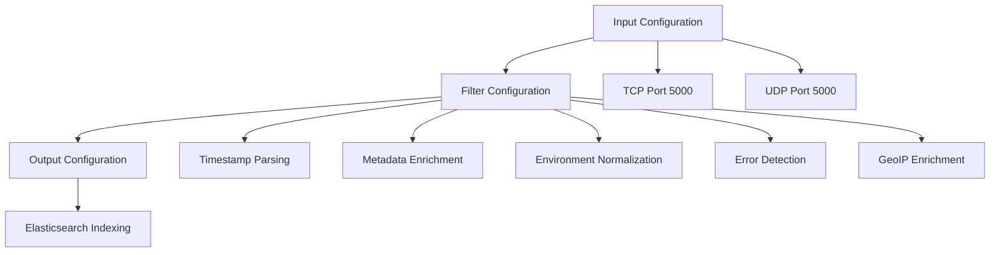

**Diagram sources**
- [elk/logstash/config/logstash.yml](file://elk/logstash/config/logstash.yml)
- [elk/logstash/pipeline/logstash.conf](file://elk/logstash/pipeline/logstash.conf)

### Input Configuration

Logstash is configured to accept logs through both TCP and UDP on port 5000, providing flexibility for different logging scenarios:

```conf
input {
  tcp {
    port => 5000
    codec => json
  }
  
  udp {
    port => 5000
    codec => json
  }
}
```

This dual-input approach allows the system to handle both reliable (TCP) and high-throughput (UDP) logging scenarios. The JSON codec ensures that incoming logs are automatically parsed as JSON objects.

### Filter Configuration

The filter section processes incoming logs by parsing timestamps, enriching metadata, normalizing environment values, and extracting relevant information:

```conf
filter {
  # Parse timestamp if present
  if [timestamp] {
    date {
      match => ["timestamp", "ISO8601"]
      target => "@timestamp"
      remove_field => ["timestamp"]
    }
  }
  
  # Add application metadata
  mutate {
    add_field => { "application" => "sentineliq" }
  }
  
  # Normalize environment values
  if [environment] == "prod" or [environment] == "production" {
    mutate { replace => { "environment" => "prod" } }
  } else if [environment] == "dev" or [environment] == "development" {
    mutate { replace => { "environment" => "dev" } }
  } else if [environment] == "staging" or [environment] == "stage" {
    mutate { replace => { "environment" => "staging" } }
  } else {
    mutate { replace => { "environment" => "dev" } }
  }
  
  # Enrich error logs
  if [level] == "ERROR" or [level] == "CRITICAL" {
    mutate { add_tag => ["alert"] }
  }
  
  # Add geo IP info if IP address present
  if [ip] {
    geoip {
      source => "ip"
      target => "geoip"
    }
  }
}
```

The filter configuration performs several key functions:
- Converts the `timestamp` field to Elasticsearch's `@timestamp` format
- Adds application identification metadata
- Normalizes environment names to standard values (dev, staging, prod)
- Tags error-level logs for alerting purposes
- Enriches logs with geolocation data based on IP addresses

### Output Configuration

Logs are forwarded to Elasticsearch with environment-specific indexing:

```conf
output {
  elasticsearch {
    hosts => ["http://elasticsearch:9200"]
    index => "sentineliq-logs-%{environment}-%{+YYYY.MM.dd}"
    document_type => "_doc"
  }
}
```

The index pattern includes the environment and date, enabling efficient log rotation and querying. The system also supports Index Lifecycle Management (ILM) policies for automatic cleanup of logs older than the retention period (default 90 days).

**Section sources**
- [elk/logstash/config/logstash.yml](file://elk/logstash/config/logstash.yml)
- [elk/logstash/pipeline/logstash.conf](file://elk/logstash/pipeline/logstash.conf)

## Kibana Setup and Visualization

Kibana is configured as the visualization and exploration interface for the ELK stack, providing dashboards, search capabilities, and alerting functionality for monitoring SentinelIQ's operations.

### Automatic Setup

The system includes an automated setup script (`elk/kibana/setup.sh`) that configures Kibana with predefined index patterns, visualizations, and dashboards:

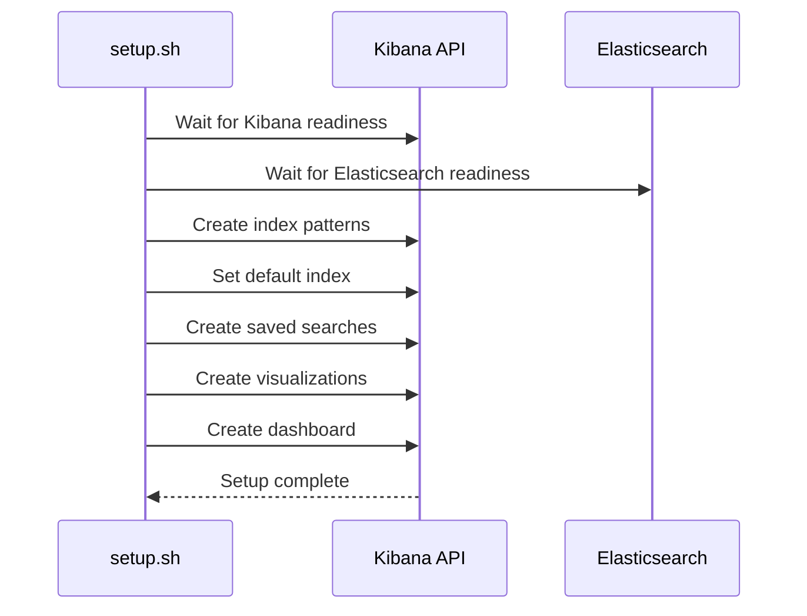

**Diagram sources**
- [elk/kibana/setup.sh](file://elk/kibana/setup.sh)

The setup process includes:
1. Waiting for both Kibana and Elasticsearch to be healthy
2. Creating index patterns for environment-specific logs
3. Setting the default index pattern based on the current environment
4. Creating saved searches for common log queries
5. Creating visualizations for key metrics
6. Assembling a comprehensive monitoring dashboard

### Index Patterns

The setup script creates two primary index patterns:
- `sentineliq-logs-{environment}-*`: Environment-specific pattern (dev, staging, prod)
- `sentineliq-logs-*`: Global pattern for cross-environment queries

The default index pattern is automatically selected based on the `NODE_ENV` environment variable, ensuring users start with the most relevant log data.

### Saved Searches

Two key saved searches are pre-configured:
- **Error Logs**: Filters for ERROR and CRITICAL level logs with relevant columns
- **Workspace Activity**: Queries for logs containing workspace identifiers

These saved searches provide quick access to the most critical log categories without requiring users to construct complex queries.

### Visualizations

Three core visualizations are created during setup:

1. **Error Rate Over Time**: Line chart showing the count of ERROR and CRITICAL logs over time
2. **Top Error Components**: Pie chart displaying the distribution of errors by component
3. **Log Levels Distribution**: Histogram showing the distribution of all log levels

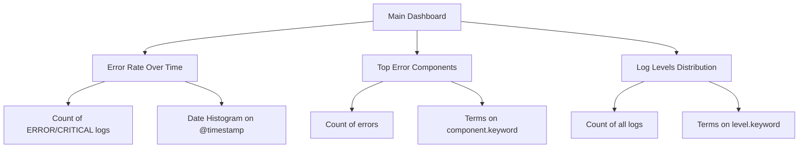

**Diagram sources**
- [elk/kibana/setup.sh](file://elk/kibana/setup.sh)

### Dashboard

The primary dashboard "SentinelIQ Production Monitoring" combines the key visualizations into a single view for comprehensive system monitoring. It is configured with auto-refresh every 30 seconds to provide near real-time visibility into system health.

### Access and Configuration

Kibana is accessible at `http://localhost:5601` in development environments. The system can be started using the `scripts/start-elk.sh` script, which orchestrates the startup of all ELK services and runs the automatic setup:

```bash
# Start ELK stack
./scripts/start-elk.sh

# Access Kibana
http://localhost:5601
```

The script verifies service health, displays status information, and automatically configures Kibana if the setup script is available.

**Section sources**
- [elk/kibana/setup.sh](file://elk/kibana/setup.sh)
- [scripts/start-elk.sh](file://scripts/start-elk.sh)

## Application Logging Implementation

SentinelIQ implements a structured logging system in Node.js that captures detailed information and forwards it to the ELK stack for centralized analysis.

### Logger Architecture

The logging system is implemented in `src/core/logs/logger.ts` and provides a component-based logging interface:

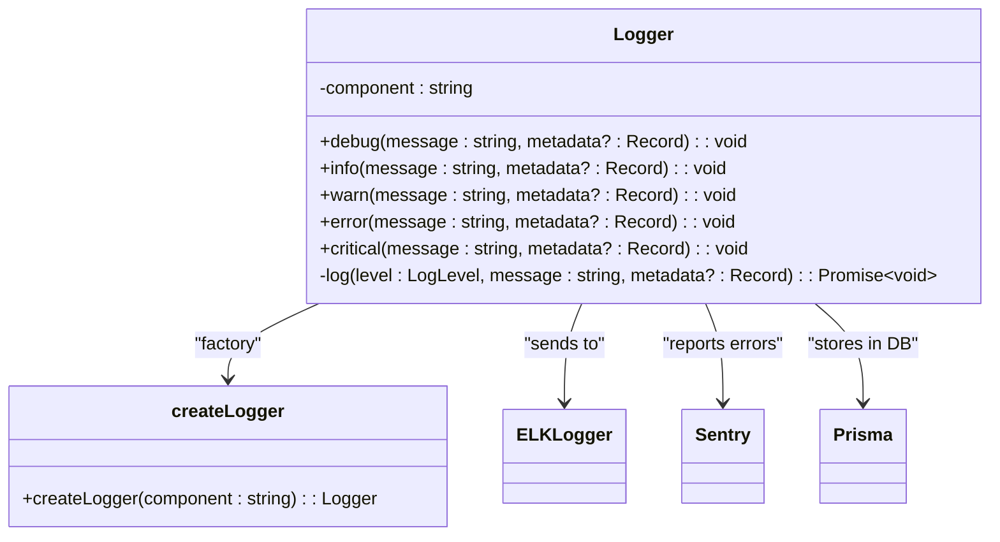

**Diagram sources**
- [src/core/logs/logger.ts](file://src/core/logs/logger.ts)
- [src/server/elkLogger.ts](file://src/server/elkLogger.ts)

### Log Structure

Application logs follow a standardized JSON structure with the following fields:

- **timestamp**: ISO 8601 formatted timestamp
- **level**: Log severity level (DEBUG, INFO, WARN, ERROR, CRITICAL)
- **component**: Source component or module
- **message**: Log message
- **workspaceId**: Associated workspace identifier
- **userId**: Associated user identifier
- **metadata**: Additional context-specific data
- **environment**: Deployment environment
- **requestId**: Correlation ID for request tracing
- **ip**: Client IP address
- **userAgent**: Client user agent
- **duration**: Operation duration in milliseconds
- **error**: Error object with message, stack trace, and code

### Logging Levels

The system defines five log levels with corresponding priorities:

```typescript
export const LOG_LEVELS = {
  DEBUG: 'DEBUG',
  INFO: 'INFO',
  WARN: 'WARN',
  ERROR: 'ERROR',
  CRITICAL: 'CRITICAL',
} as const;
```

Each level is associated with a color for console output and a priority number for filtering and sorting.

### Multi-destination Logging

The logger implementation sends logs to multiple destinations simultaneously:

1. **Console**: Colored output for local development and debugging
2. **ELK Stack**: Forwarded via Logstash for centralized aggregation
3. **Sentry**: Error and critical logs reported for exception tracking
4. **Database**: All logs stored in the `systemLog` table for persistence

The `logger.ts` implementation ensures that logging failures in one destination do not affect others through error handling and non-blocking operations.

### ELK Integration

The `elkLogger.ts` module handles communication with Logstash using a TCP socket connection:

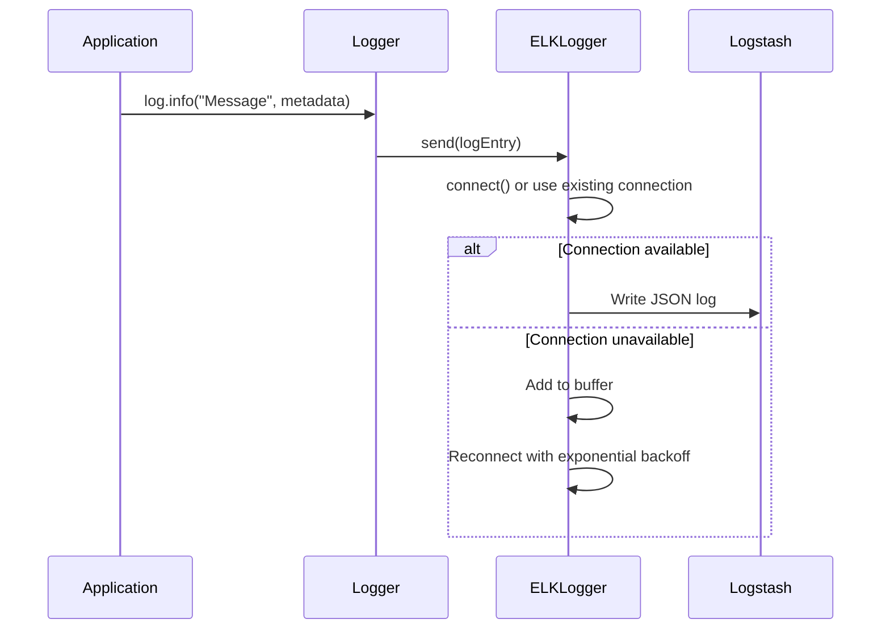

**Diagram sources**
- [src/server/elkLogger.ts](file://src/server/elkLogger.ts)

The ELK logger implements several reliability features:
- Connection pooling and reconnection with exponential backoff
- Message buffering when Logstash is unavailable
- Graceful shutdown handling
- Health monitoring

Logs are sent as JSON objects over TCP, with automatic reconnection attempts if the Logstash service becomes temporarily unavailable.

**Section sources**
- [src/core/logs/logger.ts](file://src/core/logs/logger.ts)
- [src/core/logs/levels.ts](file://src/core/logs/levels.ts)
- [src/core/logs/types.ts](file://src/core/logs/types.ts)
- [src/server/elkLogger.ts](file://src/server/elkLogger.ts)

## Health Checks and Performance Monitoring

SentinelIQ implements comprehensive health checks and performance monitoring to ensure service availability and identify performance bottlenecks.

### Health Check Endpoint

The system exposes a health check endpoint at `/health` that verifies the status of critical dependencies:

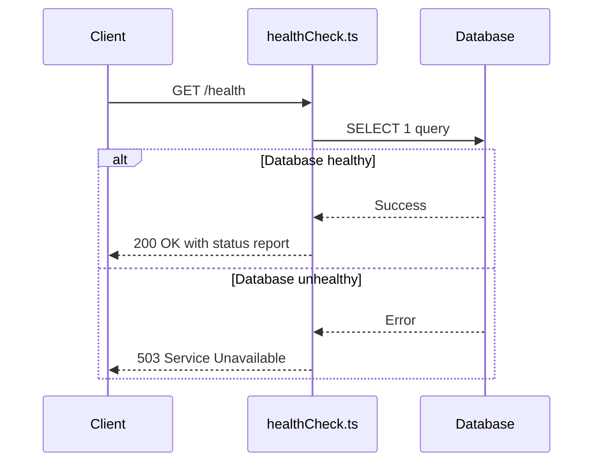

**Diagram sources**
- [src/server/healthCheck.ts](file://src/server/healthCheck.ts)

The health check response includes:
- **status**: "healthy" or "unhealthy"
- **timestamp**: Current time in ISO format
- **service**: Service name ("sentineliq-api")
- **version**: Application version
- **uptime**: Process uptime in seconds
- **responseTime**: Processing time in milliseconds
- **dependencies**: Status of dependent services (currently database)

The endpoint performs a simple database query to verify connectivity, making it suitable for load balancer health checks and monitoring systems.

### Performance Metrics

The logging system captures performance metrics through several mechanisms:

1. **Request Duration**: Operation durations are logged with the `duration` field when available
2. **Database Monitoring**: Slow query monitoring is implemented in `src/core/database/slowQueryMonitor.ts`
3. **System Logs**: Performance-related events are logged at appropriate levels

The ELK stack processes these metrics and makes them available for visualization in Kibana, allowing teams to monitor response times, identify slow operations, and track performance trends over time.

### Sentry Integration

For comprehensive error tracking and performance monitoring, SentinelIQ integrates with Sentry:

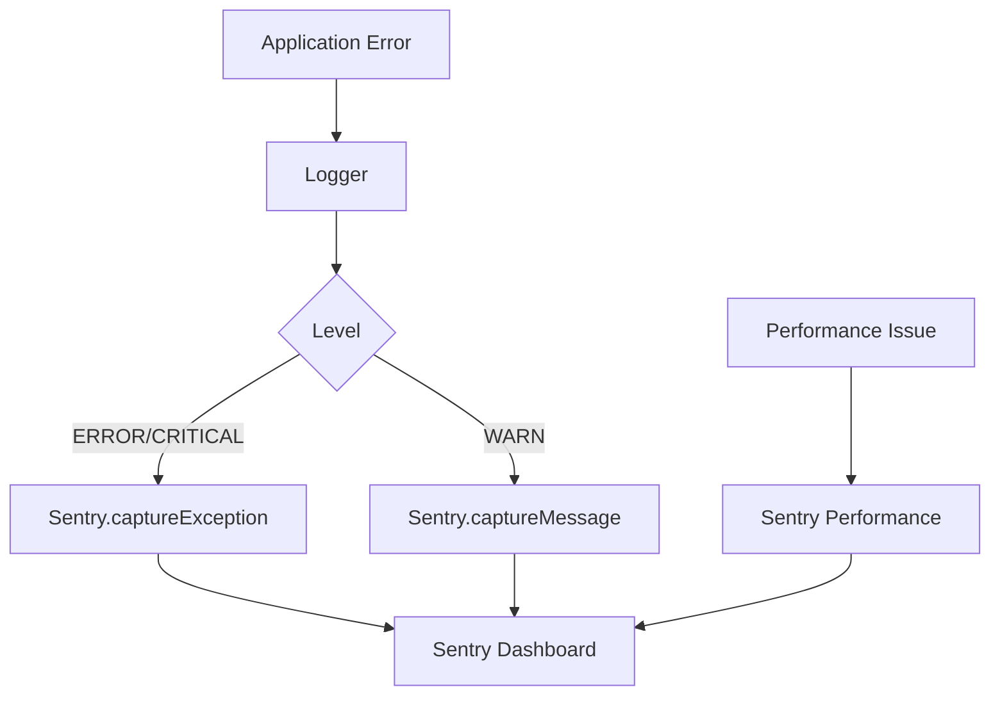

**Diagram sources**
- [src/server/sentry.ts](file://src/server/sentry.ts)

The integration captures:
- Unhandled exceptions and errors
- Performance traces for API endpoints
- User context (ID, email) for easier debugging
- Custom breadcrumbs and context

Sentry is configured with different sampling rates for development and production environments, capturing 100% of errors in development and 10% in production to balance insight with performance.

**Section sources**
- [src/server/healthCheck.ts](file://src/server/healthCheck.ts)
- [src/server/sentry.ts](file://src/server/sentry.ts)

## Alerting Mechanisms

SentinelIQ implements multiple alerting mechanisms to notify teams of critical issues and system events.

### Kibana Alerts

The system configures alerts in Kibana based on log patterns:

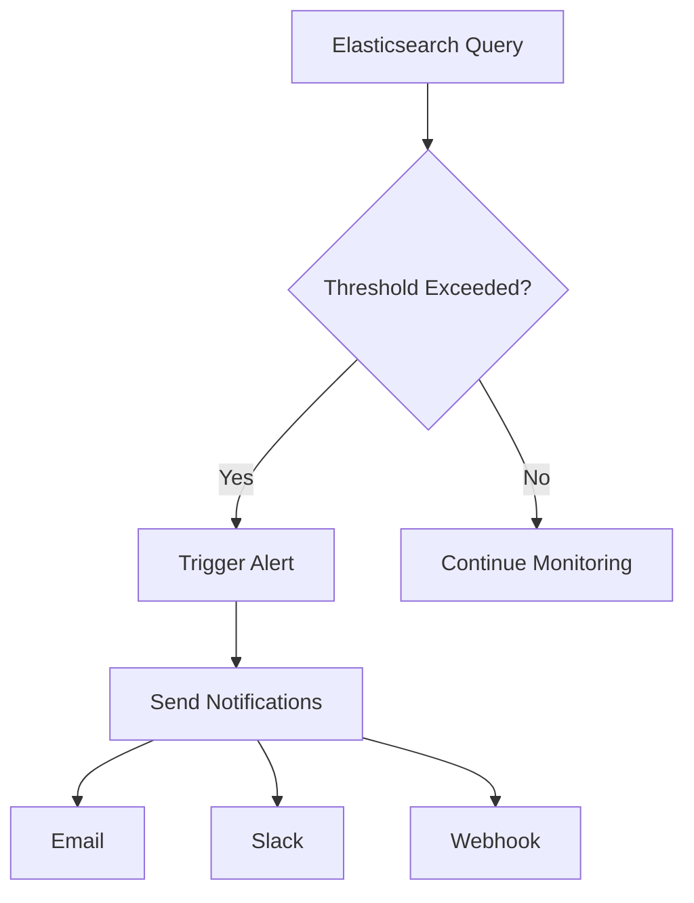

Two primary alert types are configured:
- **High Error Rate**: Triggers when more than 50 ERROR or CRITICAL logs occur in 5 minutes
- **Critical Error Detected**: Triggers immediately when any CRITICAL level log is detected

These alerts can be configured to send notifications via email, Slack, or webhooks to integrate with incident management systems.

### In-application Notifications

For security and operational events, the system implements in-application notifications:

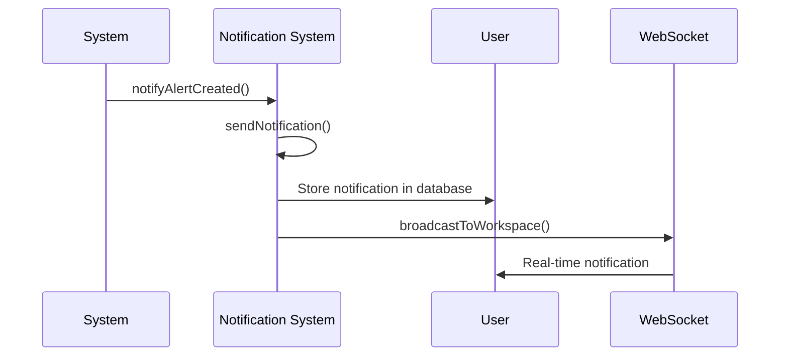

**Diagram sources**
- [src/core/modules/aegis/utils/notifications.ts](file://src/core/modules/aegis/utils/notifications.ts)

Key notification events include:
- Security alerts being created or assigned
- Incidents being created or resolved
- System errors requiring attention
- Workflow changes and assignments

Notifications are delivered through multiple channels:
- Database storage for persistence
- WebSocket broadcasting for real-time updates
- Email delivery for offline users
- External integrations (Slack, Teams, etc.)

### Alert Configuration

Alerts are defined in the application code with appropriate severity levels and notification logic. For example, when a security alert is created:

```typescript
export async function notifyAlertCreated(
  workspaceId: string,
  userId: string,
  alertData: {
    id: string;
    title: string;
    severity: string;
  }
): Promise<void> {
  await sendNotification({
    userId,
    workspaceId,
    type: alertData.severity === 'CRITICAL' ? 'CRITICAL' : 'WARNING',
    title: 'New Security Alert',
    message: `A new ${alertData.severity.toLowerCase()} alert has been created: ${alertData.title}`,
    link: `/modules/aegis/alerts/${alertData.id}`,
    eventType: 'alert_created',
    metadata: {
      alertId: alertData.id,
      severity: alertData.severity,
    },
  });
}
```

This ensures that critical events are immediately communicated to relevant team members.

**Section sources**
- [src/core/modules/aegis/utils/notifications.ts](file://src/core/modules/aegis/utils/notifications.ts)
- [src/core/modules/aegis/alerts/operations.ts](file://src/core/modules/aegis/alerts/operations.ts)

## Audit Logging

SentinelIQ implements comprehensive audit logging to track user actions, system changes, and security events for compliance and forensic analysis.

### Audit Log Structure

Audit logs capture detailed information about significant events in the system:

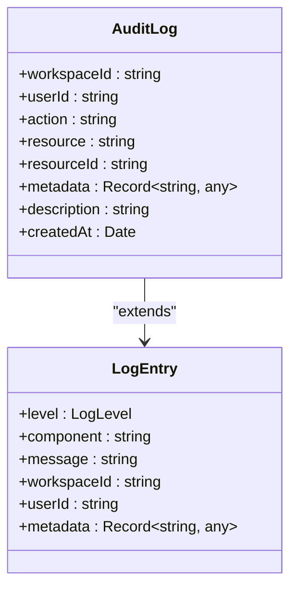

**Diagram sources**
- [src/core/modules/eclipse/utils/audit.ts](file://src/core/modules/eclipse/utils/audit.ts)

Key fields include:
- **action**: Type of action performed (e.g., "ECLIPSE_MONITOR_CREATED")
- **resource**: Type of resource affected (e.g., "eclipse_monitor")
- **resourceId**: Identifier of the specific resource
- **metadata**: Context-specific data about the change
- **description**: Human-readable description of the event

### Audit Event Types

The system logs various types of audit events across different modules:

**Eclipse Module:**
- Monitor creation, updates, and deletion
- Brand creation and configuration changes
- Detection events and alert generation

**Aegis Module:**
- Alert creation, assignment, and resolution
- Incident creation and management
- Case creation and evidence tracking

**Core System:**
- User authentication events
- Workspace creation and ownership changes
- Payment and subscription changes
- Security configuration updates

### Audit Implementation

Audit logging is implemented as utility functions that create audit log entries in the database:

```typescript
export const logMonitorCreated = async (context: any, monitor: BrandMonitor, brand: EclipseBrand) => {
  await context.entities.AuditLog.create({
    data: {
      workspaceId: monitor.workspaceId,
      userId: context.user.id,
      action: 'ECLIPSE_MONITOR_CREATED',
      resource: 'eclipse_monitor',
      resourceId: monitor.id,
      metadata: {
        brandName: brand.name,
        monitoringType: monitor.monitoringType,
        source: monitor.source,
        searchTerms: monitor.searchTerms,
      },
      description: `Monitor created for brand "${brand.name}"`,
    },
  });
};
```

These functions are called from business logic operations to ensure consistent audit trail creation. The logs are also captured by the general logging system and forwarded to the ELK stack for centralized analysis and alerting.

**Section sources**
- [src/core/modules/eclipse/utils/audit.ts](file://src/core/modules/eclipse/utils/audit.ts)

## Python Service Integration

The Python-based Sentinel Engine service integrates with the ELK stack for centralized logging, ensuring consistent monitoring across all application components.

### Python Logging Configuration

The engine uses the Loguru library for structured logging with both console and file output:

```python
# Remove default handler
logger.remove()

# Add console handler with colors
logger.add(
    sys.stdout,
    format="<green>{time:YYYY-MM-DD HH:mm:ss}</green> | <level>{level: <8}</level> | <cyan>{name}</cyan>:<cyan>{function}</cyan>:<cyan>{line}</cyan> - <level>{message}</level>",
    level=LOG_LEVEL,
    colorize=True
)

# Add file handler with rotation
if LOG_FILE:
    logger.add(
        LOG_FILE,
        format="{time:YYYY-MM-DD HH:mm:ss} | {level: <8} | {name}:{function}:{line} - {message}",
        level=LOG_LEVEL,
        rotation="10 MB",
        retention="7 days",
        compression="zip"
    )
```

### ELK Integration

The Python service is configured to send logs to the same ELK stack as the Node.js application:

```yaml
# Docker environment variables
ELK_ENABLED: "true"
LOGSTASH_HOST: logstash
LOGSTASH_PORT: 5000
```

This configuration ensures that logs from the Python engine are processed by the same Logstash pipeline, using the same filtering and enrichment rules as Node.js application logs.

### Service-Specific Logging

The engine logs key operational events:

- Service startup and configuration
- Redis connection status and queue statistics
- Individual task processing (monitor execution)
- Crawler operations and results
- Database updates and error conditions
- Resource cleanup during shutdown

These logs follow the same structured format as the Node.js application, enabling consistent querying and analysis across the entire system.

### Health Monitoring

The Python service includes health checks integrated with Docker:

```yaml
healthcheck:
  test: ["CMD", "python", "-c", "from utils.redis_client import RedisConsumer; exit(0 if RedisConsumer().health_check() else 1)"]
  interval: 30s
  timeout: 10s
  start_period: 40s
  retries: 3
```

This ensures the service is only considered healthy when it can successfully connect to Redis, providing accurate health status to the container orchestration system.

**Section sources**
- [services/engine/utils/logger.py](file://services/engine/utils/logger.py)
- [services/engine/main.py](file://services/engine/main.py)
- [docker-compose.yml](file://docker-compose.yml)

## Dashboard Creation

SentinelIQ provides guidance for creating effective Kibana dashboards to monitor system metrics, audit logs, and error tracking.

### Pre-configured Dashboard

The system automatically creates a "SentinelIQ Production Monitoring" dashboard with three key visualizations:

1. **Error Rate Over Time**: Line chart showing the trend of ERROR and CRITICAL logs
2. **Top Error Components**: Pie chart identifying the components generating the most errors
3. **Log Levels Distribution**: Histogram showing the distribution of all log levels

### Custom Dashboard Creation

To create additional dashboards for specific monitoring needs:

1. Navigate to **Dashboard** → **Create dashboard**
2. Add visualizations from the library or create new ones
3. Arrange and resize panels as needed
4. Save with an appropriate name and set refresh intervals

### Key Dashboard Types

**System Metrics Dashboard:**
- CPU and memory usage (if available)
- Request rates and response times
- Database query performance
- Queue lengths and processing rates
- Error rates and exception counts

**Audit Logs Dashboard:**
- User activity by workspace
- Security events over time
- Configuration changes
- Login attempts (successful and failed)
- Resource creation and deletion

**Error Tracking Dashboard:**
- Error frequency by type and component
- Stack trace analysis
- Error correlation with deployments
- Geographic distribution of errors
- User impact analysis

### Sample KQL Queries

The system supports Kibana Query Language (KQL) for advanced filtering:

```kql
# All errors in last 24 hours
level: ERROR AND @timestamp >= now-24h

# Critical errors with stack traces
level: CRITICAL AND error.stack: *

# Slow operations (> 1 second)
duration > 1000

# Specific user activity
userId: "user123"

# Payment-related logs
component: payment* OR message: *payment*

# Failed authentication attempts
component: auth AND level: ERROR
```

These queries can be used in dashboard filters, saved searches, and alert conditions to focus on specific aspects of system behavior.

**Section sources**
- [elk/README.md](file://elk/README.md)
- [elk/kibana/setup.sh](file://elk/kibana/setup.sh)