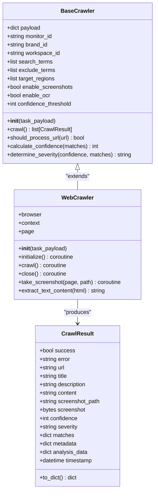
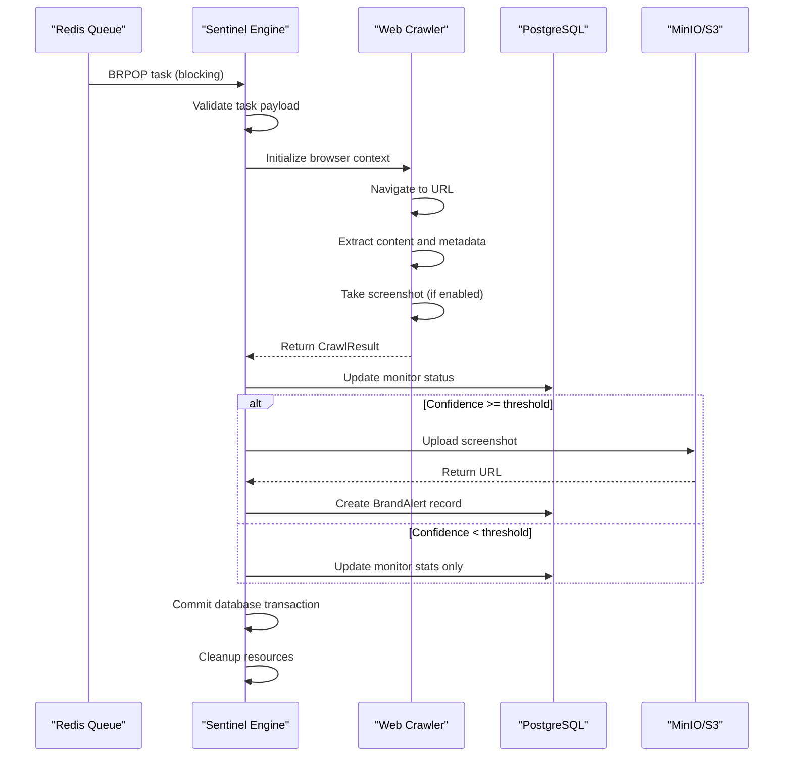
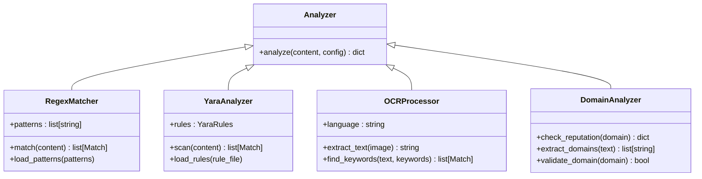

# Developer Guide

<cite>
**Referenced Files in This Document**   
- [README.md](file://README.md)
- [package.json](file://package.json)
- [vite.config.ts](file://vite.config.ts)
- [tsconfig.json](file://tsconfig.json)
- [tailwind.config.js](file://tailwind.config.js)
- [docker-compose.yml](file://docker-compose.yml)
- [services/engine/main.py](file://services/engine/main.py)
- [services/engine/requirements.txt](file://services/engine/requirements.txt)
- [services/engine/utils/logger.py](file://services/engine/utils/logger.py)
- [services/engine/utils/db_client.py](file://services/engine/utils/db_client.py)
- [services/engine/utils/redis_client.py](file://services/engine/utils/redis_client.py)
- [services/engine/utils/s3_client.py](file://services/engine/utils/s3_client.py)
- [services/engine/crawlers/base_crawler.py](file://services/engine/crawlers/base_crawler.py)
- [services/engine/crawlers/web_crawler.py](file://services/engine/crawlers/web_crawler.py)
- [services/engine/analyzers/regex_matcher.py](file://services/engine/analyzers/regex_matcher.py)
- [services/engine/analyzers/yara_analyzer.py](file://services/engine/analyzers/yara_analyzer.py)
- [services/engine/analyzers/ocr_processor.py](file://services/engine/analyzers/ocr_processor.py)
- [services/engine/analyzers/domain_analyzer.py](file://services/engine/analyzers/domain_analyzer.py)
- [services/engine/config.py](file://services/engine/config.py)
</cite>

## Table of Contents
1. [Introduction](#introduction)
2. [Development Environment Setup](#development-environment-setup)
3. [Coding Standards](#coding-standards)
4. [Testing Strategies](#testing-strategies)
5. [Contribution Workflow](#contribution-workflow)
6. [Testing Frameworks](#testing-frameworks)
7. [Linting and Formatting](#linting-and-formatting)
8. [Feature Development Guidelines](#feature-development-guidelines)
9. [Debugging and Performance Profiling](#debugging-and-performance-profiling)
10. [Extension Points](#extension-points)

## Introduction

This Developer Guide provides comprehensive documentation for developers contributing to the SentinelIQ codebase. The guide covers essential aspects of development including environment setup, coding standards, testing strategies, and contribution workflows. SentinelIQ is a sophisticated monitoring and threat detection platform built with modern technologies including TypeScript, Python, and various database technologies.

The codebase follows a modular architecture with distinct components for frontend (TypeScript/React), backend services (Python), and infrastructure (Docker, ELK stack). This guide will help developers understand the system architecture, coding conventions, and best practices for contributing to the project effectively.

## Development Environment Setup

To set up the development environment for SentinelIQ, follow these steps:

1. Ensure you have the required environment files `.env.client` and `.env.server` with correct development values in the project root directory.

2. Start the database service using the Wasp framework:
```bash
wasp start db
```

3. Launch the main application:
```bash
wasp start
```

4. For initial setup or after schema changes, run database migrations:
```bash
wasp db migrate-dev
```

The system relies on Docker for containerized services as defined in the docker-compose.yml file. The following services are configured:
- PostgreSQL (port 5432) for primary data storage
- Redis (port 6379) for queue management and caching
- Elasticsearch, Logstash, and Kibana (ELK stack) for logging and analytics
- MinIO (ports 9000/9001) for S3-compatible object storage
- RedisInsight (port 8001) for Redis GUI management
- PgAdmin (port 5050) for PostgreSQL GUI management

The Python-based Sentinel Engine service processes monitoring tasks from the Redis queue, performs web crawling, and stores results in the database with screenshots in MinIO storage.

**Section sources**
- [README.md](file://README.md#L9-L17)
- [docker-compose.yml](file://docker-compose.yml#L1-L236)

## Coding Standards

### TypeScript Standards

The frontend codebase follows strict TypeScript standards with the following configuration in tsconfig.json:
- Target: esnext
- Module: esnext
- Strict type checking enabled
- JSX preservation
- ES module resolution
- Support for ESNext features and DOM APIs

The codebase uses React with TypeScript, following modern React patterns including hooks and functional components. The project leverages ShadCN UI components for consistent, accessible UI elements with Tailwind CSS for styling.

### Python Standards

The Python services in the `services/engine` directory follow PEP 8 coding standards with the following key characteristics:
- Type hints for function parameters and return values
- Proper exception handling with logging
- Context managers for resource management
- Abstract Base Classes (ABC) for defining interfaces
- Comprehensive logging using loguru

Python code should maintain clear separation of concerns with distinct modules for:
- Crawlers (web_crawler.py, base_crawler.py)
- Analyzers (regex_matcher.py, yara_analyzer.py, ocr_processor.py, domain_analyzer.py)
- Utilities (logger.py, db_client.py, redis_client.py, s3_client.py)

### SQL Standards

Database interactions follow these standards:
- Use parameterized queries to prevent SQL injection
- Leverage SQLAlchemy ORM for Python database operations
- Follow consistent naming conventions (snake_case for columns, PascalCase for table names)
- Include proper indexing on frequently queried fields
- Use transactions for multi-statement operations

The migration system uses timestamp-prefixed SQL files in the migrations directory, with each migration containing forward and backward compatibility considerations.

**Section sources**
- [tsconfig.json](file://tsconfig.json#L1-L30)
- [tailwind.config.js](file://tailwind.config.js#L1-L293)
- [services/engine/main.py](file://services/engine/main.py#L1-L284)
- [services/engine/utils/logger.py](file://services/engine/utils/logger.py#L1-L40)
- [services/engine/utils/db_client.py](file://services/engine/utils/db_client.py#L1-L100)

## Testing Strategies

The SentinelIQ codebase employs a multi-layered testing strategy to ensure code quality and reliability.

### Unit Testing

Unit tests focus on individual components and functions in isolation. For Python services, unit tests should:
- Test individual methods of classes with various input scenarios
- Use mocking for external dependencies (database, Redis, S3)
- Validate error handling and edge cases
- Ensure proper logging output

The codebase includes test files for database and Redis connectivity:
- test_db.py - Database connection and operation tests
- test_redis.py - Redis queue operations and health checks

### Integration Testing

Integration tests verify the interaction between multiple components. Key integration points to test include:
- Redis queue processing by the Sentinel Engine
- Database operations for creating and updating monitoring records
- S3/MinIO file uploads and downloads
- End-to-end crawler execution from queue consumption to alert creation

Integration tests should use real services (or appropriate mocks) to validate the complete workflow.

### End-to-End Testing

End-to-end tests simulate real user scenarios and system workflows. These tests should:
- Validate the complete monitoring cycle from configuration to alert generation
- Test error recovery and graceful shutdown procedures
- Verify data consistency across services
- Check performance under expected load conditions

The system's main.py contains the core integration points between Redis, database, and crawling components that should be thoroughly tested.

**Section sources**
- [services/engine/main.py](file://services/engine/main.py#L1-L284)
- [services/engine/test_db.py](file://services/engine/test_db.py)
- [services/engine/test_redis.py](file://services/engine/test_redis.py)

## Contribution Workflow

The contribution workflow for SentinelIQ follows a standard Git-based process with the following steps:

1. **Branching Strategy**: Create feature branches from the main branch with descriptive names following the convention `feature/descriptive-name` or `fix/descriptive-name`.

2. **Code Implementation**: Implement the feature or fix following the coding standards outlined in this guide.

3. **Testing**: Write appropriate unit, integration, and end-to-end tests for the implemented functionality.

4. **Pull Request Creation**: Submit a pull request with a clear description of the changes, including:
   - Purpose of the change
   - Implementation details
   - Testing approach
   - Any migration requirements

5. **Code Review**: Participate in the code review process, addressing feedback and making necessary revisions.

6. **Merge and Deployment**: Once approved, merge the pull request following the team's deployment procedures.

The system uses a comprehensive set of dependencies managed through package.json for frontend and requirements.txt for Python services, ensuring consistent environments across development and production.

**Section sources**
- [package.json](file://package.json#L1-L117)
- [services/engine/requirements.txt](file://services/engine/requirements.txt#L1-L39)

## Testing Frameworks

### Vitest for Frontend Testing

The frontend testing framework is configured through vite.config.ts with Vitest as the primary testing solution. Key features include:
- Browser-based testing using Playwright
- Storybook integration for component testing
- Coverage reporting with v8
- Project-based test configuration

The configuration supports running tests in headless mode with Chromium, enabling comprehensive UI testing.

### PyTest for Backend Testing

The Python services should use PyTest as the testing framework with the following characteristics:
- Fixtures for setting up test dependencies
- Parameterized tests for multiple input scenarios
- Mocking capabilities for external services
- Coverage reporting

While not explicitly configured in the current files, the Python code structure with proper separation of concerns facilitates effective testing.

### Integration Testing Framework

The system's architecture supports integration testing through:
- Redis queue simulation for testing the main processing loop
- Database transaction rollback for test isolation
- Mock S3 client for testing file uploads without external dependencies
- HTTP server testing for API endpoints

The main.py file contains the primary integration points that should be tested to ensure the system components work together correctly.

**Section sources**
- [vite.config.ts](file://vite.config.ts#L1-L44)
- [package.json](file://package.json#L102-L104)
- [services/engine/main.py](file://services/engine/main.py#L1-L284)

## Linting and Formatting

The codebase uses Prettier for code formatting with the following configuration:
- Prettier version 3.1.1
- Tailwind CSS plugin for proper class sorting
- Configuration specified in package.json

Frontend code should follow the Prettier formatting rules with the Tailwind plugin to ensure consistent class ordering in JSX/TSX files.

For Python code, the project should adopt a consistent formatting standard such as Black or autopep8, though specific configuration files are not present in the current codebase. Python code should follow PEP 8 guidelines for:
- Line length (maximum 88 characters)
- Indentation (4 spaces)
- Naming conventions
- Import organization
- Docstring format

The presence of type hints in Python files indicates a preference for modern Python coding standards.

**Section sources**
- [package.json](file://package.json#L55-L57)
- [services/engine/main.py](file://services/engine/main.py#L1-L284)

## Feature Development Guidelines

### Adding New Features

When adding new features to the SentinelIQ codebase, follow these guidelines:

1. **Architecture Alignment**: Ensure the new feature aligns with the existing architecture and design patterns.

2. **Modular Design**: Implement features in a modular way, separating concerns appropriately between frontend, backend, and database layers.

3. **Backward Compatibility**: Maintain backward compatibility with existing APIs and data structures when possible.

4. **Configuration Management**: Use environment variables for configuration options, following the pattern established in config.py.

5. **Error Handling**: Implement comprehensive error handling with appropriate logging.

6. **Security Considerations**: Follow security best practices, especially for user input validation and authentication.

### Writing Maintainable Code

To ensure code maintainability:

1. **Documentation**: Provide clear docstrings for classes and methods, explaining purpose, parameters, and return values.

2. **Type Safety**: Use TypeScript and Python type hints extensively to catch errors early.

3. **Logging**: Implement structured logging with appropriate log levels (INFO, DEBUG, ERROR).

4. **Performance**: Consider performance implications, especially for database queries and external API calls.

5. **Testing**: Write comprehensive tests to ensure reliability and facilitate future refactoring.

The system's crawler architecture provides a good example of maintainable code with the BaseCrawler abstract class defining a clear interface and WebCrawler providing the concrete implementation.



**Diagram sources**
- [services/engine/crawlers/base_crawler.py](file://services/engine/crawlers/base_crawler.py#L1-L159)
- [services/engine/crawlers/web_crawler.py](file://services/engine/crawlers/web_crawler.py)

**Section sources**
- [services/engine/crawlers/base_crawler.py](file://services/engine/crawlers/base_crawler.py#L1-L159)
- [services/engine/crawlers/web_crawler.py](file://services/engine/crawlers/web_crawler.py)

## Debugging and Performance Profiling

### Debugging Techniques

Effective debugging in the SentinelIQ codebase involves:

1. **Logging**: The system uses loguru for comprehensive logging with colorized console output and optional file logging. Logs include timestamps, log levels, source file/line information, and structured data.

2. **Error Tracking**: Sentry is integrated for error tracking and monitoring, capturing exceptions and providing stack traces.

3. **Database Debugging**: Use the provided PgAdmin service (port 5050) for database inspection and query analysis.

4. **Redis Monitoring**: Use RedisInsight (port 8001) to monitor queue lengths, inspect task payloads, and analyze Redis performance.

5. **ELK Stack**: Utilize Kibana (port 5601) for log analysis and visualization of system behavior.

### Performance Profiling

For performance optimization:

1. **Database Performance**: Monitor slow queries using the database.slowQueryMonitor module and optimize with appropriate indexing.

2. **Crawler Performance**: The system limits concurrent crawls (configurable via SENTINEL_MAX_CONCURRENT_CRAWLS) to prevent resource exhaustion.

3. **Memory Management**: The crawler implementation includes proper resource cleanup with async context managers.

4. **Queue Processing**: Monitor Redis queue length and processing rates to identify bottlenecks.

5. **S3 Operations**: Optimize file uploads by batching operations and using appropriate chunk sizes.

The main.py file includes comprehensive error handling and resource management to ensure stable operation under various conditions.



**Diagram sources**
- [services/engine/main.py](file://services/engine/main.py#L1-L284)
- [services/engine/utils/db_client.py](file://services/engine/utils/db_client.py#L1-L100)
- [services/engine/utils/s3_client.py](file://services/engine/utils/s3_client.py#L1-L160)

**Section sources**
- [services/engine/main.py](file://services/engine/main.py#L1-L284)
- [services/engine/utils/logger.py](file://services/engine/utils/logger.py#L1-L40)
- [docker-compose.yml](file://docker-compose.yml#L1-L236)

## Extension Points

The SentinelIQ codebase provides several extension points for adding new functionality:

### Analyzer Extensions

The system supports multiple analysis techniques that can be extended:
- **Regex Matching**: The regex_matcher.py module can be enhanced with more sophisticated pattern matching.
- **YARA Analysis**: The yara_analyzer.py module allows for custom YARA rule sets.
- **OCR Processing**: The ocr_processor.py module can be extended with additional language support.
- **Domain Analysis**: The domain_analyzer.py module can incorporate new domain reputation sources.



**Diagram sources**
- [services/engine/analyzers/regex_matcher.py](file://services/engine/analyzers/regex_matcher.py)
- [services/engine/analyzers/yara_analyzer.py](file://services/engine/analyzers/yara_analyzer.py)
- [services/engine/analyzers/ocr_processor.py](file://services/engine/analyzers/ocr_processor.py)
- [services/engine/analyzers/domain_analyzer.py](file://services/engine/analyzers/domain_analyzer.py)

### Crawler Extensions

The crawler architecture supports various extension points:
- **New Crawler Types**: Implement new crawler classes that extend BaseCrawler for different data sources.
- **Custom Processing**: Override methods in WebCrawler for specialized content extraction.
- **Additional Data Sources**: Integrate with new data sources by implementing appropriate crawling logic.

### Integration Extensions

The system can be extended with new integrations:
- **Notification Providers**: Add new notification channels by implementing the base provider interface.
- **Authentication Methods**: Extend authentication capabilities with additional identity providers.
- **Data Export Formats**: Support new export formats for reports and alerts.

These extension points follow the open/closed principle, allowing new functionality to be added without modifying existing code.

**Section sources**
- [services/engine/analyzers/regex_matcher.py](file://services/engine/analyzers/regex_matcher.py)
- [services/engine/analyzers/yara_analyzer.py](file://services/engine/analyzers/yara_analyzer.py)
- [services/engine/analyzers/ocr_processor.py](file://services/engine/analyzers/ocr_processor.py)
- [services/engine/analyzers/domain_analyzer.py](file://services/engine/analyzers/domain_analyzer.py)
- [services/engine/crawlers/base_crawler.py](file://services/engine/crawlers/base_crawler.py#L1-L159)