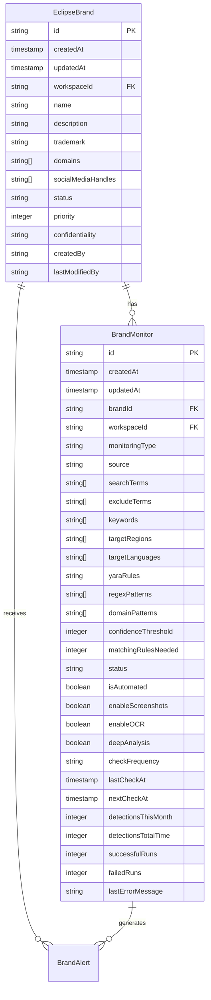
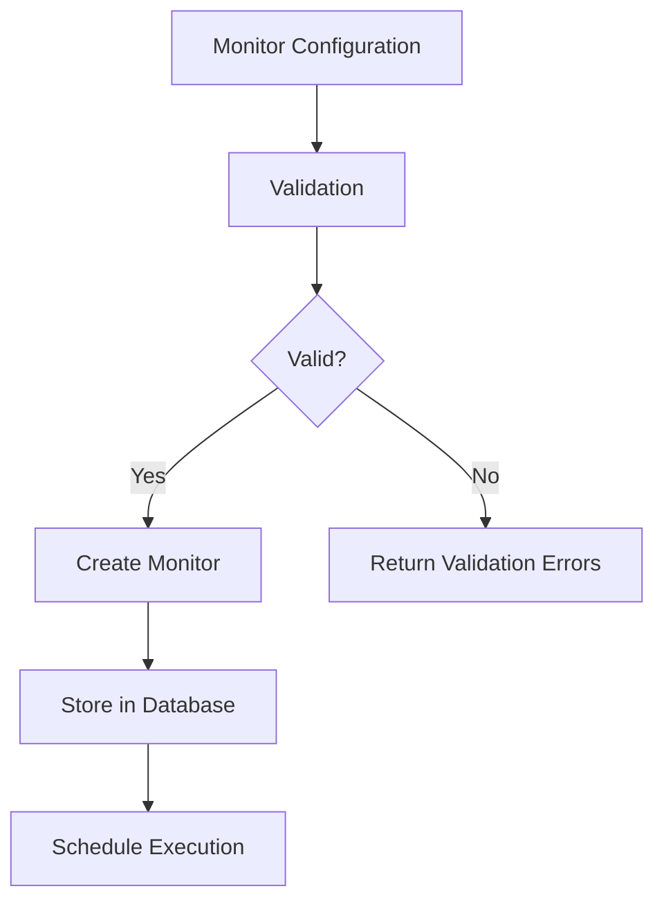
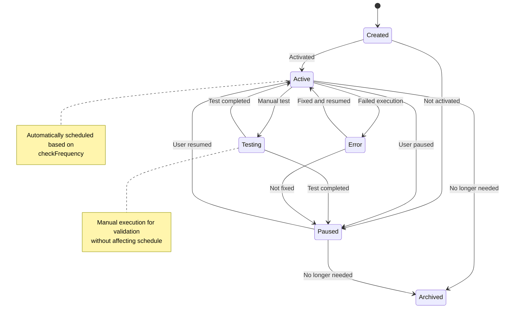
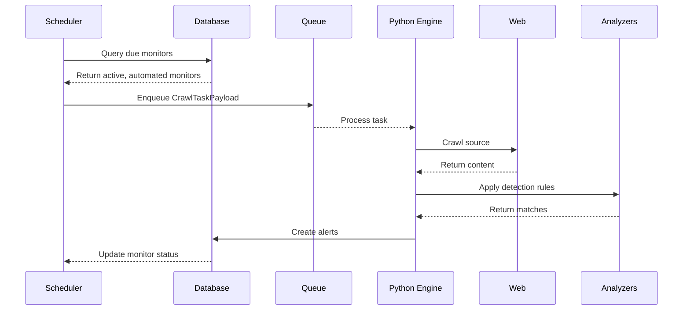
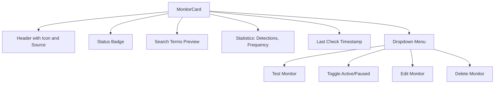
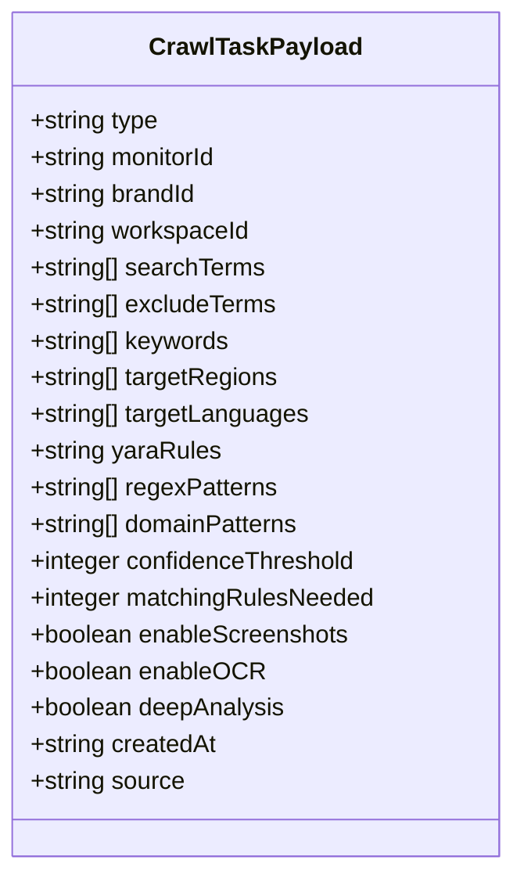
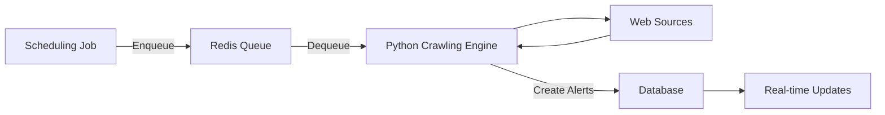

# Brand Monitoring

<cite>
**Referenced Files in This Document**   
- [types.ts](file://src/core/modules/eclipse/types.ts)
- [validation.ts](file://src/core/modules/eclipse/validation.ts)
- [operations.ts](file://src/core/modules/eclipse/operations.ts)
- [scheduler.ts](file://src/core/modules/eclipse/jobs/scheduler.ts)
- [producer.ts](file://src/core/modules/eclipse/queue/producer.ts)
- [migration.sql](file://migrations/20251120025530_add_eclipse_complete/migration.sql)
- [MonitorCard.tsx](file://src/client/pages/modules/eclipse/components/MonitorCard.tsx)
- [MonitorsTable.tsx](file://src/client/pages/modules/eclipse/components/MonitorsTable.tsx)
- [CreateMonitorDialog.tsx](file://src/client/pages/modules/eclipse/components/CreateMonitorDialog.tsx)
</cite>

## Table of Contents
1. [Introduction](#introduction)
2. [Data Model](#data-model)
3. [Monitor Configuration](#monitor-configuration)
4. [Monitoring Lifecycle](#monitoring-lifecycle)
5. [UI Components](#ui-components)
6. [Engine Integration](#engine-integration)
7. [Best Practices](#best-practices)

## Introduction
The Brand Monitoring feature within the Eclipse module enables organizations to protect their digital assets by continuously scanning various online sources for potential brand infringements. This system allows users to configure monitors that detect unauthorized usage of their brands across domains, social media, marketplaces, and web content. The monitoring system supports advanced detection techniques including regex pattern matching and YARA rules, with configurable parameters for regions, languages, and detection sensitivity.

## Data Model

The Brand Monitoring system is built around two core entities: `EclipseBrand` and `BrandMonitor`, with a one-to-many relationship between them. Each brand can have multiple monitors configured to detect different types of infringements across various sources.

**Diagram sources**
- [migration.sql](file://migrations/20251120025530_add_eclipse_complete/migration.sql#L23-L77)

**Section sources**
- [types.ts](file://src/core/modules/eclipse/types.ts#L16-L25)
- [migration.sql](file://migrations/20251120025530_add_eclipse_complete/migration.sql#L23-L77)

## Monitor Configuration

Users configure brand monitors through the `CreateMonitorInput` interface, which defines all parameters for detection. The configuration includes search terms, geographic targeting, detection rules, and execution settings.

### Configuration Parameters

| Parameter | Type | Description | Default Value |
|---------|------|-------------|---------------|
| **workspaceId** | string | ID of the workspace owning the monitor | Required |
| **brandId** | string | ID of the EclipseBrand being monitored | Required |
| **monitoringType** | enum | Type of monitoring: domain, social, marketplace, web, dns | Required |
| **source** | string | Specific source/platform to monitor | Required |
| **searchTerms** | string[] | Primary terms to search for | At least one required |
| **excludeTerms** | string[] | Terms that exclude a match when present | [] |
| **keywords** | string[] | Additional keywords to increase confidence | [] |
| **targetRegions** | string[] | Geographic regions to target | [] |
| **targetLanguages** | string[] | Languages to monitor | ['pt', 'es', 'en'] |
| **yaraRules** | string | YARA rule for complex pattern matching | Optional |
| **regexPatterns** | string[] | Regular expressions for pattern detection | [] |
| **confidenceThreshold** | integer | Minimum confidence score (0-100) to trigger alert | 70 |
| **checkFrequency** | enum | How often to run: hourly, daily, weekly, monthly | 'daily' |
| **isAutomated** | boolean | Whether the monitor runs automatically | true |
| **enableScreenshots** | boolean | Whether to capture screenshots of matches | true |
| **enableOCR** | boolean | Whether to perform OCR on images | false |
| **deepAnalysis** | boolean | Whether to perform in-depth analysis | false |

**Section sources**
- [types.ts](file://src/core/modules/eclipse/types.ts#L232-L251)
- [validation.ts](file://src/core/modules/eclipse/validation.ts#L31-L50)

### Detection Rules

The system supports multiple detection rule types that can be combined for comprehensive monitoring:

- **Search Terms**: Basic keyword matching for brand names, product names, or specific phrases
- **Regex Patterns**: Regular expressions for matching complex patterns like license keys or serial numbers
- **YARA Rules**: Advanced pattern matching for binary content, documents, or complex text patterns
- **Domain Patterns**: Wildcard patterns for detecting domain squatting (e.g., *brandname*.com)

These rules are validated through the `createMonitorSchema` which ensures all configuration parameters meet the required criteria before monitor creation.

**Section sources**
- [validation.ts](file://src/core/modules/eclipse/validation.ts#L31-L50)
- [operations.ts](file://src/core/modules/eclipse/operations.ts#L427-L464)

## Monitoring Lifecycle

The monitoring system follows a defined lifecycle from creation through execution and maintenance. Monitors transition through various states based on their configuration and execution results.

### Lifecycle States

**Diagram sources**
- [operations.ts](file://src/core/modules/eclipse/operations.ts#L497-L577)
- [scheduler.ts](file://src/core/modules/eclipse/jobs/scheduler.ts#L8-L81)

### Scheduling and Execution

The monitoring scheduler runs every 6 hours to identify monitors that need execution. Monitors are selected based on their status, automation setting, and next check time.

**Diagram sources**
- [scheduler.ts](file://src/core/modules/eclipse/jobs/scheduler.ts#L8-L81)
- [producer.ts](file://src/core/modules/eclipse/queue/producer.ts#L10-L53)

The scheduling algorithm considers:
- Monitors with `status: 'active'`
- Monitors with `isAutomated: true`
- Monitors where `nextCheckAt` is in the past (or null for first execution)

After successful scheduling, the `nextCheckAt` timestamp is updated based on the `checkFrequency` setting (hourly, daily, weekly, or monthly).

**Section sources**
- [scheduler.ts](file://src/core/modules/eclipse/jobs/scheduler.ts#L8-L81)
- [operations.ts](file://src/core/modules/eclipse/operations.ts#L427-L464)

## UI Components

The user interface for Brand Monitoring consists of several components that enable users to manage their monitors effectively.

### MonitorCard Component

The `MonitorCard` provides a visual representation of a single monitor with key information and action controls.

The component displays the monitor's source, type, status, recent detection statistics, and frequency. The dropdown menu provides access to all management actions, with visual feedback for the current status (active, paused, testing).

**Section sources**
- [MonitorCard.tsx](file://src/client/pages/modules/eclipse/components/MonitorCard.tsx#L1-L175)

### MonitorsTable Component

The `MonitorsTable` component displays a list of monitors with sortable columns and bulk actions.

| Column | Description |
|--------|-------------|
| **Selection** | Checkbox for bulk operations |
| **Monitor** | Name/domain and description |
| **Brand** | Associated EclipseBrand |
| **Status** | Active/inactive indicator |
| **Type** | Monitoring type (web, social, etc.) |
| **Alerts** | Count of generated alerts |
| **Last Verification** | Timestamp of most recent check |

The table supports:
- Bulk selection of monitors
- Sorting by any column
- Inline status indicators
- Context menu with all management actions
- Responsive design for different screen sizes

**Section sources**
- [MonitorsTable.tsx](file://src/client/pages/modules/eclipse/components/MonitorsTable.tsx#L1-L191)

## Engine Integration

The Brand Monitoring system integrates with a Python-based crawling engine through a message queue system, enabling asynchronous processing of monitoring tasks.

### Crawl Task Payload

When a monitor is scheduled for execution, a `CrawlTaskPayload` is created and sent to the Redis queue for processing by the Python engine.

**Diagram sources**
- [types.ts](file://src/core/modules/eclipse/types.ts#L355-L375)
- [producer.ts](file://src/core/modules/eclipse/queue/producer.ts#L11-L43)

The payload contains all necessary information for the engine to perform the monitoring task, including:
- Target identification (monitor, brand, workspace)
- Search parameters (terms, regions, languages)
- Detection rules (regex, YARA, domain patterns)
- Execution options (screenshots, OCR, deep analysis)
- Quality thresholds (confidence, matching rules needed)

### Queue Processing

The integration uses Redis as a message broker to decouple the monitoring scheduler from the crawling engine.

The `enqueueMonitoringTask` function serializes the monitor configuration into a JSON payload and adds it to the Redis queue. The Python engine continuously polls the queue for new tasks to process.

**Section sources**
- [producer.ts](file://src/core/modules/eclipse/queue/producer.ts#L10-L53)
- [scheduler.ts](file://src/core/modules/eclipse/jobs/scheduler.ts#L40-L45)

## Best Practices

To optimize monitor configurations and minimize false positives, follow these best practices:

### Configuration Optimization

1. **Start with Specific Search Terms**: Begin with exact brand names and product names before expanding to variations
2. **Use Exclusion Terms**: Add common false positive terms to the exclude list (e.g., "fan", "review", "tutorial")
3. **Set Appropriate Confidence Thresholds**: Adjust based on tolerance for false positives vs. missed detections
4. **Target Relevant Regions**: Focus on geographic areas where infringement is most likely
5. **Combine Detection Methods**: Use both regex and YARA rules for complex patterns

### False Positive Reduction

- **Implement Negative Keywords**: Use the `excludeTerms` field to filter out legitimate uses
- **Leverage Contextual Analysis**: Combine multiple detection rules that must be satisfied
- **Adjust Confidence Thresholds**: Higher thresholds reduce false positives but may miss subtle infringements
- **Regular Review**: Periodically analyze false positives to refine detection rules

### Performance Considerations

- **Balance Frequency and Resources**: More frequent checks consume more resources
- **Limit Scope**: Focus monitors on high-risk sources rather than broad scanning
- **Use Automation Wisely**: Automated monitors should be well-tested before enabling
- **Monitor Performance Metrics**: Track successful vs. failed runs to identify problematic monitors

**Section sources**
- [validation.ts](file://src/core/modules/eclipse/validation.ts#L31-L50)
- [types.ts](file://src/core/modules/eclipse/types.ts#L232-L251)
- [operations.ts](file://src/core/modules/eclipse/operations.ts#L427-L464)