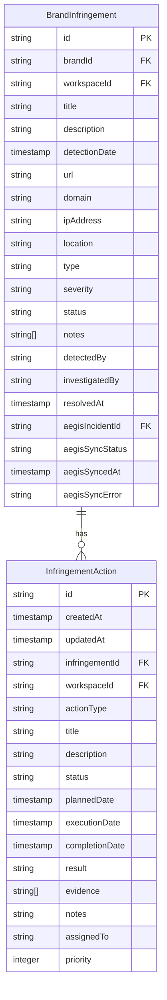
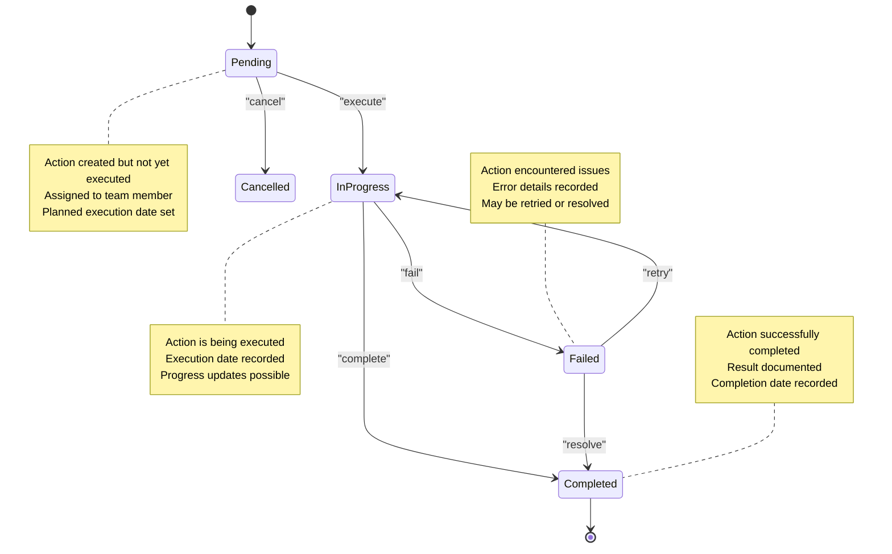
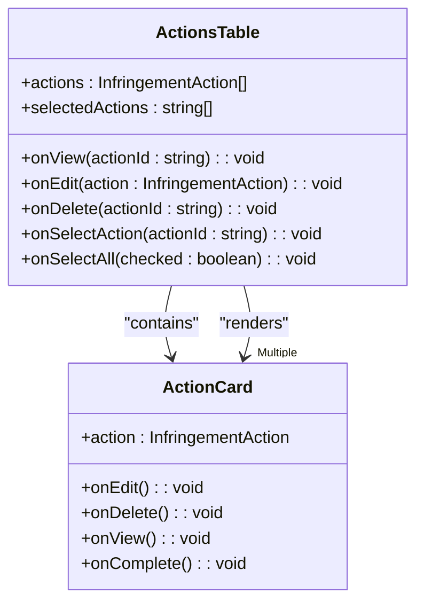
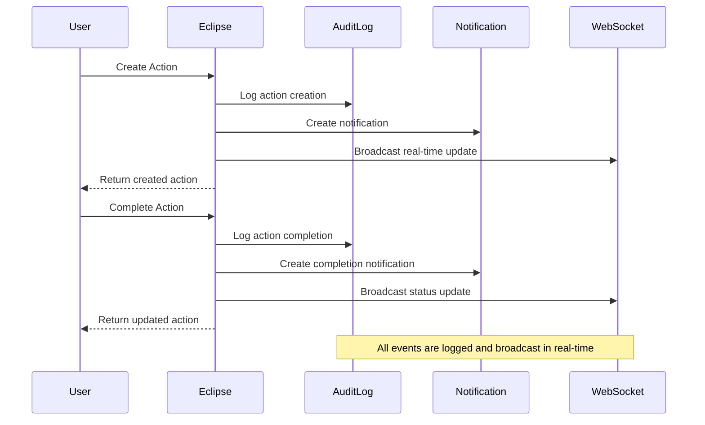
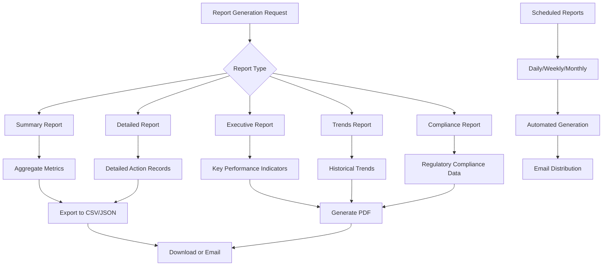
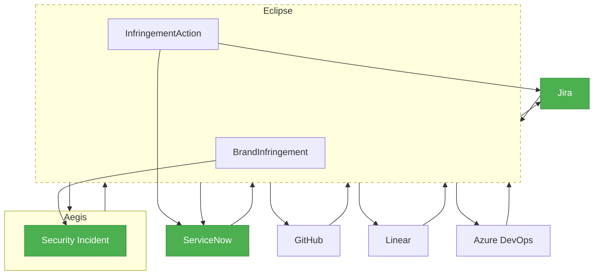

# Compliance Tracking

<cite>
**Referenced Files in This Document**   
- [ActionCard.tsx](file://src/client/pages/modules/eclipse/components/ActionCard.tsx)
- [ActionsTable.tsx](file://src/client/pages/modules/eclipse/components/ActionsTable.tsx)
- [ActionsPage.tsx](file://src/client/pages/modules/eclipse/actions/ActionsPage.tsx)
- [ActionDetailsPage.tsx](file://src/client/pages/modules/eclipse/actions/ActionDetailsPage.tsx)
- [types.ts](file://src/core/modules/eclipse/types.ts)
- [operations.ts](file://src/core/modules/eclipse/operations.ts)
- [validation.ts](file://src/core/modules/eclipse/validation.ts)
- [audit.ts](file://src/core/modules/eclipse/utils/audit.ts)
- [notifications.ts](file://src/core/modules/eclipse/utils/notifications.ts)
- [eventBus.ts](file://src/core/modules/eclipse/eventBus.ts)
- [aegis.ts](file://src/core/modules/eclipse/integrations/aegis.ts)
- [export.ts](file://src/core/modules/eclipse/export.ts)
- [migration.sql](file://migrations/20251118015752_add_eclipse_module/migration.sql)
- [migration.sql](file://migrations/20251120025530_add_eclipse_complete/migration.sql)
</cite>

## Table of Contents
1. [Introduction](#introduction)
2. [InfringementAction Data Model](#infringementaction-data-model)
3. [Action Lifecycle Management](#action-lifecycle-management)
4. [UI Components for Action Management](#ui-components-for-action-management)
5. [Audit Logging and Notifications](#audit-logging-and-notifications)
6. [Compliance Reporting](#compliance-reporting)
7. [External System Integration](#external-system-integration)
8. [Conclusion](#conclusion)

## Introduction
The Compliance Tracking functionality in the Eclipse module enables users to systematically manage enforcement actions against detected brand infringements. This system provides a structured workflow for handling takedown requests, legal actions, and other enforcement measures through a comprehensive tracking mechanism. The module integrates with the audit logging system and notification providers to ensure complete traceability and timely updates throughout the action lifecycle. Users can track actions from creation through completion, with full integration into external ticketing systems and compliance reporting requirements.

**Section sources**
- [ActionsPage.tsx](file://src/client/pages/modules/eclipse/actions/ActionsPage.tsx#L27-L297)
- [ActionDetailsPage.tsx](file://src/client/pages/modules/eclipse/actions/ActionDetailsPage.tsx#L1-L300)

## InfringementAction Data Model

The InfringementAction data model serves as the foundation for tracking enforcement actions against detected brand infringements. Each action is linked to a specific BrandInfringement and contains comprehensive metadata about the enforcement process.

**Diagram sources**
- [migration.sql](file://migrations/20251120025530_add_eclipse_complete/migration.sql#L129-L149)
- [migration.sql](file://migrations/20251120025530_add_eclipse_complete/migration.sql#L100-L126)

The InfringementAction entity contains the following key fields:

- **actionType**: Enumerated field specifying the type of enforcement action, including DMCA notices, cease and desist letters, platform reports, legal actions, and monitoring activities
- **status**: Tracks the current state of the action with values including pending, in_progress, completed, and failed
- **priority**: Integer value (1-5) indicating the urgency of the action
- **assignedTo**: Reference to the user responsible for executing the action
- **plannedDate**: Scheduled date for action execution
- **executionDate**: Actual date when the action was executed
- **completionDate**: Date when the action was marked as completed
- **result**: Text field documenting the outcome of the enforcement action

The data model establishes a one-to-many relationship between BrandInfringement and InfringementAction, allowing multiple enforcement actions to be associated with a single infringement case. This structure supports complex enforcement strategies where multiple actions may be required to resolve a single infringement.

**Section sources**
- [types.ts](file://src/core/modules/eclipse/types.ts#L130-L149)
- [validation.ts](file://src/core/modules/eclipse/validation.ts#L116-L134)
- [migration.sql](file://migrations/20251120025530_add_eclipse_complete/migration.sql#L129-L149)

## Action Lifecycle Management

The action lifecycle management system in Eclipse provides a comprehensive workflow for tracking enforcement actions from creation to completion. The process begins when a user creates a new action through the UI or programmatically via the API.

**Diagram sources**
- [operations.ts](file://src/core/modules/eclipse/operations.ts#L1148-L1200)
- [validation.ts](file://src/core/modules/eclipse/validation.ts#L127-L134)

The lifecycle begins with the creation of an action through the `createEclipseAction` operation, which validates input data against the `createActionSchema` and establishes the initial "pending" status. When an action is ready for execution, users can update its status to "in_progress" and record the execution date. Upon successful completion, the action is marked as "completed" with the result documented in the result field.

The system supports various status transitions through dedicated operations:
- **Pending to In Progress**: When execution begins
- **In Progress to Completed**: When the action is successfully executed
- **In Progress to Failed**: When execution encounters issues
- **Pending to Cancelled**: When an action is no longer required

Each status transition triggers appropriate audit logging and notifications to ensure complete traceability and team awareness. The system also supports updating action details such as notes, evidence, and priority throughout the lifecycle.

**Section sources**
- [operations.ts](file://src/core/modules/eclipse/operations.ts#L1148-L1200)
- [validation.ts](file://src/core/modules/eclipse/validation.ts#L127-L134)
- [audit.ts](file://src/core/modules/eclipse/utils/audit.ts#L169-L202)

## UI Components for Action Management

The Eclipse module provides two primary UI components for managing enforcement actions: ActionsTable and ActionCard. These components offer different views of the same data, allowing users to choose the most appropriate interface for their workflow.

**Diagram sources**
- [ActionsTable.tsx](file://src/client/pages/modules/eclipse/components/ActionsTable.tsx#L31-L246)
- [ActionCard.tsx](file://src/client/pages/modules/eclipse/components/ActionCard.tsx#L14-L215)

### ActionsTable Component

The ActionsTable component provides a tabular view of enforcement actions, optimized for bulk operations and detailed filtering. It displays key information including action type, priority, status, associated infringement, assigned team member, and creation date.

Key features of the ActionsTable include:
- **Bulk selection**: Checkbox-based selection for applying actions to multiple items
- **Status filtering**: Visual badges with color coding for different status values
- **Type categorization**: Distinct visual indicators for different action types
- **Priority indication**: Color-coded badges reflecting action priority
- **Context menu**: Dropdown menu with edit, view, and delete options

The table supports sorting by various columns and provides pagination for handling large datasets. It also includes a responsive design that adapts to different screen sizes.

### ActionCard Component

The ActionCard component presents enforcement actions in a card-based layout, ideal for detailed inspection and individual action management. Each card provides a comprehensive overview of the action with visual indicators for status and priority.

Key features of the ActionCard include:
- **Status visualization**: Left border color and status icon indicating current state
- **Priority indication**: Color-coded priority badge
- **Date information**: Planned, executed, and completion dates
- **Assignment details**: Team member assignment information
- **Action results**: Outcome documentation for completed actions
- **Context menu**: Dropdown with edit, complete, and delete options

The card layout is used in grid views and detail pages, providing a rich, information-dense representation of each action. The component is designed to be interactive, with click handlers for viewing details and updating action status.

Both components are used throughout the Eclipse interface, with the ActionsPage allowing users to toggle between table and grid views based on their preferences and workflow requirements.

**Section sources**
- [ActionsTable.tsx](file://src/client/pages/modules/eclipse/components/ActionsTable.tsx#L31-L246)
- [ActionCard.tsx](file://src/client/pages/modules/eclipse/components/ActionCard.tsx#L14-L215)
- [ActionsPage.tsx](file://src/client/pages/modules/eclipse/actions/ActionsPage.tsx#L27-L297)

## Audit Logging and Notifications

The Compliance Tracking system integrates with the audit logging and notification systems to provide complete traceability and real-time updates for enforcement actions. Every significant action in the lifecycle generates appropriate audit records and notifications.

**Diagram sources**
- [audit.ts](file://src/core/modules/eclipse/utils/audit.ts#L169-L202)
- [notifications.ts](file://src/core/modules/eclipse/utils/notifications.ts#L104-L128)
- [eventBus.ts](file://src/core/modules/eclipse/eventBus.ts#L285-L306)

### Audit Logging

The system creates audit log entries for key events in the action lifecycle:
- **Action Creation**: Logged with ECLIPSE_ACTION_CREATED action type, capturing the action details and associated infringement
- **Action Completion**: Logged with ECLIPSE_ACTION_COMPLETED action type, documenting the result and completion date
- **Status Changes**: All status transitions are recorded with appropriate metadata

Each audit log entry includes:
- **Workspace context**: The workspace where the action occurred
- **User information**: The user who performed the action
- **Resource reference**: The action ID and associated infringement
- **Metadata**: Key details about the action including type, priority, and result
- **Timestamp**: Precise timing of the event

The audit logs provide a complete trail of enforcement activities, supporting compliance requirements and operational review.

### Notifications

The system generates notifications for important action events:
- **Action Assignment**: Notifies the assigned team member when an action is assigned to them
- **Action Creation**: Informs relevant stakeholders when a new enforcement action is created
- **Action Completion**: Notifies the team when an action is successfully completed

Notifications are delivered through multiple channels:
- **In-app notifications**: Displayed in the user interface
- **WebSocket updates**: Real-time updates for immediate UI refresh
- **Email alerts**: For critical actions or when users are offline
- **External integrations**: Forwarded to connected ticketing systems

The notification system uses the event bus pattern to decouple event generation from delivery, ensuring reliable message delivery even during system maintenance or outages.

**Section sources**
- [audit.ts](file://src/core/modules/eclipse/utils/audit.ts#L169-L202)
- [notifications.ts](file://src/core/modules/eclipse/utils/notifications.ts#L104-L128)
- [eventBus.ts](file://src/core/modules/eclipse/eventBus.ts#L285-L328)

## Compliance Reporting

The Eclipse module provides comprehensive compliance reporting capabilities to meet regulatory and organizational requirements. The reporting system supports both ad-hoc and scheduled report generation in multiple formats.

**Diagram sources**
- [export.ts](file://src/core/modules/eclipse/export.ts#L256-L409)
- [types.ts](file://src/core/modules/eclipse/types.ts#L26-L33)
- [migration.sql](file://migrations/20251118015752_add_eclipse_module/migration.sql#L26-L29)

The reporting system supports the following report types:
- **Summary Reports**: High-level overview of enforcement activities
- **Detailed Reports**: Comprehensive listing of all actions with complete details
- **Executive Reports**: Strategic insights and key performance indicators
- **Trends Reports**: Historical analysis of infringement patterns and enforcement effectiveness
- **Compliance Reports**: Documentation meeting regulatory requirements

Reports can be exported in multiple formats:
- **CSV**: For import into spreadsheet applications and data analysis tools
- **JSON**: For programmatic processing and integration with other systems
- **PDF**: For formal documentation and archival purposes

The system also supports scheduled reporting, allowing organizations to automatically generate and distribute compliance reports on a regular basis. Scheduled reports can be configured for daily, weekly, or monthly delivery to specified recipients.

The export functionality includes specialized methods for different data types:
- `exportActionsToCSV()`: Converts action records to CSV format
- `exportToJSON()`: Serializes data to JSON format
- `generateReportHTML()`: Creates formatted HTML for PDF conversion

These capabilities ensure that organizations can meet their compliance reporting requirements with minimal manual effort.

**Section sources**
- [export.ts](file://src/core/modules/eclipse/export.ts#L1-L409)
- [types.ts](file://src/core/modules/eclipse/types.ts#L26-L33)
- [migration.sql](file://migrations/20251118015752_add_eclipse_module/migration.sql#L26-L29)

## External System Integration

The Compliance Tracking system integrates with external systems to extend its capabilities and streamline enforcement workflows. The primary integration is with the Aegis security incident management module, but the architecture supports connections to various external ticketing systems.

**Diagram sources**
- [aegis.ts](file://src/core/modules/eclipse/integrations/aegis.ts#L1-L251)
- [types.ts](file://src/core/modules/eclipse/types.ts#L114-L125)
- [migration.sql](file://migrations/20251120025530_add_eclipse_complete/migration.sql#L100-L126)

### Aegis Integration

The integration with the Aegis security incident management module enables automatic escalation of high-severity infringements to formal security incidents. This integration is governed by the `shouldCreateAegisIncident()` function, which determines eligibility based on:
- **Severity**: Only critical or high-severity infringements are eligible
- **Type**: Counterfeiting, impersonation, and domain squatting are prioritized
- **Business rules**: Configurable policies determine escalation criteria

When an infringement meets the criteria, the `createAegisIncidentFromInfringement()` function creates a corresponding incident in Aegis with:
- **Title**: Formatted to include brand name and infringement details
- **Description**: Comprehensive details including URL, domain, and detection information
- **Severity mapping**: Eclipse severity levels mapped to Aegis severity levels
- **Metadata**: Bidirectional references to maintain linkage between systems

The integration maintains synchronization status in the BrandInfringement entity with fields including:
- `aegisIncidentId`: Reference to the corresponding Aegis incident
- `aegisSyncStatus`: Current synchronization status (pending, synced, error)
- `aegisSyncedAt`: Timestamp of last successful synchronization
- `aegisSyncError`: Error details if synchronization failed

### External Ticketing Systems

The architecture supports integration with external ticketing systems through a provider-based model. While the specific implementations are not detailed in the provided code, the presence of ticket provider modules in the notifications system indicates support for:
- **Jira**: Atlassian's issue and project tracking software
- **ServiceNow**: Enterprise service management platform
- **GitHub**: Code hosting and issue tracking
- **Linear**: Modern issue tracking for software teams
- **Azure DevOps**: Microsoft's development tool suite

These integrations would allow enforcement actions to be synchronized with external ticketing systems, enabling organizations to manage brand protection activities within their existing workflows. The event-driven architecture ensures that status changes in Eclipse are reflected in external systems and vice versa.

**Section sources**
- [aegis.ts](file://src/core/modules/eclipse/integrations/aegis.ts#L1-L251)
- [types.ts](file://src/core/modules/eclipse/types.ts#L114-L125)
- [migration.sql](file://migrations/20251120025530_add_eclipse_complete/migration.sql#L100-L126)

## Conclusion

The Compliance Tracking functionality in the Eclipse module provides a comprehensive system for managing enforcement actions against brand infringements. The InfringementAction data model establishes a robust foundation for tracking takedown requests, legal actions, and other enforcement measures throughout their lifecycle. The system's integration with audit logging and notification providers ensures complete traceability and timely updates for all stakeholders.

Key strengths of the implementation include:
- **Flexible action types**: Support for various enforcement methods including DMCA notices, cease and desist letters, and platform reports
- **Comprehensive lifecycle management**: Full tracking from creation through completion with appropriate status transitions
- **Rich UI components**: Both tabular and card-based views for different user preferences and workflows
- **Complete audit trail**: Detailed logging of all significant events for compliance and operational review
- **Real-time notifications**: Immediate updates through multiple channels to keep teams informed
- **External integrations**: Seamless connection with Aegis and other ticketing systems for extended capabilities
- **Comprehensive reporting**: Multiple report types and export formats to meet compliance requirements

The system is designed to scale from individual enforcement actions to enterprise-wide brand protection programs, providing the tools necessary to effectively manage intellectual property rights in the digital landscape.

[No sources needed since this section summarizes without analyzing specific files]