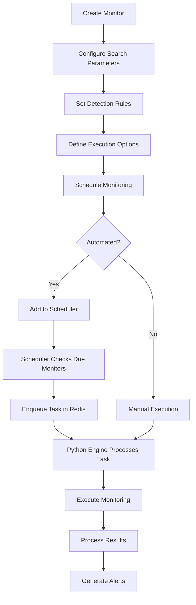
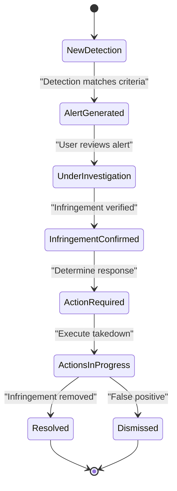
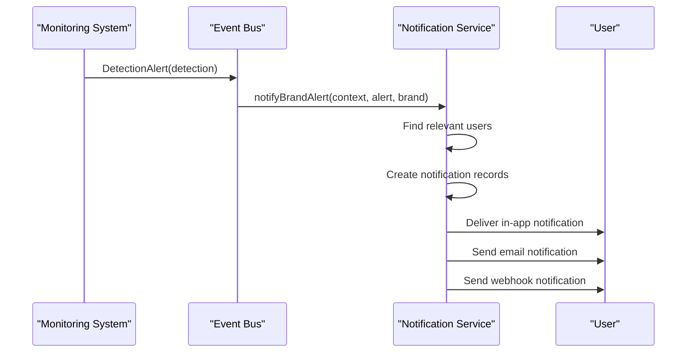
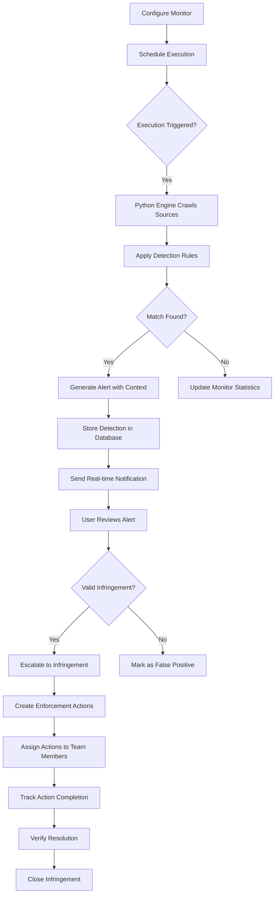
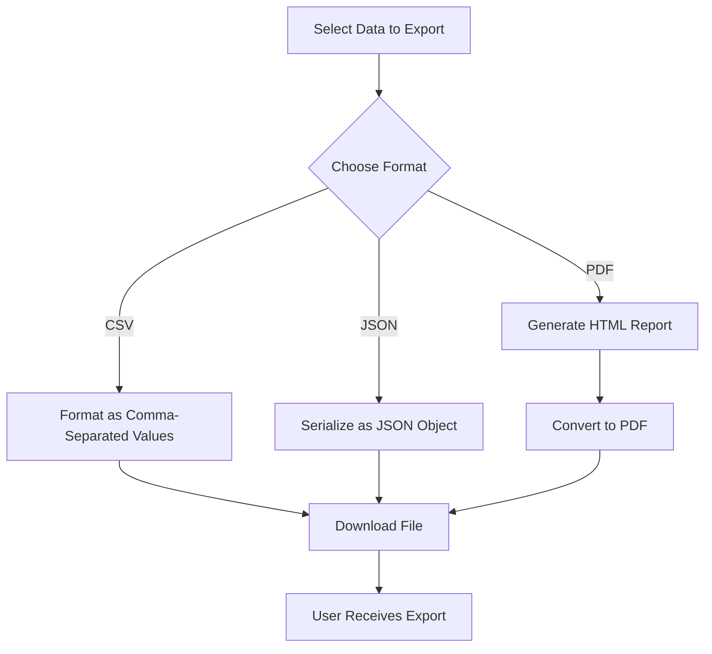

# Eclipse Module (Brand Protection)

<cite>
**Referenced Files in This Document**   
- [migration.sql](file://migrations/20251118015752_add_eclipse_module/migration.sql)
- [migration.sql](file://migrations/20251120025530_add_eclipse_complete/migration.sql)
- [types.ts](file://src/core/modules/eclipse/types.ts)
- [operations.ts](file://src/core/modules/eclipse/operations.ts)
- [detections/operations.ts](file://src/core/modules/eclipse/detections/operations.ts)
- [utils/notifications.ts](file://src/core/modules/eclipse/utils/notifications.ts)
- [utils/audit.ts](file://src/core/modules/eclipse/utils/audit.ts)
- [export.ts](file://src/core/modules/eclipse/export.ts)
- [jobs/scheduler.ts](file://src/core/modules/eclipse/jobs/scheduler.ts)
- [queue/producer.ts](file://src/core/modules/eclipse/queue/producer.ts)
- [utils/permissions.ts](file://src/core/modules/eclipse/utils/permissions.ts)
- [index.ts](file://src/core/modules/eclipse/index.ts)
</cite>

## Table of Contents
1. [Introduction](#introduction)
2. [Data Model](#data-model)
3. [Brand Monitoring Implementation](#brand-monitoring-implementation)
4. [Infringement Detection and Management](#infringement-detection-and-management)
5. [User Interface Components](#user-interface-components)
6. [Integration with Notification System](#integration-with-notification-system)
7. [Integration with Ticketing Providers](#integration-with-ticketing-providers)
8. [Detection Workflows](#detection-workflows)
9. [Export Functionality](#export-functionality)
10. [Real-time Updates](#real-time-updates)
11. [Challenges in Brand Monitoring Accuracy](#challenges-in-brand-monitoring-accuracy)
12. [False Positive Reduction Strategies](#false-positive-reduction-strategies)

## Introduction
The Eclipse module provides comprehensive digital brand protection and infringement detection capabilities. It enables organizations to monitor various sources for brand misuse, detect infringements, and manage enforcement actions. The system supports multiple detection methods including keyword monitoring, YARA rule matching, regex pattern matching, and typo squatter detection. The module integrates with external systems for notifications and ticketing, providing a complete solution for brand protection operations.

## Data Model
The Eclipse module implements a comprehensive data model for brand protection operations, consisting of several interconnected entities that track brands, monitoring activities, detections, and enforcement actions.

```mermaid
erDiagram
ECLIPSE_BRAND {
string id PK
timestamp createdAt
timestamp updatedAt
string workspaceId FK
string name
string description
string trademark
string[] domains
string[] socialMediaHandles
string status
integer priority
string confidentiality
string createdBy
string lastModifiedBy
}
BRAND_MONITOR {
string id PK
timestamp createdAt
timestamp updatedAt
string brandId FK
string workspaceId FK
string monitoringType
string source
string[] searchTerms
string[] excludeTerms
string[] keywords
string[] targetRegions
string[] targetLanguages
string[] excludeRegions
string yaraRules
string[] regexPatterns
string[] domainPatterns
integer confidenceThreshold
integer matchingRulesNeeded
string status
boolean isAutomated
boolean enableScreenshots
boolean enableOCR
boolean deepAnalysis
string checkFrequency
timestamp lastCheckAt
timestamp nextCheckAt
integer detectionsThisMonth
integer detectionsTotalTime
integer successfulRuns
integer failedRuns
string lastErrorMessage
}
BRAND_ALERT {
string id PK
timestamp createdAt
timestamp updatedAt
string monitorId FK
string brandId FK
string workspaceId FK
string title
string description
string url
string severity
string status
string infringementId FK
jsonb sourceData
integer confidence
}
BRAND_INFRINGEMENT {
string id PK
timestamp createdAt
timestamp updatedAt
string brandId FK
string workspaceId FK
string title
string description
timestamp detectionDate
string url
string domain
string ipAddress
string location
string type
string severity
string status
string[] notes
string detectedBy
string investigatedBy
timestamp resolvedAt
string aegisIncidentId FK
string aegisSyncStatus
timestamp aegisSyncedAt
string aegisSyncError
}
INFRINGEMENT_ACTION {
string id PK
timestamp createdAt
timestamp updatedAt
string infringementId FK
string workspaceId FK
string actionType
string title
string description
string status
timestamp plannedDate
timestamp executionDate
timestamp completionDate
string result
string[] evidence
string notes
string assignedTo
integer priority
}
BRAND_ALERT_AGGREGATION {
string id PK
timestamp createdAt
timestamp updatedAt
string brandId FK
string workspaceId FK
string period
timestamp date
integer totalAlerts
integer criticalAlerts
integer highAlerts
integer newInfringements
integer actionsCompleted
}
MODIFICATION_HISTORY {
string id PK
timestamp createdAt
string brandId FK
string field
string oldValue
string newValue
string modifiedBy
}
ECLIPSE_BRAND ||--o{ BRAND_MONITOR : "has"
ECLIPSE_BRAND ||--o{ BRAND_ALERT : "has"
ECLIPSE_BRAND ||--o{ BRAND_INFRINGEMENT : "has"
ECLIPSE_BRAND ||--o{ BRAND_ALERT_AGGREGATION : "has"
ECLIPSE_BRAND ||--o{ MODIFICATION_HISTORY : "has"
BRAND_MONITOR ||--o{ BRAND_ALERT : "generates"
BRAND_ALERT }o--|| BRAND_INFRINGEMENT : "escalates to"
BRAND_INFRINGEMENT ||--o{ INFRINGEMENT_ACTION : "has"
```

**Diagram sources**
- [migration.sql](file://migrations/20251118015752_add_eclipse_module/migration.sql)
- [migration.sql](file://migrations/20251120025530_add_eclipse_complete/migration.sql)

**Section sources**
- [migration.sql](file://migrations/20251118015752_add_eclipse_module/migration.sql)
- [migration.sql](file://migrations/20251120025530_add_eclipse_complete/migration.sql)
- [types.ts](file://src/core/modules/eclipse/types.ts)

## Brand Monitoring Implementation
The Eclipse module implements a sophisticated brand monitoring system that allows organizations to track their brands across various digital channels. The monitoring system supports multiple detection methods including keyword monitoring, YARA rule matching, regex pattern matching, and typo squatter detection.

The monitoring configuration is highly customizable, allowing users to define search terms, exclude terms, keywords, target regions, and target languages. Monitors can be configured to run automatically on a specified frequency (hourly, daily, weekly, or monthly) or manually triggered. The system supports deep analysis with screenshot capture and OCR processing for visual content analysis.

Monitoring tasks are scheduled and executed through a distributed task queue system using Redis. The scheduler runs periodically to identify monitors that are due for execution based on their check frequency and next check time. When a monitor is due, a task is enqueued in Redis for processing by the Python-based engine service.

**Diagram sources**
- [jobs/scheduler.ts](file://src/core/modules/eclipse/jobs/scheduler.ts)
- [queue/producer.ts](file://src/core/modules/eclipse/queue/producer.ts)
- [operations.ts](file://src/core/modules/eclipse/operations.ts)

**Section sources**
- [operations.ts](file://src/core/modules/eclipse/operations.ts)
- [jobs/scheduler.ts](file://src/core/modules/eclipse/jobs/scheduler.ts)
- [queue/producer.ts](file://src/core/modules/eclipse/queue/producer.ts)

## Infringement Detection and Management
The Eclipse module provides a comprehensive system for detecting and managing brand infringements. When monitoring activities identify potential brand misuse, alerts are generated and can be escalated to formal infringements for further investigation and action.

The infringement detection system supports multiple infringement types including counterfeiting, domain squatter, typo squatter, social media impersonation, phishing, malware distribution, data leaks, and trademark violations. Each infringement is assigned a severity level and status, allowing teams to prioritize their response efforts.

Infringements can be linked to Aegis security incidents, enabling seamless integration between brand protection and security operations. The system tracks the entire lifecycle of an infringement from detection through investigation to resolution, maintaining a complete audit trail of all actions taken.

**Diagram sources**
- [operations.ts](file://src/core/modules/eclipse/operations.ts)
- [types.ts](file://src/core/modules/eclipse/types.ts)

**Section sources**
- [operations.ts](file://src/core/modules/eclipse/operations.ts)
- [detections/operations.ts](file://src/core/modules/eclipse/detections/operations.ts)

## User Interface Components
The Eclipse module provides a comprehensive set of user interface components for managing brands, viewing detections, and taking enforcement actions. The frontend is built using React with TypeScript, following a component-based architecture.

Key UI components include:
- Brand management interface with table and card views
- Monitor configuration wizard with step-by-step guidance
- Detection dashboard with filtering and sorting capabilities
- Infringement tracking with timeline visualization
- Action management with assignment and status tracking
- Export functionality with multiple format options

The interface supports real-time updates through WebSocket connections, ensuring users see the latest data without manual refresh. The design follows accessibility guidelines and supports multiple languages through the i18n system.

**Section sources**
- [types.ts](file://src/core/modules/eclipse/types.ts)
- [operations.ts](file://src/core/modules/eclipse/operations.ts)

## Integration with Notification System
The Eclipse module integrates with a comprehensive notification system that keeps users informed about important events and actions. The notification system supports multiple delivery channels including in-app notifications, email, and webhook integrations.

When significant events occur, such as new alerts, infringement escalations, or action assignments, the system generates notifications that are delivered to relevant users based on their roles and preferences. Workspace owners and administrators receive critical notifications for high-severity issues, while team members receive notifications for items assigned to them.

The notification system is implemented through event bus patterns, with specific functions for different notification types:
- Brand alert notifications for new detections
- Infringement creation notifications for confirmed violations
- Infringement resolution notifications when issues are closed
- Action assignment notifications for delegated tasks
- Aegis incident escalation notifications when security integration is triggered

**Diagram sources**
- [utils/notifications.ts](file://src/core/modules/eclipse/utils/notifications.ts)
- [operations.ts](file://src/core/modules/eclipse/operations.ts)

**Section sources**
- [utils/notifications.ts](file://src/core/modules/eclipse/utils/notifications.ts)
- [operations.ts](file://src/core/modules/eclipse/operations.ts)

## Integration with Ticketing Providers
The Eclipse module integrates with various ticketing providers to enable seamless enforcement actions. The system supports integration with popular platforms including Jira, GitHub, Azure DevOps, Linear, ServiceNow, and custom webhook endpoints.

When an infringement requires external tracking or coordination, users can create tickets directly from the Eclipse interface. The system maps infringement data to the appropriate fields in the target ticketing system, including title, description, severity, and relevant evidence URLs.

The integration is implemented through a provider-based architecture, with a base ticket provider class and specific implementations for each supported platform. This allows for consistent functionality across different providers while accommodating platform-specific requirements.

**Section sources**
- [operations.ts](file://src/core/modules/eclipse/operations.ts)
- [types.ts](file://src/core/modules/eclipse/types.ts)

## Detection Workflows
The Eclipse module implements a comprehensive detection workflow that begins with monitor configuration and ends with enforcement actions. The workflow is designed to minimize false positives while ensuring critical infringements are identified and addressed promptly.

The detection process starts with monitor creation, where users define the brand, search parameters, and detection rules. Once configured, monitors are scheduled for regular execution or can be run manually. The Python engine processes each monitor by crawling configured sources and applying detection rules to identify potential infringements.

When a potential infringement is detected, an alert is generated with relevant context including the source URL, matched content, and confidence score. Users can review alerts, acknowledge them, or escalate them to formal infringements. Escalated infringements trigger additional workflows including notification generation and potential ticket creation.

**Diagram sources**
- [operations.ts](file://src/core/modules/eclipse/operations.ts)
- [jobs/scheduler.ts](file://src/core/modules/eclipse/jobs/scheduler.ts)
- [queue/producer.ts](file://src/core/modules/eclipse/queue/producer.ts)

**Section sources**
- [operations.ts](file://src/core/modules/eclipse/operations.ts)
- [jobs/scheduler.ts](file://src/core/modules/eclipse/jobs/scheduler.ts)
- [queue/producer.ts](file://src/core/modules/eclipse/queue/producer.ts)

## Export Functionality
The Eclipse module provides robust export functionality that allows users to export data in multiple formats for reporting, analysis, and compliance purposes. The export system supports CSV, JSON, and PDF formats, catering to different use cases and requirements.

For bulk data analysis, users can export alerts, infringements, and actions in CSV format, which can be easily imported into spreadsheet applications. The CSV export includes all relevant fields with proper escaping of special characters to ensure data integrity.

For programmatic access and integration with other systems, JSON export provides a structured representation of the data that can be easily parsed by other applications. This is particularly useful for automated reporting and data synchronization scenarios.

For executive reporting and compliance documentation, the system generates comprehensive PDF reports with visual elements including charts and formatted tables. These reports include executive summaries, critical alerts, open infringements, and key metrics, providing a complete overview of brand protection activities.

**Diagram sources**
- [export.ts](file://src/core/modules/eclipse/export.ts)

**Section sources**
- [export.ts](file://src/core/modules/eclipse/export.ts)

## Real-time Updates
The Eclipse module implements real-time updates through WebSocket connections, ensuring users have access to the latest data without manual refresh. The system uses a publish-subscribe pattern to broadcast updates to relevant clients based on their workspace and permissions.

When significant events occur, such as new detections, infringement escalations, or action completions, the system publishes messages to the appropriate channels. Clients subscribed to these channels receive the updates immediately and update their UI accordingly.

The real-time system is implemented using the useEclipseRealtime hook in the frontend, which establishes and manages the WebSocket connection. This hook provides a clean API for components to subscribe to specific event types and receive updates.

**Section sources**
- [operations.ts](file://src/core/modules/eclipse/operations.ts)
- [utils/notifications.ts](file://src/core/modules/eclipse/utils/notifications.ts)

## Challenges in Brand Monitoring Accuracy
The Eclipse module faces several challenges in maintaining high brand monitoring accuracy while minimizing false positives. These challenges stem from the complexity of digital content, evolving infringement tactics, and the need to balance sensitivity with precision.

One major challenge is keyword ambiguity, where brand-related terms appear in legitimate contexts unrelated to infringement. For example, a company named "Apple" may receive numerous false positives from discussions about the fruit. The system addresses this through exclude terms, context analysis, and confidence scoring.

Another challenge is the detection of visual infringements, such as logo misuse in images or videos. While the system supports screenshot capture and OCR processing, accurately identifying brand elements in visual content remains difficult due to variations in quality, perspective, and partial visibility.

Domain-based infringements present additional challenges, particularly with internationalized domain names (IDNs) and homoglyph attacks that use visually similar characters from different scripts. The system employs domain pattern matching and typo squatter detection to identify these sophisticated attacks.

**Section sources**
- [types.ts](file://src/core/modules/eclipse/types.ts)
- [operations.ts](file://src/core/modules/eclipse/operations.ts)

## False Positive Reduction Strategies
The Eclipse module implements several strategies to reduce false positives in brand monitoring and infringement detection. These strategies focus on improving detection accuracy through configurable rules, confidence scoring, and human-in-the-loop validation.

The system uses a multi-rule matching approach where multiple detection criteria must be met before generating an alert. Users can configure the number of matching rules needed to trigger an alert, allowing them to balance sensitivity and specificity based on their risk tolerance.

Confidence scoring is implemented to rank alerts by their likelihood of being genuine infringements. The score is calculated based on factors such as match quality, source reputation, and contextual indicators. Users can set confidence thresholds to filter out low-confidence alerts automatically.

The system also supports manual review workflows where alerts are initially marked as "new" and require human validation before being escalated to formal infringements. During review, users can mark alerts as "false positive" to train the system and improve future detection accuracy.

Additional false positive reduction features include:
- Exclude terms to filter out known legitimate contexts
- Source reputation scoring to weight results from trusted sources
- Temporal analysis to identify patterns that distinguish genuine infringements from coincidental matches
- Machine learning models (planned) to improve detection accuracy over time based on user feedback

**Section sources**
- [types.ts](file://src/core/modules/eclipse/types.ts)
- [operations.ts](file://src/core/modules/eclipse/operations.ts)
- [utils/notifications.ts](file://src/core/modules/eclipse/utils/notifications.ts)