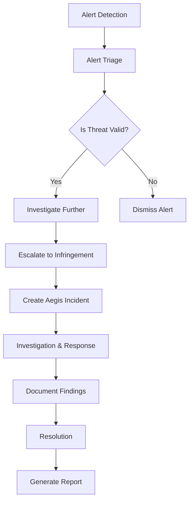
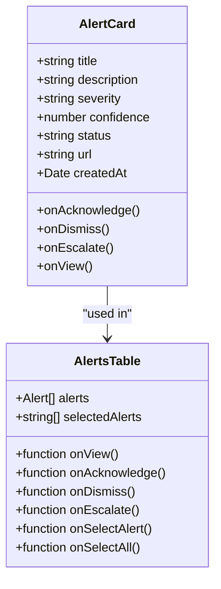
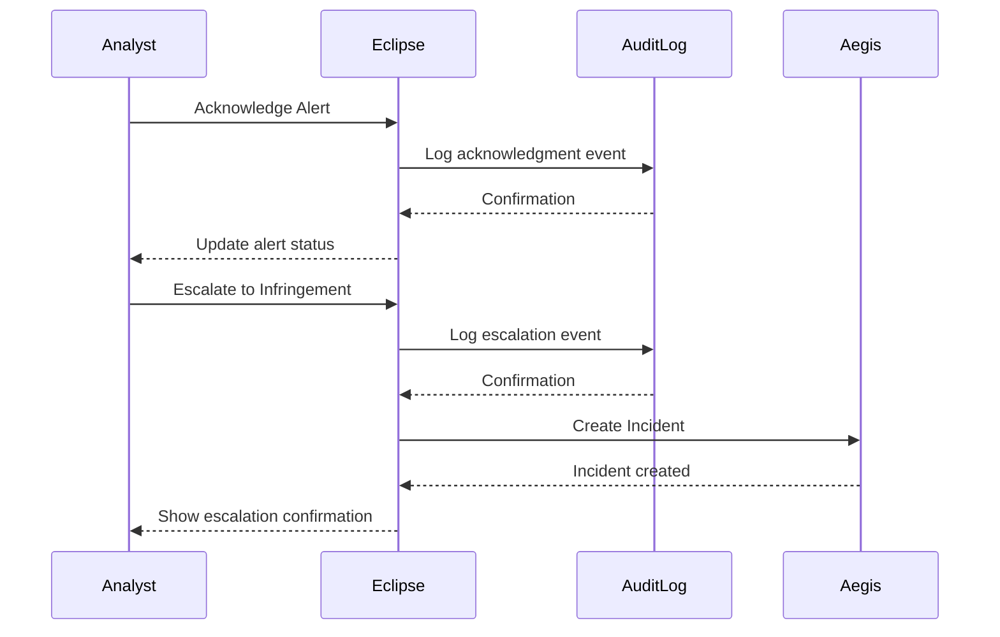
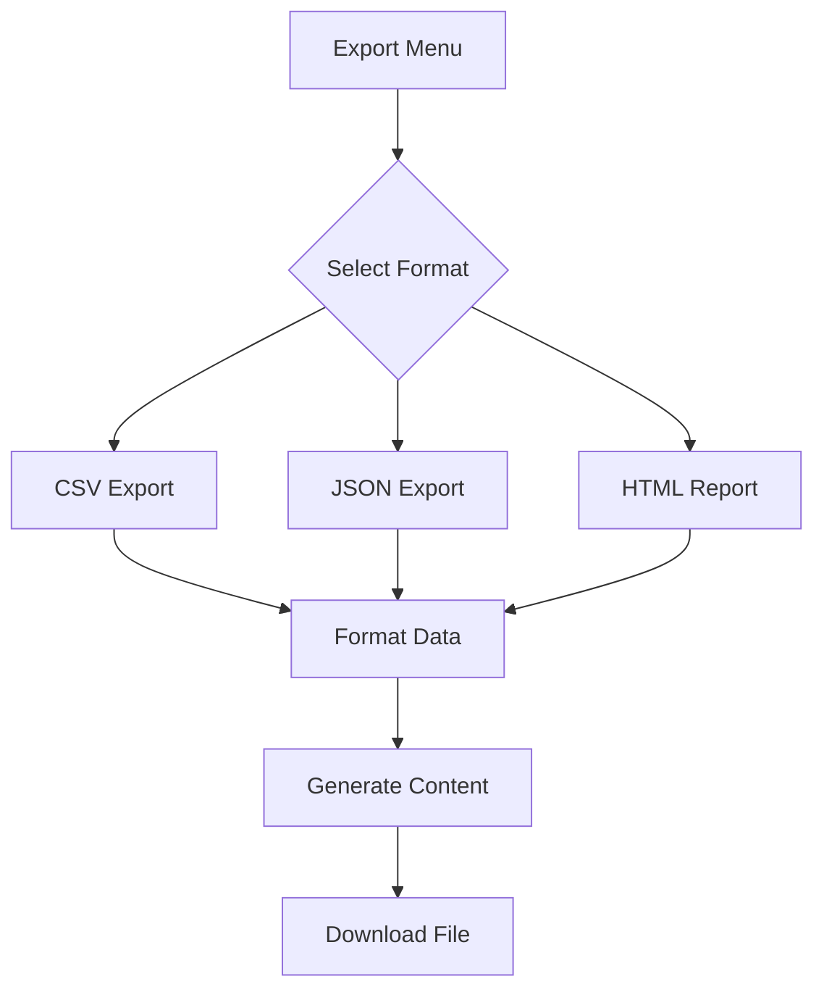
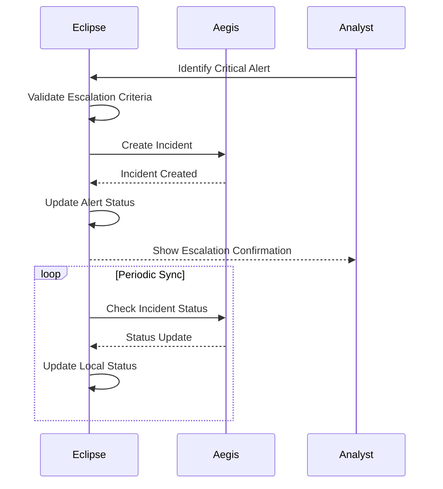

# Investigation Tools

<cite>
**Referenced Files in This Document**   
- [AlertCard.tsx](file://src/client/pages/modules/eclipse/components/AlertCard.tsx)
- [AlertsTable.tsx](file://src/client/pages/modules/eclipse/components/AlertsTable.tsx)
- [AuditLogTimeline.tsx](file://src/client/pages/modules/eclipse/components/AuditLogTimeline.tsx)
- [ExportMenu.tsx](file://src/client/pages/modules/eclipse/components/ExportMenu.tsx)
- [DetectionsListPage.tsx](file://src/client/pages/modules/eclipse/detections/DetectionsListPage.tsx)
- [export.ts](file://src/core/modules/eclipse/export.ts)
- [types.ts](file://src/core/modules/eclipse/types.ts)
- [aegis.ts](file://src/core/modules/eclipse/integrations/aegis.ts)
- [Timeline.tsx](file://src/client/pages/modules/aegis/components/Timeline.tsx)
- [CreateCaseFromAlert.tsx](file://src/client/pages/modules/aegis/components/CreateCaseFromAlert.tsx)
- [operations.ts](file://src/core/modules/eclipse/operations.ts)
- [migration.sql](file://migrations/20251120052630_add_brand_alert_fields/migration.sql)
- [migration.sql](file://migrations/20251120025530_add_eclipse_complete/migration.sql)
</cite>

## Table of Contents
1. [Introduction](#introduction)
2. [Investigation Workflow](#investigation-workflow)
3. [Alert Management Components](#alert-management-components)
4. [Audit Log Timeline](#audit-log-timeline)
5. [Data Export and Reporting](#data-export-and-reporting)
6. [Integration with Aegis Incident Response](#integration-with-aegis-incident-response)
7. [Best Practices for Investigations](#best-practices-for-investigations)
8. [Conclusion](#conclusion)

## Introduction

The Eclipse module provides comprehensive investigation tools for security teams to identify, analyze, and respond to brand threats. This documentation details the investigation workflow from alert detection to resolution, covering key components such as AlertCard, AlertsTable, AuditLogTimeline, and data export functionality. The tools enable security teams to correlate alerts, track user actions through audit trails, and generate investigation packages for compliance reporting. The integration with the Aegis incident response module allows for seamless escalation of critical threats into formal investigations.

**Section sources**
- [DetectionsListPage.tsx](file://src/client/pages/modules/eclipse/detections/DetectionsListPage.tsx)

## Investigation Workflow

The investigation workflow in the Eclipse module follows a structured process from alert detection to resolution. When a potential brand threat is detected, the system generates an alert that appears in the Detections List. Security analysts can filter alerts by status (new, acknowledged, investigating, dismissed, escalated) and severity (critical, high, medium, low) to prioritize their investigation efforts.

The workflow begins with alert triage, where analysts review the alert details including title, description, URL, confidence score, and severity level. Analysts can acknowledge alerts to indicate they are being reviewed, investigate further by examining the source content, or dismiss false positives. For confirmed threats, analysts can escalate alerts to create formal infringement cases, which automatically generates a corresponding incident in the Aegis incident response module.

Throughout the investigation, all user actions are recorded in the audit trail, providing a complete history of the investigation process. The workflow concludes with resolution, where analysts document their findings and actions taken. The system supports bulk operations, allowing teams to efficiently manage multiple alerts simultaneously.

**Diagram sources **
- [AlertCard.tsx](file://src/client/pages/modules/eclipse/components/AlertCard.tsx)
- [AlertsTable.tsx](file://src/client/pages/modules/eclipse/components/AlertsTable.tsx)
- [operations.ts](file://src/core/modules/eclipse/operations.ts)

**Section sources**
- [DetectionsListPage.tsx](file://src/client/pages/modules/eclipse/detections/DetectionsListPage.tsx)
- [operations.ts](file://src/core/modules/eclipse/operations.ts)

## Alert Management Components

### AlertCard Component

The AlertCard component provides a compact, interactive representation of individual brand threat alerts. Each card displays essential information including the alert title, description, severity level, confidence score, and detection timestamp. The severity is visually indicated through color-coded icons and backgrounds, with critical alerts shown in red, high severity in orange, medium in yellow, and low in blue.

Alert cards support direct actions through embedded buttons that allow analysts to acknowledge, dismiss, or escalate alerts without navigating away from the current view. When an alert is escalated, it automatically creates a corresponding infringement record and can trigger the creation of an incident in the Aegis module. The component also displays the source URL with a direct link for further investigation.

**Section sources**
- [AlertCard.tsx](file://src/client/pages/modules/eclipse/components/AlertCard.tsx)

### AlertsTable Component

The AlertsTable component provides a comprehensive view of multiple alerts with advanced filtering and bulk operation capabilities. The table displays key information including URL, severity, status, confidence score, associated brand, and detection date. Analysts can sort and filter alerts based on various criteria to focus on the most critical threats.

The table supports bulk actions, allowing analysts to acknowledge, dismiss, or escalate multiple alerts simultaneously. Each row includes a dropdown menu with additional actions such as viewing detailed alert information. The component implements virtual scrolling for optimal performance when handling large datasets, ensuring a responsive user experience even with thousands of alerts.

**Diagram sources **
- [AlertCard.tsx](file://src/client/pages/modules/eclipse/components/AlertCard.tsx)
- [AlertsTable.tsx](file://src/client/pages/modules/eclipse/components/AlertsTable.tsx)

**Section sources**
- [AlertCard.tsx](file://src/client/pages/modules/eclipse/components/AlertCard.tsx)
- [AlertsTable.tsx](file://src/client/pages/modules/eclipse/components/AlertsTable.tsx)

## Audit Log Timeline

The AuditLogTimeline component provides a chronological view of all user actions and system events related to brand protection activities. This timeline serves as a comprehensive audit trail for investigations, capturing every significant action taken within the Eclipse module. The component displays events in reverse chronological order, with the most recent activities at the top.

Each timeline entry includes an icon representing the action type (create, update, delete, escalate, assign, complete), the action description, the user who performed the action, and the timestamp with precise date and time. Additional metadata such as IP address and user agent are also recorded for security and forensic purposes. The timeline supports expanding entries to view detailed metadata in JSON format.

The audit log captures critical investigation milestones including alert acknowledgments, dismissals, escalations to infringements, and status changes. This complete history enables security teams to reconstruct the investigation process, identify patterns in threat actor behavior, and demonstrate compliance with regulatory requirements. The timeline is accessible at multiple levels, including workspace-wide, brand-specific, and individual alert/infringement contexts.

**Diagram sources **
- [AuditLogTimeline.tsx](file://src/client/pages/modules/eclipse/components/AuditLogTimeline.tsx)
- [operations.ts](file://src/core/modules/eclipse/operations.ts)

**Section sources**
- [AuditLogTimeline.tsx](file://src/client/pages/modules/eclipse/components/AuditLogTimeline.tsx)

## Data Export and Reporting

### Export Functionality

The Eclipse module provides robust data export capabilities to support investigation documentation and compliance reporting. The ExportMenu component offers multiple export formats including CSV, JSON, and HTML reports. Analysts can export data for various resource types including alerts, infringements, and actions.

The CSV export format is optimized for analysis in spreadsheet applications, with properly formatted headers and escaped special characters. The JSON export preserves the complete data structure with all nested relationships, making it suitable for programmatic analysis and integration with other security tools. The export functions handle both real-time data and pre-loaded datasets, ensuring flexibility in different usage scenarios.

**Diagram sources **
- [ExportMenu.tsx](file://src/client/pages/modules/eclipse/components/ExportMenu.tsx)
- [export.ts](file://src/core/modules/eclipse/export.ts)

### Report Generation

The Eclipse module includes a comprehensive reporting system that generates detailed HTML reports for brand protection activities. The report generation process compiles data from multiple sources including alerts, infringements, and actions to create a holistic view of the security posture. Reports can be generated for custom date ranges, with presets for common periods such as last 24 hours, 7 days, 30 days, and 90 days.

The generated HTML reports include executive summaries with key metrics, detailed sections for critical alerts and open infringements, and visual elements to enhance readability. The reports are styled with a professional template that includes the organization's branding and can be easily shared with stakeholders. The reporting system also supports automated generation for regular compliance submissions.

**Section sources**
- [ExportMenu.tsx](file://src/client/pages/modules/eclipse/components/ExportMenu.tsx)
- [export.ts](file://src/core/modules/eclipse/export.ts)

## Integration with Aegis Incident Response

The Eclipse module integrates seamlessly with the Aegis incident response module to enable coordinated threat management. When a brand threat requires formal investigation, analysts can escalate alerts from Eclipse to create incidents in Aegis. This integration follows a defined escalation policy based on severity and threat type, with critical and high-severity infringements automatically eligible for escalation.

The integration preserves context between systems by mapping Eclipse alert data to Aegis incident fields. Key information such as the alert title, description, URL, severity, and detection details are transferred to the incident record. The system maintains bidirectional references, allowing analysts to navigate between the Eclipse alert and the corresponding Aegis incident.

The integration also synchronizes investigation status, ensuring that actions taken in one system are reflected in the other. For example, when an incident is resolved in Aegis, the corresponding alert status in Eclipse is updated accordingly. This unified approach eliminates silos and provides a complete view of the threat lifecycle from detection to resolution.

**Diagram sources **
- [aegis.ts](file://src/core/modules/eclipse/integrations/aegis.ts)
- [CreateCaseFromAlert.tsx](file://src/client/pages/modules/aegis/components/CreateCaseFromAlert.tsx)

**Section sources**
- [aegis.ts](file://src/core/modules/eclipse/integrations/aegis.ts)
- [CreateCaseFromAlert.tsx](file://src/client/pages/modules/aegis/components/CreateCaseFromAlert.tsx)

## Best Practices for Investigations

### Alert Triage and Prioritization

Security teams should establish clear criteria for alert triage and prioritization based on severity, confidence score, and potential business impact. Critical and high-severity alerts should be reviewed immediately, while lower severity alerts can be processed according to established SLAs. Teams should regularly review and refine their alerting rules to minimize false positives and ensure relevant threats are captured.

### Documentation and Audit Trails

Maintaining comprehensive documentation throughout the investigation process is critical for accountability and knowledge sharing. All actions taken during an investigation should be properly documented in the system, with clear rationale for decisions made. The audit log should be reviewed regularly to ensure all activities are properly recorded and to identify any potential gaps in the investigation process.

### Collaboration and Escalation

Effective investigations require collaboration across teams and clear escalation paths for complex threats. The integration with Aegis provides a structured framework for escalating threats that require formal incident response. Teams should establish clear communication protocols and ensure all stakeholders understand their roles and responsibilities in the investigation process.

### Continuous Improvement

Security teams should conduct regular post-incident reviews to identify opportunities for process improvement. Metrics such as mean time to detect (MTTD), mean time to respond (MTTR), and resolution rates should be tracked and analyzed to measure effectiveness. Feedback from investigations should be used to refine detection rules, improve response procedures, and enhance training programs.

**Section sources**
- [operations.ts](file://src/core/modules/eclipse/operations.ts)
- [types.ts](file://src/core/modules/eclipse/types.ts)

## Conclusion

The investigation tools in the Eclipse module provide security teams with a comprehensive suite of capabilities for identifying, analyzing, and responding to brand threats. The integration of alert management, audit logging, data export, and incident response functionalities creates a cohesive investigation workflow that enhances operational efficiency and ensures thorough documentation. By leveraging these tools effectively, security teams can protect their organization's brand integrity, respond quickly to emerging threats, and maintain compliance with regulatory requirements. The seamless integration with the Aegis incident response module further strengthens the organization's security posture by enabling coordinated response to critical threats.