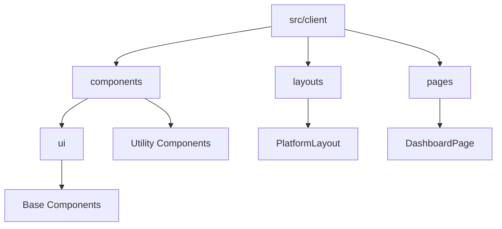
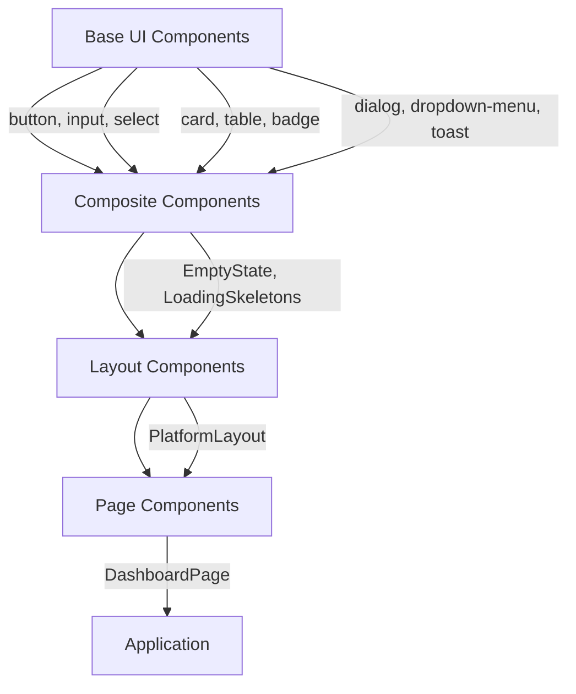
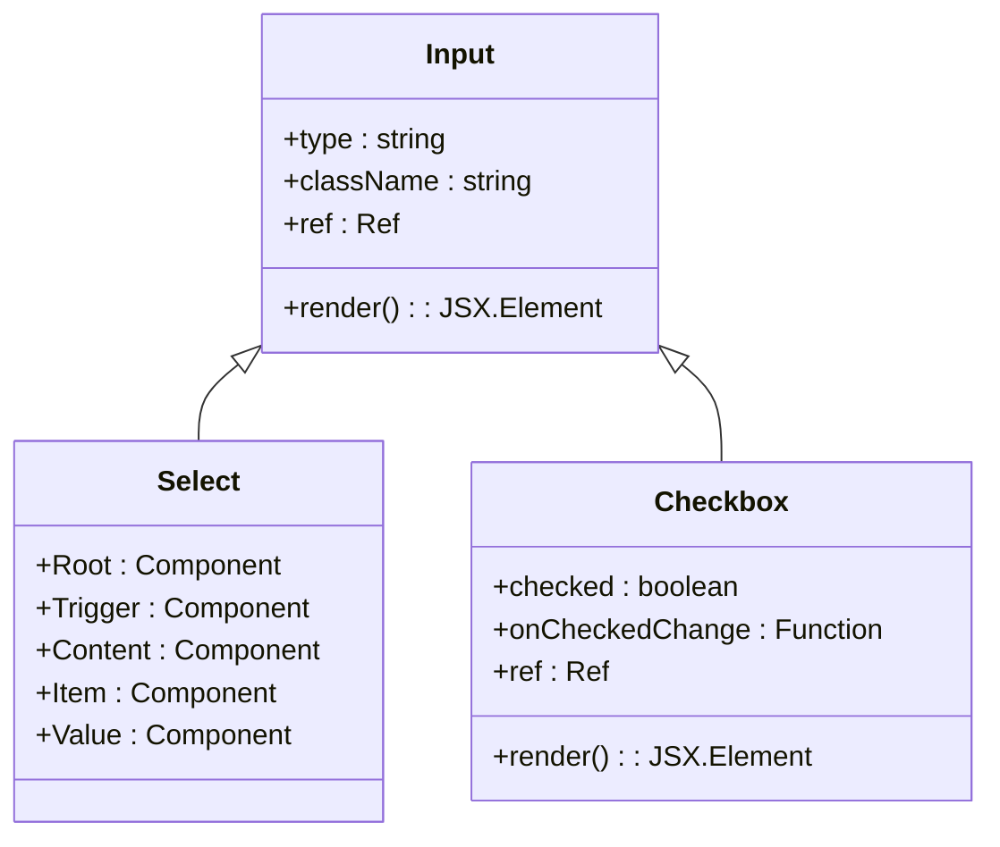
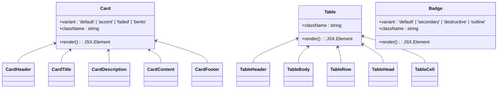
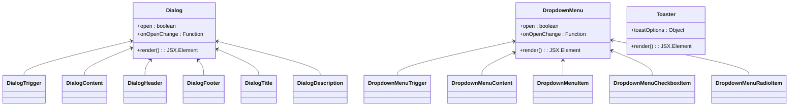
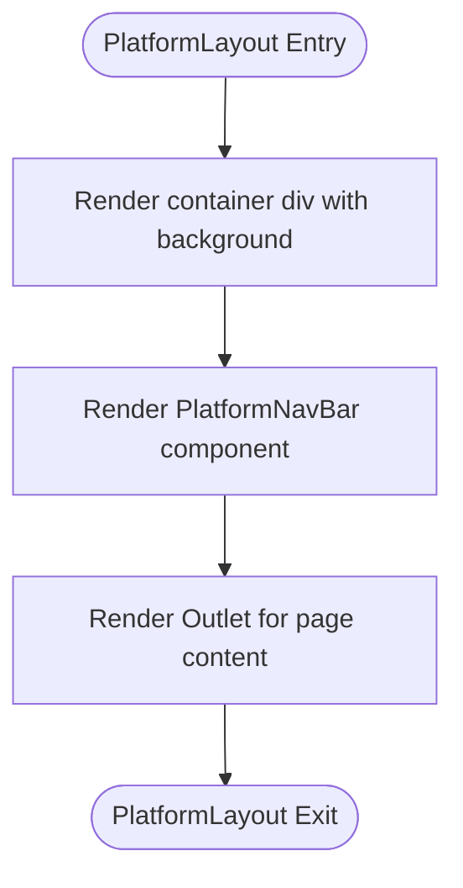
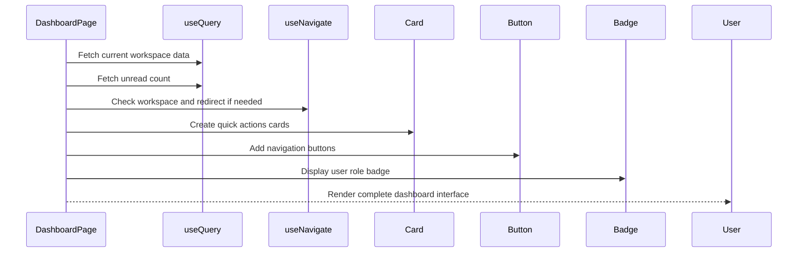
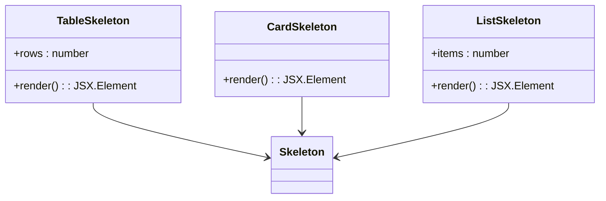
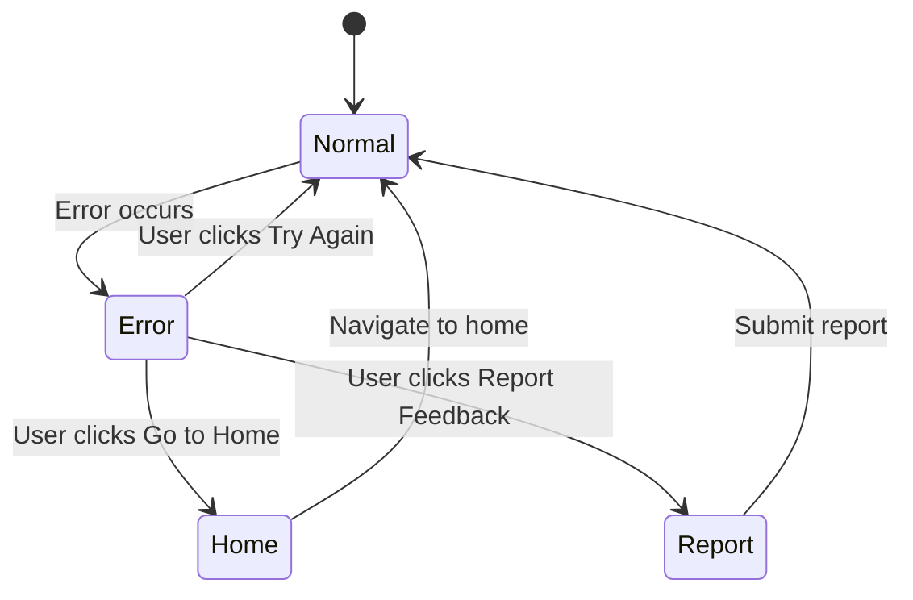
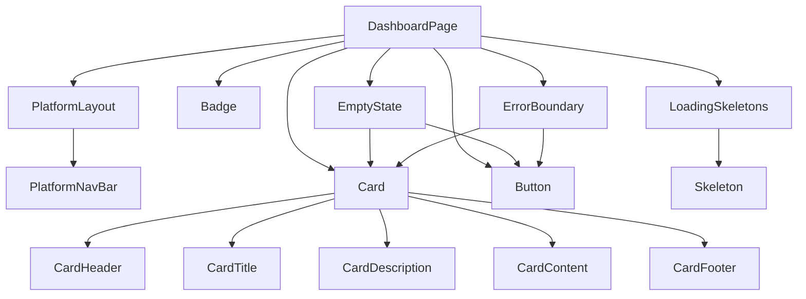

# Component Hierarchy

<cite>
**Referenced Files in This Document**   
- [button.tsx](file://src/client/components/ui/button.tsx)
- [input.tsx](file://src/client/components/ui/input.tsx)
- [select.tsx](file://src/client/components/ui/select.tsx)
- [checkbox.tsx](file://src/client/components/ui/checkbox.tsx)
- [table.tsx](file://src/client/components/ui/table.tsx)
- [card.tsx](file://src/client/components/ui/card.tsx)
- [badge.tsx](file://src/client/components/ui/badge.tsx)
- [dialog.tsx](file://src/client/components/ui/dialog.tsx)
- [dropdown-menu.tsx](file://src/client/components/ui/dropdown-menu.tsx)
- [toaster.tsx](file://src/client/components/ui/toaster.tsx)
- [EmptyState.tsx](file://src/client/components/EmptyState.tsx)
- [LoadingSkeletons.tsx](file://src/client/components/LoadingSkeletons.tsx)
- [ErrorBoundary.tsx](file://src/client/components/ErrorBoundary.tsx)
- [PlatformLayout.tsx](file://src/client/layouts/PlatformLayout.tsx)
- [DashboardPage.tsx](file://src/client/pages/DashboardPage.tsx)
</cite>

## Table of Contents
1. [Introduction](#introduction)
2. [Project Structure](#project-structure)
3. [Core Components](#core-components)
4. [Architecture Overview](#architecture-overview)
5. [Detailed Component Analysis](#detailed-component-analysis)
6. [Dependency Analysis](#dependency-analysis)
7. [Performance Considerations](#performance-considerations)
8. [Troubleshooting Guide](#troubleshooting-guide)
9. [Conclusion](#conclusion)

## Introduction
This document provides comprehensive documentation for the React component hierarchy in SentinelIQ's frontend. It explains the organization of reusable UI components based on ShadCN and Tailwind CSS, including form controls, data display elements, and interactive components. The documentation covers composition patterns used in higher-level components like DashboardPage and PlatformLayout, with examples from actual implementation files. It also describes utility components that maintain consistent UX across the application.

## Project Structure
The frontend component structure follows a modular organization with clear separation between base UI components, layout components, and page-level components. The structure is organized into distinct directories for different component types:



**Diagram sources**
- [src/client/components/ui](file://src/client/components/ui)
- [src/client/layouts](file://src/client/layouts)
- [src/client/pages](file://src/client/pages)

**Section sources**
- [src/client](file://src/client)

## Core Components
The core UI components in SentinelIQ are built using ShadCN patterns with Tailwind CSS for styling. These components are organized in the `src/client/components/ui` directory and include form controls, data display elements, and interactive components. The component library follows a consistent pattern of using Radix UI primitives for accessibility and behavior, combined with Tailwind CSS for styling.

**Section sources**
- [src/client/components/ui](file://src/client/components/ui)

## Architecture Overview
The component architecture in SentinelIQ follows a hierarchical composition pattern where base UI components are combined to create higher-level components and complete page layouts. This approach enables consistent styling and behavior across the application while allowing for flexibility in composition.



**Diagram sources**
- [src/client/components/ui/button.tsx](file://src/client/components/ui/button.tsx)
- [src/client/components/ui/card.tsx](file://src/client/components/ui/card.tsx)
- [src/client/layouts/PlatformLayout.tsx](file://src/client/layouts/PlatformLayout.tsx)
- [src/client/pages/DashboardPage.tsx](file://src/client/pages/DashboardPage.tsx)

## Detailed Component Analysis

### Base UI Components
The base UI components are built using Radix UI primitives and styled with Tailwind CSS. These components provide consistent styling and accessibility features across the application.

#### Form Controls
The form controls include input fields, select dropdowns, and checkboxes, all following a consistent design system.



**Diagram sources**
- [input.tsx](file://src/client/components/ui/input.tsx)
- [select.tsx](file://src/client/components/ui/select.tsx)
- [checkbox.tsx](file://src/client/components/ui/checkbox.tsx)

#### Data Display Elements
Data display elements include cards, tables, and badges that are used to present information in a structured way.



**Diagram sources**
- [card.tsx](file://src/client/components/ui/card.tsx)
- [table.tsx](file://src/client/components/ui/table.tsx)
- [badge.tsx](file://src/client/components/ui/badge.tsx)

#### Interactive Components
Interactive components include dialogs, dropdown menus, and toast notifications that provide user interaction capabilities.



**Diagram sources**
- [dialog.tsx](file://src/client/components/ui/dialog.tsx)
- [dropdown-menu.tsx](file://src/client/components/ui/dropdown-menu.tsx)
- [toaster.tsx](file://src/client/components/ui/toaster.tsx)

### Layout Components
Layout components provide the structural framework for pages in the application, ensuring consistent navigation and content organization.

#### Platform Layout
The PlatformLayout component serves as the base layout for all internal pages in the application, providing consistent navigation and structure.



**Diagram sources**
- [PlatformLayout.tsx](file://src/client/layouts/PlatformLayout.tsx)

**Section sources**
- [PlatformLayout.tsx](file://src/client/layouts/PlatformLayout.tsx)

### Page Components
Page components represent complete views in the application, composed of various UI components to create functional interfaces.

#### Dashboard Page
The DashboardPage component demonstrates the composition pattern used throughout the application, combining multiple UI components to create a comprehensive dashboard interface.



**Diagram sources**
- [DashboardPage.tsx](file://src/client/pages/DashboardPage.tsx)

**Section sources**
- [DashboardPage.tsx](file://src/client/pages/DashboardPage.tsx)

### Utility Components
Utility components provide consistent UX patterns for common scenarios like empty states, loading states, and error handling.

#### EmptyState Component
The EmptyState component provides a consistent way to display empty states throughout the application.

```mermaid
classDiagram
class EmptyState {
+icon : ReactNode
+title : string
+description : string
+action : {label : string, onClick : Function}
+className : string
+render() : JSX.Element
}
EmptyState --> Card
EmptyState --> Button
```

**Diagram sources**
- [EmptyState.tsx](file://src/client/components/EmptyState.tsx)

#### LoadingSkeletons Component
The LoadingSkeletons component provides various skeleton loading states for different UI patterns.



**Diagram sources**
- [LoadingSkeletons.tsx](file://src/client/components/LoadingSkeletons.tsx)

#### ErrorBoundary Component
The ErrorBoundary component provides consistent error handling and reporting across the application.



**Diagram sources**
- [ErrorBoundary.tsx](file://src/client/components/ErrorBoundary.tsx)

## Dependency Analysis
The component hierarchy in SentinelIQ follows a clear dependency structure where higher-level components depend on lower-level UI components. This creates a maintainable and scalable architecture.



**Diagram sources**
- [DashboardPage.tsx](file://src/client/pages/DashboardPage.tsx)
- [PlatformLayout.tsx](file://src/client/layouts/PlatformLayout.tsx)
- [EmptyState.tsx](file://src/client/components/EmptyState.tsx)
- [LoadingSkeletons.tsx](file://src/client/components/LoadingSkeletons.tsx)
- [ErrorBoundary.tsx](file://src/client/components/ErrorBoundary.tsx)

**Section sources**
- [src/client/pages/DashboardPage.tsx](file://src/client/pages/DashboardPage.tsx)
- [src/client/layouts/PlatformLayout.tsx](file://src/client/layouts/PlatformLayout.tsx)
- [src/client/components/EmptyState.tsx](file://src/client/components/EmptyState.tsx)
- [src/client/components/LoadingSkeletons.tsx](file://src/client/components/LoadingSkeletons.tsx)
- [src/client/components/ErrorBoundary.tsx](file://src/client/components/ErrorBoundary.tsx)

## Performance Considerations
The component hierarchy is designed with performance in mind, using React's composition patterns to minimize re-renders and optimize rendering performance. The use of memoization and proper component boundaries helps maintain smooth interactions even with complex UIs.

## Troubleshooting Guide
When troubleshooting component issues in SentinelIQ, consider the following common scenarios:

**Section sources**
- [ErrorBoundary.tsx](file://src/client/components/ErrorBoundary.tsx)
- [LoadingSkeletons.tsx](file://src/client/components/LoadingSkeletons.tsx)
- [EmptyState.tsx](file://src/client/components/EmptyState.tsx)

## Conclusion
The React component hierarchy in SentinelIQ's frontend follows a well-structured approach using ShadCN and Tailwind CSS. The architecture promotes reusability, consistency, and maintainability through a clear component organization and composition patterns. Base UI components provide the building blocks, which are combined into higher-level components and complete page layouts. Utility components ensure consistent UX for edge cases like loading and error states. This hierarchical approach enables rapid development of new features while maintaining a cohesive user experience across the application.