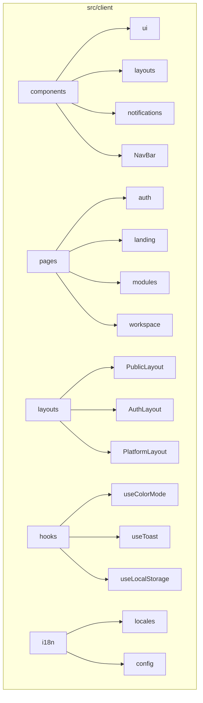
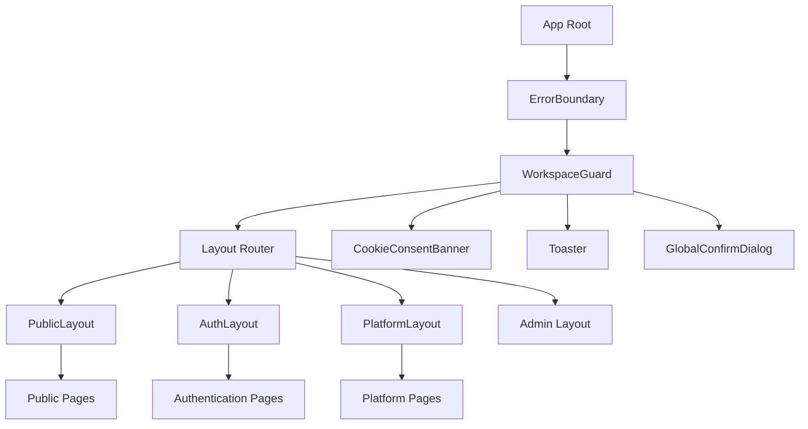
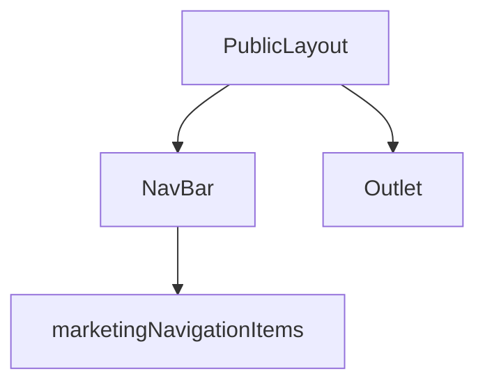
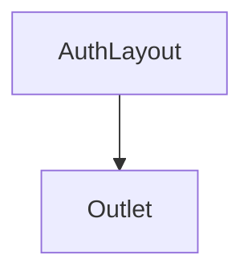
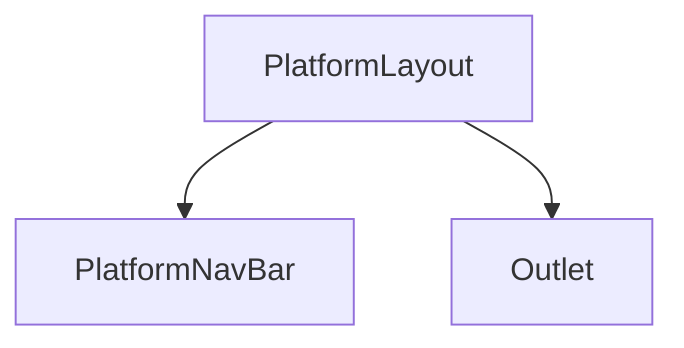
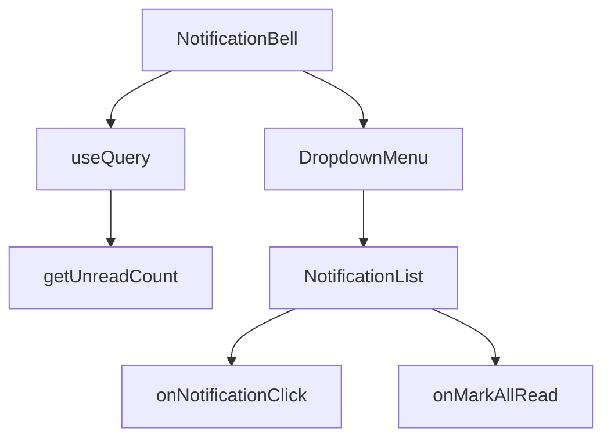
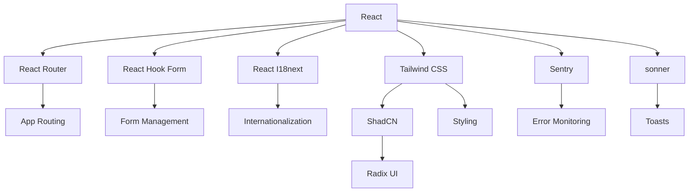

# Frontend Architecture

<cite>
**Referenced Files in This Document**   
- [App.tsx](file://src/client/App.tsx)
- [PublicLayout.tsx](file://src/client/layouts/PublicLayout.tsx)
- [AuthLayout.tsx](file://src/client/layouts/AuthLayout.tsx)
- [PlatformLayout.tsx](file://src/client/layouts/PlatformLayout.tsx)
- [tailwind.config.js](file://tailwind.config.js)
- [components.json](file://components.json)
- [useColorMode.tsx](file://src/client/hooks/useColorMode.tsx)
- [useToast.tsx](file://src/client/hooks/useToast.tsx)
- [config.ts](file://src/client/i18n/config.ts)
- [DashboardPage.tsx](file://src/client/pages/DashboardPage.tsx)
- [NavBar.tsx](file://src/client/components/NavBar/NavBar.tsx)
- [NotificationBell.tsx](file://src/client/components/notifications/NotificationBell.tsx)
- [useLocalStorage.tsx](file://src/client/hooks/useLocalStorage.tsx)
</cite>

## Table of Contents
1. [Introduction](#introduction)
2. [Project Structure](#project-structure)
3. [Core Components](#core-components)
4. [Architecture Overview](#architecture-overview)
5. [Detailed Component Analysis](#detailed-component-analysis)
6. [Dependency Analysis](#dependency-analysis)
7. [Performance Considerations](#performance-considerations)
8. [Troubleshooting Guide](#troubleshooting-guide)
9. [Conclusion](#conclusion)

## Introduction
This document provides comprehensive architectural documentation for the React frontend of SentinelIQ, a sophisticated security intelligence platform. The frontend is built using modern React patterns with TypeScript and functional components enhanced by hooks. The architecture follows a component-based design with a clear separation of concerns, leveraging ShadCN UI components and Tailwind CSS for consistent, accessible, and responsive user interfaces. The system implements multiple layout strategies for different user contexts, robust state management, internationalization support, and dark mode capabilities.

## Project Structure

The frontend application follows a well-organized directory structure that separates concerns and promotes maintainability. The core frontend code resides in the `src/client` directory, which contains components, layouts, pages, hooks, and configuration files.

**Diagram sources**
- [App.tsx](file://src/client/App.tsx)
- [components.json](file://components.json)

**Section sources**
- [App.tsx](file://src/client/App.tsx)
- [tailwind.config.js](file://tailwind.config.js)

## Core Components

The frontend architecture is built around reusable, composable components that follow the atomic design principles. The UI component library is based on ShadCN, which provides accessible and customizable components built on top of Radix UI and styled with Tailwind CSS. Key component categories include layout components, form elements, data display components, and interactive elements.

The application leverages React's functional component model with hooks for state management and side effects. TypeScript provides type safety across the codebase, ensuring robust interfaces and reducing runtime errors. The component hierarchy is designed to promote reusability and maintainability, with higher-order components encapsulating common functionality.

**Section sources**
- [App.tsx](file://src/client/App.tsx)
- [components.json](file://components.json)
- [src/client/components/ui](file://src/client/components/ui)

## Architecture Overview

The frontend architecture of SentinelIQ is designed as a single-page application (SPA) with client-side routing, multiple layout strategies, and a component-based structure. The architecture follows modern React best practices, utilizing functional components with hooks for state management and side effects.

The application implements a routing-based layout system that dynamically selects the appropriate layout component based on the current route. This approach allows for different user experiences in different contexts: public marketing pages, authentication flows, and authenticated platform interfaces. State management is handled through a combination of React hooks, context, and local storage, while internationalization is implemented using i18next with language detection and persistence.

**Diagram sources**
- [App.tsx](file://src/client/App.tsx)
- [layouts/PublicLayout.tsx](file://src/client/layouts/PublicLayout.tsx)
- [layouts/AuthLayout.tsx](file://src/client/layouts/AuthLayout.tsx)
- [layouts/PlatformLayout.tsx](file://src/client/layouts/PlatformLayout.tsx)

## Detailed Component Analysis

### Layout System Analysis

The layout system in SentinelIQ is designed to provide different user experiences based on the context of the current route. The application uses a root App component that determines which layout to render based on the current pathname, enabling a seamless transition between different application states.

#### PublicLayout Component
The PublicLayout is used for marketing and informational pages that are accessible without authentication. It includes the main navigation bar with marketing-focused navigation items and provides a full-width content area for landing pages and documentation.

**Diagram sources**
- [PublicLayout.tsx](file://src/client/layouts/PublicLayout.tsx)
- [NavBar.tsx](file://src/client/components/NavBar/NavBar.tsx)

#### AuthLayout Component
The AuthLayout is used for authentication-related pages such as login, signup, and password reset. This layout is minimal, containing only the main content area without navigation elements, focusing the user's attention on the authentication task.

**Diagram sources**
- [AuthLayout.tsx](file://src/client/layouts/AuthLayout.tsx)

#### PlatformLayout Component
The PlatformLayout is used for all authenticated platform pages, providing a consistent interface with the platform navigation bar and workspace context. This layout ensures that users have access to platform features and navigation while working within the application.

**Diagram sources**
- [PlatformLayout.tsx](file://src/client/layouts/PlatformLayout.tsx)

**Section sources**
- [App.tsx](file://src/client/App.tsx#L56-L115)
- [PublicLayout.tsx](file://src/client/layouts/PublicLayout.tsx)
- [AuthLayout.tsx](file://src/client/layouts/AuthLayout.tsx)
- [PlatformLayout.tsx](file://src/client/layouts/PlatformLayout.tsx)

### UI Component Library

The UI component library is built on ShadCN, which provides a collection of reusable components based on Radix UI and styled with Tailwind CSS. This approach ensures accessibility, responsiveness, and consistency across the application.

#### Form Components
The form components include input fields, checkboxes, select dropdowns, and form validation utilities. These components are designed to work seamlessly with React Hook Form for efficient form state management and validation.

#### Data Display Components
Data display components include tables, cards, badges, and progress indicators. The table component supports sorting, filtering, and pagination, while cards provide a consistent way to present information in a structured format.

#### Notification Components
The notification system includes a notification bell component that displays unread counts and a dropdown list of recent notifications. This component uses polling to keep the unread count updated and provides actions for marking notifications as read.

**Diagram sources**
- [NotificationBell.tsx](file://src/client/components/notifications/NotificationBell.tsx)
- [useQuery](file://src/client/hooks/useQuery.ts)

**Section sources**
- [NotificationBell.tsx](file://src/client/components/notifications/NotificationBell.tsx)
- [components/ui](file://src/client/components/ui)

## Dependency Analysis

The frontend architecture relies on a well-defined set of dependencies that support the core functionality of the application. The dependency management follows modern best practices, with clear separation between production dependencies and development tools.

**Diagram sources**
- [package.json](file://package.json)
- [App.tsx](file://src/client/App.tsx)
- [tailwind.config.js](file://tailwind.config.js)

**Section sources**
- [package.json](file://package.json)
- [App.tsx](file://src/client/App.tsx)
- [tailwind.config.js](file://tailwind.config.js)

## Performance Considerations

The application implements several performance optimization techniques to ensure a responsive and efficient user experience. These optimizations include code splitting, lazy loading of components, and efficient state management patterns.

The routing system enables code splitting by allowing different parts of the application to be loaded on demand. Layout components are only loaded when needed, reducing the initial bundle size for different user contexts. The use of React.memo and useMemo helps prevent unnecessary re-renders, while the query caching mechanism reduces redundant API calls.

The application also implements performance monitoring through Sentry, which tracks frontend performance metrics including page load times, API response times, and user interactions. This monitoring helps identify performance bottlenecks and optimize critical user journeys.

## Troubleshooting Guide

When troubleshooting issues in the SentinelIQ frontend, consider the following common scenarios and their solutions:

1. **Layout not rendering correctly**: Check the route configuration and ensure the correct layout is being selected based on the current pathname. Verify that the layout components are properly imported and referenced in the App component.

2. **Internationalization not working**: Ensure that the i18n configuration is properly initialized and that translation files exist for the requested language. Check the language detection settings and localStorage persistence.

3. **Dark mode not persisting**: Verify that the useColorMode hook is properly implemented and that the color theme is being stored in localStorage. Check for any CSS conflicts that might override the dark mode styles.

4. **Notification count not updating**: Confirm that the polling interval in the NotificationBell component is functioning correctly and that the API endpoint for unread counts is returning the expected data.

5. **Form validation issues**: Ensure that React Hook Form is properly configured and that validation rules are correctly defined. Check for any conflicts between client-side validation and server-side validation.

**Section sources**
- [useColorMode.tsx](file://src/client/hooks/useColorMode.tsx)
- [config.ts](file://src/client/i18n/config.ts)
- [NotificationBell.tsx](file://src/client/components/notifications/NotificationBell.tsx)
- [useLocalStorage.tsx](file://src/client/hooks/useLocalStorage.tsx)

## Conclusion

The frontend architecture of SentinelIQ demonstrates a modern, well-structured React application that follows best practices for component design, state management, and user experience. The component-based architecture with TypeScript provides type safety and maintainability, while the layout system enables different user experiences for various application contexts.

The integration of ShadCN and Tailwind CSS ensures a consistent, accessible, and responsive UI across all components. The state management approach using React hooks and local storage provides a balance between simplicity and functionality, while the internationalization and dark mode features enhance accessibility and user preference support.

The architecture is designed for scalability and maintainability, with clear separation of concerns and reusable components. Future enhancements could include server-side rendering for improved SEO and initial load performance, as well as additional performance optimizations such as more aggressive code splitting and lazy loading strategies.