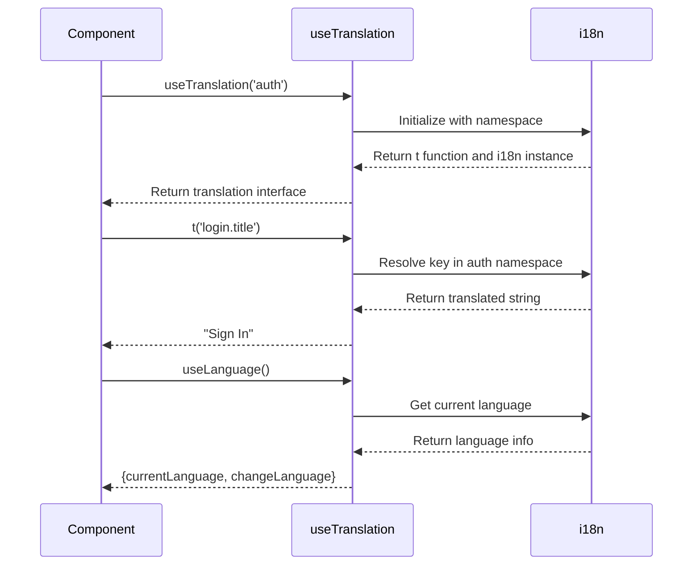

# Internationalization

<cite>
**Referenced Files in This Document**   
- [config.ts](file://src/client/i18n/config.ts)
- [locales.d.ts](file://src/client/i18n/locales.d.ts)
- [common.ts](file://src/client/i18n/locales/common.ts)
- [auth.ts](file://src/client/i18n/locales/auth.ts)
- [dashboard.ts](file://src/client/i18n/locales/dashboard.ts)
- [useTranslation.ts](file://src/client/hooks/useTranslation.ts)
- [LanguageSwitcher.tsx](file://src/client/components/LanguageSwitcher.tsx)
- [LoginPage.tsx](file://src/client/pages/auth/LoginPage.tsx)
- [DashboardPage.tsx](file://src/client/pages/DashboardPage.tsx)
- [common.json](file://src/client/i18n/locales/en/common.json)
- [auth.json](file://src/client/i18n/locales/en/auth.json)
- [dashboard.json](file://src/client/i18n/locales/en/dashboard.json)
</cite>

## Table of Contents
1. [Introduction](#introduction)
2. [Configuration Setup](#configuration-setup)
3. [Translation File Structure](#translation-file-structure)
4. [TypeScript Type Definitions](#typescript-type-definitions)
5. [Translation Hook Implementation](#translation-hook-implementation)
6. [Language Switcher Component](#language-switcher-component)
7. [Dynamic Content Translation Examples](#dynamic-content-translation-examples)
8. [Best Practices for Translation Management](#best-practices-for-translation-management)
9. [Adding New Languages](#adding-new-languages)
10. [Conclusion](#conclusion)

## Introduction

The internationalization (i18n) implementation in SentinelIQ provides a comprehensive system for supporting multiple languages across the application. The system is built on i18next with React integration, enabling dynamic language switching, namespace-based organization of translations, and type-safe access to translation keys. This documentation details the complete i18n architecture, from configuration and file structure to component implementation and best practices.

**Section sources**
- [config.ts](file://src/client/i18n/config.ts)
- [README.md](file://src/client/i18n/README.md)

## Configuration Setup

The i18n configuration in `i18n/config.ts` establishes the core behavior of the internationalization system. The configuration imports translation resources for all supported languages and namespaces, then initializes the i18next instance with specific settings for language detection, fallback, and interpolation.

Language detection follows a prioritized order: first checking localStorage for a previously selected language, then falling back to the browser's navigator language. The detected language is cached in localStorage to maintain user preference across sessions. The system supports two languages: English (en) as the default and Portuguese (pt) as the secondary language.

The configuration defines a fallback language (English) to ensure that all translation keys have a default value when a translation is missing in the current language. Multiple namespaces are registered including common, auth, dashboard, billing, analytics, admin, workspace, audit, aegis, and eclipse, allowing for domain-specific organization of translation keys.

Interpolation is configured with `escapeValue: false` since React handles XSS protection, allowing direct rendering of variables within translation strings. The React integration is configured with `useSuspense: false` to prevent component suspension during translation loading.

```mermaid
flowchart TD
A[Application Start] --> B[Initialize i18next]
B --> C[Detect Language]
C --> D{Language in localStorage?}
D --> |Yes| E[Use Stored Language]
D --> |No| F[Use Browser Language]
F --> G{Supported Language?}
G --> |Yes| H[Set Language]
G --> |No| I[Use Fallback (en)]
E --> J[Load Translation Resources]
H --> J
I --> J
J --> K[i18n Ready for Use]
```

**Diagram sources**
- [config.ts](file://src/client/i18n/config.ts#L44-L66)

**Section sources**
- [config.ts](file://src/client/i18n/config.ts#L1-L69)

## Translation File Structure

The translation files are organized in the `locales/` directory with a clear structure separating languages and domains. The directory contains subdirectories for each supported language (`en/` and `pt/`), with JSON files for each domain-specific namespace.

Each language directory contains JSON files for the following domains:
- `common.json`: Shared UI elements, actions, status messages, and validation texts
- `auth.json`: Authentication-related texts (login, signup, password reset)
- `dashboard.json`: Dashboard-specific content and greetings
- `billing.json`: Subscription and payment-related texts
- `analytics.json`: Analytics and reporting terminology
- `admin.json`: Administrative functions and system management
- `eclipse.json`: Eclipse module-specific terminology
- `workspace.json`: Workspace management and settings

The JSON structure uses a nested object format with logical grouping of related translation keys. For example, the `common.json` file groups keys under categories like "app", "navigation", "actions", "status", "messages", "validation", and "dates". This hierarchical organization improves maintainability and makes it easier to locate specific translations.

The system follows a consistent naming convention across all translation files, using lowercase with words separated by underscores or camelCase for multi-word keys. This consistency ensures predictability when accessing translation keys from components.


**Diagram sources**
- [locales](file://src/client/i18n/locales)

**Section sources**
- [common.json](file://src/client/i18n/locales/en/common.json)
- [auth.json](file://src/client/i18n/locales/en/auth.json)
- [dashboard.json](file://src/client/i18n/locales/en/dashboard.json)

## TypeScript Type Definitions

The i18n system includes comprehensive TypeScript type definitions to ensure type safety when accessing translations. The `locales.d.ts` file extends the i18next module with custom type options that define the default namespace and the structure of all translation resources.

Each domain-specific translation file (e.g., `common.ts`, `auth.ts`) exports constant objects (`commonEN`, `commonPT`, `authEN`, `authPT`, etc.) that contain the actual translation values. These objects are declared with `as const` to preserve their literal types, enabling full type inference and preventing accidental modifications.

The type system defines the default namespace as 'common', meaning that when no namespace is specified in the useTranslation hook, the common namespace is used by default. All available namespaces are explicitly listed in the type definition, providing autocomplete and type checking for namespace selection.

This type-safe approach prevents runtime errors caused by misspelled translation keys and provides developers with immediate feedback in their IDEs. The type system also ensures that translations in different languages maintain the same structure, reducing the risk of missing keys in specific language versions.


**Diagram sources**
- [locales.d.ts](file://src/client/i18n/locales.d.ts#L1-L35)
- [common.ts](file://src/client/i18n/locales/common.ts)
- [auth.ts](file://src/client/i18n/locales/auth.ts)

**Section sources**
- [locales.d.ts](file://src/client/i18n/locales.d.ts#L1-L35)
- [common.ts](file://src/client/i18n/locales/common.ts#L1-L196)
- [auth.ts](file://src/client/i18n/locales/auth.ts#L1-L122)

## Translation Hook Implementation

The `useTranslation` hook in `hooks/useTranslation.ts` provides a simplified interface to the i18next translation system. This custom hook wraps the standard `useI18NextTranslation` hook from react-i18next, making it easier to use throughout the application.

The primary function `useTranslation()` accepts an optional namespace or array of namespaces as a parameter. When a single namespace is provided, all translation keys are resolved within that namespace. When multiple namespaces are provided, keys can be accessed using the namespace prefix (e.g., 'common:actions.save').

The hook also exports a `useLanguage` function that provides access to the current language state and the ability to change the language programmatically. This function returns the current language code, a function to change the language, and a list of supported languages.

The implementation includes JSDoc comments with usage examples, demonstrating common patterns such as basic translation, interpolation with dynamic variables, and using multiple namespaces. This documentation helps developers understand how to properly use the hook in various scenarios.



**Diagram sources**
- [useTranslation.ts](file://src/client/hooks/useTranslation.ts#L1-L45)

**Section sources**
- [useTranslation.ts](file://src/client/hooks/useTranslation.ts#L1-L45)

## Language Switcher Component

The `LanguageSwitcher` component provides a user interface for changing the application language. Implemented as a dropdown menu, it displays available languages with their corresponding flags and names. The component is designed to be easily integrated into navigation bars or user preference panels.

The component uses the i18n instance directly from the useTranslation hook to access the current language and change the language setting. It defines a list of supported languages with their codes, display names, and flag emojis. The current language is highlighted in the dropdown menu for better user feedback.

When a user selects a different language, the component calls `i18n.changeLanguage()` with the selected language code. This triggers a re-render of all components using translations, updating the entire interface to the new language. The language preference is automatically saved to localStorage by the i18next language detector, ensuring persistence across sessions.

The component uses UI primitives from the application's component library, including DropdownMenu and Button components, ensuring visual consistency with the rest of the application. The accessibility is enhanced with appropriate ARIA labels and keyboard navigation support.

```mermaid
flowchart TD
A[LanguageSwitcher Render] --> B[Get Current Language]
B --> C[Display Flag Icon]
C --> D[User Clicks Dropdown]
D --> E[Show Language Options]
E --> F{User Selects Language?}
F --> |Yes| G[Call i18n.changeLanguage()]
G --> H[Update Interface Language]
H --> I[Save to localStorage]
I --> J[Component Updates]
F --> |No| K[Close Dropdown]
```

**Diagram sources**
- [LanguageSwitcher.tsx](file://src/client/components/LanguageSwitcher.tsx#L1-L50)

**Section sources**
- [LanguageSwitcher.tsx](file://src/client/components/LanguageSwitcher.tsx#L1-L50)

## Dynamic Content Translation Examples

The implementation demonstrates effective patterns for translating dynamic content in components. The `LoginPage.tsx` example shows how to use the useTranslation hook with a specific namespace ('auth') to access authentication-related translations. The component uses translation keys for various UI elements including the "Don't have an account?" text and the "Sign up" link.

The `DashboardPage.tsx` example illustrates more advanced usage patterns, including multiple namespaces and dynamic interpolation. The component imports both 'dashboard' and 'common' namespaces, allowing access to translation keys from both domains. It uses the `t()` function with namespace prefixes (e.g., 'common:status.loading') to resolve keys from different namespaces.

Dynamic interpolation is demonstrated in the welcome message: `t('dashboard:welcome', { name: workspace.name })`. This pattern allows personalized content while maintaining translation capabilities. The translation string contains a placeholder (`{{name}}`) that is replaced with the actual workspace name at runtime.

The component also shows conditional translation usage, where some text elements use translation keys while others use hardcoded strings. This selective approach balances the need for internationalization with development efficiency, focusing translation efforts on user-facing content while keeping technical identifiers in English.


**Diagram sources**
- [LoginPage.tsx](file://src/client/pages/auth/LoginPage.tsx#L1-L31)
- [DashboardPage.tsx](file://src/client/pages/DashboardPage.tsx#L1-L160)

**Section sources**
- [LoginPage.tsx](file://src/client/pages/auth/LoginPage.tsx#L1-L31)
- [DashboardPage.tsx](file://src/client/pages/DashboardPage.tsx#L1-L160)

## Best Practices for Translation Management

The i18n implementation follows several best practices for effective translation management. The system uses a consistent structure across all translation files, with the same key hierarchy in both English and Portuguese versions. This consistency ensures that all languages have complete coverage and reduces the risk of missing translations.

Translation keys are organized by domain and function, making it easier to locate and update specific texts. Common UI elements are grouped in the 'common' namespace, while feature-specific texts are organized in dedicated namespaces like 'auth', 'dashboard', and 'billing'. This separation of concerns improves maintainability and reduces conflicts during collaborative development.

The system supports dynamic variables through interpolation, allowing personalized content while maintaining translation integrity. Pluralization is handled through separate keys for different forms, following the conventions of each language. Context-specific variations of the same word are distinguished with descriptive suffixes to ensure accurate translation.

The implementation includes comprehensive documentation in the i18n README file, providing examples and guidelines for developers. The type-safe approach with TypeScript prevents many common errors and provides immediate feedback during development. Regular audits of translation files ensure completeness and consistency across all languages.

**Section sources**
- [README.md](file://src/client/i18n/README.md#L1-L152)
- [common.ts](file://src/client/i18n/locales/common.ts)
- [auth.ts](file://src/client/i18n/locales/auth.ts)

## Adding New Languages

Adding new languages to the SentinelIQ application follows a structured process to ensure consistency and completeness. The first step is to create a new directory in the `locales/` folder using the standard language code (e.g., 'es' for Spanish). Within this directory, JSON files should be created for each existing namespace (common.json, auth.json, dashboard.json, etc.).

For each translation file, all keys from the English version should be replicated with their appropriate translations. The corresponding TypeScript definition files (e.g., `common.ts`) must be updated to include the new language constants (e.g., `commonES`). These constants should be exported alongside the existing language exports.

The i18next configuration in `config.ts` needs to be updated to include the new language in the resources object, mapping each namespace to its corresponding translation object. The language should also be added to the list of supported languages in the `useLanguage` hook.

After implementation, thorough testing is required to verify that all translations appear correctly in the UI and that language switching works as expected. Automated tests should check for missing keys and ensure that the type system correctly validates the new language additions.

**Section sources**
- [config.ts](file://src/client/i18n/config.ts)
- [locales](file://src/client/i18n/locales)
- [useTranslation.ts](file://src/client/hooks/useTranslation.ts)

## Conclusion

The internationalization implementation in SentinelIQ provides a robust, scalable solution for multi-language support. By leveraging i18next with React integration, the system offers a comprehensive approach to translation management with features like language detection, fallback mechanisms, and namespace organization.

The architecture balances developer experience with user needs, providing type safety through TypeScript while enabling seamless language switching for end users. The modular structure with domain-specific namespaces makes it easy to maintain and extend the translation system as the application grows.

Key strengths of the implementation include its consistency across languages, comprehensive documentation, and adherence to best practices in internationalization. The system is designed to be maintainable, with clear patterns for adding new translations and supporting additional languages in the future.