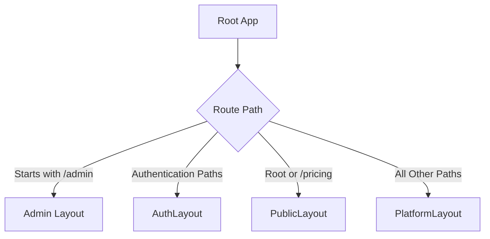
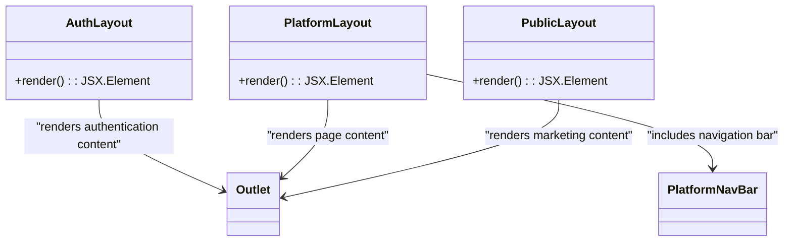
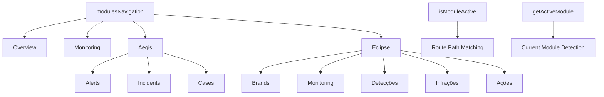
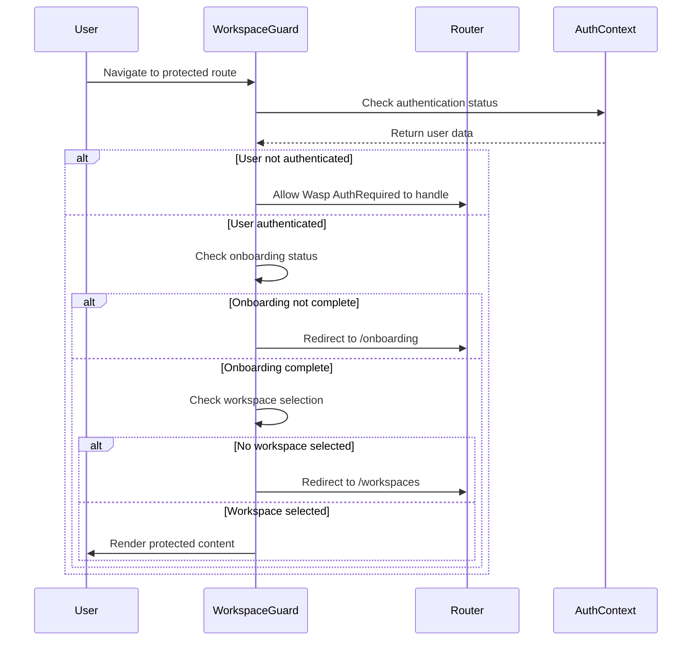
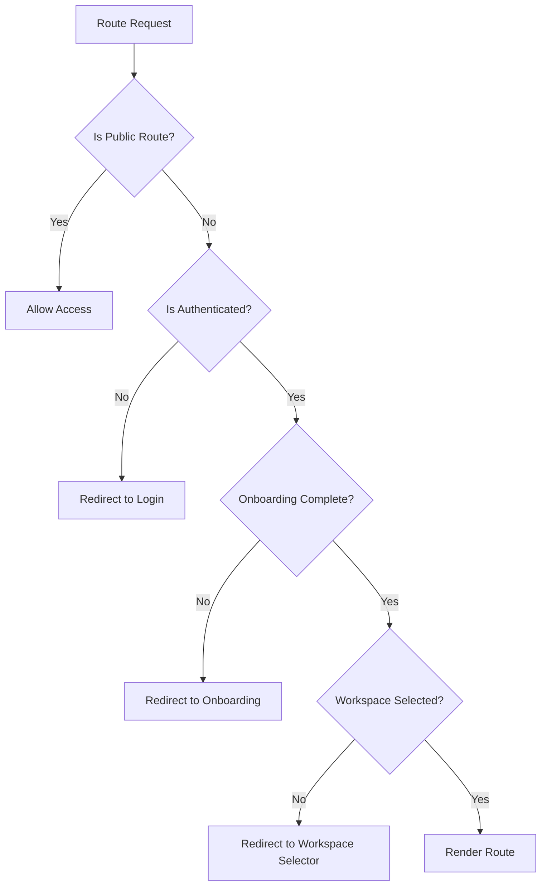

# Routing and Navigation

<cite>
**Referenced Files in This Document**   
- [App.tsx](file://src/client/App.tsx)
- [modulesNavigation.ts](file://src/client/config/modulesNavigation.ts)
- [AuthLayout.tsx](file://src/client/layouts/AuthLayout.tsx)
- [PlatformLayout.tsx](file://src/client/layouts/PlatformLayout.tsx)
- [WorkspaceGuard.tsx](file://src/client/components/WorkspaceGuard.tsx)
- [PlatformNavBar.tsx](file://src/client/components/PlatformNavBar/PlatformNavBar.tsx)
- [WorkspaceNavigation.tsx](file://src/client/pages/workspace/components/WorkspaceNavigation.tsx)
- [DashboardPage.tsx](file://src/client/pages/DashboardPage.tsx)
- [WorkspaceSelectorPage.tsx](file://src/client/pages/workspace/selector/WorkspaceSelectorPage.tsx)
- [WorkspaceLayout.tsx](file://src/client/pages/workspace/WorkspaceLayout.tsx)
</cite>

## Table of Contents
1. [Introduction](#introduction)
2. [Routing Structure](#routing-structure)
3. [Navigation Layouts](#navigation-layouts)
4. [Dynamic Module Navigation](#dynamic-module-navigation)
5. [WorkspaceGuard Implementation](#workspaceguard-implementation)
6. [Route Transitions and Parameter Handling](#route-transitions-and-parameter-handling)
7. [Navigation Guards and Authentication](#navigation-guards-and-authentication)
8. [Lazy Loading and Performance Optimization](#lazy-loading-and-performance-optimization)
9. [SEO Considerations](#seo-considerations)
10. [Adding New Routes](#adding-new-routes)

## Introduction
The routing and navigation system in SentinelIQ's frontend is designed to provide a seamless user experience across different application states, authentication levels, and workspace contexts. The system implements a sophisticated routing structure with multiple layout types, role-based access control, and dynamic module navigation. This documentation provides a comprehensive overview of the routing architecture, navigation patterns, and implementation details that enable the platform's complex navigation requirements.

**Section sources**
- [App.tsx](file://src/client/App.tsx#L49-L55)

## Routing Structure
The routing structure in SentinelIQ is organized around three primary route categories: public routes, authentication routes, and protected platform routes. The root App component determines the appropriate layout based on the current route path, enabling different user experiences for marketing pages, authentication flows, and authenticated platform functionality.

Public routes include the landing page and pricing information, accessible to all users without authentication. Authentication routes encompass login, signup, password reset, and email verification flows, providing a streamlined onboarding experience. Protected routes require authentication and workspace context, including the dashboard, modules, and workspace management functionality.

The routing logic in App.tsx uses the useLocation hook to determine the current path and selects the appropriate layout component. This approach allows for clean separation of concerns between different application states while maintaining a consistent user experience.

**Diagram sources**
- [App.tsx](file://src/client/App.tsx#L63-L88)

**Section sources**
- [App.tsx](file://src/client/App.tsx#L56-L88)

## Navigation Layouts
SentinelIQ implements three primary navigation layouts to support different user contexts and application states: AuthLayout, PlatformLayout, and PublicLayout. Each layout serves a specific purpose and provides the appropriate user interface elements for its context.

The AuthLayout is used for authentication pages and provides a minimal interface without navigation elements, focusing the user's attention on the authentication task. It consists of a simple container that renders the current route's content without additional navigation components.

The PlatformLayout serves as the base layout for all authenticated platform pages and includes the PlatformNavBar component, which provides global navigation, user controls, and workspace context. This layout ensures consistent navigation across all protected routes while maintaining access to essential user functionality.

**Diagram sources**
- [AuthLayout.tsx](file://src/client/layouts/AuthLayout.tsx#L7-L15)
- [PlatformLayout.tsx](file://src/client/layouts/PlatformLayout.tsx#L8-L17)

**Section sources**
- [AuthLayout.tsx](file://src/client/layouts/AuthLayout.tsx)
- [PlatformLayout.tsx](file://src/client/layouts/PlatformLayout.tsx)

## Dynamic Module Navigation
The dynamic module navigation system in SentinelIQ is driven by the modulesNavigation configuration in modulesNavigation.ts. This centralized configuration defines the structure of the platform's modules, including their routes, icons, colors, and hierarchical organization. The system enables easy addition and modification of modules without requiring changes to the core navigation components.

The modulesNavigation configuration is an array of ModuleConfig objects, each representing a top-level module with optional sub-items. Each module includes an ID, name, icon, route, color, and description. Sub-items provide additional navigation options within a module, creating a hierarchical navigation structure.

The system includes helper functions like isModuleActive and getActiveModule that determine the current active module based on the route path. These functions are used by navigation components to highlight the current module and provide context-aware navigation.

**Diagram sources**
- [modulesNavigation.ts](file://src/client/config/modulesNavigation.ts#L32-L133)
- [modulesNavigation.ts](file://src/client/config/modulesNavigation.ts#L135-L146)

**Section sources**
- [modulesNavigation.ts](file://src/client/config/modulesNavigation.ts)

## WorkspaceGuard Implementation
The WorkspaceGuard component ensures proper workspace context before rendering protected content, implementing a multi-step validation process to guide users through the application flow. It prevents access to protected routes when users lack the necessary context, redirecting them to appropriate onboarding or workspace selection pages.

The guard checks several conditions in sequence: authentication status, onboarding completion, and workspace selection. Users who haven't completed onboarding are redirected to the onboarding flow, while authenticated users without an active workspace are directed to the workspace selector. This ensures that users always have the necessary context before accessing protected functionality.

The guard also handles special cases for admin users and public routes, allowing appropriate access while maintaining security. It uses React's useEffect hook to perform these checks whenever the user authentication state or location changes, ensuring real-time validation of access requirements.

**Diagram sources**
- [WorkspaceGuard.tsx](file://src/client/components/WorkspaceGuard.tsx#L20-L81)

**Section sources**
- [WorkspaceGuard.tsx](file://src/client/components/WorkspaceGuard.tsx)

## Route Transitions and Parameter Handling
SentinelIQ's routing system handles route transitions and parameter management through React Router DOM's built-in mechanisms combined with custom hooks and components. The system supports smooth navigation between routes, hash-based scrolling, and parameterized routes for dynamic content loading.

Route transitions are managed through the useNavigate hook, which provides programmatic navigation capabilities. Components like DashboardPage use this hook to handle button clicks and other user interactions that require navigation. The system also supports query parameters for filtering and state management, such as the tab parameter in workspace settings URLs.

Hash-based navigation is implemented in the App component to support anchor links within pages. When a route includes a hash fragment, the component scrolls to the corresponding element after the route change. This enhances user experience by maintaining scroll position and supporting deep linking within long pages.

**Section sources**
- [App.tsx](file://src/client/App.tsx#L90-L98)
- [DashboardPage.tsx](file://src/client/pages/DashboardPage.tsx#L13-L14)

## Navigation Guards and Authentication
The navigation guard system in SentinelIQ combines client-side routing logic with authentication state management to control access to different parts of the application. The system implements a multi-layered approach to access control, ensuring that users can only access routes appropriate to their authentication state and permissions.

The primary navigation guard is implemented in the WorkspaceGuard component, which sits above the routing system and intercepts navigation to protected routes. It works in conjunction with Wasp's AuthRequired component to provide comprehensive access control. Public routes are explicitly defined and excluded from workspace requirements, allowing access to marketing and authentication pages.

Role-based access is implemented through conditional rendering in navigation components like WorkspaceNavigation, which filters menu items based on the user's role within the current workspace. This ensures that users only see navigation options they have permission to access, providing a clean and secure user experience.

**Diagram sources**
- [WorkspaceGuard.tsx](file://src/client/components/WorkspaceGuard.tsx#L6-L18)
- [WorkspaceNavigation.tsx](file://src/client/pages/workspace/components/WorkspaceNavigation.tsx#L56-L58)

**Section sources**
- [WorkspaceGuard.tsx](file://src/client/components/WorkspaceGuard.tsx)
- [WorkspaceNavigation.tsx](file://src/client/pages/workspace/components/WorkspaceNavigation.tsx)

## Lazy Loading and Performance Optimization
While the current implementation does not explicitly show code-splitting or dynamic imports, the routing architecture is designed to support lazy loading for performance optimization. The modular structure of the application, with clearly separated components and routes, provides an ideal foundation for implementing code splitting.

Future enhancements could include dynamic import statements for route components, loading them only when needed. This would reduce the initial bundle size and improve application startup time, particularly for users who primarily access a subset of the platform's functionality.

The use of React's Suspense component in conjunction with lazy imports could provide loading states during component loading, enhancing the user experience during navigation. Route-based code splitting would allow the application to load only the necessary code for the current route, significantly improving performance for large-scale deployments.

**Section sources**
- [App.tsx](file://src/client/App.tsx)

## SEO Considerations
The client-side routing implementation in SentinelIQ presents specific SEO challenges that are addressed through various strategies. While the application is primarily a single-page application with client-side routing, it includes provisions for search engine optimization and social media sharing.

The application likely uses server-side rendering or static site generation for public routes like the landing page and pricing information, ensuring these pages are crawlable by search engines. For protected routes, the application relies on proper meta tags and structured data to provide context when links are shared on social media platforms.

The use of semantic HTML and proper heading hierarchy in components like LandingPage helps search engines understand the content structure. Additionally, the application may implement dynamic meta tags that update based on the current route, providing appropriate titles and descriptions for social sharing.

**Section sources**
- [LandingPage.tsx](file://src/client/pages/landing/LandingPage.tsx)

## Adding New Routes
Adding new routes to SentinelIQ's navigation system follows a structured process that ensures consistency and proper integration with the existing architecture. The process varies depending on the type of route being added: public, authentication, or protected platform route.

For protected routes, developers must first ensure the route is included in the appropriate navigation configuration, such as modulesNavigation.ts for module-related routes. The new route should be added to the relevant module's subItems array with proper configuration for name, icon, route, and color.

New routes should be integrated with the existing layout system by ensuring they are rendered within the appropriate layout component. Protected routes automatically use the PlatformLayout through the routing configuration in App.tsx, while authentication routes use AuthLayout.

When adding routes that require specific permissions, developers should implement appropriate access controls using the role-based filtering system in navigation components. This ensures that users only see and can access routes for which they have the necessary permissions.

**Section sources**
- [modulesNavigation.ts](file://src/client/config/modulesNavigation.ts)
- [App.tsx](file://src/client/App.tsx)