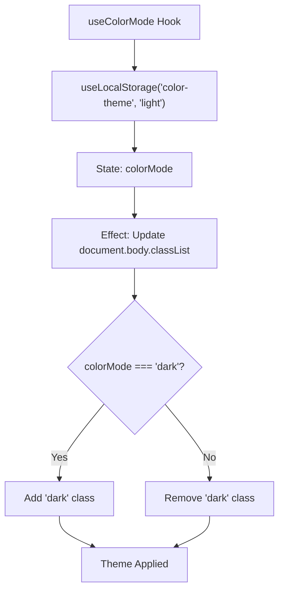
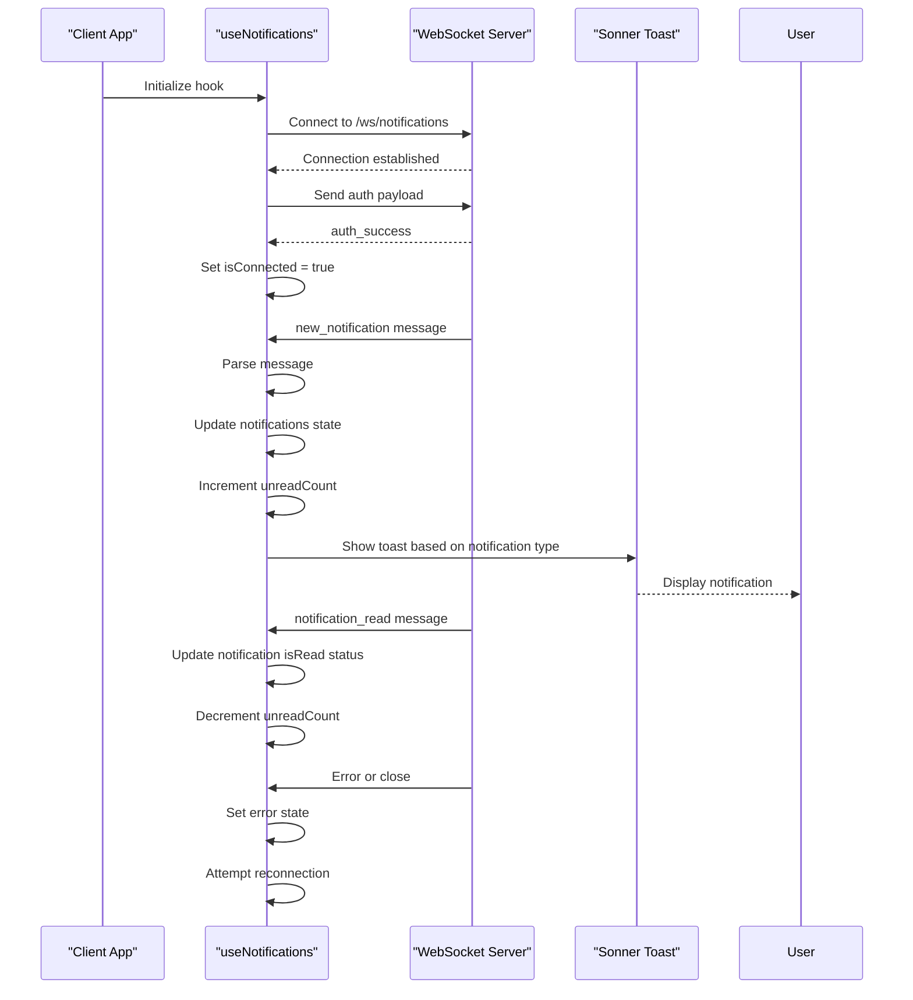
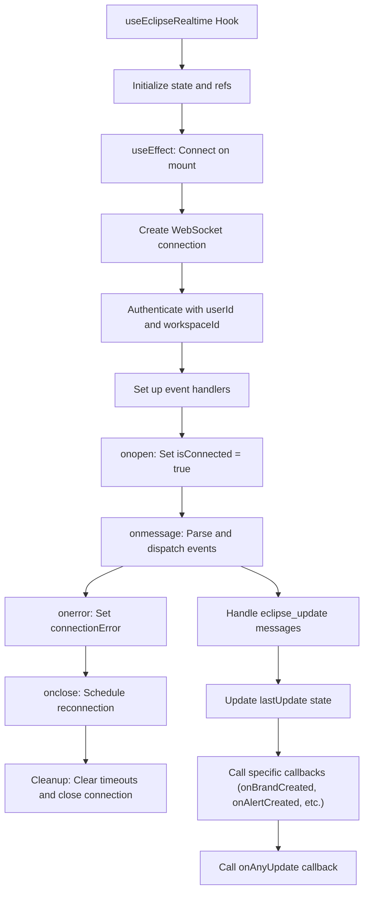
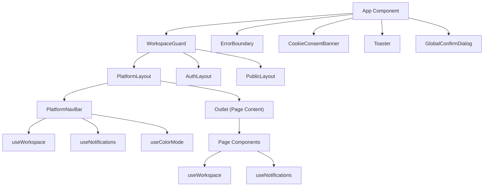

# State Management

<cite>
**Referenced Files in This Document**   
- [useWorkspace.ts](file://src/client/hooks/useWorkspace.ts)
- [useEclipseRealtime.ts](file://src/client/hooks/useEclipseRealtime.ts)
- [useColorMode.tsx](file://src/client/hooks/useColorMode.tsx)
- [useNotifications.ts](file://src/client/hooks/useNotifications.ts)
- [useRealtimeUpdates.ts](file://src/client/hooks/useRealtimeUpdates.ts)
- [useLocalStorage.tsx](file://src/client/hooks/useLocalStorage.tsx)
- [App.tsx](file://src/client/App.tsx)
- [NotificationBell.tsx](file://src/client/components/notifications/NotificationBell.tsx)
- [NotificationList.tsx](file://src/client/components/notifications/NotificationList.tsx)
- [DarkModeSwitcher.tsx](file://src/client/components/DarkModeSwitcher.tsx)
- [WorkspaceGuard.tsx](file://src/client/components/WorkspaceGuard.tsx)
</cite>

## Table of Contents
1. [Introduction](#introduction)
2. [Core Custom Hooks](#core-custom-hooks)
3. [State Propagation and Side-Effect Management](#state-propagation-and-side-effect-management)
4. [Global vs Local State Management](#global-vs-local-state-management)
5. [Re-render Optimization and Memoization](#re-render-optimization-and-memoization)
6. [Common Issues and Debugging Strategies](#common-issues-and-debugging-strategies)
7. [Conclusion](#conclusion)

## Introduction
SentinelIQ implements a comprehensive React state management system using custom hooks to handle multi-tenancy, theme persistence, real-time notifications, and WebSocket-driven data synchronization. The application leverages a combination of useState, useContext, useReducer, and custom hooks to manage both local and global state across its complex feature set. This documentation details the implementation patterns, best practices, and architectural decisions behind SentinelIQ's state management system, focusing on key custom hooks that enable seamless user experiences across workspaces, themes, and real-time data updates.

## Core Custom Hooks

### useWorkspace for Multi-tenancy Context
The `useWorkspace` hook provides access to the current workspace context in SentinelIQ's multi-tenant architecture. It retrieves workspace data through Wasp's query operations, returning the current workspace object, its members, loading state, and error information. This hook is essential for maintaining workspace isolation and enabling features that depend on workspace-specific data. It serves as the foundation for workspace-aware components and operations throughout the application.

**Section sources**
- [useWorkspace.ts](file://src/client/hooks/useWorkspace.ts#L1-L28)

### useColorMode for Theme Persistence
The `useColorMode` hook manages theme persistence by synchronizing the application's color mode with localStorage. It uses the `useLocalStorage` custom hook to store and retrieve the user's preferred theme (light or dark), applying the appropriate CSS class to the document body. This implementation ensures theme consistency across sessions and provides a seamless user experience when switching between light and dark modes.

**Diagram sources**
- [useColorMode.tsx](file://src/client/hooks/useColorMode.tsx#L1-L19)
- [useLocalStorage.tsx](file://src/client/hooks/useLocalStorage.tsx#L1-L44)

**Section sources**
- [useColorMode.tsx](file://src/client/hooks/useColorMode.tsx#L1-L19)
- [useLocalStorage.tsx](file://src/client/hooks/useLocalStorage.tsx#L1-L44)
- [DarkModeSwitcher.tsx](file://src/client/components/DarkModeSwitcher.tsx#L1-L57)

### useNotifications for Real-time Alert Handling
The `useNotifications` hook establishes a WebSocket connection for real-time notification delivery. It manages the connection lifecycle, authentication, message handling, and reconnection logic. The hook maintains state for notifications, unread count, connection status, and errors, while providing functions to add notifications, mark them as read, and reconnect. It integrates with the Sonner toast library to display notifications with appropriate styling based on their type (INFO, SUCCESS, WARNING, ERROR, CRITICAL).

**Diagram sources**
- [useNotifications.ts](file://src/client/hooks/useNotifications.ts#L1-L360)
- [NotificationBell.tsx](file://src/client/components/notifications/NotificationBell.tsx#L1-L51)
- [NotificationList.tsx](file://src/client/components/notifications/NotificationList.ts#L1-L177)

**Section sources**
- [useNotifications.ts](file://src/client/hooks/useNotifications.ts#L1-L360)

### useRealtimeUpdates for WebSocket-driven Data Synchronization
The `useRealtimeUpdates` hook provides a polling-based mechanism for real-time data synchronization. It allows components to subscribe to specific event types (alerts, incidents, cases, etc.) and register callback functions that execute at regular intervals. The hook manages subscriptions and polling intervals efficiently, ensuring that only one interval timer exists per event type. This pattern enables components to stay updated with the latest data without requiring constant manual refetching.

**Section sources**
- [useRealtimeUpdates.ts](file://src/client/hooks/useRealtimeUpdates.ts#L1-L121)

## State Propagation and Side-Effect Management

### Implementation in useWorkspace.ts
The `useWorkspace` hook demonstrates a clean pattern of state propagation by wrapping Wasp's query operation and exposing a simplified interface. It transforms the query result into a consistent return object with normalized properties (currentWorkspace, members, isLoading, error), making it easier for components to consume the data without handling the underlying query mechanics.

**Section sources**
- [useWorkspace.ts](file://src/client/hooks/useWorkspace.ts#L1-L28)

### Implementation in useEclipseRealtime.ts
The `useEclipseRealtime` hook exemplifies sophisticated side-effect management through its WebSocket implementation. It handles connection establishment, authentication, message parsing, event dispatching, and reconnection with exponential backoff. The hook uses useRef to maintain WebSocket references across renders, useCallback to memoize event handlers, and useEffect for lifecycle management. It also implements a secondary hook `useEclipseAutoRefresh` that simplifies common use cases by automatically triggering refetch functions when relevant events occur.

**Diagram sources**
- [useEclipseRealtime.ts](file://src/client/hooks/useEclipseRealtime.ts#L1-L220)

**Section sources**
- [useEclipseRealtime.ts](file://src/client/hooks/useEclipseRealtime.ts#L1-L220)

## Global vs Local State Management

### Global State with Context and Custom Hooks
SentinelIQ primarily uses custom hooks rather than React Context for global state management. The `useWorkspace`, `useNotifications`, and `useColorMode` hooks serve as global state providers, accessible to any component that imports them. This approach avoids the prop drilling problem while maintaining a clean dependency structure. The App component orchestrates these global states through higher-order components like WorkspaceGuard, which manages workspace selection and onboarding flow.

**Diagram sources**
- [App.tsx](file://src/client/App.tsx#L1-L116)
- [WorkspaceGuard.tsx](file://src/client/components/WorkspaceGuard.tsx#L1-L82)
- [PlatformLayout.tsx](file://src/client/layouts/PlatformLayout.tsx#L1-L18)

**Section sources**
- [App.tsx](file://src/client/App.tsx#L1-L116)
- [WorkspaceGuard.tsx](file://src/client/components/WorkspaceGuard.tsx#L1-L82)

### Local State with useState and useReducer
For local component state, SentinelIQ uses useState for simple state variables and effects. Components like NotificationList use useState to manage local UI state such as filter options (showUnreadOnly) and loading indicators. The pattern follows React best practices by keeping local state contained within components and using props to communicate with parent components or trigger global state updates.

**Section sources**
- [NotificationList.tsx](file://src/client/components/notifications/NotificationList.ts#L1-L177)

## Re-render Optimization and Memoization

### useCallback for Event Handler Stability
SentinelIQ extensively uses useCallback to prevent unnecessary re-renders caused by changing function references. The `useEclipseRealtime` and `useNotifications` hooks wrap their core functions (connect, handleMessage, reconnect) in useCallback with appropriate dependency arrays. This ensures that child components receiving these functions as props do not re-render unnecessarily when the parent component re-renders.

**Section sources**
- [useEclipseRealtime.ts](file://src/client/hooks/useEclipseRealtime.ts#L1-L220)
- [useNotifications.ts](file://src/client/hooks/useNotifications.ts#L1-L360)

### useEffect Dependency Management
The application demonstrates careful dependency management in useEffect hooks. The `useColorMode` hook includes colorMode in its dependency array to ensure the effect runs when the theme changes. Similarly, connection and subscription effects in real-time hooks include relevant dependencies like user authentication state and workspace context to ensure proper setup and cleanup.

**Section sources**
- [useColorMode.tsx](file://src/client/hooks/useColorMode.tsx#L1-L19)
- [useNotifications.ts](file://src/client/hooks/useNotifications.ts#L1-L360)

### useMemo for Computed Values
While not explicitly shown in the analyzed files, the application's routing logic in App.tsx suggests the use of useMemo for computing layout types based on the current route. This prevents unnecessary re-computation of the layout type on every render, improving performance.

**Section sources**
- [App.tsx](file://src/client/App.tsx#L1-L116)

## Common Issues and Debugging Strategies

### Stale Closures in Async Operations
The real-time hooks address stale closure issues by using useRef to store mutable values that need to be accessed in callbacks without causing re-renders. For example, reconnectAttemptsRef in useNotifications maintains the current reconnection count across renders without requiring the effect to re-run when the count changes.

**Section sources**
- [useNotifications.ts](file://src/client/hooks/useNotifications.ts#L1-L360)

### Race Conditions in WebSocket Reconnection
The application handles race conditions in WebSocket reconnection by using clearTimeout on reconnectTimeoutRef during cleanup. This prevents multiple concurrent reconnection attempts and ensures that only the most recent reconnection timer is active, avoiding potential conflicts and resource leaks.

**Section sources**
- [useEclipseRealtime.ts](file://src/client/hooks/useEclipseRealtime.ts#L1-L220)
- [useNotifications.ts](file://src/client/hooks/useNotifications.ts#L1-L360)

### Debugging with React DevTools
SentinelIQ's state management patterns are designed to be debuggable with React DevTools. Custom hooks appear as named components in the component tree, making it easy to inspect their state and props. The use of descriptive hook names (useWorkspace, useNotifications) and clear state objects facilitates debugging by providing meaningful context in the DevTools interface.

**Section sources**
- [useWorkspace.ts](file://src/client/hooks/useWorkspace.ts#L1-L28)
- [useNotifications.ts](file://src/client/hooks/useNotifications.ts#L1-L360)

## Conclusion
SentinelIQ implements a robust and scalable state management system using custom React hooks that address the specific needs of a multi-tenant, real-time security intelligence platform. By leveraging useState, useEffect, useCallback, and useRef in combination with Wasp's operations, the application achieves efficient state management across global and local contexts. The custom hooks for workspace context, theme persistence, and real-time updates demonstrate best practices in React development, including proper cleanup, dependency management, and performance optimization. These patterns enable developers to build complex features while maintaining code clarity and application performance.