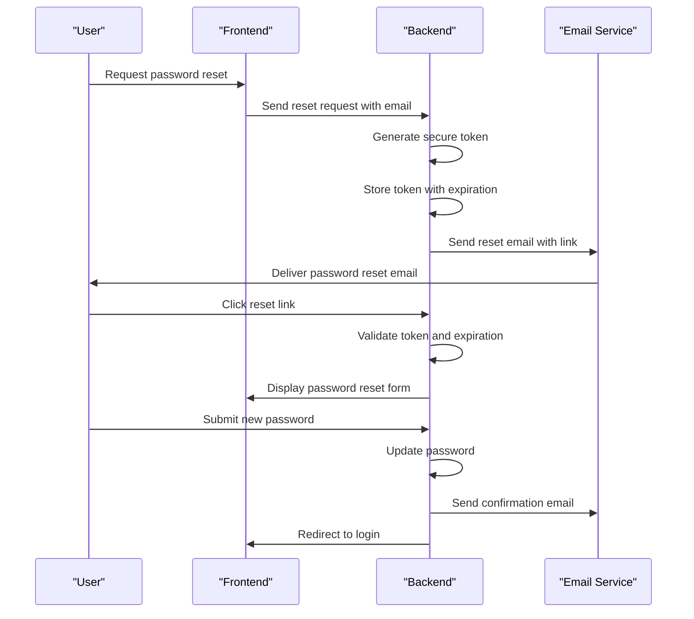
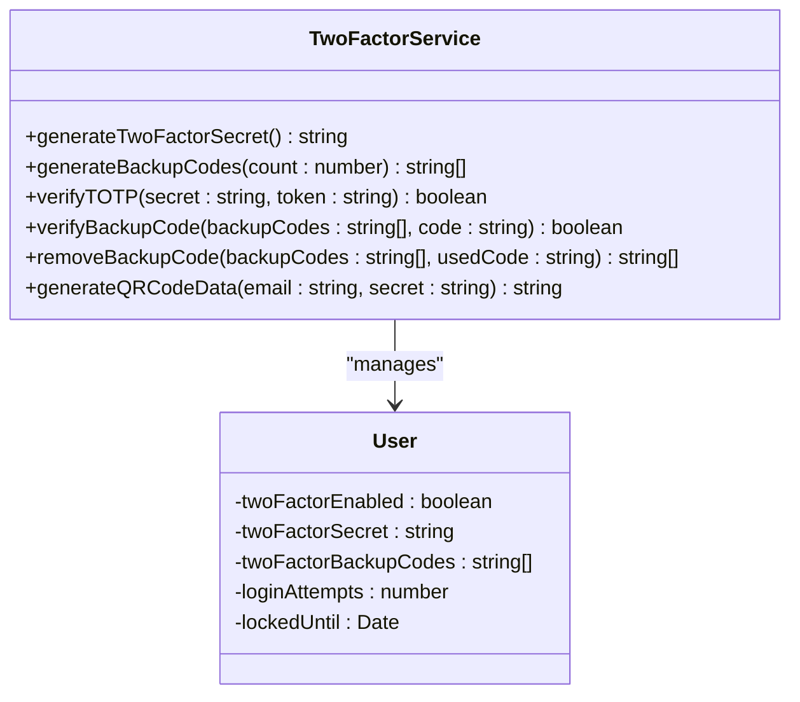
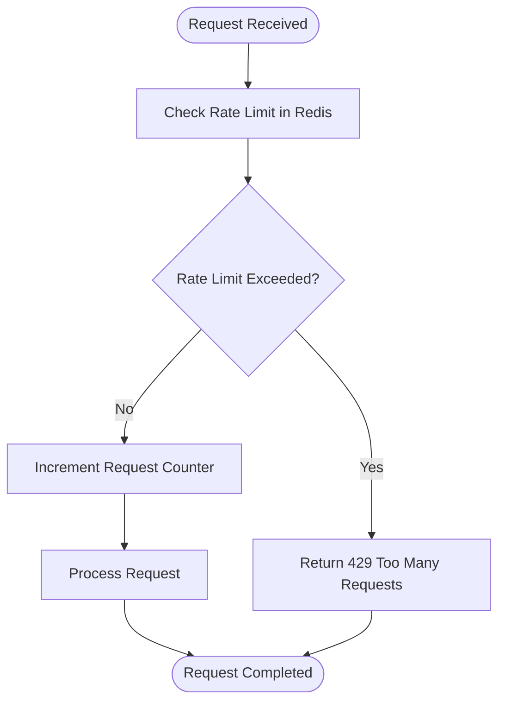
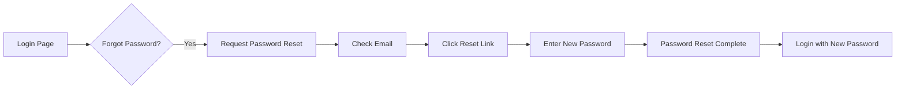

# Account Recovery

<cite>
**Referenced Files in This Document**   
- [twoFactor.ts](file://src/core/auth/twoFactor.ts)
- [twoFactorOperations.ts](file://src/core/auth/twoFactorOperations.ts)
- [auth.ts](file://src/core/email/templates/auth.ts)
- [emails.ts](file://src/core/auth/emails.ts)
- [PasswordResetPage.tsx](file://src/client/pages/auth/PasswordResetPage.tsx)
- [RequestPasswordResetPage.tsx](file://src/client/pages/auth/RequestPasswordResetPage.tsx)
- [rateLimit.ts](file://src/server/rateLimit.ts)
</cite>

## Table of Contents
1. [Introduction](#introduction)
2. [Password Reset Workflow](#password-reset-workflow)
3. [Two-Factor Authentication Recovery](#two-factor-authentication-recovery)
4. [Security Measures](#security-measures)
5. [Integration with Authentication System](#integration-with-authentication-system)
6. [User Interface Components](#user-interface-components)
7. [Error Handling](#error-handling)
8. [Common Issues and Best Practices](#common-issues-and-best-practices)

## Introduction
SentinelIQ provides robust account recovery mechanisms to ensure users can securely regain access to their accounts while maintaining high security standards. The system implements both password reset functionality and two-factor authentication (2FA) recovery options, with comprehensive security measures to prevent abuse. This document details the account recovery mechanisms, including secure token generation, expiration policies, email verification, backup code usage, rate limiting, suspicious activity detection, and audit logging.

**Section sources**
- [twoFactor.ts](file://src/core/auth/twoFactor.ts#L1-L97)
- [twoFactorOperations.ts](file://src/core/auth/twoFactorOperations.ts#L1-L186)

## Password Reset Workflow

### Secure Token Generation and Email Verification
The password reset workflow in SentinelIQ follows a secure process to verify user identity before allowing password changes. When a user requests a password reset, the system generates a secure token that is sent to the user's registered email address. This token is used to authenticate the password reset request and ensure that only the legitimate account owner can change the password.

The workflow begins when a user accesses the password reset request page. Upon submitting their email address, the system validates the input and sends a password reset email containing a unique reset link. This link includes a secure token that is time-limited for security purposes.

The email template used for password reset notifications includes clear instructions and a prominent button for resetting the password, along with the option to copy the link manually. The email also contains a warning that the link expires after one hour for security reasons, and advises users to contact support if they did not request the password reset.

**Diagram sources**
- [emails.ts](file://src/core/auth/emails.ts#L1-L41)
- [auth.ts](file://src/core/email/templates/auth.ts#L76-L108)

**Section sources**
- [RequestPasswordResetPage.tsx](file://src/client/pages/auth/RequestPasswordResetPage.tsx#L1-L11)
- [PasswordResetPage.tsx](file://src/client/pages/auth/PasswordResetPage.tsx#L1-L16)

### Expiration Policies
SentinelIQ implements strict expiration policies for password reset tokens to enhance security. According to the email template configuration, password reset links expire after one hour from the time they are generated. This short expiration window minimizes the risk of token interception and unauthorized use.

The system automatically invalidates the reset token after it has been used successfully, preventing replay attacks. Additionally, if a user requests multiple password resets, each new request invalidates previous tokens, ensuring that only the most recent reset request is valid.

## Two-Factor Authentication Recovery

### Backup Codes and Account Recovery Codes
SentinelIQ implements a comprehensive 2FA recovery system using backup codes to help users regain access when they lose access to their authenticator device. When a user enables 2FA on their account, the system generates a set of backup codes that can be used to authenticate in place of the time-based one-time password (TOTP).

The backup codes are generated using cryptographically secure random number generation. Each code is created by generating 4 bytes of random data and converting it to an 8-character hexadecimal string in uppercase format. By default, the system generates 8 backup codes for each user.

When 2FA is enabled, these backup codes are displayed to the user once and sent via email notification. The user is strongly advised to store these codes in a secure location, as they represent the only recovery method if the authenticator device is lost or inaccessible.

**Diagram sources**
- [twoFactor.ts](file://src/core/auth/twoFactor.ts#L1-L97)

**Section sources**
- [twoFactor.ts](file://src/core/auth/twoFactor.ts#L25-L32)
- [twoFactorOperations.ts](file://src/core/auth/twoFactorOperations.ts#L42-L44)

### Generation, Secure Delivery, and Usage Tracking
The generation of 2FA backup codes occurs when a user enables two-factor authentication on their account. The process is initiated through the `enable2FA` operation, which generates a new secret key for TOTP authentication and creates a set of backup codes.

During the 2FA setup process, the system temporarily stores the generated secret and backup codes in the user record without enabling 2FA immediately. This allows the user to verify the setup using their authenticator app before the 2FA is activated. Once the user successfully verifies the setup, the 2FA is activated by setting the `twoFactorEnabled` flag to true.

The backup codes are securely delivered to the user through multiple channels:
1. Displayed on the screen immediately after 2FA setup
2. Included in a confirmation email sent to the user's registered email address
3. Available for download or printing during the setup process

When a backup code is used for authentication, it is permanently removed from the user's available codes to prevent reuse. The `removeBackupCode` function filters out the used code from the array of backup codes, ensuring that each code can only be used once.

Users can regenerate new backup codes through the account settings, but this process requires successful 2FA verification with their current authenticator app. This prevents unauthorized users from changing the recovery options even if they have compromised the account password.

## Security Measures

### Rate Limiting
SentinelIQ implements comprehensive rate limiting to prevent abuse of account recovery mechanisms. The system uses Redis-based rate limiting to track and control the frequency of authentication-related operations.

The rate limiting system is configured with different thresholds for various operations. For password reset requests, the system limits users to prevent excessive requests that could indicate automated attacks or denial-of-service attempts. When a rate limit is exceeded, the system returns a 429 Too Many Requests error with a message indicating when the user can try again.

The rate limiting configuration is defined in the server middleware and applies to various endpoints. The system uses a sliding window algorithm to track requests, with counters automatically expiring after the configured time window. In case of Redis connectivity issues, the system operates in a "fail open" mode, logging the error but allowing requests to proceed to ensure availability.

**Diagram sources**
- [rateLimit.ts](file://src/server/rateLimit.ts#L1-L85)

**Section sources**
- [rateLimit.ts](file://src/server/rateLimit.ts#L16-L55)
- [twoFactor.ts](file://src/core/auth/twoFactor.ts#L81-L97)

### Suspicious Activity Detection
The account recovery system includes mechanisms to detect and respond to suspicious activity. One key component is the account lockout feature, which temporarily locks an account after multiple failed login attempts.

According to the configuration in the codebase, an account is locked after 5 failed login attempts. The lockout duration is set to 15 minutes, during which the user cannot attempt to log in. This prevents brute force attacks while minimizing disruption to legitimate users who may have temporarily forgotten their credentials.

The system also monitors for patterns of suspicious behavior, such as multiple password reset requests from different IP addresses or locations in a short period. While specific implementation details are not visible in the provided code, the presence of audit logging suggests that such activities are recorded for security analysis.

### Audit Logging of Recovery Attempts
SentinelIQ maintains comprehensive audit logs of all account recovery attempts, providing visibility into security-related events. The system logs various authentication events, including password resets, 2FA enablement and disablement, and account lockouts.

When a user successfully resets their password, the system sends a confirmation email that includes details of the change, such as the timestamp and IP address. This serves as both a security notification to the legitimate user and a deterrent to unauthorized access attempts.

The audit system also logs when 2FA is enabled or disabled on an account. The 2FA enabled email includes information about when the feature was activated and the number of backup codes generated. Similarly, when 2FA is disabled, the system sends a notification with the timestamp of the change.

These audit logs are crucial for security monitoring and incident response. If a user notices unauthorized changes to their account security settings, they can immediately contact support to investigate and remediate the issue.

## Integration with Authentication System

### Backend Implementation
The account recovery mechanisms are tightly integrated with SentinelIQ's authentication system. The implementation leverages Wasp framework's authentication capabilities while extending them with custom recovery features.

The 2FA functionality is implemented as a set of operations that interact with the user entity in the database. The user model includes specific fields for 2FA management:
- `twoFactorEnabled`: Boolean flag indicating whether 2FA is active
- `twoFactorSecret`: The secret key used for TOTP generation
- `twoFactorBackupCodes`: Array of backup codes for account recovery

The authentication system uses the Speakeasy library to implement TOTP (Time-based One-Time Password) algorithm for 2FA. This industry-standard approach ensures compatibility with popular authenticator apps like Google Authenticator, Authy, and Microsoft Authenticator.

The password reset functionality integrates with Wasp's built-in authentication system, overriding the default email content with custom templates that provide a consistent user experience and enhanced security information.

### Email Integration
The account recovery system is integrated with the email service to provide timely notifications to users. The system uses a template-based approach to generate consistent and professional-looking emails for various authentication events.

The email templates are defined in the `auth.ts` file and include specific templates for:
- Password reset requests
- Password change confirmations
- 2FA enablement and disablement
- Account lockouts
- Email verification

Each template includes appropriate security warnings and instructions. For example, the password reset email clearly states that the link expires after one hour and advises users to contact support if they did not request the reset.

The email service is configured to include relevant variables in the templates, such as the user's name, timestamps, and other contextual information. This personalization enhances the user experience while maintaining security.

## User Interface Components

### Recovery Flows
The user interface for account recovery is implemented as a series of dedicated pages within the authentication section of the application. These pages provide a streamlined experience for users who need to recover access to their accounts.

The password recovery flow consists of two main pages:
1. Request Password Reset Page: Allows users to enter their email address to initiate the recovery process
2. Password Reset Page: Allows users to set a new password after clicking the reset link

Both pages use the `AuthPageLayout` component to maintain a consistent look and feel with other authentication pages. The layout includes appropriate branding and navigation elements to help users understand their current context.

The components leverage Wasp's built-in authentication forms (`ForgotPasswordForm` and `ResetPasswordForm`) to handle the actual form submission and validation. This ensures consistency with the backend authentication system and reduces the risk of implementation errors.

**Diagram sources**
- [RequestPasswordResetPage.tsx](file://src/client/pages/auth/RequestPasswordResetPage.tsx#L1-L11)
- [PasswordResetPage.tsx](file://src/client/pages/auth/PasswordResetPage.tsx#L1-L16)

**Section sources**
- [RequestPasswordResetPage.tsx](file://src/client/pages/auth/RequestPasswordResetPage.tsx#L1-L11)
- [PasswordResetPage.tsx](file://src/client/pages/auth/PasswordResetPage.tsx#L1-L16)

## Error Handling

### Expired or Invalid Recovery Tokens
The system implements robust error handling for expired or invalid recovery tokens. When a user attempts to use a password reset link that has expired, the system displays an appropriate error message and provides options to request a new reset link.

For 2FA authentication, the system handles various error conditions:
- Invalid TOTP codes (due to timing issues or incorrect entry)
- Invalid backup codes
- Used backup codes
- Missing 2FA setup

When a user enters an incorrect TOTP code, the system allows a grace period by using a window of 2 time steps (approximately 60 seconds) before and after the current time. This accommodates minor clock differences between the server and the user's device.

If a user attempts to use a backup code that has already been used, the system rejects the code and requires a different one. This one-time use policy enhances security by preventing replay attacks.

The error messages are designed to be helpful without revealing too much information that could aid attackers. For example, the system does not distinguish between an invalid code and a non-existent account, preventing user enumeration attacks.

## Common Issues and Best Practices

### Users Losing Both Password and 2FA Devices
One of the most challenging scenarios in account recovery is when users lose access to both their password and 2FA device. SentinelIQ addresses this through the backup code system, which provides an alternative authentication method.

Best practices for users include:
- Storing backup codes in a secure password manager
- Printing backup codes and storing them in a safe location
- Never storing backup codes on the same device used for 2FA
- Regularly testing backup codes to ensure they work

The system encourages users to save their backup codes during the 2FA setup process by prominently displaying them and sending them via email. However, once the setup is complete, the codes are not stored in plain text and cannot be retrieved, emphasizing the importance of secure storage.

### Social Engineering Prevention
SentinelIQ implements several measures to prevent social engineering attacks on the account recovery system:
- No account recovery through customer support without multi-factor verification
- Time-limited reset links that expire after one hour
- Account lockout after multiple failed attempts
- Security notifications for important account changes
- No display of sensitive information in error messages

The system is designed so that even support personnel cannot bypass the standard recovery procedures, preventing attackers from impersonating users to gain access through social engineering.

### Balancing Security with Usability
SentinelIQ strikes a balance between security and usability in its recovery mechanisms:
- The 15-minute account lockout is long enough to deter brute force attacks but short enough to not overly inconvenience legitimate users
- The 8-character hexadecimal backup codes are easier to enter than longer codes while maintaining sufficient entropy
- Clear email notifications help users understand security events without overwhelming them with technical details
- The integration with standard authenticator apps ensures compatibility and familiarity

The system also provides multiple recovery options (password reset and 2FA backup codes) to accommodate different user scenarios while maintaining high security standards. This multi-layered approach ensures that users can recover access to their accounts without compromising the overall security posture.