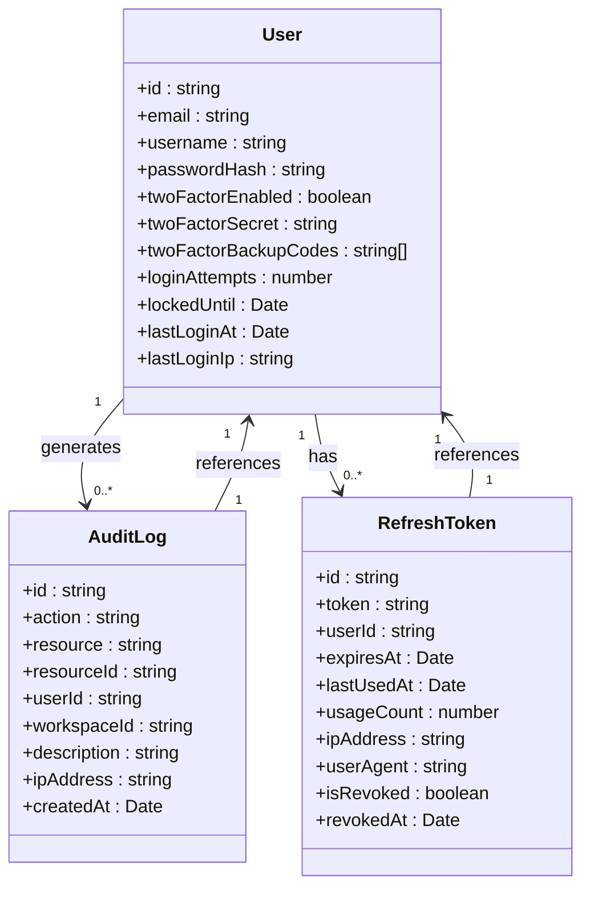

# Authentication Flow

<cite>
**Referenced Files in This Document**   
- [twoFactorOperations.ts](file://src/core/auth/twoFactorOperations.ts)
- [passwordPolicy.ts](file://src/core/auth/passwordPolicy.ts)
- [twoFactor.ts](file://src/core/auth/twoFactor.ts)
- [rateLimit.ts](file://src/server/rateLimit.ts)
- [security.ts](file://src/server/security.ts)
- [operations.ts](file://src/core/audit/operations.ts)
- [LoginPage.tsx](file://src/client/pages/auth/LoginPage.tsx)
- [SignupPage.tsx](file://src/client/pages/auth/SignupPage.tsx)
- [PasswordStrengthMeter.tsx](file://src/client/components/PasswordStrengthMeter.tsx)
- [userSignupFields.ts](file://src/core/auth/userSignupFields.ts)
- [migration.sql](file://migrations/20251117041409_add_2fa_security_redis/migration.sql)
- [migration.sql](file://migrations/20251117045259_add_refresh_tokens_ip_whitelist_password_policy/migration.sql)
</cite>

## Table of Contents
1. [Introduction](#introduction)
2. [Password Policy Enforcement](#password-policy-enforcement)
3. [Two-Factor Authentication Implementation](#two-factor-authentication-implementation)
4. [Login Sequence and Security Controls](#login-sequence-and-security-controls)
5. [Integration with Wasp Authentication System](#integration-with-wasp-authentication-system)
6. [Security Event Logging and Audit System](#security-event-logging-and-audit-system)
7. [Common Issues and Recovery Mechanisms](#common-issues-and-recovery-mechanisms)
8. [Conclusion](#conclusion)

## Introduction
The SentinelIQ authentication system implements a comprehensive security framework that combines robust password policies, two-factor authentication (2FA) using TOTP, rate limiting, and detailed audit logging. This document details the implementation of the authentication flow, focusing on password policy enforcement, 2FA with speakeasy, login sequence with security controls, and integration with Wasp's authentication system. The system is designed to provide enterprise-grade security while maintaining usability through features like backup codes and recovery mechanisms.

**Section sources**
- [twoFactorOperations.ts](file://src/core/auth/twoFactorOperations.ts)
- [passwordPolicy.ts](file://src/core/auth/passwordPolicy.ts)
- [security.ts](file://src/server/security.ts)

## Password Policy Enforcement

### Password Complexity Rules
SentinelIQ enforces strict password complexity requirements through a multi-layered validation system. The password policy requires a minimum length of 8 characters and a strength score of at least 3 out of 4, as determined by the zxcvbn library. The system evaluates passwords based on multiple factors including length, character variety (uppercase, lowercase, numbers, special characters), and resistance to common patterns.

The validation process includes both basic length checks and advanced analysis using zxcvbn, which provides detailed feedback on password strength and suggestions for improvement. The system also checks for common patterns such as "123", "password", "qwerty", and other easily guessable sequences.

```mermaid
flowchart TD
Start([Password Input]) --> LengthCheck["Check Minimum Length (8)"]
LengthCheck --> |Too Short| ReturnError["Return 'Password too short'"]
LengthCheck --> |Sufficient| ZxcvbnAnalysis["Analyze with zxcvbn"]
ZxcvbnAnalysis --> ScoreCheck["Check Score ≥ 3?"]
ScoreCheck --> |Low Score| Feedback["Provide Feedback & Suggestions"]
ScoreCheck --> |Sufficient| PatternCheck["Check Common Patterns"]
PatternCheck --> |Contains Pattern| Warning["Warn User"]
PatternCheck --> |No Pattern| ValidPassword["Password Valid"]
Feedback --> ValidPassword
Warning --> ValidPassword
ValidPassword --> End([Accept Password])
```

**Diagram sources**
- [passwordPolicy.ts](file://src/core/auth/passwordPolicy.ts#L13-L51)
- [userSignupFields.ts](file://src/core/auth/userSignupFields.ts#L28-L37)

### Hashing Mechanisms
The authentication system leverages Wasp's built-in authentication framework for password hashing, which uses industry-standard bcrypt algorithms. Passwords are never stored in plain text and are securely hashed before being persisted to the database. The system automatically handles the hashing process during user registration and password updates, ensuring that all credentials are protected according to best practices.

### Breach Detection
While the current implementation does not include direct integration with external breach detection services, the password policy system is designed to prevent the use of weak or commonly compromised passwords through its comprehensive strength evaluation. The zxcvbn library includes pattern recognition for commonly used and compromised passwords, providing an additional layer of protection against credential stuffing attacks.

**Section sources**
- [passwordPolicy.ts](file://src/core/auth/passwordPolicy.ts)
- [userSignupFields.ts](file://src/core/auth/userSignupFields.ts#L28-L37)

## Two-Factor Authentication Implementation

### TOTP with Speakeasy
The two-factor authentication system in SentinelIQ is implemented using the Time-based One-Time Password (TOTP) algorithm through the speakeasy library. This provides a secure second factor that changes every 30 seconds, significantly enhancing account security beyond just passwords.

The 2FA workflow consists of several key operations: enabling 2FA, verifying the setup, disabling 2FA, and regenerating backup codes. Each operation follows a secure process that ensures the user's identity is verified before making changes to their authentication settings.

**Diagram sources**
- [twoFactorOperations.ts](file://src/core/auth/twoFactorOperations.ts)
- [twoFactor.ts](file://src/core/auth/twoFactor.ts#L13-L20)

### Secret Generation and QR Code Provisioning
When a user enables 2FA, the system generates a cryptographically secure secret key using speakeasy's generateSecret function with a length of 32 characters. This secret is encoded in base32 format, which is compatible with most authenticator apps.

The QR code provisioning process generates an otpauth URL in the format: `otpauth://totp/SentinelIQ:user@example.com?secret=SECRET&issuer=SentinelIQ`. This URL contains all the necessary information for authenticator apps to set up the TOTP configuration automatically by scanning the QR code.

### Token Verification Logic
The token verification process uses speakeasy's TOTP verification with a window of 2 time steps, providing a 60-second grace period (30 seconds before and after the current time step). This accommodates minor clock drift between the server and the user's device while maintaining security.

The verification function performs input validation to ensure the token is exactly 6 digits before attempting verification. Error handling is implemented to catch any exceptions during the verification process and return appropriate error messages.

### Backup Code Generation and Recovery
The system generates 8 backup codes, each consisting of 8 hexadecimal characters (4 bytes converted to uppercase hex). These codes are stored as an encrypted array in the user's record and can be used for account recovery when the primary authenticator is unavailable.

Each backup code can only be used once. When a backup code is used for authentication, it is automatically removed from the user's account to prevent reuse. Users can regenerate new backup codes at any time, which invalidates all previous codes.

**Section sources**
- [twoFactorOperations.ts](file://src/core/auth/twoFactorOperations.ts)
- [twoFactor.ts](file://src/core/auth/twoFactor.ts)

## Login Sequence and Security Controls

### Credential Submission to Session Creation
The login sequence in SentinelIQ follows a secure flow from credential submission to session creation. When a user submits their credentials, the system first validates the username/email and password against the stored hashed values. If the credentials are valid and the account is not locked, the system creates a session and issues a refresh token.

For accounts with 2FA enabled, the login process requires an additional step where the user must provide a valid TOTP code or backup code. Only after successful 2FA verification is the session created and the user granted access to the application.

**Diagram sources**
- [twoFactorOperations.ts](file://src/core/auth/twoFactorOperations.ts#L66-L101)
- [twoFactor.ts](file://src/core/auth/twoFactor.ts#L81-L97)
- [rateLimit.ts](file://src/server/rateLimit.ts)

### Rate Limiting and Failed Attempt Tracking
The authentication system implements comprehensive rate limiting to prevent brute force attacks. The rate limiting is implemented using Redis for distributed storage, allowing the system to track attempts across multiple instances.

For login attempts, the system tracks failed attempts at the account level. After 5 consecutive failed attempts, the account is locked for 15 minutes. This lockout period is stored in the user record and checked on each login attempt.

Additional rate limiting is applied to various authentication-related operations:
- Workspace creation: 5 per hour
- Workspace updates: 30 per minute
- Member invitations: 10 per minute

### Account Lockout Policies
The account lockout policy is designed to balance security and usability. After 5 failed login attempts, the account is temporarily locked for 15 minutes. During this period, any further login attempts will be rejected with a specific error message indicating the account is locked.

The lockout state is stored in the user record with a `lockedUntil` timestamp. The system also maintains a `loginAttempts` counter that is reset upon successful login. This approach prevents both automated brute force attacks and manual guessing attempts while minimizing the impact on legitimate users who may occasionally mistype their credentials.

**Section sources**
- [twoFactor.ts](file://src/core/auth/twoFactor.ts#L81-L97)
- [rateLimit.ts](file://src/server/rateLimit.ts)
- [migration.sql](file://migrations/20251117041409_add_2fa_security_redis/migration.sql#L2-L8)

## Integration with Wasp Authentication System

### Wasp Authentication Framework
SentinelIQ leverages Wasp's authentication system as the foundation for its security implementation. The integration is achieved through Wasp's extensible authentication providers system, which allows customization of user fields and validation logic while maintaining compatibility with the core authentication flow.

The system uses Wasp's built-in email/password authentication provider, extended with custom validation and additional user fields. The integration is configured through Wasp's auth configuration, which specifies the custom user signup fields and validation functions.

### Custom User Signup Fields
The authentication system extends Wasp's default user model with additional fields and validation logic. The `userSignupFields.ts` file defines custom field extraction and validation for different authentication providers (email, GitHub, Google, Discord).

For email/password authentication, the system extracts the email and username from the signup data and determines admin status based on a list of admin emails defined in environment variables. Similar logic is applied to social authentication providers, with additional checks for verified emails and proper scope configuration.

### Session Management
Session management is handled through Wasp's session system, enhanced with refresh tokens stored in the database. The `RefreshToken` table stores token information including creation time, expiration, usage count, IP address, and user agent, enabling advanced security features like device tracking and suspicious activity detection.

The system implements session timeout policies, with sessions automatically expiring after a configurable period of inactivity. Users can also manually revoke sessions through the account settings interface.

**Section sources**
- [userSignupFields.ts](file://src/core/auth/userSignupFields.ts)
- [migration.sql](file://migrations/20251117045259_add_refresh_tokens_ip_whitelist_password_policy/migration.sql)
- [security.ts](file://src/server/security.ts)

## Security Event Logging and Audit System

### Audit System Integration
All authentication-related events are logged through SentinelIQ's comprehensive audit system. The audit logs capture critical security events including login attempts (successful and failed), 2FA configuration changes, password updates, and session creation/revocation.

The audit system is implemented in the `core/audit` module, with specific operations for retrieving and exporting audit logs. Each log entry includes the user ID, action performed, resource affected, timestamp, and IP address, providing a complete trail of authentication activities.

### Event Types and Logging
The authentication system logs the following key events:
- User login (success/failure)
- Account lockout
- 2FA enabled/disabled
- Password change
- Session creation/revocation
- Backup code regeneration
- Suspicious activity detection

These events are stored in the `AuditLog` table and can be queried by administrators for security monitoring and compliance purposes. The system also supports exporting audit logs in CSV format for offline analysis.

**Diagram sources**
- [operations.ts](file://src/core/audit/operations.ts)
- [migration.sql](file://migrations/20251117041409_add_2fa_security_redis/migration.sql)
- [migration.sql](file://migrations/20251117045259_add_refresh_tokens_ip_whitelist_password_policy/migration.sql)

**Section sources**
- [operations.ts](file://src/core/audit/operations.ts)
- [twoFactorOperations.ts](file://src/core/auth/twoFactorOperations.ts)

## Common Issues and Recovery Mechanisms

### Lost 2FA Devices
When users lose access to their 2FA device, they can use their backup codes to log in. The system provides 8 one-time use backup codes during the 2FA setup process, which should be stored securely by the user.

If a user has lost both their 2FA device and backup codes, they must contact support for account recovery. The support team follows a strict verification process to confirm the user's identity before disabling 2FA on the account.

### Recovery Code Regeneration
Users can regenerate their backup codes at any time through the account settings interface. This process requires the user to authenticate with their current 2FA method (TOTP code or backup code) before generating new codes.

When new backup codes are generated, all previous codes are immediately invalidated to prevent their use. The user is prompted to download and securely store the new codes, with a warning that the old codes will no longer work.

### Multi-Device Synchronization
The TOTP-based 2FA system supports multi-device synchronization through the shared secret key. Users can scan the same QR code on multiple authenticator apps (e.g., on both their phone and tablet) to have the same 2FA codes available on multiple devices.

However, the system does not support multiple simultaneous sessions with different devices. Each login creates a new session, and users must complete the full authentication process (including 2FA) when logging in from a new device or browser.

**Section sources**
- [twoFactorOperations.ts](file://src/core/auth/twoFactorOperations.ts#L149-L185)
- [twoFactor.ts](file://src/core/auth/twoFactor.ts#L58-L67)

## Conclusion
The SentinelIQ authentication system implements a robust security framework that combines multiple layers of protection to safeguard user accounts. The system enforces strong password policies using zxcvbn for comprehensive strength evaluation, implements TOTP-based two-factor authentication with speakeasy, and includes comprehensive security controls like rate limiting and account lockout policies.

The integration with Wasp's authentication system provides a solid foundation while allowing for extensive customization and extension. The audit system ensures complete visibility into authentication activities, supporting both security monitoring and compliance requirements.

Key strengths of the implementation include the use of industry-standard libraries (speakeasy, zxcvbn), proper cryptographic practices, and a balanced approach to security and usability through features like backup codes and recovery mechanisms. The system is well-positioned to protect against common attack vectors while providing a smooth user experience.