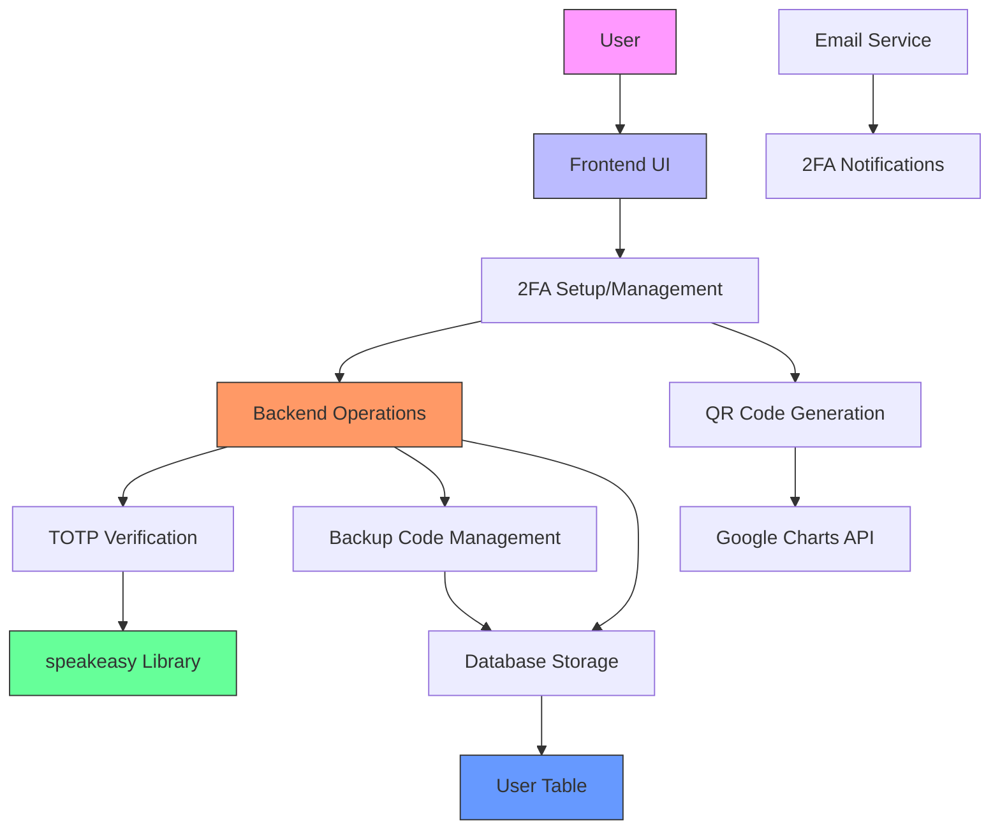
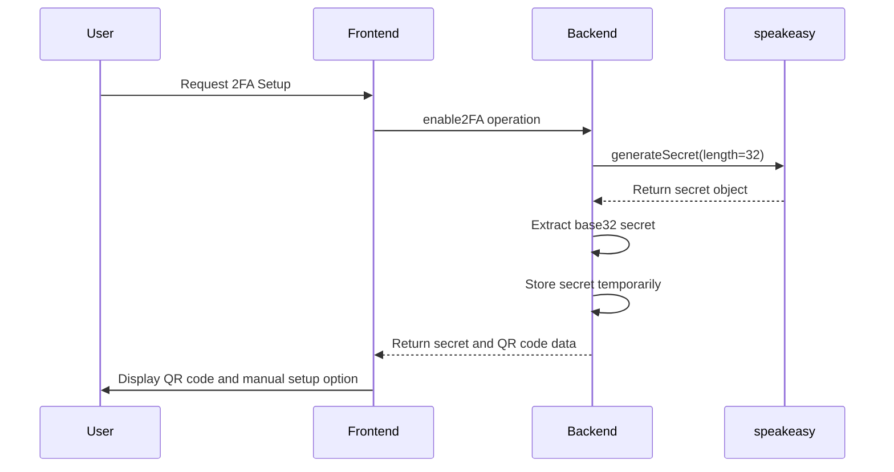
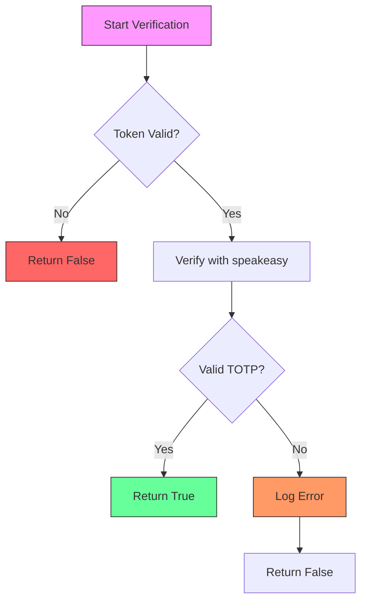
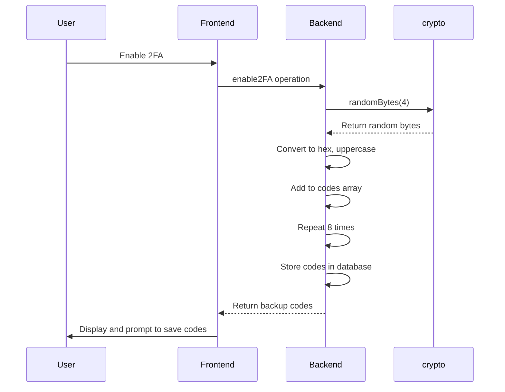
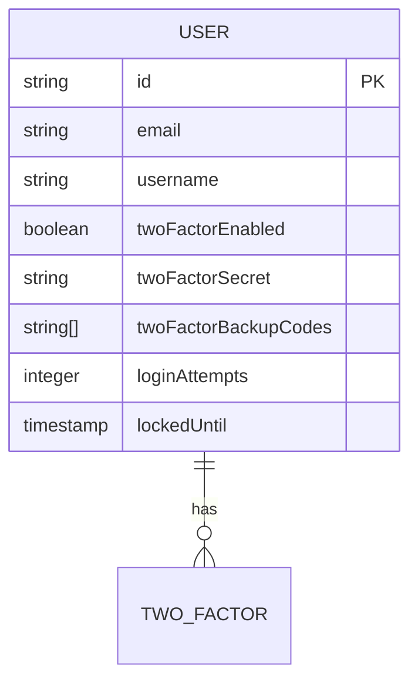
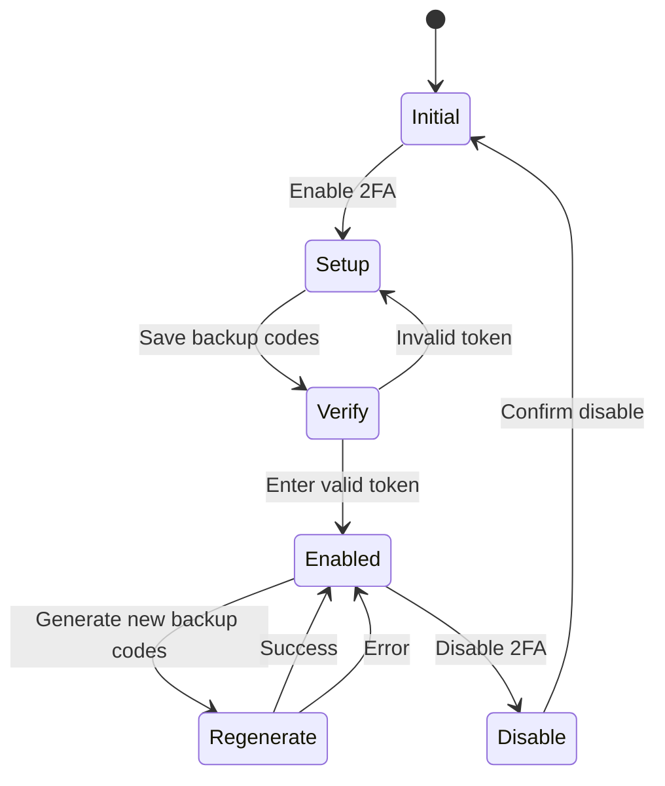
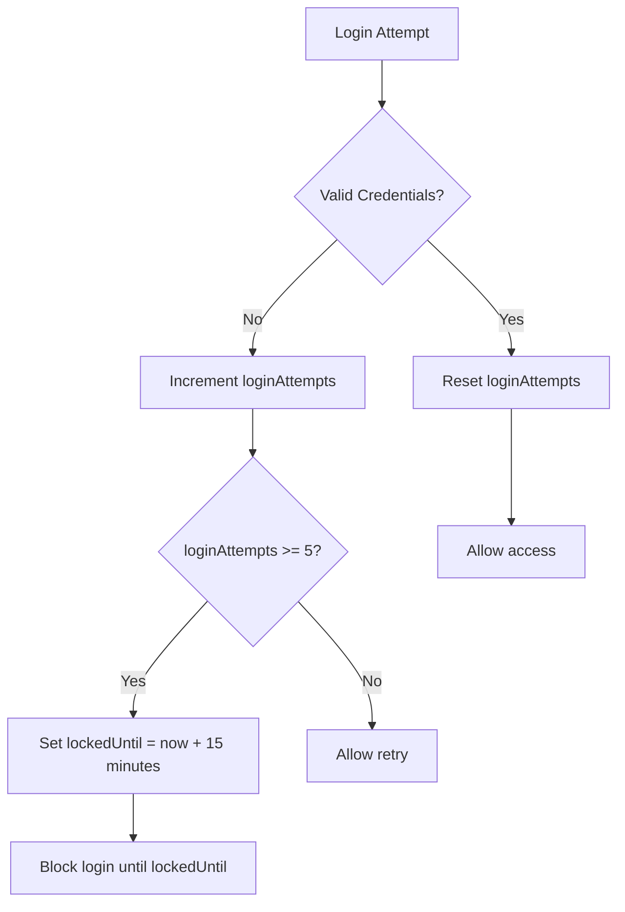
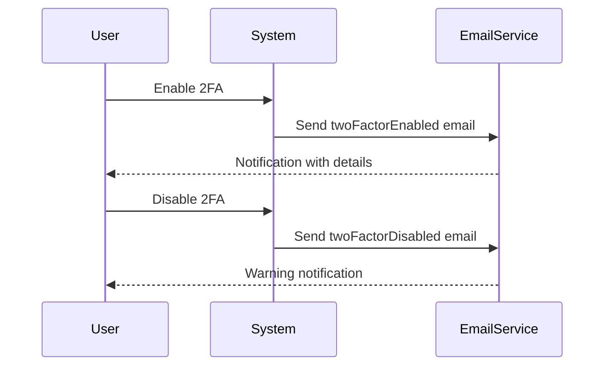

# Two-Factor Authentication

<cite>
**Referenced Files in This Document**   
- [twoFactor.ts](file://src/core/auth/twoFactor.ts)
- [twoFactorOperations.ts](file://src/core/auth/twoFactorOperations.ts)
- [TwoFactorAuthPage.tsx](file://src/client/pages/user/security/TwoFactorAuthPage.tsx)
- [migration.sql](file://migrations/20251117041409_add_2fa_security_redis/migration.sql)
- [auth.ts](file://src/core/email/templates/auth.ts)
</cite>

## Table of Contents
1. [Introduction](#introduction)
2. [Architecture Overview](#architecture-overview)
3. [Core Components](#core-components)
4. [TOTP-Based Authentication Flow](#totp-based-authentication-flow)
5. [Backup Code Management](#backup-code-management)
6. [Database Schema](#database-schema)
7. [User Interface Components](#user-interface-components)
8. [Security Features](#security-features)
9. [Common Issues and Solutions](#common-issues-and-solutions)
10. [Email Notifications](#email-notifications)

## Introduction
SentinelIQ implements a robust two-factor authentication (2FA) system using the Time-based One-Time Password (TOTP) algorithm to enhance account security. This documentation details the complete 2FA implementation, covering the TOTP workflow, backup code recovery, database schema, user interface components, and integration with the authentication system. The implementation uses the speakeasy library for TOTP generation and verification, providing a secure and user-friendly authentication experience.

## Architecture Overview
The 2FA system in SentinelIQ follows a client-server architecture with clear separation between frontend components and backend operations. The system integrates with the existing authentication workflow to provide an additional security layer during login.



**Diagram sources**
- [twoFactorOperations.ts](file://src/core/auth/twoFactorOperations.ts)
- [TwoFactorAuthPage.tsx](file://src/client/pages/user/security/TwoFactorAuthPage.tsx)
- [migration.sql](file://migrations/20251117041409_add_2fa_security_redis/migration.sql)

**Section sources**
- [twoFactorOperations.ts](file://src/core/auth/twoFactorOperations.ts)
- [TwoFactorAuthPage.tsx](file://src/client/pages/user/security/TwoFactorAuthPage.tsx)

## Core Components
The 2FA implementation consists of several core components that work together to provide secure authentication. These components are organized in the codebase to maintain separation of concerns and ensure maintainability.

### Backend Utilities
The backend utilities handle the cryptographic operations and business logic for 2FA. These functions are implemented in the `twoFactor.ts` file and provide the foundation for the entire 2FA system.

**Section sources**
- [twoFactor.ts](file://src/core/auth/twoFactor.ts)

### Frontend Components
The frontend components provide the user interface for 2FA setup and management. These components are implemented in React and follow modern UI/UX principles to ensure a smooth user experience.

**Section sources**
- [TwoFactorAuthPage.tsx](file://src/client/pages/user/security/TwoFactorAuthPage.tsx)

## TOTP-Based Authentication Flow
The TOTP-based authentication flow in SentinelIQ follows the standard RFC 6238 specification, providing a secure method for two-factor authentication using time-based one-time passwords.

### Secret Generation
The 2FA secret is generated using the speakeasy library with a 32-character base32 encoded string. The secret generation process includes the application name and issuer information to ensure proper identification in authenticator apps.



**Diagram sources**
- [twoFactor.ts](file://src/core/auth/twoFactor.ts#L13-L20)
- [twoFactorOperations.ts](file://src/core/auth/twoFactorOperations.ts#L25-L54)

**Section sources**
- [twoFactor.ts](file://src/core/auth/twoFactor.ts#L13-L20)
- [twoFactorOperations.ts](file://src/core/auth/twoFactorOperations.ts#L25-L54)

### QR Code Provisioning
The QR code provisioning process converts the TOTP secret into a scannable format using the otpauth URL scheme. This allows users to easily configure their authenticator apps by scanning the QR code.

The QR code data is generated using the following format:
```
otpauth://totp/{issuer}:{email}?secret={secret}&issuer={issuer}
```

The frontend uses the Google Charts API to generate the QR code image, eliminating the need for additional dependencies.

**Section sources**
- [twoFactor.ts](file://src/core/auth/twoFactor.ts#L72-L76)
- [TwoFactorAuthPage.tsx](file://src/client/pages/user/security/TwoFactorAuthPage.tsx#L28-L29)

### Token Verification Logic
The token verification process uses speakeasy's TOTP verification with configurable time windows and drift tolerance. The system allows for a 60-second grace period by setting the window parameter to 2, which accounts for clock synchronization issues between the server and client devices.



**Diagram sources**
- [twoFactor.ts](file://src/core/auth/twoFactor.ts#L37-L53)

**Section sources**
- [twoFactor.ts](file://src/core/auth/twoFactor.ts#L37-L53)
- [twoFactorOperations.ts](file://src/core/auth/twoFactorOperations.ts#L86-L90)

## Backup Code Management
The backup code system provides a recovery mechanism for users who lose access to their authenticator app or 2FA device.

### Backup Code Generation
Backup codes are generated as 8-character hexadecimal strings, with 8 codes created by default. Each code is generated using cryptographically secure random bytes to ensure unpredictability.



**Diagram sources**
- [twoFactor.ts](file://src/core/auth/twoFactor.ts#L25-L32)
- [twoFactorOperations.ts](file://src/core/auth/twoFactorOperations.ts#L43-L54)

**Section sources**
- [twoFactor.ts](file://src/core/auth/twoFactor.ts#L25-L32)
- [twoFactorOperations.ts](file://src/core/auth/twoFactorOperations.ts#L43-L54)

### Recovery Process
The recovery process allows users to authenticate using backup codes when they cannot access their authenticator app. Each backup code can only be used once, and the system automatically removes used codes from the user's account.

**Section sources**
- [twoFactor.ts](file://src/core/auth/twoFactor.ts#L58-L67)
- [twoFactorOperations.ts](file://src/core/auth/twoFactorOperations.ts#L126-L131)

## Database Schema
The 2FA implementation requires specific database fields to store authentication secrets and user preferences. These fields were added through a dedicated migration.



The following columns were added to the User table:
- `twoFactorEnabled`: BOOLEAN NOT NULL DEFAULT false
- `twoFactorSecret`: TEXT
- `twoFactorBackupCodes`: TEXT[] DEFAULT ARRAY[]::TEXT[]
- `loginAttempts`: INTEGER NOT NULL DEFAULT 0
- `lockedUntil`: TIMESTAMP(3)

**Diagram sources**
- [migration.sql](file://migrations/20251117041409_add_2fa_security_redis/migration.sql)

**Section sources**
- [migration.sql](file://migrations/20251117041409_add_2fa_security_redis/migration.sql)

## User Interface Components
The user interface for 2FA management is implemented as a dedicated page that guides users through the setup and configuration process.

### Setup Workflow
The 2FA setup workflow consists of three main steps:
1. Initial state with enable button
2. Setup state with QR code and backup codes
3. Verification state with token input



**Diagram sources**
- [TwoFactorAuthPage.tsx](file://src/client/pages/user/security/TwoFactorAuthPage.tsx#L11-L21)

**Section sources**
- [TwoFactorAuthPage.tsx](file://src/client/pages/user/security/TwoFactorAuthPage.tsx)

### Component Structure
The 2FA UI component is structured as a state machine with different views based on the user's 2FA status. The component uses React hooks for state management and integrates with the Wasp framework for data operations.

**Section sources**
- [TwoFactorAuthPage.tsx](file://src/client/pages/user/security/TwoFactorAuthPage.tsx)

## Security Features
The 2FA implementation includes several security features to protect against common attack vectors and ensure account safety.

### Account Lockout Mechanism
The system implements an account lockout mechanism to prevent brute force attacks. After 5 failed login attempts, the account is locked for 15 minutes.



**Diagram sources**
- [twoFactor.ts](file://src/core/auth/twoFactor.ts#L81-L97)

**Section sources**
- [twoFactor.ts](file://src/core/auth/twoFactor.ts#L81-L97)

### Secure Storage
All 2FA secrets and backup codes are stored securely in the database. The TOTP secret is stored in base32 format, and backup codes are stored as an array of encrypted strings.

**Section sources**
- [twoFactorOperations.ts](file://src/core/auth/twoFactorOperations.ts#L48-L54)

## Common Issues and Solutions
This section addresses common issues users may encounter with the 2FA system and provides solutions.

### Lost 2FA Device
When a user loses their 2FA device, they can use one of their backup codes to log in. After logging in, they should immediately disable 2FA and set it up again with a new device.

**Section sources**
- [twoFactorOperations.ts](file://src/core/auth/twoFactorOperations.ts#L106-L144)

### Clock Synchronization Problems
Clock synchronization issues between the server and client device can cause TOTP verification failures. The system mitigates this by allowing a 60-second grace period (window: 2) during verification.

**Section sources**
- [twoFactor.ts](file://src/core/auth/twoFactor.ts#L47-L48)

### Multi-Device Setup Scenarios
Users can set up the same 2FA secret on multiple devices by scanning the QR code or entering the secret key on each device. All devices will generate the same time-based codes.

**Section sources**
- [twoFactor.ts](file://src/core/auth/twoFactor.ts#L72-L76)
- [TwoFactorAuthPage.tsx](file://src/client/pages/user/security/TwoFactorAuthPage.tsx#L28-L29)

## Email Notifications
The system sends email notifications to users when they enable or disable 2FA, providing an audit trail and security awareness.



**Diagram sources**
- [auth.ts](file://src/core/email/templates/auth.ts#L132-L169)
- [auth.ts](file://src/core/email/templates/auth.ts#L164-L200)

**Section sources**
- [auth.ts](file://src/core/email/templates/auth.ts#L132-L200)