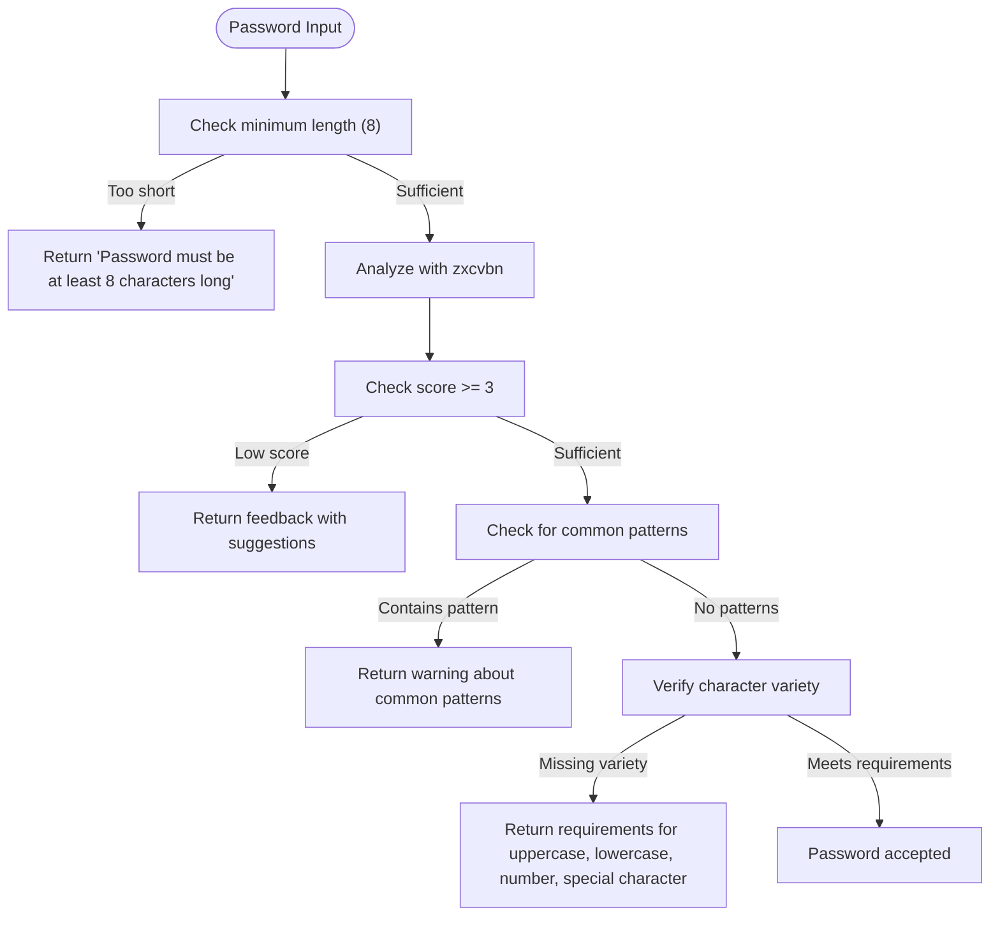
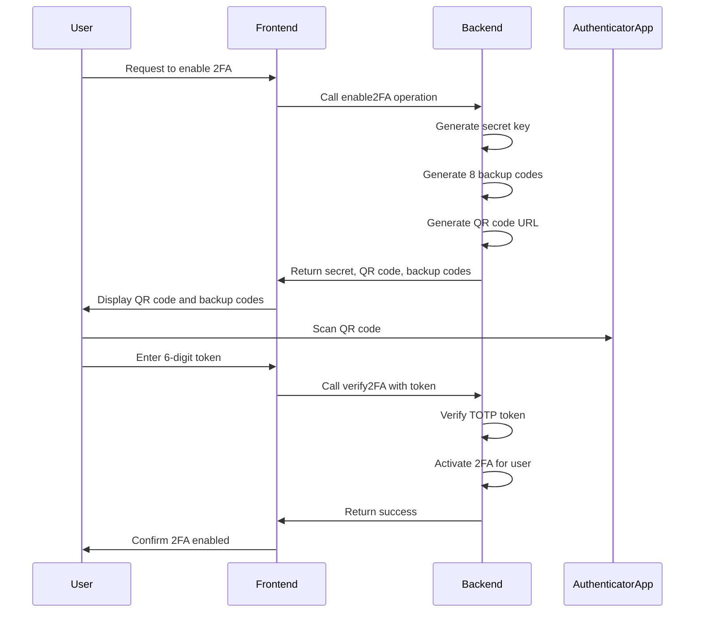
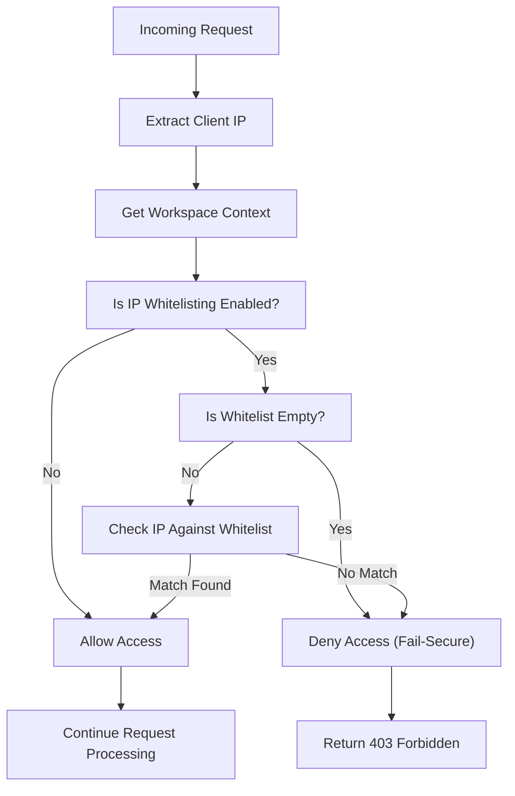
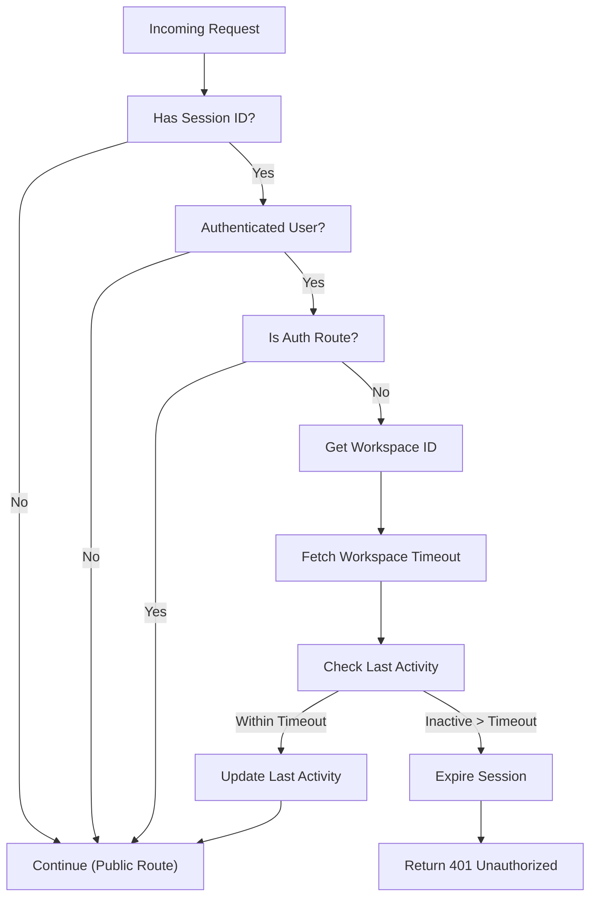

# Authentication and Authorization

<cite>
**Referenced Files in This Document**   
- [passwordPolicy.ts](file://src/core/auth/passwordPolicy.ts)
- [twoFactor.ts](file://src/core/auth/twoFactor.ts)
- [twoFactorOperations.ts](file://src/core/auth/twoFactorOperations.ts)
- [sessionTimeout.ts](file://src/server/sessionTimeout.ts)
- [ipWhitelist.ts](file://src/core/auth/ipWhitelist.ts)
- [ipWhitelistOperations.ts](file://src/core/auth/ipWhitelistOperations.ts)
- [migration.sql](file://migrations/20251117041409_add_2fa_security_redis/migration.sql)
- [migration.sql](file://migrations/20251117045259_add_refresh_tokens_ip_whitelist_password_policy/migration.sql)
- [migration.sql](file://migrations/20251117165822_add_session_timeout/migration.sql)
</cite>

## Table of Contents
1. [Introduction](#introduction)
2. [Password Policy Enforcement](#password-policy-enforcement)
3. [Two-Factor Authentication (2FA) Implementation](#two-factor-authentication-2fa-implementation)
4. [IP Address Whitelisting](#ip-address-whitelisting)
5. [Session Timeout Controls](#session-timeout-controls)
6. [Integration with Wasp Auth System](#integration-with-wasp-auth-system)
7. [Security Event Logging](#security-event-logging)
8. [Error Handling Patterns](#error-handling-patterns)
9. [Common Issues and Recovery Flows](#common-issues-and-recovery-flows)

## Introduction
The SentinelIQ authentication and authorization system implements a comprehensive security framework that includes password policy enforcement, two-factor authentication (2FA), IP address whitelisting, and session timeout controls. The system is integrated with Wasp's authentication infrastructure and provides enterprise-grade security features for workspace-level access control. This document details the implementation of these security mechanisms, including complexity rules, hashing mechanisms, breach detection, TOTP-based 2FA flows, IP validation middleware, and workspace-specific session configurations.

## Password Policy Enforcement
The password policy enforcement system in SentinelIQ implements multiple layers of security to ensure strong password practices. The system uses the zxcvbn library for advanced password strength analysis, which evaluates passwords based on length, character variety, and resistance to brute-force attacks.

The implementation includes minimum length requirements (8 characters) and requires a strength score of at least 3 out of 4, as determined by zxcvbn's entropy calculation. The system checks for the presence of uppercase letters, lowercase letters, numbers, and special characters, providing real-time feedback to users during password creation.

Additional security measures include detection of common password patterns such as "123", "password", "qwerty", "admin", "letmein", and "welcome". The system also provides crack time estimates based on offline slow hashing scenarios, helping users understand the practical security implications of their password choices.

**Diagram sources**
- [passwordPolicy.ts](file://src/core/auth/passwordPolicy.ts#L1-L128)

**Section sources**
- [passwordPolicy.ts](file://src/core/auth/passwordPolicy.ts#L1-L128)

## Two-Factor Authentication (2FA) Implementation
The two-factor authentication system in SentinelIQ uses the Time-based One-Time Password (TOTP) algorithm with the speakeasy library for secure implementation. The 2FA flow provides multiple layers of protection for user accounts, including secret generation, QR code provisioning, token verification, and backup code management.

The system generates a 32-character base32 secret key for each user when enabling 2FA, which is used to generate time-based tokens. The QR code data is formatted according to the otpauth://totp standard, allowing compatibility with popular authenticator apps like Google Authenticator, Authy, and Microsoft Authenticator.

For account recovery, the system generates eight 8-character hexadecimal backup codes using cryptographically secure random number generation. These codes can be used once and are automatically removed from the user's account after use. The system also implements account lockout protection, locking accounts for 15 minutes after five consecutive failed login attempts.

**Diagram sources**
- [twoFactor.ts](file://src/core/auth/twoFactor.ts#L1-L98)
- [twoFactorOperations.ts](file://src/core/auth/twoFactorOperations.ts#L1-L186)

**Section sources**
- [twoFactor.ts](file://src/core/auth/twoFactor.ts#L1-L98)
- [twoFactorOperations.ts](file://src/core/auth/twoFactorOperations.ts#L1-L186)

## IP Address Whitelisting
The IP address whitelisting functionality in SentinelIQ provides an additional layer of security by restricting access to workspaces based on IP addresses. This enterprise feature is available only to users with enterprise subscription plans and allows workspace owners to define specific IP addresses or ranges that are permitted to access their workspace.

The system supports multiple IP address formats including individual IP addresses (e.g., 192.168.1.100), CIDR notation (e.g., 192.168.1.0/24), and wildcard patterns (e.g., 192.168.1.*). The implementation includes comprehensive validation of IP addresses and CIDR notation to prevent configuration errors.

The middleware extracts the client IP address from various headers including X-Forwarded-For, X-Real-IP, and X-Client-IP, with proper handling of proxy chains. It also normalizes IPv6-mapped IPv4 addresses to their IPv4 equivalents for consistent matching.

**Diagram sources**
- [ipWhitelist.ts](file://src/core/auth/ipWhitelist.ts#L1-L189)
- [ipWhitelistOperations.ts](file://src/core/auth/ipWhitelistOperations.ts#L1-L281)

**Section sources**
- [ipWhitelist.ts](file://src/core/auth/ipWhitelist.ts#L1-L189)
- [ipWhitelistOperations.ts](file://src/core/auth/ipWhitelistOperations.ts#L1-L281)

## Session Timeout Controls
The session timeout system in SentinelIQ implements workspace-specific session management with inactivity tracking and automatic session invalidation. Each workspace can configure its own session timeout duration, with a default of 30 minutes (1800 seconds) if not explicitly set.

The system tracks user activity on a per-session basis, updating the last activity timestamp with each request. When a request is received, the middleware calculates the time since the last activity and compares it to the workspace's configured timeout. If the inactivity period exceeds the timeout, the session is invalidated and a 401 Unauthorized response is returned.

The implementation uses an in-memory session store for tracking active sessions, with periodic cleanup of expired sessions every hour. For production deployments with multiple instances, Redis is recommended as the session store to ensure consistency across instances.

**Diagram sources**
- [sessionTimeout.ts](file://src/server/sessionTimeout.ts#L1-L205)

**Section sources**
- [sessionTimeout.ts](file://src/server/sessionTimeout.ts#L1-L205)

## Integration with Wasp Auth System
The authentication and authorization system in SentinelIQ is tightly integrated with the Wasp framework's authentication infrastructure. The implementation leverages Wasp's built-in authentication features while extending them with additional security layers.

The system uses Wasp's session management, with the session ID stored in a sessionId cookie. The authentication middleware is configured to run after Wasp's auth middleware, allowing access to the authenticated user context. This integration enables seamless access to user information and workspace associations within the security middleware.

Security features are implemented as Wasp operations, allowing them to be called from both client and server contexts. The operations follow Wasp's pattern of accepting arguments and context parameters, with the context providing access to the database entities and user information.

The integration also includes proper error handling using Wasp's HttpError class, ensuring consistent error responses across the application. Security events are logged using the same audit logging system used by other application components, providing a unified security monitoring capability.

**Section sources**
- [twoFactorOperations.ts](file://src/core/auth/twoFactorOperations.ts#L1-L186)
- [ipWhitelistOperations.ts](file://src/core/auth/ipWhitelistOperations.ts#L1-L281)
- [sessionTimeout.ts](file://src/server/sessionTimeout.ts#L1-L205)

## Security Event Logging
The authentication system in SentinelIQ includes comprehensive security event logging to track important authentication activities. All significant security-related actions are recorded in the audit log system, providing visibility into authentication events and facilitating security investigations.

The system logs events such as 2FA setup, 2FA verification, 2FA disablement, IP whitelist changes, and session timeouts. Each log entry includes the workspace ID, user ID, action type, resource affected, description, and metadata specific to the action. For example, when a user updates the IP whitelist, the log entry includes the number of entries in the updated whitelist.

The audit logging is integrated with the existing audit system, using the same data model and storage mechanisms as other audit events in the application. This ensures consistency in log format and enables unified querying and reporting across all security events.

**Section sources**
- [twoFactorOperations.ts](file://src/core/auth/twoFactorOperations.ts#L1-L186)
- [ipWhitelistOperations.ts](file://src/core/auth/ipWhitelistOperations.ts#L1-L281)

## Error Handling Patterns
The authentication system implements consistent error handling patterns across all security features. The system uses Wasp's HttpError class to return standardized HTTP error responses with appropriate status codes and error messages.

For authentication-related errors, the system returns 401 Unauthorized for authentication failures and 403 Forbidden for authorization failures. Validation errors return 400 Bad Request with specific error messages that help users understand what went wrong.

The error handling includes specific patterns for different security features:
- Password policy violations return detailed feedback about strength requirements
- 2FA verification failures return generic error messages to prevent enumeration attacks
- IP whitelist violations return clear messages about the access restriction
- Session timeout errors include the timeout duration in the response

The system also includes server-side error handling with appropriate logging, ensuring that unexpected errors are captured for debugging while maintaining security by not exposing sensitive information to clients.

**Section sources**
- [twoFactor.ts](file://src/core/auth/twoFactor.ts#L1-L98)
- [twoFactorOperations.ts](file://src/core/auth/twoFactorOperations.ts#L1-L186)
- [ipWhitelistOperations.ts](file://src/core/auth/ipWhitelistOperations.ts#L1-L281)
- [sessionTimeout.ts](file://src/server/sessionTimeout.ts#L1-L205)

## Common Issues and Recovery Flows
The authentication system addresses several common issues that users may encounter, with appropriate recovery flows for each scenario.

For locked accounts due to multiple failed login attempts, the system implements a 15-minute lockout period after five consecutive failed attempts. Users are informed that their account is temporarily locked and must wait for the lockout period to expire before attempting to log in again.

For 2FA recovery, the system provides backup codes that can be used when users lose access to their authenticator app. Users can also regenerate new backup codes after successfully authenticating with their current 2FA method. The system does not provide alternative recovery methods like SMS or email codes to maintain security.

For multi-device access, the system allows users to be logged in from multiple devices simultaneously. Each session is tracked independently with its own activity timer, and users can view and manage their active sessions. The system does not automatically log out other devices when a new login occurs, but workspace administrators can implement policies to restrict concurrent sessions if needed.

The recovery flows are designed to balance security and usability, ensuring that legitimate users can recover access to their accounts while preventing unauthorized access through recovery mechanisms.

**Section sources**
- [twoFactor.ts](file://src/core/auth/twoFactor.ts#L1-L98)
- [twoFactorOperations.ts](file://src/core/auth/twoFactorOperations.ts#L1-L186)
- [sessionTimeout.ts](file://src/server/sessionTimeout.ts#L1-L205)