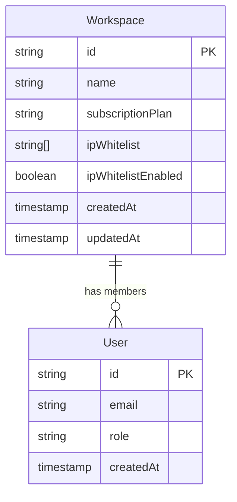
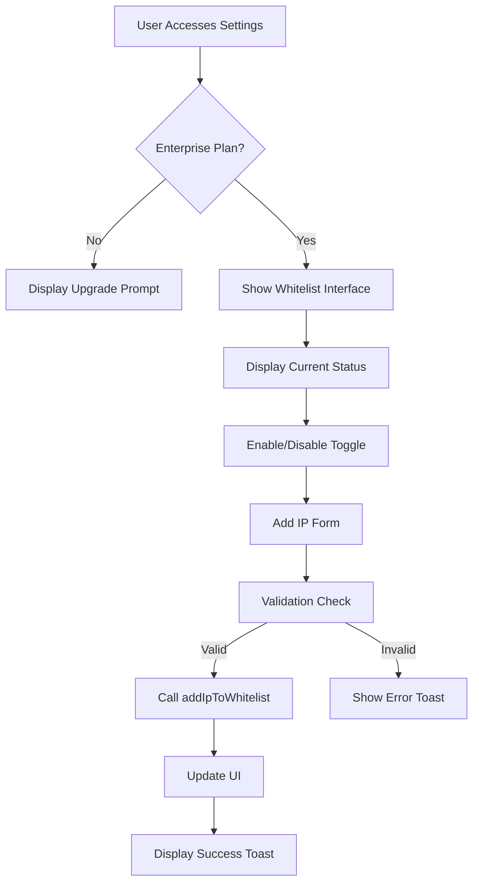
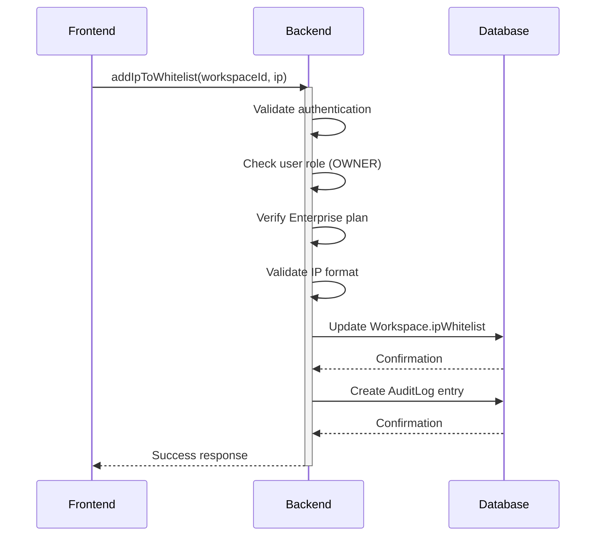
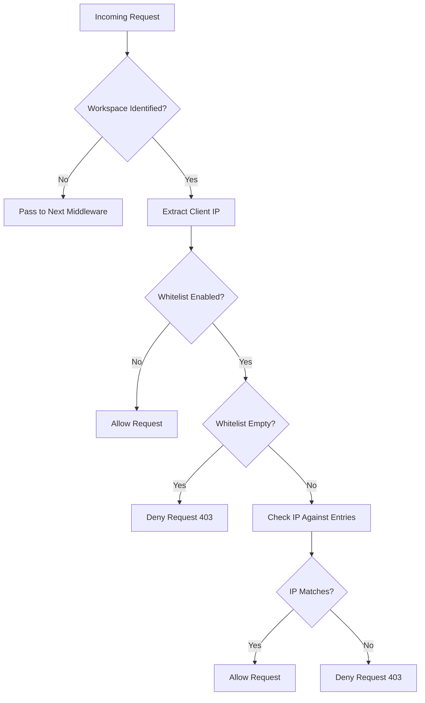
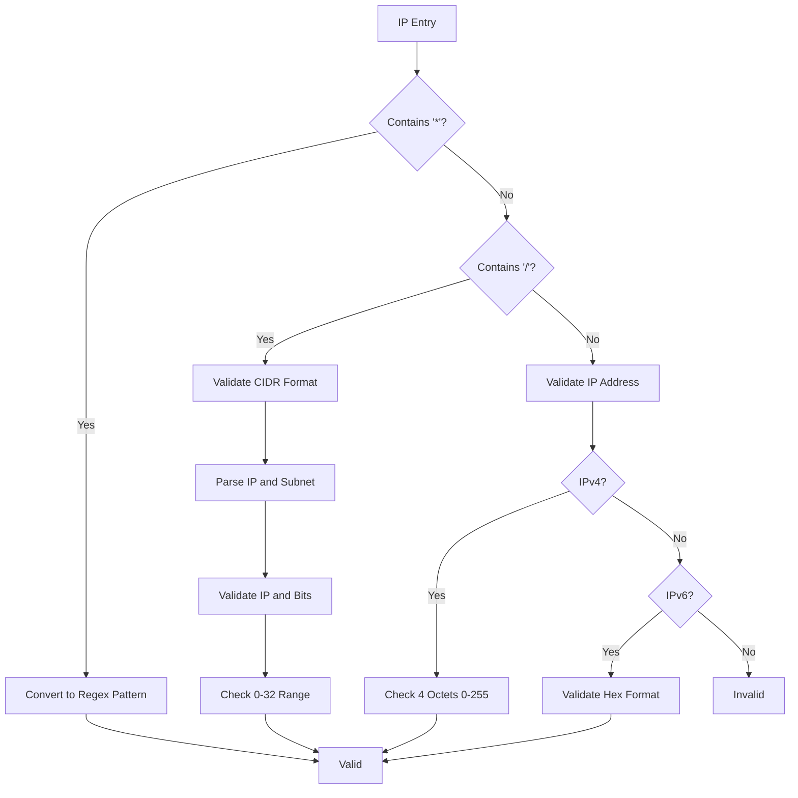

# Authorization Controls

<cite>
**Referenced Files in This Document**   
- [IpWhitelistSettings.tsx](file://src/client/components/IpWhitelistSettings.tsx)
- [ipWhitelistOperations.ts](file://src/core/auth/ipWhitelistOperations.ts)
- [ipWhitelist.ts](file://src/core/auth/ipWhitelist.ts)
- [migration.sql](file://migrations/20251117045259_add_refresh_tokens_ip_whitelist_password_policy/migration.sql)
</cite>

## Table of Contents
1. [Introduction](#introduction)
2. [IP Whitelist Configuration Workflow](#ip-whitelist-configuration-workflow)
3. [Database Schema and Storage](#database-schema-and-storage)
4. [Frontend Implementation](#frontend-implementation)
5. [Backend Validation and Operations](#backend-validation-and-operations)
6. [Middleware Enforcement](#middleware-enforcement)
7. [IP Address Validation and Matching](#ip-address-validation-and-matching)
8. [Edge Cases and Special Considerations](#edge-cases-and-special-considerations)
9. [Security and Audit Logging](#security-and-audit-logging)
10. [Common Issues and Troubleshooting](#common-issues-and-troubleshooting)

## Introduction
SentinelIQ provides enterprise-grade authorization controls through its IP address whitelisting functionality. This security feature allows workspace owners to restrict access to specific IP addresses, CIDR ranges, or wildcard patterns, ensuring that only authorized network locations can access sensitive workspace data. The implementation spans both frontend and backend components, with robust validation, middleware enforcement, and audit logging. This document details the complete workflow from configuration to enforcement, covering the technical implementation, edge cases, and security considerations.

## IP Whitelist Configuration Workflow
The IP whitelisting feature follows a structured workflow that begins with user configuration in the frontend and ends with server-side enforcement. Workspace owners can enable or disable the whitelist, add or remove IP addresses, and view the current configuration through a dedicated settings interface. The process requires an Enterprise subscription, as indicated in both the frontend and backend validation logic. When enabling the whitelist, administrators must ensure at least one IP address is configured to prevent accidental lockout. The system validates each IP entry for proper format before storage, supporting IPv4, IPv6, CIDR notation, and wildcard patterns. Once configured, the whitelist is enforced through middleware that intercepts incoming requests and verifies the client's IP address against the allowed list.

**Section sources**
- [IpWhitelistSettings.tsx](file://src/client/components/IpWhitelistSettings.tsx#L1-L201)
- [ipWhitelistOperations.ts](file://src/core/auth/ipWhitelistOperations.ts#L1-L281)

## Database Schema and Storage
The IP whitelist configuration is stored in the database as part of the Workspace entity. The schema includes two key fields: `ipWhitelist` as a text array to store the allowed IP addresses and `ipWhitelistEnabled` as a boolean flag to control whether the whitelist is active. The migration file shows that `ipWhitelist` is initialized as an empty array by default, while `ipWhitelistEnabled` defaults to false, ensuring that the feature is disabled by default for all workspaces. This design allows for flexible storage of various IP formats, including individual addresses, CIDR ranges, and wildcard patterns, all stored as strings in the array. The database schema is implemented through Prisma, with the fields added to the Workspace model to maintain workspace-specific security policies.

**Diagram sources **
- [migration.sql](file://migrations/20251117045259_add_refresh_tokens_ip_whitelist_password_policy/migration.sql#L1-L33)

## Frontend Implementation
The frontend implementation of IP whitelisting is centered around the `IpWhitelistSettings` component, which provides a user-friendly interface for managing the whitelist. The component displays the current status of the whitelist, allows adding new IP addresses through a form, and lists existing entries with removal options. Visual indicators show whether the feature is enabled and whether the workspace has an Enterprise plan. The interface includes helpful guidance, such as examples of valid IP formats and warnings about the consequences of enabling the whitelist. When the whitelist is active, a prominent alert reminds administrators to ensure their current IP is included to prevent lockout. The component uses Wasp's operations to communicate with the backend, calling functions like `getWorkspaceIpWhitelist`, `addIpToWhitelist`, `removeIpFromWhitelist`, and `toggleIpWhitelist` to perform actions. Error handling is implemented through toast notifications that provide immediate feedback to users.

**Diagram sources **
- [IpWhitelistSettings.tsx](file://src/client/components/IpWhitelistSettings.tsx#L1-L201)

## Backend Validation and Operations
The backend operations for IP whitelisting are implemented in the `ipWhitelistOperations.ts` file, which contains several key functions for managing the whitelist. The `getWorkspaceIpWhitelist` operation retrieves the current configuration, verifying that the requesting user has appropriate permissions (OWNER or ADMIN). The `addIpToWhitelist` function validates the IP format using `isValidWhitelistEntry` before adding it to the workspace's whitelist array, preventing duplicates. Similarly, `removeIpFromWhitelist` removes a specific IP address from the array. The `toggleIpWhitelist` operation includes a critical safety check that prevents enabling the whitelist without any IP addresses configured, avoiding accidental lockout scenarios. All operations include comprehensive permission checks, ensuring only workspace owners can modify the whitelist, and verify that the workspace has an Enterprise plan before allowing changes.

**Diagram sources **
- [ipWhitelistOperations.ts](file://src/core/auth/ipWhitelistOperations.ts#L1-L281)

## Middleware Enforcement
The IP whitelist enforcement is implemented through middleware that intercepts incoming requests to workspace routes. The `createIpWhitelistMiddleware` function creates an Express middleware that retrieves the workspace context from the request, extracts the client's IP address, and checks whether it is allowed by the whitelist. The middleware uses the `getClientIp` function to determine the client's IP, which checks multiple headers including `X-Forwarded-For`, `X-Real-IP`, and direct connection information to handle proxied requests correctly. If the IP is not whitelisted, the middleware throws an HTTP 403 error with a descriptive message. The enforcement logic is fail-secure, meaning that if the whitelist is enabled but empty, all requests are denied. This ensures that misconfiguration does not inadvertently open access to the workspace.

**Diagram sources **
- [ipWhitelist.ts](file://src/core/auth/ipWhitelist.ts#L154-L174)

## IP Address Validation and Matching
The system implements comprehensive IP address validation and matching logic to support various formats and ensure security. The `isValidWhitelistEntry` function checks whether an IP entry is valid, supporting three formats: individual IP addresses, CIDR notation, and wildcard patterns. For CIDR notation, the system validates both the IP portion and the subnet mask, ensuring the mask is between 0 and 32 for IPv4. The `ipMatchesCIDR` function implements the actual matching logic, converting IP addresses to integers and applying the subnet mask to determine if an address falls within a range. Wildcard patterns are converted to regular expressions for matching, allowing flexible patterns like `192.168.1.*`. The system also handles IPv6 addresses, including IPv4-mapped IPv6 addresses by normalizing them to their IPv4 equivalents. This comprehensive validation ensures that only properly formatted IP entries can be added to the whitelist.

**Diagram sources **
- [ipWhitelist.ts](file://src/core/auth/ipWhitelist.ts#L97-L116)

## Edge Cases and Special Considerations
The IP whitelisting implementation addresses several important edge cases to ensure reliability and security. For IPv6 compatibility, the system normalizes IPv4-mapped IPv6 addresses by removing the `::ffff:` prefix, allowing IPv4 addresses to be matched correctly when clients connect via IPv6. The handling of proxied requests is carefully implemented through the `getClientIp` function, which prioritizes the `X-Forwarded-For` header and takes the first IP in the list to prevent IP spoofing. The system also addresses the issue of dynamic IP addresses by allowing CIDR ranges that can accommodate changing IP assignments from ISPs. During maintenance scenarios, administrators can temporarily disable the whitelist without losing the configuration, providing flexibility for troubleshooting. The implementation includes safeguards against accidental lockout by preventing the enabling of an empty whitelist and by requiring Enterprise plans for this security feature.

**Section sources**
- [ipWhitelist.ts](file://src/core/auth/ipWhitelist.ts#L39-L55)
- [ipWhitelistOperations.ts](file://src/core/auth/ipWhitelistOperations.ts#L256-L259)

## Security and Audit Logging
Every change to the IP whitelist configuration is recorded in the audit log for security and compliance purposes. The system creates audit log entries for all operations, including adding or removing IP addresses and toggling the whitelist status. Each log entry includes the action performed, the resource affected, the user responsible, and metadata about the change. This comprehensive logging allows administrators to track configuration changes and investigate security incidents. The implementation follows the principle of least privilege, restricting whitelist management to workspace owners only. Additionally, all operations include authentication and authorization checks to prevent unauthorized access. The system also integrates with the broader security infrastructure, including rate limiting and CORS policies, to provide layered protection for the API endpoints that manage the whitelist.

**Section sources**
- [ipWhitelistOperations.ts](file://src/core/auth/ipWhitelistOperations.ts#L93-L103)
- [ipWhitelistOperations.ts](file://src/core/auth/ipWhitelistOperations.ts#L155-L165)

## Common Issues and Troubleshooting
Several common issues may arise when using the IP whitelisting feature, and the system includes mechanisms to address them. Accidental lockout is prevented by the validation that requires at least one IP address to be configured before enabling the whitelist. Users with dynamic IP addresses can use CIDR ranges to accommodate IP changes from their ISP. When behind proxies or load balancers, the system correctly identifies the client IP through the `X-Forwarded-For` header, though administrators must ensure their infrastructure is configured to set this header properly. If the whitelist appears not to be working, administrators should verify that the `ipWhitelistEnabled` flag is set to true and that the IP entries are correctly formatted. The audit logs provide valuable information for troubleshooting configuration issues, showing exactly when and by whom changes were made to the whitelist.

**Section sources**
- [ipWhitelistOperations.ts](file://src/core/auth/ipWhitelistOperations.ts#L256-L259)
- [ipWhitelist.ts](file://src/core/auth/ipWhitelist.ts#L135-L138)