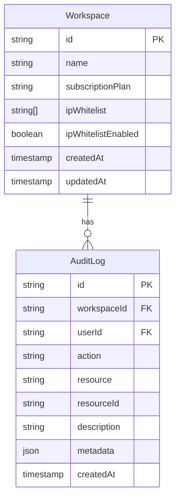
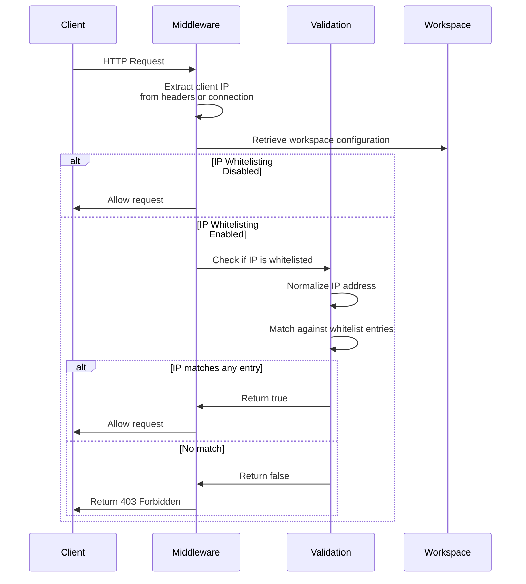
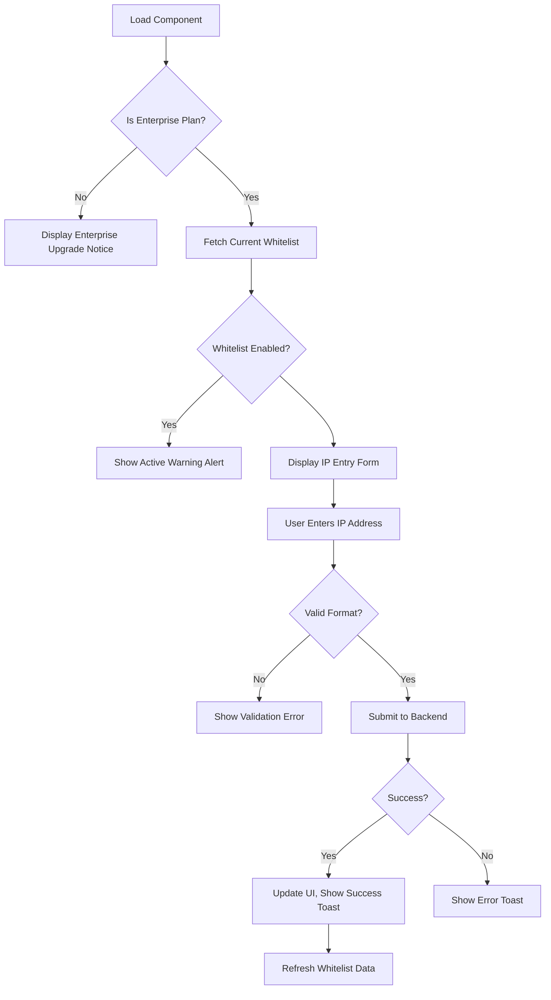

# IP Whitelisting

<cite>
**Referenced Files in This Document**   
- [IpWhitelistSettings.tsx](file://src/client/components/IpWhitelistSettings.tsx)
- [ipWhitelistOperations.ts](file://src/core/auth/ipWhitelistOperations.ts)
- [ipWhitelist.ts](file://src/core/auth/ipWhitelist.ts)
- [migration.sql](file://migrations/20251117045259_add_refresh_tokens_ip_whitelist_password_policy/migration.sql)
</cite>

## Table of Contents
1. [Introduction](#introduction)
2. [Configuration and Management](#configuration-and-management)
3. [Database Storage](#database-storage)
4. [Middleware Implementation](#middleware-implementation)
5. [Frontend Configuration Workflow](#frontend-configuration-workflow)
6. [Enterprise Plan Restrictions](#enterprise-plan-restrictions)
7. [Edge Cases and Operational Considerations](#edge-cases-and-operational-considerations)

## Introduction
The IP whitelisting functionality in SentinelIQ provides administrators with the ability to restrict access to workspaces based on IP addresses. This security feature allows configuration of allowed IP ranges using CIDR notation, wildcards, and individual IP addresses. The implementation includes secure storage of whitelist rules in the database and middleware that intercepts incoming requests to validate client IP addresses against the whitelist. The system supports IPv6 compatibility and properly handles X-Forwarded-For headers for proxied requests.

## Configuration and Management
Administrators can configure IP whitelisting rules through a dedicated interface that supports multiple formats for specifying allowed IP addresses. The system accepts individual IP addresses (e.g., 192.168.1.1), CIDR notation (e.g., 192.168.1.0/24), and wildcard patterns (e.g., 192.168.1.*). Each workspace maintains its own whitelist configuration, which is enforced at the request level.

The configuration process involves three primary operations: enabling/disabling the whitelist, adding new IP entries, and removing existing entries. When enabling IP whitelisting, the system validates that at least one IP address is present in the whitelist to prevent accidental lockout. All configuration changes are restricted to workspace owners and trigger audit log entries for security monitoring.

**Section sources**
- [ipWhitelistOperations.ts](file://src/core/auth/ipWhitelistOperations.ts#L1-L281)
- [ipWhitelist.ts](file://src/core/auth/ipWhitelist.ts#L1-L189)

## Database Storage
IP whitelist rules are securely stored in the database as part of the Workspace entity. The migration adds two columns to the Workspace table: `ipWhitelist` as a text array with a default empty array, and `ipWhitelistEnabled` as a boolean with a default value of false. This schema design allows for flexible storage of various IP formats while maintaining referential integrity with the workspace.

The database schema ensures that IP whitelist data is persisted alongside other workspace configuration settings. The text array type accommodates different IP formats (individual addresses, CIDR notation, and wildcards) without requiring complex normalization. Audit logs are automatically created for all modifications to IP whitelist settings, providing a complete history of changes for compliance and security review.

**Diagram sources**
- [migration.sql](file://migrations/20251117045259_add_refresh_tokens_ip_whitelist_password_policy/migration.sql#L1-L33)
- [ipWhitelistOperations.ts](file://src/core/auth/ipWhitelistOperations.ts#L93-L103)

## Middleware Implementation
The IP whitelisting middleware intercepts incoming requests and validates the client's IP address against the configured whitelist. The middleware extracts the client IP from various sources in order of preference: X-Forwarded-For header (taking the first IP in the comma-separated list), X-Real-IP header, X-Client-IP header, and finally the connection's remote address. This approach ensures accurate IP detection in proxy and load-balanced environments.

The validation logic first checks if IP whitelisting is enabled for the workspace. If disabled, all requests are allowed. If enabled, the middleware verifies that the client IP matches at least one entry in the whitelist. The matching algorithm supports exact IP matches, CIDR range calculations, and wildcard pattern matching. For IPv4-mapped IPv6 addresses (e.g., ::ffff:192.168.1.1), the system normalizes the IP by removing the IPv6 prefix before validation.

**Diagram sources**
- [ipWhitelist.ts](file://src/core/auth/ipWhitelist.ts#L154-L174)
- [ipWhitelist.ts](file://src/core/auth/ipWhitelist.ts#L121-L148)

## Frontend Configuration Workflow
The frontend configuration interface is implemented in IpWhitelistSettings.tsx as a React component that provides a user-friendly interface for managing IP whitelist rules. The UI displays the current status of IP whitelisting (enabled/disabled) with a toggle switch and shows all configured IP addresses in a list format. Users can add new IP entries through a form with real-time validation feedback.

The interface includes contextual alerts to guide administrators: a warning when IP whitelisting is active (to prevent accidental lockout) and a plan restriction notice for non-Enterprise workspaces. The component uses Wasp's operations to communicate with the backend, with optimistic UI updates and error handling via toast notifications. The design follows accessibility best practices with proper labeling and keyboard navigation support.

**Diagram sources**
- [IpWhitelistSettings.tsx](file://src/client/components/IpWhitelistSettings.tsx#L1-L201)

## Enterprise Plan Restrictions
IP whitelisting is restricted to Enterprise plan workspaces as a premium security feature. The system validates the workspace's subscription plan before allowing any IP whitelist operations. Non-Enterprise workspaces can view the IP whitelisting interface but cannot enable the feature or modify the whitelist. This restriction is enforced both in the frontend UI (disabling controls) and in the backend operations (returning 403 errors).

The plan validation is performed using the isEnterprisePlan function from the workspace/quotas module, which checks the workspace's subscriptionPlan field against the Enterprise tier. This ensures that only authorized workspaces can leverage this security capability, aligning with the product's tiered feature model.

**Section sources**
- [ipWhitelistOperations.ts](file://src/core/auth/ipWhitelistOperations.ts#L40-L41)
- [ipWhitelistOperations.ts](file://src/core/auth/ipWhitelistOperations.ts#L77-L79)

## Edge Cases and Operational Considerations
The IP whitelisting implementation includes several safeguards for edge cases and operational scenarios. To prevent accidental lockout, the system requires at least one IP address in the whitelist before enabling the feature. When handling X-Forwarded-For headers, only the first IP address is considered to prevent IP spoofing through header manipulation.

During maintenance windows, administrators should ensure that maintenance IPs are included in the whitelist before enabling the feature. The system handles IPv6 addresses and IPv4-mapped IPv6 addresses transparently through IP normalization. Error handling includes validation of IP formats before storage and graceful degradation when encountering invalid whitelist entries during request processing.

The implementation also considers operational aspects such as audit logging for all configuration changes, rate limiting to prevent abuse of the configuration endpoints, and proper error messaging to guide administrators through correct configuration. These considerations ensure the feature is both secure and user-friendly in real-world operational scenarios.

**Section sources**
- [ipWhitelistOperations.ts](file://src/core/auth/ipWhitelistOperations.ts#L256-L259)
- [ipWhitelist.ts](file://src/core/auth/ipWhitelist.ts#L135-L138)
- [ipWhitelist.ts](file://src/core/auth/ipWhitelist.ts#L180-L185)