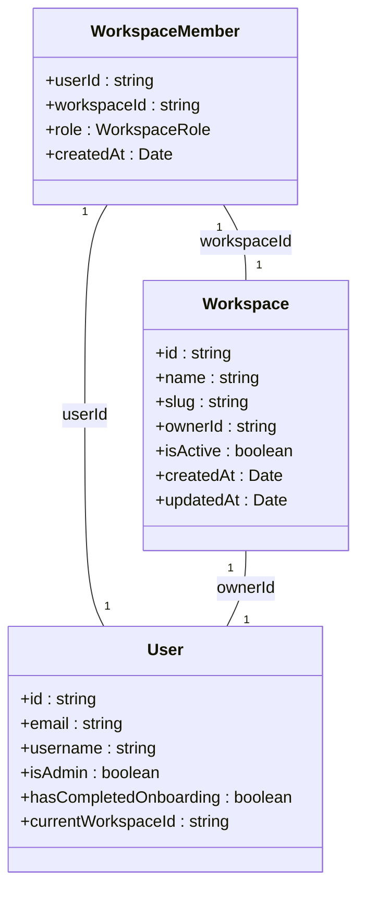
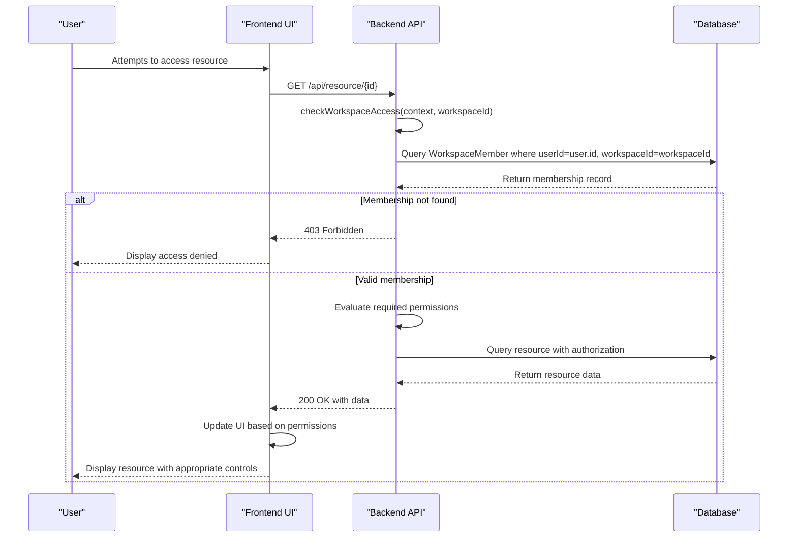
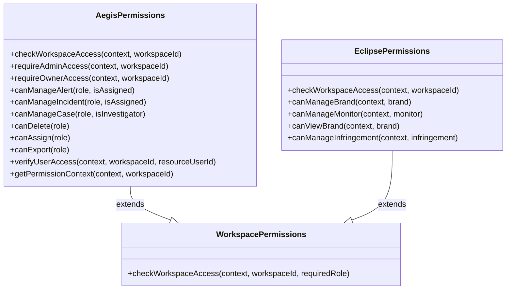
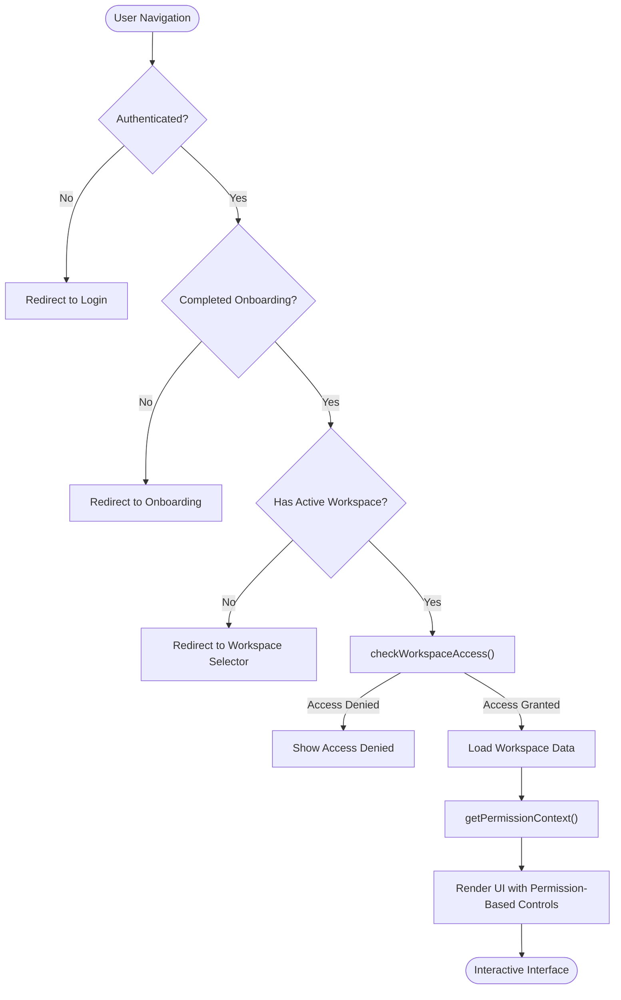
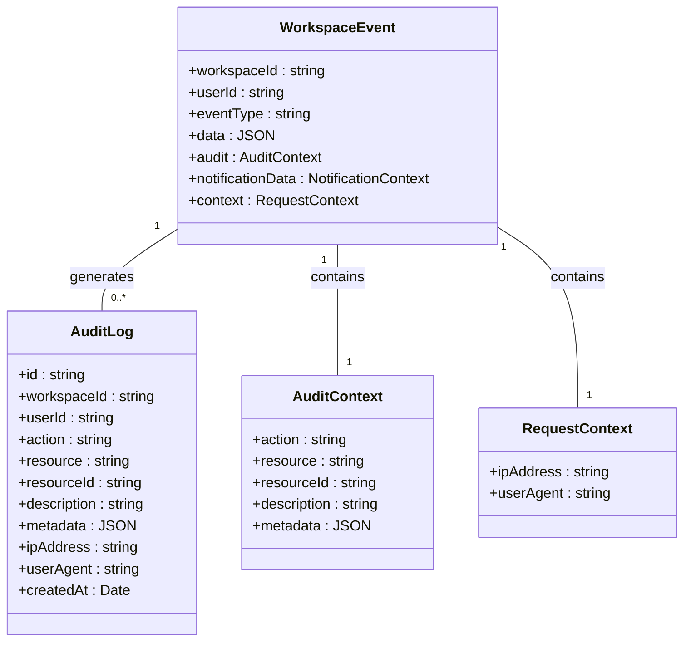

# Permission Management

<cite>
**Referenced Files in This Document**   
- [permissions.ts](file://src/core/modules/aegis/utils/permissions.ts)
- [permissions.ts](file://src/core/modules/eclipse/utils/permissions.ts)
- [ModuleUsersPage.tsx](file://src/client/pages/modules/ModuleUsersPage.tsx)
- [operations.ts](file://src/core/workspace/operations.ts)
- [services.ts](file://src/core/workspace/services.ts)
- [WorkspaceGuard.tsx](file://src/client/components/WorkspaceGuard.tsx)
- [useWorkspace.ts](file://src/client/hooks/useWorkspace.ts)
- [audit.ts](file://src/core/audit/operations.ts)
</cite>

## Table of Contents
1. [Introduction](#introduction)
2. [Workspace Membership and Roles](#workspace-membership-and-roles)
3. [Permission Evaluation System](#permission-evaluation-system)
4. [Module-Specific Permission Utilities](#module-specific-permission-utilities)
5. [Frontend Permission Integration](#frontend-permission-integration)
6. [User Management Development Status](#user-management-development-status)
7. [Best Practices and Security Considerations](#best-practices-and-security-considerations)
8. [Permission Inheritance and Nested Resources](#permission-inheritance-and-nested-resources)
9. [Audit Logging and Compliance](#audit-logging-and-compliance)
10. [Conclusion](#conclusion)

## Introduction

The SentinelIQ permission management system implements a robust Role-Based Access Control (RBAC) framework that governs user access to workspaces and resources. The system is built around workspace membership roles (OWNER, ADMIN, MEMBER) and provides both generic workspace access checks and module-specific permission utilities. This documentation details how users are granted access to workspaces, how permissions are dynamically calculated based on role and resource ownership, and how the system integrates backend permission checks with frontend UI rendering.

The permission system is designed with security, auditability, and extensibility in mind, following the principle of least privilege and providing comprehensive audit logging for all permission-related actions. The system supports both direct permission checks and context-based permission evaluation, allowing for fine-grained control over user capabilities within the application.

**Section sources**
- [permissions.ts](file://src/core/modules/aegis/utils/permissions.ts#L1-L60)
- [operations.ts](file://src/core/workspace/operations.ts#L89-L109)

## Workspace Membership and Roles

The SentinelIQ permission system is built on a three-tier role hierarchy within workspaces: OWNER, ADMIN, and MEMBER. These roles define the level of access and control a user has over workspace resources and operations. Users gain access to a workspace through membership, which is established either by creating a workspace (automatically becoming OWNER) or by being invited by an existing OWNER or ADMIN.

The role hierarchy follows a clear progression of privileges, with OWNER having the highest level of access, followed by ADMIN, and then MEMBER. This hierarchy is implemented in the `WorkspaceService.checkWorkspaceAccess` method, which uses a numeric level system (OWNER: 3, ADMIN: 2, MEMBER: 1) to evaluate whether a user meets the required role threshold for specific operations. When a user attempts to access a workspace, the system verifies their membership status and role, throwing appropriate HTTP errors (401 for unauthenticated users, 403 for insufficient permissions) when access is denied.

Workspace membership is managed through a comprehensive set of operations including `inviteMemberToWorkspace`, `removeMemberFromWorkspace`, `updateMemberRole`, and `transferWorkspaceOwnership`. These operations include appropriate permission checks to ensure that only users with sufficient privileges can modify membership. For example, only OWNER and ADMIN users can invite or remove members, while only the OWNER can transfer ownership of the workspace.

**Diagram sources **
- [operations.ts](file://src/core/workspace/operations.ts#L52-L67)
- [services.ts](file://src/core/workspace/services.ts#L1-L42)

**Section sources**
- [operations.ts](file://src/core/workspace/operations.ts#L438-L444)
- [services.ts](file://src/core/workspace/services.ts#L1-L42)

## Permission Evaluation System

The permission evaluation system in SentinelIQ combines role-based checks with resource ownership verification to determine user access. The core of this system is the `checkWorkspaceAccess` function, which is implemented in multiple locations across the codebase with slight variations. This function verifies that a user is authenticated and has a valid membership in the requested workspace, returning the user's role if access is granted.

For more complex permission scenarios, the system provides specialized functions that evaluate permissions based on both role and ownership. The `verifyUserAccess` function, for example, determines whether a user has access to a specific resource by checking if they are either an ADMIN/OWNER or the owner of the resource (identified by matching user IDs). This pattern enables fine-grained access control where users can manage their own resources while administrators have broader oversight.

The system also implements permission context objects that bundle multiple permission checks into a single evaluation. The `getPermissionContext` function returns an object with boolean flags for various capabilities (canManageAlerts, canManageIncidents, canDelete, etc.) based on the user's role. This approach reduces the number of individual permission checks needed in business logic and provides a consistent interface for determining user capabilities.

**Diagram sources **
- [permissions.ts](file://src/core/modules/aegis/utils/permissions.ts#L1-L60)
- [operations.ts](file://src/core/workspace/operations.ts#L89-L109)

**Section sources**
- [permissions.ts](file://src/core/modules/aegis/utils/permissions.ts#L111-L158)
- [operations.ts](file://src/core/workspace/operations.ts#L89-L109)

## Module-Specific Permission Utilities

SentinelIQ implements module-specific permission utilities that extend the core workspace permission system to address the unique requirements of different modules. The Aegis and Eclipse modules each have their own permission utility files that provide specialized functions for their respective domains.

The Aegis module's permission system focuses on security operations, with functions that determine access to alerts, incidents, cases, and evidence. These functions implement nuanced permission logic that considers both user role and assignment status. For example, while OWNER and ADMIN users have full access to manage all alerts, MEMBER users can only manage alerts they have been assigned to. Similarly, access to evidence is restricted to OWNER/ADMIN users or to members who are investigators on the relevant case.

The Eclipse module implements a similar pattern with functions like `canManageBrand`, `canManageMonitor`, and `canManageInfringement`, all of which restrict management capabilities to OWNER and ADMIN users while allowing all members to view brands within their workspace. This modular approach allows each module to define its own permission semantics while maintaining consistency with the overall RBAC framework.

**Diagram sources **
- [permissions.ts](file://src/core/modules/aegis/utils/permissions.ts#L1-L60)
- [permissions.ts](file://src/core/modules/eclipse/utils/permissions.ts#L4-L60)

**Section sources**
- [permissions.ts](file://src/core/modules/aegis/utils/permissions.ts#L1-L60)
- [permissions.ts](file://src/core/modules/eclipse/utils/permissions.ts#L4-L60)

## Frontend Permission Integration

The frontend of SentinelIQ integrates permission checks through a combination of route guards, React hooks, and permission context providers. The `WorkspaceGuard` component acts as a central authorization mechanism, redirecting users based on their authentication status, onboarding completion, and workspace membership. This guard prevents unauthorized access to workspace-specific routes and ensures users are properly directed to onboarding or workspace selection when appropriate.

The `useWorkspace` hook provides a convenient way for components to access information about the current workspace, including the user's role and membership status. This hook wraps the `getCurrentWorkspace` operation and returns a structured object that can be used to conditionally render UI elements based on workspace context. Components can use this hook to determine whether to display certain features or controls based on the user's permissions.

Permission context is used throughout the frontend to enable or disable UI elements dynamically. For example, buttons for creating new resources, editing existing ones, or deleting items are conditionally rendered or disabled based on the user's role and specific permissions. This creates a seamless user experience where users only see options they are authorized to use, reducing confusion and preventing unauthorized actions.

**Diagram sources **
- [WorkspaceGuard.tsx](file://src/client/components/WorkspaceGuard.tsx#L20-L82)
- [useWorkspace.ts](file://src/client/hooks/useWorkspace.ts#L1-L27)

**Section sources**
- [WorkspaceGuard.tsx](file://src/client/components/WorkspaceGuard.tsx#L20-L82)
- [useWorkspace.ts](file://src/client/hooks/useWorkspace.ts#L1-L27)

## User Management Development Status

The user management functionality in SentinelIQ is currently under development, as indicated by the `ModuleUsersPage.tsx` component. This page serves as a placeholder for future user management features and explicitly states that functionality for access control, permissions, user profiles, and access logs will be available soon. The current implementation displays a simple card with a message indicating the module is in development, suggesting that comprehensive user management tools are planned but not yet implemented.

Despite the current state of the user management interface, the underlying permission system is fully functional and supports key operations such as inviting members, removing members, updating roles, and transferring ownership. These operations are accessible through other parts of the application, such as workspace settings, indicating that user management capabilities exist but are not yet centralized in a dedicated interface.

The development status of the user management module presents an opportunity to implement best practices in permission management, including role-based access control, audit logging of permission changes, and support for permission inheritance in nested resources. As this module is developed, it should provide administrators with comprehensive tools to manage user roles, permissions, and access across workspaces and modules.

**Section sources**
- [ModuleUsersPage.tsx](file://src/client/pages/modules/ModuleUsersPage.tsx#L1-L33)

## Best Practices and Security Considerations

The SentinelIQ permission system incorporates several best practices for secure and effective permission management. The principle of least privilege is enforced through the role hierarchy and specific permission checks that limit user capabilities to only what is necessary for their role. This reduces the potential impact of compromised accounts and limits the blast radius of security incidents.

Audit logging is implemented for all significant permission-related actions, including membership changes, role updates, and ownership transfers. Each operation that modifies permissions or access rights emits events to the `workspaceEventBus`, which generates audit log entries with detailed information about the action, including the user who performed it, the target of the action, and relevant metadata. This provides a comprehensive trail of permission changes for security monitoring and compliance purposes.

The system also implements rate limiting on sensitive operations such as inviting members and accepting invitations to prevent abuse and brute force attacks. Operations like `inviteMemberToWorkspace` and `acceptWorkspaceInvitation` include rate limit checks to prevent automated attempts to add users or claim invitations. Additionally, ownership transfers require confirmation via email with a time-limited token, adding an extra layer of security for this critical operation.

Security considerations are also evident in the implementation of ownership transfer, which uses a two-step confirmation process. The current owner initiates the transfer, but the new owner must confirm via a secure token sent to their email address. This prevents unauthorized ownership changes and ensures that the new owner is aware of and consents to the transfer. The atomic update sequence ensures that role changes and ownership updates are performed consistently, preventing intermediate states where workspace ownership might be ambiguous.

**Section sources**
- [operations.ts](file://src/core/workspace/operations.ts#L445-L448)
- [operations.ts](file://src/core/workspace/operations.ts#L698-L700)
- [operations.ts](file://src/core/workspace/operations.ts#L742-L758)

## Permission Inheritance and Nested Resources

While the current implementation primarily focuses on workspace-level permissions, the architecture supports permission inheritance patterns that could be extended to nested resources. The permission system's design, with its separation of generic workspace access checks and module-specific utilities, provides a foundation for implementing hierarchical permission models.

For nested resources, permission inheritance could be implemented by checking permissions at multiple levels of the resource hierarchy. For example, access to a specific alert might depend on permissions at the workspace level, the case level (if the alert is part of a case), and the alert level itself. The current `verifyUserAccess` function, which considers both role and resource ownership, provides a pattern that could be extended to handle inheritance by traversing the resource hierarchy and evaluating permissions at each level.

The system already demonstrates aspects of permission inheritance through the relationship between workspace roles and module-specific permissions. A user's ability to manage alerts, incidents, or cases in the Aegis module is derived from their workspace role, creating a form of inheritance where higher-level workspace permissions grant capabilities in specific modules. This pattern could be extended to more complex resource hierarchies by implementing similar derivation rules for nested resources.

When extending the permission system to support nested resources, it would be important to maintain performance by minimizing database queries and potentially implementing caching mechanisms for frequently accessed permission evaluations. The current use of context objects like those returned by `getPermissionContext` suggests an awareness of performance considerations and provides a model for efficient permission evaluation that could be adapted for more complex inheritance scenarios.

**Section sources**
- [permissions.ts](file://src/core/modules/aegis/utils/permissions.ts#L153-L188)
- [permissions.ts](file://src/core/modules/aegis/utils/permissions.ts#L111-L158)

## Audit Logging and Compliance

The SentinelIQ system includes comprehensive audit logging capabilities that capture permission-related events and support compliance requirements. The audit system is centered around the `workspaceEventBus`, which emits events for significant operations that are then recorded in the audit log. These events include detailed information about the action performed, the user who performed it, the target of the action, and relevant metadata.

Key operations that generate audit logs include membership changes (adding or removing members), role updates, ownership transfers, and workspace deletion. Each audit log entry includes contextual information such as IP address and user agent, which helps in security investigations and provides additional evidence for compliance audits. The system also supports exporting audit logs in CSV format, but restricts this capability to OWNER and ADMIN users to prevent unauthorized access to sensitive audit data.

For compliance with data protection regulations like GDPR, the system implements a data export feature that allows OWNER and ADMIN users to export all workspace data. This operation is itself audited, creating a record of when and by whom the data export was performed. The exported data includes workspace information, member details, audit logs, notifications, and invitations, providing a comprehensive snapshot of the workspace for compliance purposes.

The audit system also supports filtering and querying of audit logs by various criteria, including user, action type, resource, and date range. This enables administrators to investigate specific events or generate reports on permission changes over time. The `getAuditLogs` and `getAuditLogsByResource` functions provide flexible interfaces for retrieving audit data, while `exportAuditLogs` facilitates compliance reporting by providing data in a standard format.

**Diagram sources **
- [audit.ts](file://src/core/audit/operations.ts#L1-L59)
- [types.ts](file://src/core/audit/types.ts#L1-L60)

**Section sources**
- [audit.ts](file://src/core/audit/operations.ts#L1-L215)
- [operations.ts](file://src/core/workspace/operations.ts#L364-L380)

## Conclusion

The permission management system in SentinelIQ provides a robust foundation for controlling access to workspaces and resources through a role-based access control model. The system effectively combines workspace membership roles (OWNER, ADMIN, MEMBER) with module-specific permission utilities to create a flexible and secure authorization framework. Key strengths of the system include its consistent implementation across modules, comprehensive audit logging, and integration with frontend components to enable dynamic UI rendering based on user permissions.

The current implementation demonstrates adherence to security best practices, including the principle of least privilege, rate limiting on sensitive operations, and multi-step confirmation for critical actions like ownership transfer. The system's architecture supports future enhancements, particularly in the area of user management, where the placeholder `ModuleUsersPage` indicates upcoming functionality for centralized user and permission administration.

As the system evolves, opportunities exist to further enhance the permission model with features like custom roles, permission inheritance for nested resources, and more sophisticated permission delegation patterns. The existing foundation, with its clear separation of concerns and consistent patterns, provides a solid basis for these extensions while maintaining the security and reliability of the permission management system.