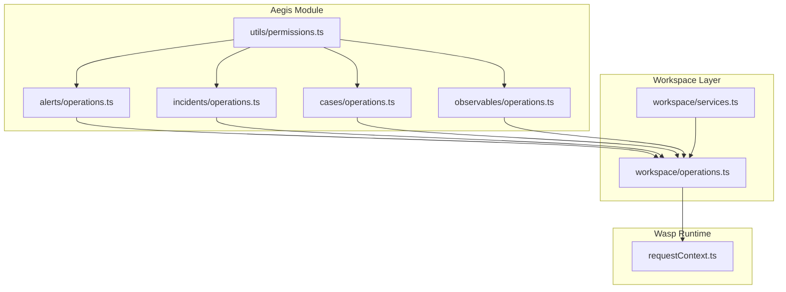
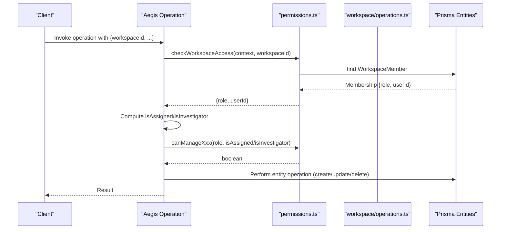
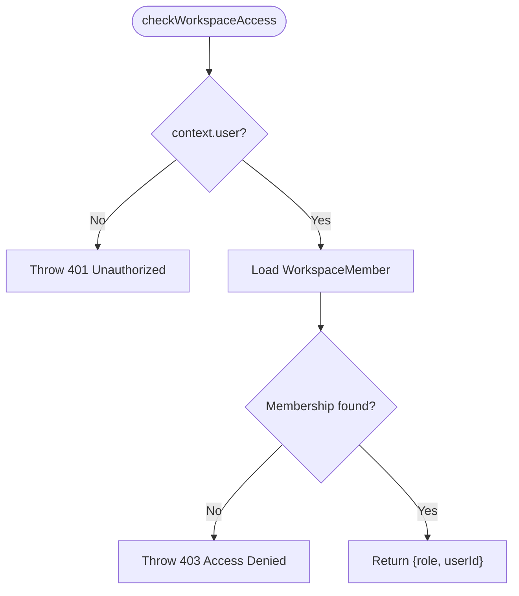
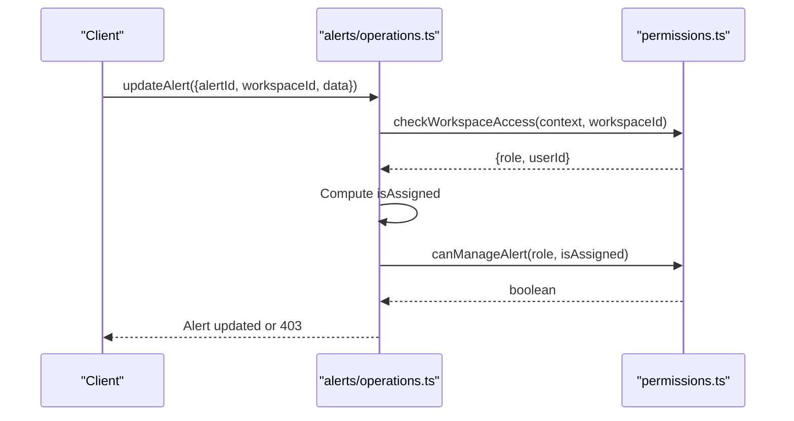
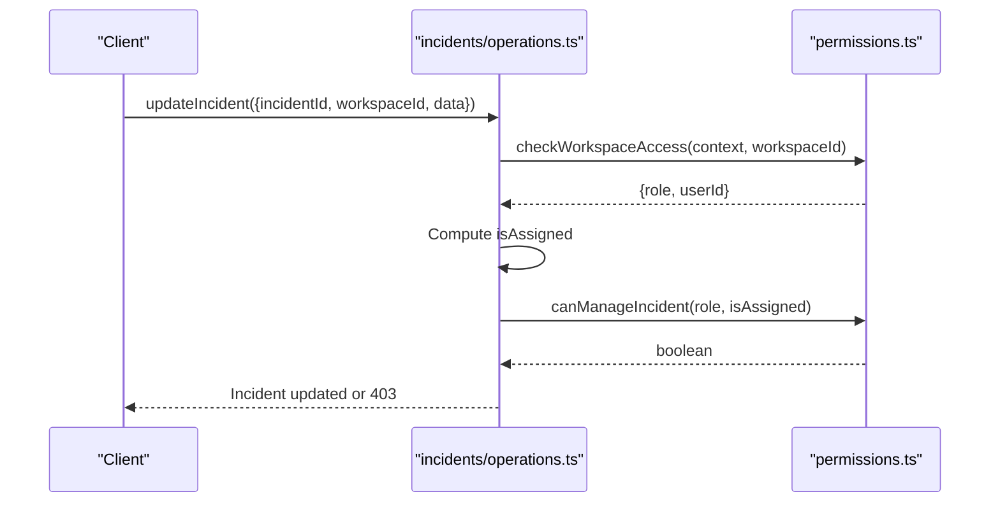
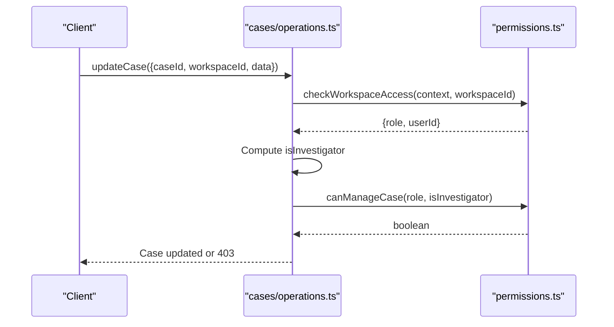
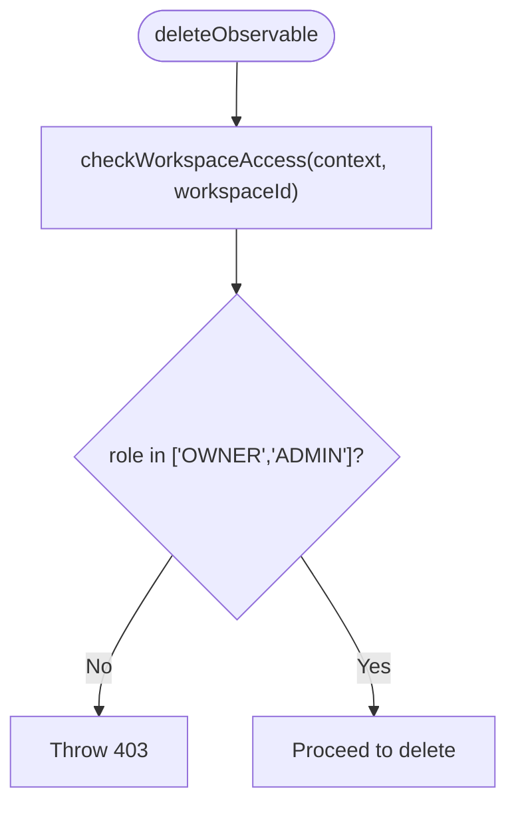
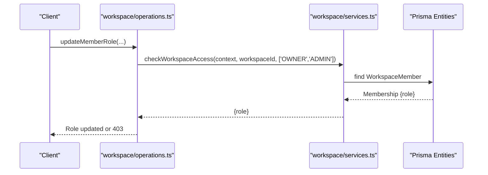
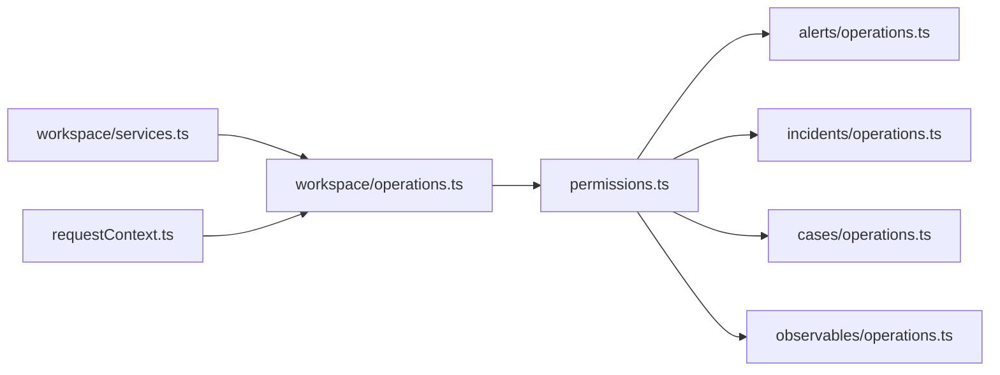

# Role-Based Access Control

<cite>
**Referenced Files in This Document**
- [permissions.ts](file://src/core/modules/aegis/utils/permissions.ts)
- [operations.ts](file://src/core/modules/aegis/observables/operations.ts)
- [operations.ts](file://src/core/modules/aegis/incidents/operations.ts)
- [operations.ts](file://src/core/modules/aegis/alerts/operations.ts)
- [operations.ts](file://src/core/modules/aegis/cases/operations.ts)
- [operations.ts](file://src/core/workspace/operations.ts)
- [services.ts](file://src/core/workspace/services.ts)
- [requestContext.ts](file://src/server/requestContext.ts)
</cite>

## Table of Contents
1. [Introduction](#introduction)
2. [Project Structure](#project-structure)
3. [Core Components](#core-components)
4. [Architecture Overview](#architecture-overview)
5. [Detailed Component Analysis](#detailed-component-analysis)
6. [Dependency Analysis](#dependency-analysis)
7. [Performance Considerations](#performance-considerations)
8. [Troubleshooting Guide](#troubleshooting-guide)
9. [Conclusion](#conclusion)

## Introduction
This document explains the Role-Based Access Control (RBAC) system in SentinelIQ’s Aegis module and how it integrates with Wasp’s context system. It covers the three-tier role hierarchy (OWNER, ADMIN, MEMBER), permission enforcement across modules (alerts, incidents, cases, observables), and the permission-checking helpers that gate sensitive operations. It also documents the granular permissions such as canManageAlert, canManageIncident, canDelete, canAssign, and canExport, and shows how getPermissionContext provides a comprehensive permission profile for UI rendering. Guidance is included for implementing RBAC in new features and troubleshooting common permission issues.

## Project Structure
RBAC is implemented primarily in the Aegis module under core/modules/aegis. The permission helpers live in utils/permissions.ts and are consumed by operations across alerts, incidents, cases, and observables. Workspace-level access control is centralized in core/workspace/operations.ts and core/workspace/services.ts. Wasp’s context (context.user, context.entities) is used throughout to enforce access and derive user roles.

**Diagram sources**
- [permissions.ts](file://src/core/modules/aegis/utils/permissions.ts#L1-L189)
- [operations.ts](file://src/core/modules/aegis/alerts/operations.ts#L1-L499)
- [operations.ts](file://src/core/modules/aegis/incidents/operations.ts#L1-L754)
- [operations.ts](file://src/core/modules/aegis/cases/operations.ts#L1-L800)
- [operations.ts](file://src/core/modules/aegis/observables/operations.ts#L1-L811)
- [operations.ts](file://src/core/workspace/operations.ts#L80-L162)
- [services.ts](file://src/core/workspace/services.ts#L1-L42)
- [requestContext.ts](file://src/server/requestContext.ts#L1-L56)

**Section sources**
- [permissions.ts](file://src/core/modules/aegis/utils/permissions.ts#L1-L189)
- [operations.ts](file://src/core/modules/aegis/alerts/operations.ts#L1-L499)
- [operations.ts](file://src/core/modules/aegis/incidents/operations.ts#L1-L754)
- [operations.ts](file://src/core/modules/aegis/cases/operations.ts#L1-L800)
- [operations.ts](file://src/core/modules/aegis/observables/operations.ts#L1-L811)
- [operations.ts](file://src/core/workspace/operations.ts#L80-L162)
- [services.ts](file://src/core/workspace/services.ts#L1-L42)
- [requestContext.ts](file://src/server/requestContext.ts#L1-L56)

## Core Components
- Role hierarchy: OWNER > ADMIN > MEMBER. Higher roles inherit permissions of lower roles plus additional administrative capabilities.
- Workspace access checks: Every operation begins by validating that context.user is authenticated and that a WorkspaceMember record exists for the given workspaceId.
- Permission helpers:
  - checkWorkspaceAccess: Returns role and userId; throws if unauthorized.
  - requireAdminAccess / requireOwnerAccess: Enforce elevated roles.
  - canManageAlert, canManageIncident, canManageCase: Allow OWNER/ADMIN full control; MEMBER can manage only assignments they own.
  - canDelete, canAssign: Only OWNER/ADMIN.
  - canExport: All authenticated users with workspace access.
  - getPermissionContext: Returns a compact permission profile for UI rendering.

**Section sources**
- [permissions.ts](file://src/core/modules/aegis/utils/permissions.ts#L14-L189)
- [operations.ts](file://src/core/modules/aegis/alerts/operations.ts#L300-L368)
- [operations.ts](file://src/core/modules/aegis/incidents/operations.ts#L346-L431)
- [operations.ts](file://src/core/modules/aegis/cases/operations.ts#L354-L423)
- [operations.ts](file://src/core/modules/aegis/observables/operations.ts#L663-L697)

## Architecture Overview
The RBAC enforcement follows a consistent pattern:
- All operations receive a Wasp context argument.
- Operations call checkWorkspaceAccess(context, workspaceId) to ensure the user belongs to the workspace and to obtain their role.
- For sensitive actions, operations call requireAdminAccess or requireOwnerAccess, or use granular helpers like canAssign, canDelete, canExport.
- For assignment-based permissions, operations compute isAssigned or isInvestigator and pass to canManageAlert/canManageIncident/canManageCase.

**Diagram sources**
- [permissions.ts](file://src/core/modules/aegis/utils/permissions.ts#L14-L189)
- [operations.ts](file://src/core/modules/aegis/alerts/operations.ts#L300-L368)
- [operations.ts](file://src/core/modules/aegis/incidents/operations.ts#L346-L431)
- [operations.ts](file://src/core/modules/aegis/cases/operations.ts#L354-L423)
- [operations.ts](file://src/core/modules/aegis/observables/operations.ts#L663-L697)
- [operations.ts](file://src/core/workspace/operations.ts#L80-L162)

## Detailed Component Analysis

### Aegis Permissions Utilities
- checkWorkspaceAccess: Ensures authentication and membership; returns role and userId.
- requireAdminAccess / requireOwnerAccess: Enforce elevated roles.
- canManageAlert, canManageIncident, canManageCase: OWNER/ADMIN full control; MEMBER can manage only assignments they own.
- canDelete, canAssign: OWNER/ADMIN only.
- canExport: All authenticated users with workspace access.
- getPermissionContext: Aggregates a permission profile for UI rendering.

**Diagram sources**
- [permissions.ts](file://src/core/modules/aegis/utils/permissions.ts#L14-L37)

**Section sources**
- [permissions.ts](file://src/core/modules/aegis/utils/permissions.ts#L14-L189)

### Alerts Module RBAC
- Access control: All queries/actions call checkWorkspaceAccess.
- Assignment-based management: canManageAlert(role, isAssigned) gates updates; canAssign(role) gates assignment.
- Bulk operations: bulkUpdateAegisAlerts uses canAssign to authorize mass changes.

**Diagram sources**
- [operations.ts](file://src/core/modules/aegis/alerts/operations.ts#L300-L368)
- [permissions.ts](file://src/core/modules/aegis/utils/permissions.ts#L67-L117)

**Section sources**
- [operations.ts](file://src/core/modules/aegis/alerts/operations.ts#L300-L499)

### Incidents Module RBAC
- Access control: All queries/actions call checkWorkspaceAccess.
- Assignment-based management: canManageIncident(role, isAssigned) gates updates; canAssign(role) gates assignment.
- Progress and resolution: Updates validated against role and assignment status.

**Diagram sources**
- [operations.ts](file://src/core/modules/aegis/incidents/operations.ts#L346-L431)
- [permissions.ts](file://src/core/modules/aegis/utils/permissions.ts#L79-L101)

**Section sources**
- [operations.ts](file://src/core/modules/aegis/incidents/operations.ts#L346-L495)

### Cases Module RBAC
- Access control: All queries/actions call checkWorkspaceAccess.
- Assignment-based management: canManageCase(role, isInvestigator) gates updates; canAssign(role) gates assignment.
- Case lifecycle: Creation, updates, closing, reopening, and reporting are gated by role and assignment.

**Diagram sources**
- [operations.ts](file://src/core/modules/aegis/cases/operations.ts#L354-L423)
- [permissions.ts](file://src/core/modules/aegis/utils/permissions.ts#L91-L101)

**Section sources**
- [operations.ts](file://src/core/modules/aegis/cases/operations.ts#L354-L484)

### Observables Module RBAC
- Access control: All queries/actions call checkWorkspaceAccess.
- Deletion: Only OWNER/ADMIN can delete observables.
- Export: canExport(role) permits authenticated users with workspace access to export.

**Diagram sources**
- [operations.ts](file://src/core/modules/aegis/observables/operations.ts#L663-L697)
- [permissions.ts](file://src/core/modules/aegis/utils/permissions.ts#L103-L117)

**Section sources**
- [operations.ts](file://src/core/modules/aegis/observables/operations.ts#L663-L697)

### Workspace-Level Access and Context
- Workspace operations enforce role checks using checkWorkspaceAccess(context, workspaceId, requiredRoles).
- WorkspaceService.checkWorkspaceAccess provides a reusable, hierarchical role check across modules.
- requestContext.ts extracts IP and user agent for audit/logging.

**Diagram sources**
- [operations.ts](file://src/core/workspace/operations.ts#L635-L689)
- [services.ts](file://src/core/workspace/services.ts#L1-L42)

**Section sources**
- [operations.ts](file://src/core/workspace/operations.ts#L80-L162)
- [services.ts](file://src/core/workspace/services.ts#L1-L42)
- [requestContext.ts](file://src/server/requestContext.ts#L1-L56)

## Dependency Analysis
- Cohesion: Permission helpers in utils/permissions.ts encapsulate role logic and are reused across modules.
- Coupling: Operations depend on checkWorkspaceAccess and granular helpers; Workspace operations depend on WorkspaceMember records.
- External dependencies: Wasp’s context (context.user, context.entities) and HttpError for standardized errors.

**Diagram sources**
- [permissions.ts](file://src/core/modules/aegis/utils/permissions.ts#L1-L189)
- [operations.ts](file://src/core/modules/aegis/alerts/operations.ts#L1-L499)
- [operations.ts](file://src/core/modules/aegis/incidents/operations.ts#L1-L754)
- [operations.ts](file://src/core/modules/aegis/cases/operations.ts#L1-L800)
- [operations.ts](file://src/core/modules/aegis/observables/operations.ts#L1-L811)
- [operations.ts](file://src/core/workspace/operations.ts#L80-L162)
- [services.ts](file://src/core/workspace/services.ts#L1-L42)
- [requestContext.ts](file://src/server/requestContext.ts#L1-L56)

**Section sources**
- [permissions.ts](file://src/core/modules/aegis/utils/permissions.ts#L1-L189)
- [operations.ts](file://src/core/modules/aegis/alerts/operations.ts#L1-L499)
- [operations.ts](file://src/core/modules/aegis/incidents/operations.ts#L1-L754)
- [operations.ts](file://src/core/modules/aegis/cases/operations.ts#L1-L800)
- [operations.ts](file://src/core/modules/aegis/observables/operations.ts#L1-L811)
- [operations.ts](file://src/core/workspace/operations.ts#L80-L162)
- [services.ts](file://src/core/workspace/services.ts#L1-L42)
- [requestContext.ts](file://src/server/requestContext.ts#L1-L56)

## Performance Considerations
- Minimize repeated membership lookups: cache role and userId from checkWorkspaceAccess within a single operation call when possible.
- Prefer early exits: throw 401/403 as soon as authentication or authorization fails to avoid unnecessary DB queries.
- Use targeted includes: only include relations needed for the operation to reduce payload size.

## Troubleshooting Guide
Common issues and resolutions:
- 401 Unauthorized: Ensure context.user is present. This occurs when a user is not authenticated.
- 403 Access Denied: The user is not a member of the workspace or lacks required role. Verify WorkspaceMember exists and role is correct.
- Assignment failures: Only OWNER/ADMIN can assign resources. Ensure canAssign(role) passes.
- Management failures: For MEMBER, canManageAlert/canManageIncident/canManageCase require isAssigned/isInvestigator to be true.
- Deletion failures: Only OWNER/ADMIN can delete. Ensure canDelete(role) passes.
- Export failures: Ensure canExport(role) passes; all authenticated users with workspace access can export.

Implementation tips:
- Always call checkWorkspaceAccess(context, workspaceId) at the start of operations.
- For assignment-based permissions, compute isAssigned or isInvestigator and pass to canManageXxx.
- Use requireAdminAccess/requireOwnerAccess for administrative actions.
- For UI rendering, call getPermissionContext(context, workspaceId) to derive a permission profile.

**Section sources**
- [permissions.ts](file://src/core/modules/aegis/utils/permissions.ts#L14-L189)
- [operations.ts](file://src/core/modules/aegis/alerts/operations.ts#L300-L368)
- [operations.ts](file://src/core/modules/aegis/incidents/operations.ts#L346-L431)
- [operations.ts](file://src/core/modules/aegis/cases/operations.ts#L354-L423)
- [operations.ts](file://src/core/modules/aegis/observables/operations.ts#L663-L697)

## Conclusion
SentinelIQ’s RBAC system enforces a clear, consistent model across the Aegis module using Wasp’s context. The three-tier hierarchy (OWNER, ADMIN, MEMBER) is enforced via workspace membership checks and granular permission helpers. Operations consistently validate access early, compute assignment-based permissions when needed, and restrict destructive actions to higher roles. The getPermissionContext helper provides a concise permission profile for UI rendering. Following these patterns ensures secure and predictable behavior as new features are added.