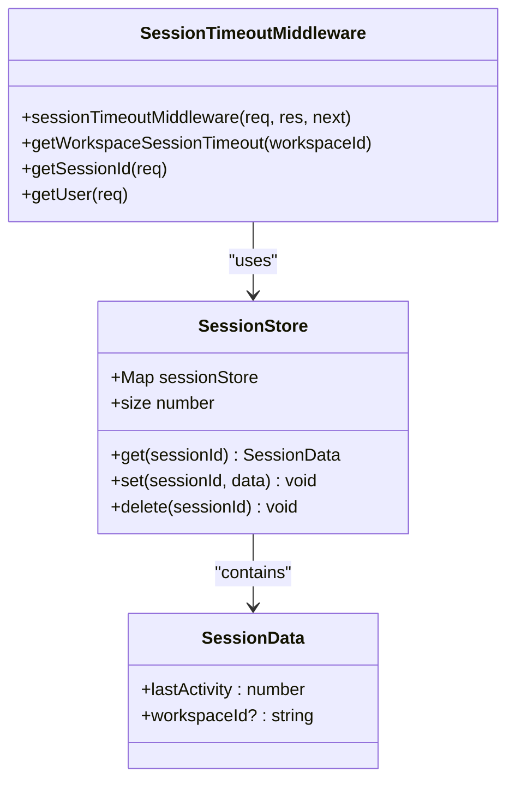
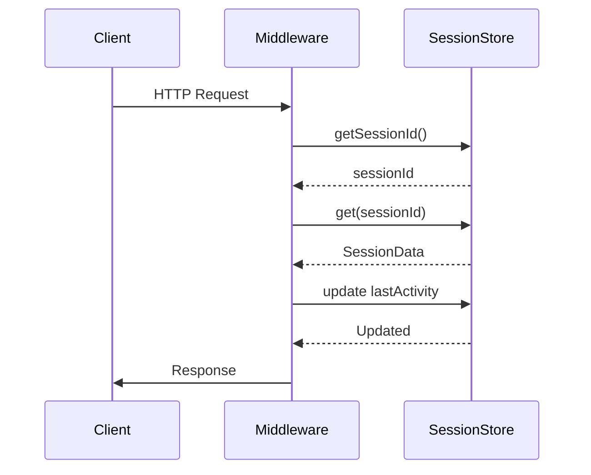
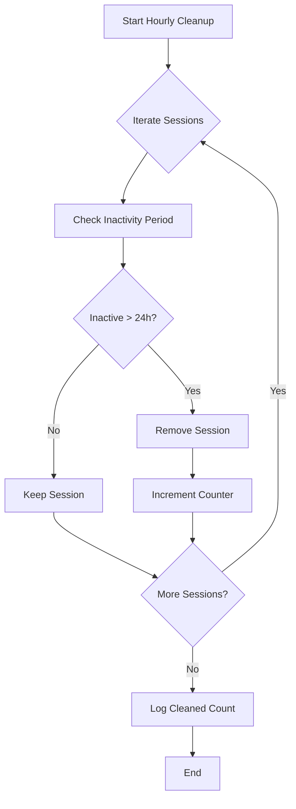
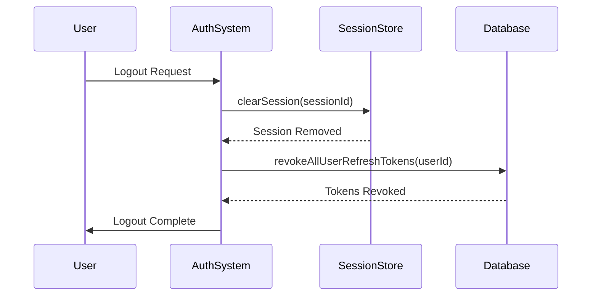

# Concurrent Session Control

<cite>
**Referenced Files in This Document**   
- [sessionTimeout.ts](file://src/server/sessionTimeout.ts)
- [refreshToken.ts](file://src/core/auth/refreshToken.ts)
- [operations.ts](file://src/core/workspace/operations.ts)
- [migration.sql](file://migrations/20251117165822_add_session_timeout/migration.sql)
</cite>

## Table of Contents
1. [Introduction](#introduction)
2. [Session Tracking Mechanism](#session-tracking-mechanism)
3. [Active Session Management](#active-session-management)
4. [Session Expiration and Cleanup](#session-expiration-and-cleanup)
5. [Forced Session Termination](#forced-session-termination)
6. [Security Policy Integration](#security-policy-integration)
7. [Concurrent Session Challenges](#concurrent-session-challenges)
8. [Monitoring and Security Recommendations](#monitoring-and-security-recommendations)

## Introduction
SentinelIQ implements a comprehensive concurrent session management system that enables secure handling of multiple simultaneous sessions for the same user across different devices and browsers. The system combines in-memory session tracking with database-backed refresh tokens to provide robust session management capabilities. This documentation details the implementation of session tracking, enumeration, expiration, and forced termination mechanisms that ensure security while maintaining usability across multiple concurrent sessions.

**Section sources**
- [sessionTimeout.ts](file://src/server/sessionTimeout.ts#L1-L60)

## Session Tracking Mechanism
SentinelIQ uses an in-memory session store to track active sessions across the system. Each session is identified by a unique session ID mapped to user data and workspace context. The session store maintains a Map structure where session IDs serve as keys and session data objects as values. Each session data object contains the last activity timestamp and associated workspace ID, enabling workspace-specific timeout policies.

The system extracts session IDs from the 'sessionId' cookie or 'x-session-id' header, integrating with the Wasp authentication system. When a request is processed, the middleware checks the session's activity against the workspace-specific timeout configuration. If the inactive time exceeds the configured timeout, the session is invalidated. The session store is updated on each request to record the latest activity, ensuring accurate tracking of user engagement.

**Diagram sources**
- [sessionTimeout.ts](file://src/server/sessionTimeout.ts#L23-L24)
- [sessionTimeout.ts](file://src/server/sessionTimeout.ts#L18-L21)

**Section sources**
- [sessionTimeout.ts](file://src/server/sessionTimeout.ts#L1-L60)
- [sessionTimeout.ts](file://src/server/sessionTimeout.ts#L62-L129)

## Active Session Management
The system provides functionality to enumerate active sessions and count concurrent sessions through the getActiveSessionCount function. This function returns the size of the session store, providing a real-time count of all active sessions in the system. The session enumeration occurs in-memory, offering efficient performance for monitoring and auditing purposes.

When a user authenticates, a new session is created in the session store with the current timestamp and associated workspace context. On subsequent requests, the session's last activity timestamp is updated, maintaining the session's active status. The system handles sessions both with and without workspace context, applying default timeout policies when workspace information is unavailable.

**Diagram sources**
- [sessionTimeout.ts](file://src/server/sessionTimeout.ts#L167-L169)
- [sessionTimeout.ts](file://src/server/sessionTimeout.ts#L117-L122)

**Section sources**
- [sessionTimeout.ts](file://src/server/sessionTimeout.ts#L164-L169)
- [sessionTimeout.ts](file://src/server/sessionTimeout.ts#L131-L154)

## Session Expiration and Cleanup
SentinelIQ implements periodic cleanup of expired sessions through the cleanupExpiredSessions cron job that runs hourly. This function iterates through all sessions in the store, removing those that have been inactive for more than 24 hours. The cleanup process helps maintain system performance by preventing unbounded growth of the session store and ensures compliance with security policies regarding session retention.

Each workspace can configure its own session timeout value, which is stored in the database and retrieved when validating sessions. The default timeout is 30 minutes (1800 seconds), but administrators can adjust this value between 5 minutes and 24 hours based on security requirements. When a session expires due to inactivity, it is automatically removed from the store, and subsequent requests receive a 401 Unauthorized response.

**Diagram sources**
- [sessionTimeout.ts](file://src/server/sessionTimeout.ts#L174-L191)
- [sessionTimeout.ts](file://src/server/sessionTimeout.ts#L197-L201)

**Section sources**
- [sessionTimeout.ts](file://src/server/sessionTimeout.ts#L171-L191)
- [sessionTimeout.ts](file://src/server/sessionTimeout.ts#L193-L204)
- [migration.sql](file://migrations/20251117165822_add_session_timeout/migration.sql#L1-L2)

## Forced Session Termination
The system implements a forced logout mechanism that clears sessions via the clearSession function when users log out or when security policies change. This function removes the specified session from the in-memory store, immediately invalidating it. The clearSession function is called during logout operations to ensure that the user's session cannot be reused.

In addition to the in-memory session store, SentinelIQ uses refresh tokens stored in the database to manage long-lived authentication. When a user logs out or when security policies require session termination, the system can revoke all refresh tokens for that user, effectively terminating all active sessions across devices. This provides an additional layer of security beyond the in-memory session clearing.

**Diagram sources**
- [sessionTimeout.ts](file://src/server/sessionTimeout.ts#L159-L162)
- [refreshToken.ts](file://src/core/auth/refreshToken.ts#L156-L165)

**Section sources**
- [sessionTimeout.ts](file://src/server/sessionTimeout.ts#L156-L162)
- [refreshToken.ts](file://src/core/auth/refreshToken.ts#L156-L192)

## Security Policy Integration
SentinelIQ integrates session management with workspace security policies, allowing administrators to configure session timeout values based on organizational requirements. The updateWorkspaceSessionTimeout operation enables workspace owners and admins to modify the session timeout configuration, with validation ensuring values remain between 5 minutes and 24 hours.

When security policies change, such as when two-factor authentication is enabled or IP whitelisting is configured, the system can trigger session invalidation to ensure users re-authenticate under the new security requirements. This integration between session management and security policies enhances overall system security by enforcing policy compliance through session control.

**Section sources**
- [operations.ts](file://src/core/workspace/operations.ts#L1412-L1483)

## Concurrent Session Challenges
The system addresses several challenges associated with concurrent sessions, including session conflicts and race conditions during token refresh. The refresh token rotation mechanism prevents reuse of refresh tokens, detecting potential security breaches when a token is presented more than once. When reuse is detected, all refresh tokens for the user are revoked, protecting against token theft.

To ensure consistent user experience across devices, the system synchronizes session state through the combination of in-memory sessions and database-stored refresh tokens. While the in-memory store provides fast access for session validation, the database-backed refresh tokens ensure that session termination commands apply to all devices, even in distributed deployment scenarios.

The system also implements rate limiting on session-related operations to prevent abuse and includes comprehensive logging for audit purposes. Each session creation, validation, and termination is logged with relevant context, enabling security teams to monitor for suspicious activity patterns across concurrent sessions.

**Section sources**
- [refreshToken.ts](file://src/core/auth/refreshToken.ts#L96-L154)
- [refreshToken.ts](file://src/core/auth/refreshToken.ts#L48-L98)

## Monitoring and Security Recommendations
For effective monitoring of concurrent sessions, administrators should track the active session count and review session expiration logs regularly. The getActiveSessionCount function provides a simple metric for monitoring overall system usage and detecting potential anomalies. The hourly cleanup logs indicate the number of expired sessions removed, helping to understand user engagement patterns.

Security best practices recommend configuring appropriate session timeout values based on the sensitivity of the data accessed. For high-security environments, shorter timeout values (15-30 minutes) are recommended, while less sensitive workspaces may use longer timeouts for improved usability. Organizations should also implement monitoring for unusual concurrent session patterns, such as sessions from geographically distant locations within a short time period.

The system's architecture supports scaling to Redis for multi-instance deployments, which should be implemented in production environments to ensure session consistency across load-balanced instances. This prevents issues where a user's session might be valid on one server but not another, ensuring a seamless experience across concurrent sessions regardless of which application instance handles each request.