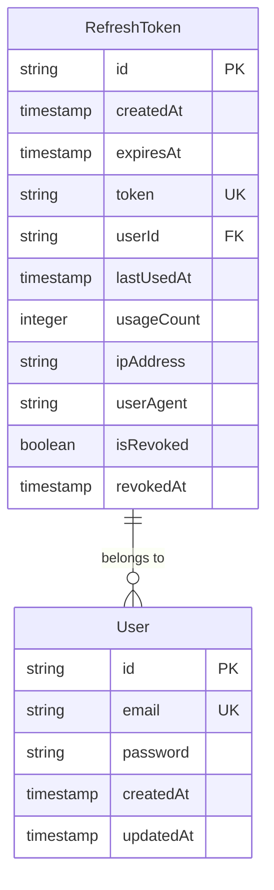
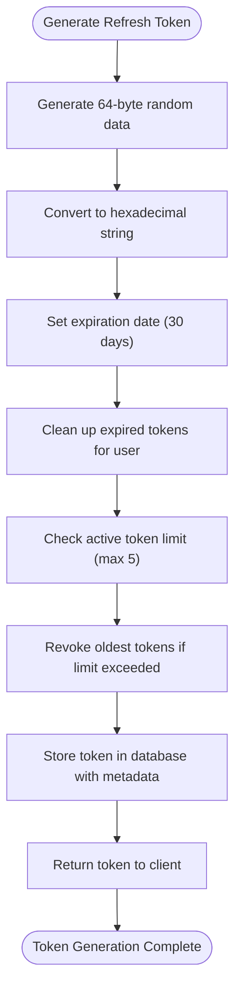
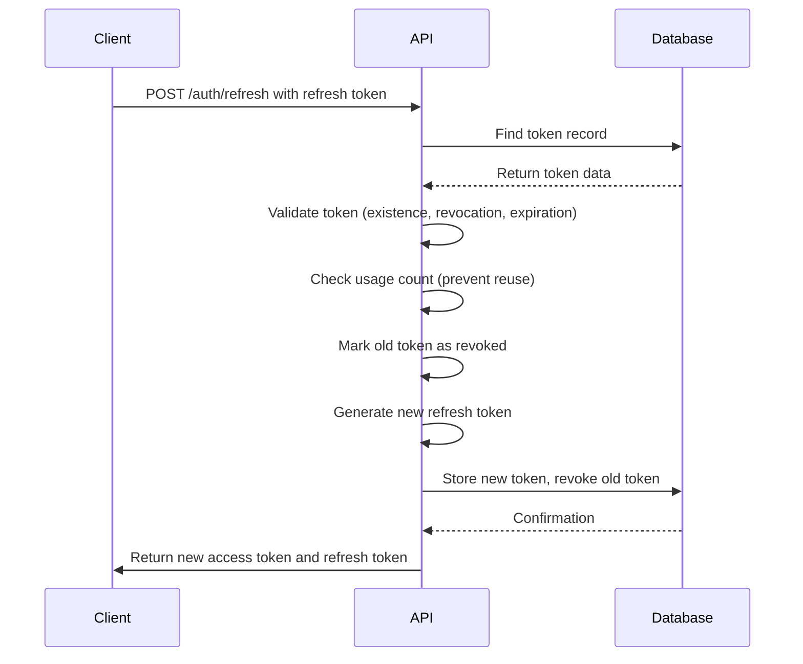
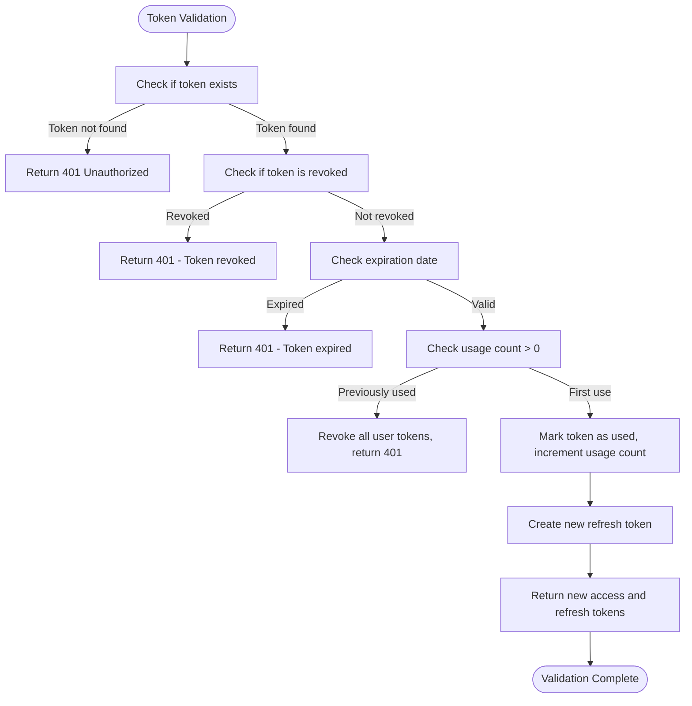
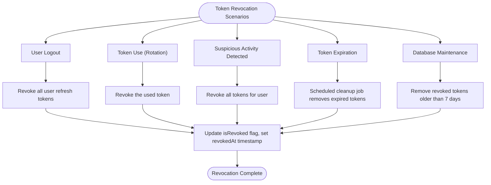
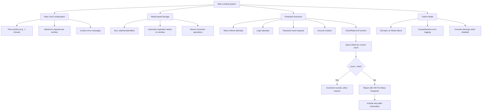
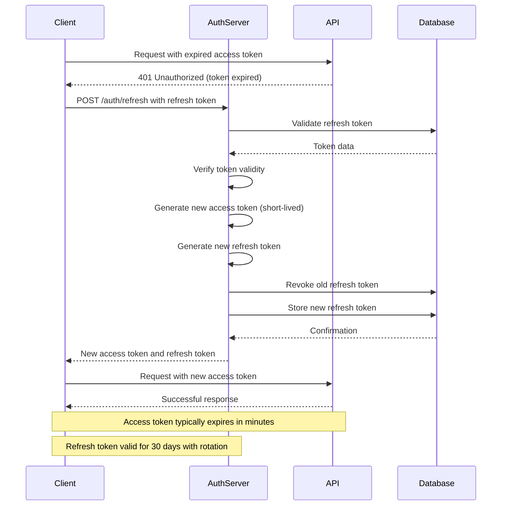

# Refresh Token Management

<cite>
**Referenced Files in This Document**   
- [refreshToken.ts](file://src/core/auth/refreshToken.ts)
- [migration.sql](file://migrations/20251117045259_add_refresh_tokens_ip_whitelist_password_policy/migration.sql)
- [sessionTimeout.ts](file://src/server/sessionTimeout.ts)
- [rateLimit.ts](file://src/server/rateLimit.ts)
</cite>

## Table of Contents
1. [Introduction](#introduction)
2. [Refresh Token Architecture](#refresh-token-architecture)
3. [Token Generation and Storage](#token-generation-and-storage)
4. [Token Rotation Mechanism](#token-rotation-mechanism)
5. [Token Validation and Renewal](#token-validation-and-renewal)
6. [Token Revocation and Expiration](#token-revocation-and-expiration)
7. [Security Measures](#security-measures)
8. [Rate Limiting and Abuse Prevention](#rate-limiting-and-abuse-prevention)
9. [Integration with Access Tokens](#integration-with-access-tokens)
10. [Best Practices](#best-practices)

## Introduction
The refresh token system in SentinelIQ provides a secure mechanism for maintaining long-lived user authentication while minimizing security risks. This document details the implementation of refresh tokens, focusing on token rotation, secure storage, validation, and revocation processes. The system is designed to prevent common security threats such as token theft, replay attacks, and unauthorized access.

## Refresh Token Architecture
The refresh token system in SentinelIQ follows a comprehensive architecture that ensures secure and efficient authentication management. The system stores refresh tokens in a dedicated database table with multiple security attributes and implements token rotation to enhance security.

**Diagram sources**
- [migration.sql](file://migrations/20251117045259_add_refresh_tokens_ip_whitelist_password_policy/migration.sql#L6-L33)

**Section sources**
- [refreshToken.ts](file://src/core/auth/refreshToken.ts#L1-L193)
- [migration.sql](file://migrations/20251117045259_add_refresh_tokens_ip_whitelist_password_policy/migration.sql#L6-L33)

## Token Generation and Storage
The refresh token generation process in SentinelIQ employs cryptographic best practices to ensure token security. Tokens are generated using cryptographically secure random bytes and stored with multiple security attributes.

The system generates refresh tokens using Node.js's crypto module with a 64-byte random string converted to hexadecimal format, providing 512 bits of entropy. Each token is associated with user metadata including IP address and user agent for additional security monitoring.

**Diagram sources**
- [refreshToken.ts](file://src/core/auth/refreshToken.ts#L13-L72)

**Section sources**
- [refreshToken.ts](file://src/core/auth/refreshToken.ts#L1-L72)

## Token Rotation Mechanism
SentinelIQ implements a robust token rotation mechanism that enhances security by issuing new refresh tokens on each use. This approach prevents token replay attacks and allows the system to detect and respond to potential token theft.

When a refresh token is used to obtain a new access token, the system validates the token and immediately creates a new refresh token while revoking the original. This rotation ensures that each refresh token can only be used once, making stolen tokens ineffective after their first use.

**Diagram sources**
- [refreshToken.ts](file://src/core/auth/refreshToken.ts#L77-L138)

**Section sources**
- [refreshToken.ts](file://src/core/auth/refreshToken.ts#L77-L138)

## Token Validation and Renewal
The token validation and renewal process in SentinelIQ follows a comprehensive security check before issuing new tokens. The system verifies multiple aspects of the refresh token to ensure its legitimacy and prevent unauthorized access.

During validation, the system checks for token existence, revocation status, expiration, and usage history. If a token has been used before (usageCount > 0), the system treats this as a potential security breach and revokes all refresh tokens for that user to prevent further access.

**Diagram sources**
- [refreshToken.ts](file://src/core/auth/refreshToken.ts#L77-L138)

**Section sources**
- [refreshToken.ts](file://src/core/auth/refreshToken.ts#L77-L138)

## Token Revocation and Expiration
SentinelIQ implements comprehensive token revocation and expiration policies to maintain system security and manage token lifecycle effectively. The system provides multiple revocation mechanisms and automated cleanup processes.

The system automatically revokes refresh tokens on user logout, after use (due to rotation), and when suspicious activity is detected. Additionally, a scheduled job runs to clean up expired tokens and revoked tokens older than seven days to maintain database efficiency.

**Diagram sources**
- [refreshToken.ts](file://src/core/auth/refreshToken.ts#L143-L192)

**Section sources**
- [refreshToken.ts](file://src/core/auth/refreshToken.ts#L143-L192)

## Security Measures
SentinelIQ employs multiple security measures to protect refresh tokens and prevent common attack vectors. The system combines secure token generation, storage practices, and detection mechanisms to create a robust authentication security framework.

Key security features include HTTP-only cookies to prevent XSS attacks, token binding to IP address and user agent, and detection of token reuse which indicates potential token theft. The system also limits the number of active refresh tokens per user to prevent token proliferation.

```mermaid
flowchart TD
SecurityMeasures[Security Measures] --> Generation["Secure Generation"]
Generation --> CryptoRandom["Cryptographically secure random tokens"]
Generation --> LongTokens["64-byte tokens (512 bits of entropy)"]
SecurityMeasures --> Storage["Secure Storage"]
Storage --> HttpOnly["HTTP-only cookies"]
Storage --> SecureFlag["Secure flag (HTTPS only)"]
Storage --> SameSite["SameSite=Lax"]
Storage --> DatabaseEncryption["Encrypted database storage"]
SecurityMeasures --> Validation["Enhanced Validation"]
Validation --> ExpirationCheck["Expiration validation"]
Validation --> RevocationCheck["Revocation status check"]
Validation --> UsageCount["Usage count monitoring"]
Validation --> IPBinding["IP address binding"]
Validation --> UserAgent["User agent verification"]
SecurityMeasures --> Rotation["Token Rotation"]
Rotation --> OneTimeUse["One-time use tokens"]
Rotation --> NewOnRefresh["New token on each refresh"]
Rotation --> OldRevoked["Immediate revocation of old tokens"]
SecurityMeasures --> Limits["Usage Limits"]
Limits --> MaxTokens["Max 5 active tokens per user"]
Limits --> Expiry["30-day expiration"]
Limits --> Cleanup["Automatic cleanup of expired tokens"]
```

**Section sources**
- [refreshToken.ts](file://src/core/auth/refreshToken.ts#L7-L193)
- [migration.sql](file://migrations/20251117045259_add_refresh_tokens_ip_whitelist_password_policy/migration.sql#L6-L33)

## Rate Limiting and Abuse Prevention
The refresh token system in SentinelIQ incorporates rate limiting to prevent brute force attacks and abuse of the token refresh endpoint. This protection mechanism helps prevent attackers from attempting to guess or enumerate valid refresh tokens.

While the primary rate limiting configuration is defined in the server's rateLimit.ts file, the authentication system integrates with this framework to protect sensitive endpoints. The rate limiting applies to various authentication operations to prevent abuse while maintaining usability for legitimate users.

**Diagram sources**
- [rateLimit.ts](file://src/server/rateLimit.ts#L1-L85)

**Section sources**
- [rateLimit.ts](file://src/server/rateLimit.ts#L1-L85)

## Integration with Access Tokens
The refresh token system in SentinelIQ works in conjunction with access tokens to provide a complete authentication solution. Access tokens handle short-term authorization for API requests, while refresh tokens enable long-term authentication without requiring users to repeatedly enter their credentials.

When an access token expires, the client application uses the refresh token to obtain a new access token without user interaction. This seamless renewal process improves user experience while maintaining security through the token rotation mechanism.

**Section sources**
- [refreshToken.ts](file://src/core/auth/refreshToken.ts#L77-L138)

## Best Practices
SentinelIQ follows industry best practices for refresh token management to ensure maximum security and reliability. These practices cover token expiration, secure cookie attributes, and proper handling of token refresh requests.

The system implements a 30-day expiration period for refresh tokens, which balances security and user convenience. The implementation also follows the token rotation pattern, where a new refresh token is issued with each refresh request, and the previous token is immediately invalidated.

```mermaid
flowchart TD
BestPractices[Best Practices] --> Expiration["Token Expiration"]
Expiration --> ThirtyDays["30-day refresh token expiration"]
Expiration --> ShortAccess["Short-lived access tokens"]
Expiration --> CleanupJob["Scheduled cleanup of expired tokens"]
BestPractices --> CookieAttributes["Secure Cookie Attributes"]
CookieAttributes --> HttpOnly["HttpOnly flag to prevent XSS"]
CookieAttributes --> Secure["Secure flag for HTTPS only"]
CookieAttributes --> SameSite["SameSite=Lax to prevent CSRF"]
CookieAttributes --> Domain["Proper domain setting"]
CookieAttributes --> Path["Path=/ for site-wide access"]
BestPractices --> Rotation["Token Rotation"]
Rotation --> NewToken["Issue new refresh token on each use"]
Rotation --> RevokeOld["Immediately revoke used tokens"]
Rotation --> DetectReuse["Detect and respond to token reuse"]
Rotation --> LimitTokens["Limit active tokens per user (5 max)"]
BestPractices --> Validation["Comprehensive Validation"]
Validation --> MultipleChecks["Check existence, revocation, expiration"]
Validation --> Metadata["Validate IP address and user agent"]
Validation --> UsageCount["Monitor usage count for security"]
Validation --> RateLimiting["Apply rate limiting to refresh endpoint"]
BestPractices --> ErrorHandling["Proper Error Handling"]
ErrorHandling --> GenericErrors["Use generic error messages"]
ErrorHandling --> Logging["Log security events without sensitive data"]
ErrorHandling --> Monitoring["Monitor for suspicious patterns"]
ErrorHandling --> Alerting["Alert on potential security incidents"]
```

**Section sources**
- [refreshToken.ts](file://src/core/auth/refreshToken.ts#L1-L193)
- [migration.sql](file://migrations/20251117045259_add_refresh_tokens_ip_whitelist_password_policy/migration.sql#L6-L33)
- [rateLimit.ts](file://src/server/rateLimit.ts#L1-L85)