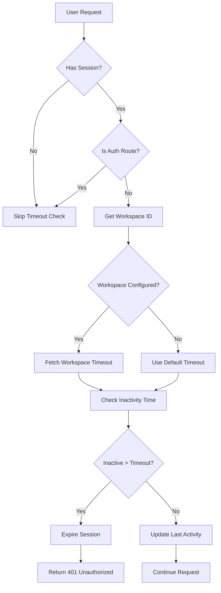
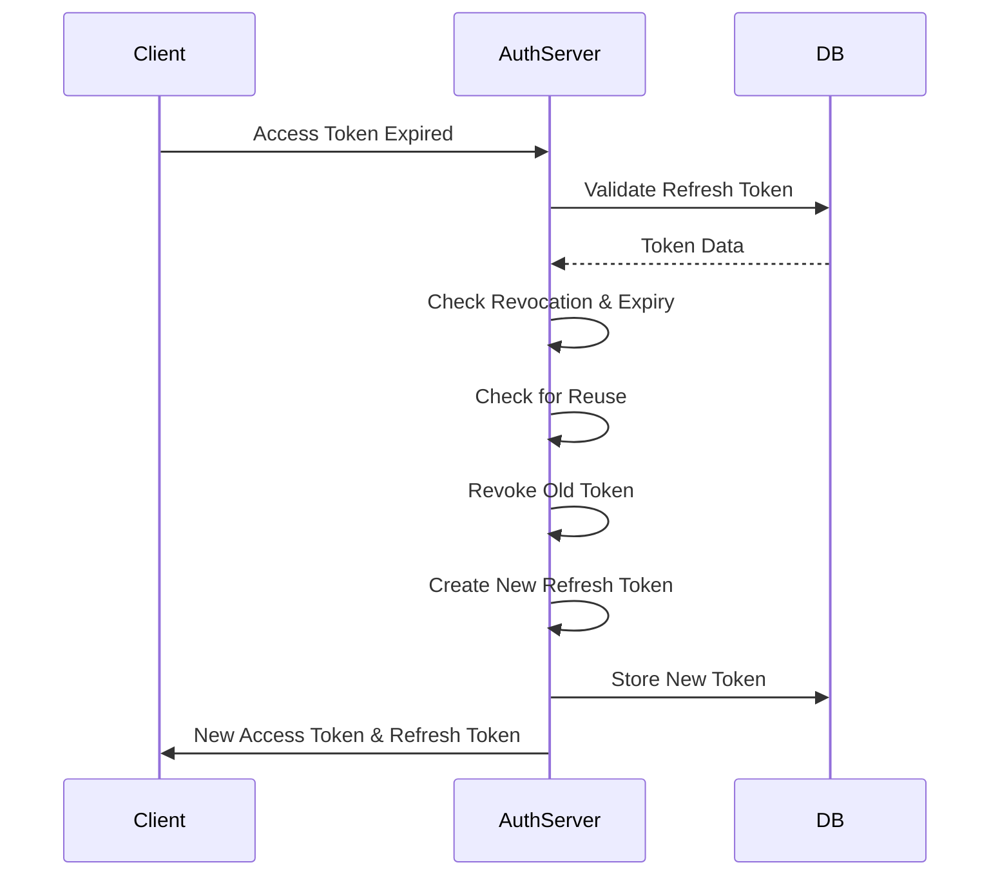
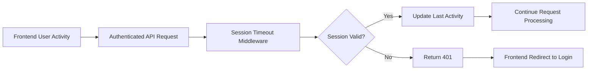
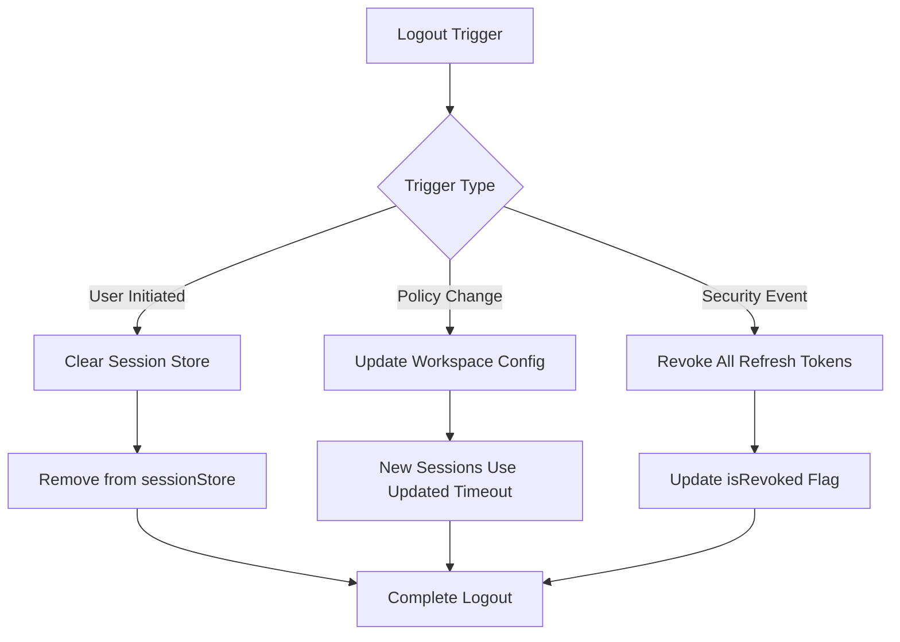
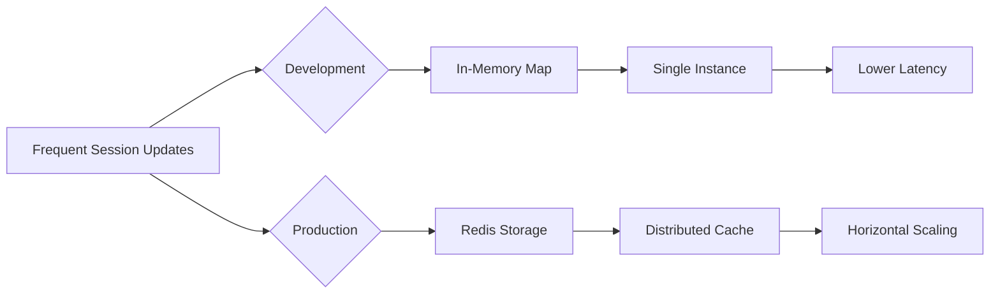

# Session Management

<cite>
**Referenced Files in This Document**   
- [sessionTimeout.ts](file://src/server/sessionTimeout.ts)
- [refreshToken.ts](file://src/core/auth/refreshToken.ts)
- [workspace/operations.ts](file://src/core/workspace/operations.ts)
- [migration.sql](file://migrations/20251117165822_add_session_timeout/migration.sql)
- [useWorkspace.ts](file://src/client/hooks/useWorkspace.ts)
</cite>

## Table of Contents
1. [Introduction](#introduction)
2. [Session Timeout Controls](#session-timeout-controls)
3. [Refresh Token Implementation](#refresh-token-implementation)
4. [Integration Between Frontend and Backend](#integration-between-frontend-and-backend)
5. [Forced Logout Mechanisms](#forced-logout-mechanisms)
6. [Common Issues and Solutions](#common-issues-and-solutions)

## Introduction
The SentinelIQ session management system provides a comprehensive security framework for maintaining user authentication while protecting against unauthorized access. The system implements workspace-specific session timeout configurations, inactivity tracking, and refresh token rotation to balance security with user experience. This documentation details the implementation of these features, including the integration between frontend activity detection and backend session renewal, as well as mechanisms for handling policy changes and security events.

## Session Timeout Controls
The session timeout system in SentinelIQ allows each workspace to configure its own session duration based on security requirements. This workspace-specific configuration is stored in the database with a default timeout of 1800 seconds (30 minutes) if not explicitly set.

**Diagram sources**
- [sessionTimeout.ts](file://src/server/sessionTimeout.ts#L62-L129)

**Section sources**
- [sessionTimeout.ts](file://src/server/sessionTimeout.ts#L1-L205)
- [migration.sql](file://migrations/20251117165822_add_session_timeout/migration.sql#L1-L3)

## Refresh Token Implementation
The refresh token system enables long-lived authentication while maintaining security through token rotation and revocation. Each refresh token has an expiry of 30 days, and the system limits users to a maximum of 5 active refresh tokens at any time.

**Diagram sources**
- [refreshToken.ts](file://src/core/auth/refreshToken.ts#L74-L154)

**Section sources**
- [refreshToken.ts](file://src/core/auth/refreshToken.ts#L1-L193)

## Integration Between Frontend and Backend
The session management system integrates frontend activity detection with backend session renewal through a middleware-based approach. When a user performs actions in the frontend, these requests automatically update the session's last activity timestamp on the backend.

The system uses HTTP-only cookies to store refresh tokens, preventing client-side JavaScript access and reducing the risk of cross-site scripting attacks. The frontend detects user activity and makes authenticated requests, which trigger the session timeout middleware to update the session's last activity time.

**Diagram sources**
- [sessionTimeout.ts](file://src/server/sessionTimeout.ts#L62-L129)
- [useWorkspace.ts](file://src/client/hooks/useWorkspace.ts#L1-L28)

**Section sources**
- [sessionTimeout.ts](file://src/server/sessionTimeout.ts#L1-L205)
- [useWorkspace.ts](file://src/client/hooks/useWorkspace.ts#L1-L28)

## Forced Logout Mechanisms
SentinelIQ implements several forced logout mechanisms to respond to security events and policy changes. When a workspace's session timeout policy is updated, existing sessions are not immediately terminated but will expire according to the new configuration on their next inactivity check.

The system provides explicit logout functionality that clears sessions from the server-side store and revokes refresh tokens. Additionally, security policies trigger forced logouts when suspicious activity is detected, such as refresh token reuse which may indicate a security breach.

**Diagram sources**
- [sessionTimeout.ts](file://src/server/sessionTimeout.ts#L159-L162)
- [refreshToken.ts](file://src/core/auth/refreshToken.ts#L156-L173)

**Section sources**
- [sessionTimeout.ts](file://src/server/sessionTimeout.ts#L159-L191)
- [refreshToken.ts](file://src/core/auth/refreshToken.ts#L156-L192)
- [workspace/operations.ts](file://src/core/workspace/operations.ts#L1447-L1483)

## Common Issues and Solutions
The session management system addresses several common issues related to session handling in web applications.

### Stale Sessions
Stale sessions are prevented through periodic cleanup jobs that remove expired sessions from the in-memory store. The system runs a cleanup process every hour to remove sessions that have exceeded the maximum age of 24 hours.

### Concurrent Logins
The system handles concurrent logins by limiting the number of active refresh tokens per user to 5. When a user exceeds this limit, the oldest tokens are automatically revoked, ensuring that only a reasonable number of concurrent sessions are allowed.

### Performance Impacts
To minimize performance impacts from frequent session updates, the system uses an in-memory Map for session storage during development. In production deployments, Redis is recommended for distributed session tracking across multiple instances, preventing performance bottlenecks.

**Diagram sources**
- [sessionTimeout.ts](file://src/server/sessionTimeout.ts#L23-L24)
- [sessionTimeout.ts](file://src/server/sessionTimeout.ts#L174-L191)

**Section sources**
- [sessionTimeout.ts](file://src/server/sessionTimeout.ts#L1-L205)