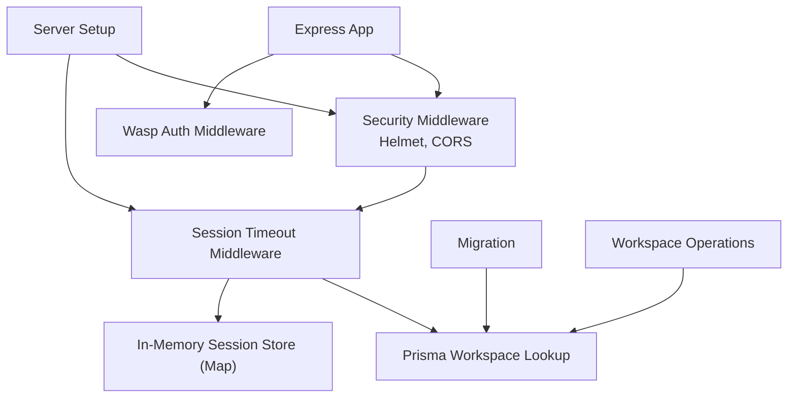
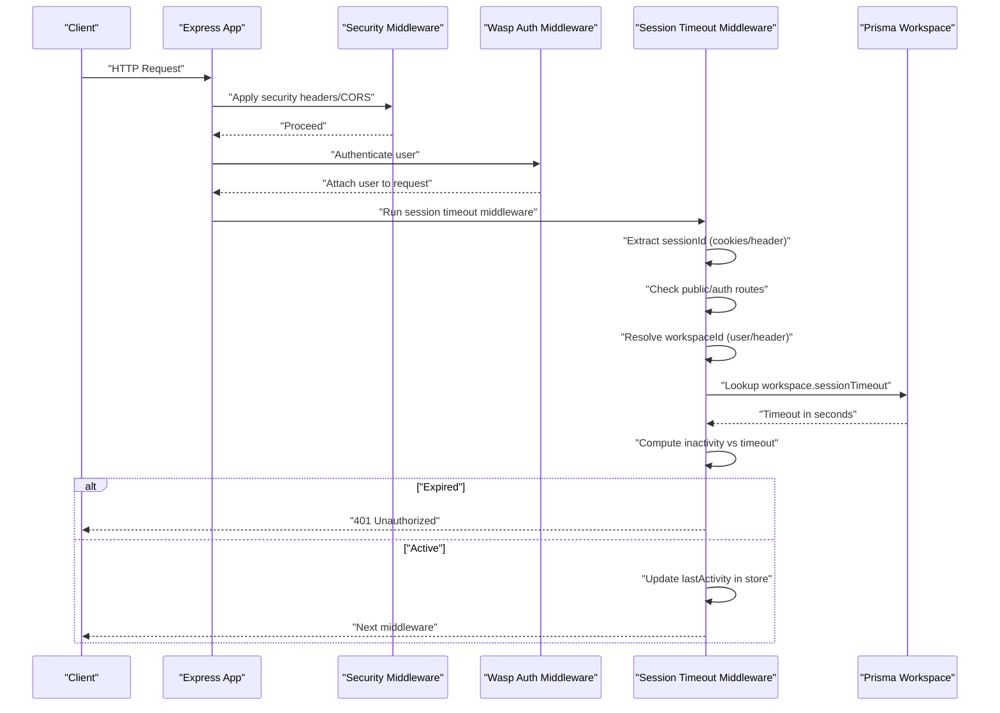
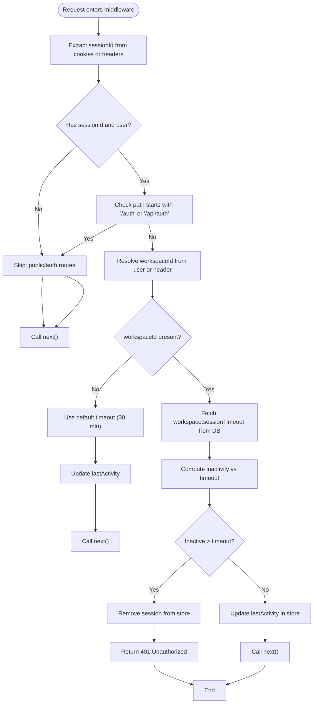
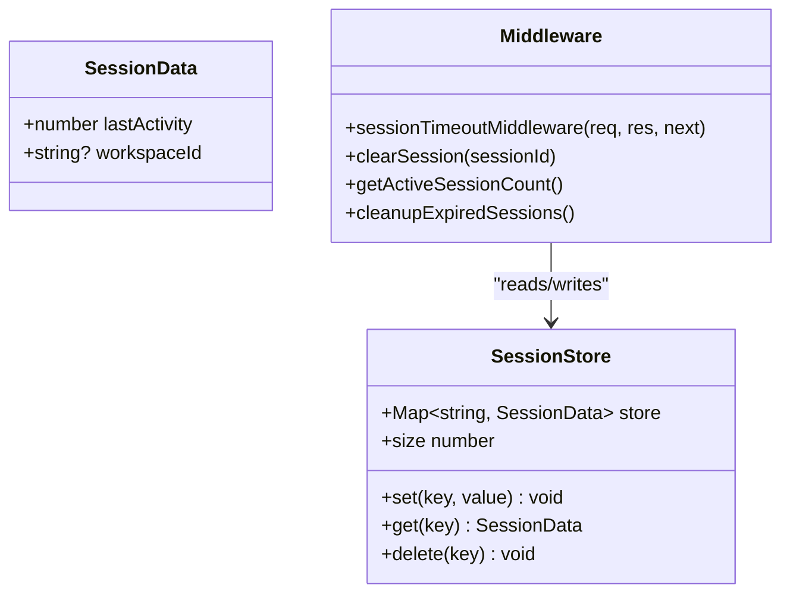
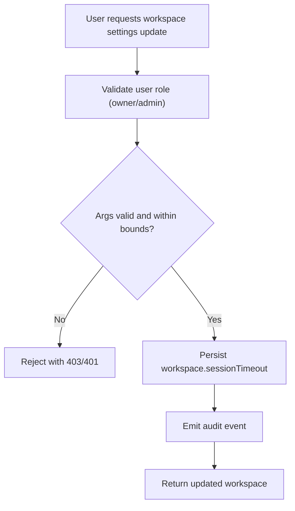
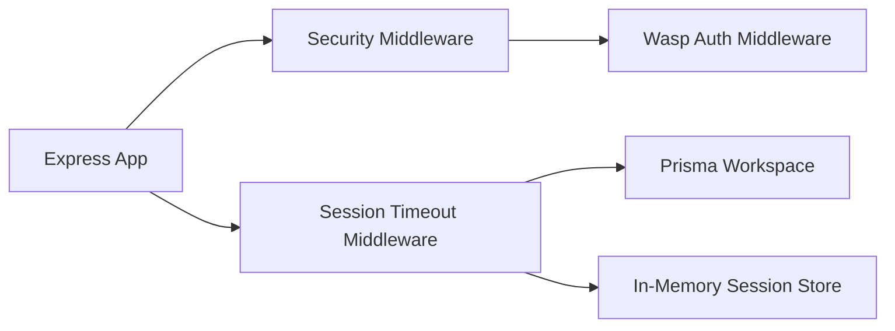

# Session Timeout

<cite>
**Referenced Files in This Document**
- [sessionTimeout.ts](file://src/server/sessionTimeout.ts)
- [sentry.ts](file://src/server/sentry.ts)
- [middlewareConfig.ts](file://src/server/middlewareConfig.ts)
- [security.ts](file://src/server/security.ts)
- [migration.sql](file://migrations/20251117165822_add_session_timeout/migration.sql)
- [workspace.operations.ts](file://src/core/workspace/operations.ts)
</cite>

## Table of Contents
1. [Introduction](#introduction)
2. [Project Structure](#project-structure)
3. [Core Components](#core-components)
4. [Architecture Overview](#architecture-overview)
5. [Detailed Component Analysis](#detailed-component-analysis)
6. [Dependency Analysis](#dependency-analysis)
7. [Performance Considerations](#performance-considerations)
8. [Troubleshooting Guide](#troubleshooting-guide)
9. [Conclusion](#conclusion)

## Introduction
This document explains the session timeout mechanism in SentinelIQ. It covers how workspace-specific session timeouts are implemented, including the default 30-minute timeout and configurable workspace settings. It documents the middleware flow that checks user activity on each request, calculates inactivity duration, and invalidates expired sessions with 401 Unauthorized responses. It also describes the in-memory session store implementation using a Map structure, activity timestamp updates, and the extraction of session IDs from cookies or headers. Finally, it addresses common issues such as handling public routes, auth routes, and requests without workspace context, along with performance considerations and error handling.

## Project Structure
The session timeout feature spans several parts of the backend:
- A dedicated middleware module that validates session activity and enforces timeouts.
- A server initialization entry that wires the middleware into the Express app.
- A database migration that adds the workspace-level session timeout field.
- Backend operations that manage workspace session timeout configuration.
- Supporting security and middleware configuration modules.

**Diagram sources**
- [sessionTimeout.ts](file://src/server/sessionTimeout.ts#L1-L205)
- [sentry.ts](file://src/server/sentry.ts#L1-L26)
- [security.ts](file://src/server/security.ts#L1-L268)
- [migration.sql](file://migrations/20251117165822_add_session_timeout/migration.sql#L1-L3)
- [workspace.operations.ts](file://src/core/workspace/operations.ts#L1412-L1484)

**Section sources**
- [sessionTimeout.ts](file://src/server/sessionTimeout.ts#L1-L205)
- [sentry.ts](file://src/server/sentry.ts#L1-L26)
- [security.ts](file://src/server/security.ts#L1-L268)
- [migration.sql](file://migrations/20251117165822_add_session_timeout/migration.sql#L1-L3)
- [workspace.operations.ts](file://src/core/workspace/operations.ts#L1412-L1484)

## Core Components
- Session timeout middleware: Enforces workspace-specific or default session timeouts and updates activity timestamps.
- In-memory session store: Tracks last activity per session ID.
- Session ID extraction: Reads session ID from cookies or headers.
- Workspace timeout lookup: Retrieves timeout from the database per workspace.
- Server initialization: Registers the middleware and schedules periodic cleanup.
- Workspace operations: Allows workspace owners/admins to configure session timeout.

Key responsibilities:
- Validate session activity on each request.
- Respect public routes and auth routes.
- Use workspace context when available; otherwise fall back to default.
- Invalidate expired sessions and return 401 Unauthorized.
- Periodically clean up stale sessions.

**Section sources**
- [sessionTimeout.ts](file://src/server/sessionTimeout.ts#L1-L205)
- [workspace.operations.ts](file://src/core/workspace/operations.ts#L1412-L1484)

## Architecture Overview
The middleware participates in the Express request lifecycle after authentication. It reads the session ID, determines the workspace context, retrieves the appropriate timeout, compares inactivity against the timeout, and either rejects the request with 401 or updates the activity timestamp.

**Diagram sources**
- [sessionTimeout.ts](file://src/server/sessionTimeout.ts#L62-L129)
- [sentry.ts](file://src/server/sentry.ts#L11-L26)
- [security.ts](file://src/server/security.ts#L250-L268)

## Detailed Component Analysis

### Session Timeout Middleware
The middleware performs the following steps:
- Extracts session ID from cookies or headers.
- Skips processing for public routes and auth routes.
- Resolves workspace context from the authenticated user or request headers.
- Fetches workspace-specific timeout from the database.
- Computes inactivity duration and invalidates sessions older than the configured timeout.
- Updates last activity timestamp for active sessions.
- Handles errors gracefully without blocking requests.

**Diagram sources**
- [sessionTimeout.ts](file://src/server/sessionTimeout.ts#L62-L129)
- [sessionTimeout.ts](file://src/server/sessionTimeout.ts#L131-L154)

**Section sources**
- [sessionTimeout.ts](file://src/server/sessionTimeout.ts#L62-L129)
- [sessionTimeout.ts](file://src/server/sessionTimeout.ts#L131-L154)

### In-Memory Session Store
The store is implemented as a Map keyed by session ID with values containing:
- lastActivity: Unix timestamp of the last activity.
- workspaceId: Optional workspace identifier for context-aware timeouts.

Behavior:
- On each request, the middleware updates lastActivity.
- Periodic cleanup removes entries older than a maximum age threshold.
- Exposed helpers: clearSession, getActiveSessionCount, cleanupExpiredSessions.

**Diagram sources**
- [sessionTimeout.ts](file://src/server/sessionTimeout.ts#L1-L25)
- [sessionTimeout.ts](file://src/server/sessionTimeout.ts#L156-L205)

**Section sources**
- [sessionTimeout.ts](file://src/server/sessionTimeout.ts#L1-L25)
- [sessionTimeout.ts](file://src/server/sessionTimeout.ts#L156-L205)

### Session ID Extraction and Workspace Resolution
- Session ID is extracted from cookies or headers. The middleware checks for a specific cookie and a header commonly used by the platform.
- Workspace ID resolution prioritizes the authenticated user’s current workspace and falls back to a header if not present.

Common scenarios:
- Public routes: No session/user present; middleware skips enforcement.
- Auth routes: Requests under specific paths are skipped to avoid interfering with authentication flows.
- No workspace context: Uses default timeout and still updates activity.

**Section sources**
- [sessionTimeout.ts](file://src/server/sessionTimeout.ts#L44-L61)
- [sessionTimeout.ts](file://src/server/sessionTimeout.ts#L62-L89)

### Workspace-Specific Timeout and Default Behavior
- Default timeout: 30 minutes (1800 seconds) if workspace does not define a value.
- Workspace-level override: Per-workspace timeout stored in the database and fetched on demand.
- Configuration endpoint: Only workspace owners/admins can update the timeout within allowed bounds.

**Diagram sources**
- [workspace.operations.ts](file://src/core/workspace/operations.ts#L1412-L1484)
- [migration.sql](file://migrations/20251117165822_add_session_timeout/migration.sql#L1-L3)

**Section sources**
- [sessionTimeout.ts](file://src/server/sessionTimeout.ts#L29-L42)
- [workspace.operations.ts](file://src/core/workspace/operations.ts#L1412-L1484)
- [migration.sql](file://migrations/20251117165822_add_session_timeout/migration.sql#L1-L3)

### Server Initialization and Cleanup
- The middleware is registered during server setup after security middleware.
- A periodic cleanup job runs every hour to remove stale sessions from the store.

**Section sources**
- [sentry.ts](file://src/server/sentry.ts#L11-L26)
- [sessionTimeout.ts](file://src/server/sessionTimeout.ts#L193-L205)

## Dependency Analysis
- Express app: Hosts middleware stack and integrates security and session timeout.
- Security middleware: Helmet and CORS are applied before session timeout.
- Wasp auth: Injects user into the request context for the middleware to use.
- Prisma: Provides workspace-level session timeout configuration.
- In-memory store: Lightweight Map-based store; production deployments should consider a distributed store.

**Diagram sources**
- [sessionTimeout.ts](file://src/server/sessionTimeout.ts#L1-L205)
- [sentry.ts](file://src/server/sentry.ts#L11-L26)
- [security.ts](file://src/server/security.ts#L250-L268)

**Section sources**
- [sessionTimeout.ts](file://src/server/sessionTimeout.ts#L1-L205)
- [sentry.ts](file://src/server/sentry.ts#L11-L26)
- [security.ts](file://src/server/security.ts#L250-L268)

## Performance Considerations
- Frequency of updates: The middleware updates lastActivity on every request. For high-traffic APIs, consider batching or reducing update frequency if needed.
- Store choice: The current implementation uses an in-memory Map. For multi-instance deployments, replace with a distributed store (e.g., Redis) to ensure consistent session state across instances.
- Cleanup cadence: The hourly cleanup helps reclaim memory. Adjust interval based on traffic and memory footprint.
- Database calls: Each request may hit the database for workspace timeout. Consider caching timeouts per workspace in memory with invalidation on change.

[No sources needed since this section provides general guidance]

## Troubleshooting Guide
Common issues and resolutions:
- Requests without workspace context:
  - Behavior: Uses default timeout and still updates activity.
  - Verify that the user context or header is provided when applicable.
- Auth routes timing out:
  - Behavior: Auth routes are intentionally skipped.
  - Ensure authentication endpoints are under the expected paths.
- Missing session ID:
  - Behavior: Requests without a session ID are skipped.
  - Confirm that the client sends the expected cookie or header.
- Frequent 401 Unauthorized responses:
  - Verify workspace timeout configuration and ensure it aligns with user expectations.
  - Check that the client maintains activity to refresh lastActivity.
- Error handling:
  - The middleware logs errors and continues to avoid blocking legitimate requests.
  - Review logs for unexpected failures during workspace lookup.

**Section sources**
- [sessionTimeout.ts](file://src/server/sessionTimeout.ts#L62-L129)
- [sessionTimeout.ts](file://src/server/sessionTimeout.ts#L131-L154)

## Conclusion
SentinelIQ’s session timeout mechanism provides robust, workspace-aware session enforcement with a default 30-minute timeout and configurable overrides. The middleware integrates cleanly into the Express stack, respects public and auth routes, and invalidates sessions after inactivity while updating activity timestamps. For production, consider migrating the in-memory store to a distributed solution and tuning cleanup intervals and database caching to balance performance and correctness.