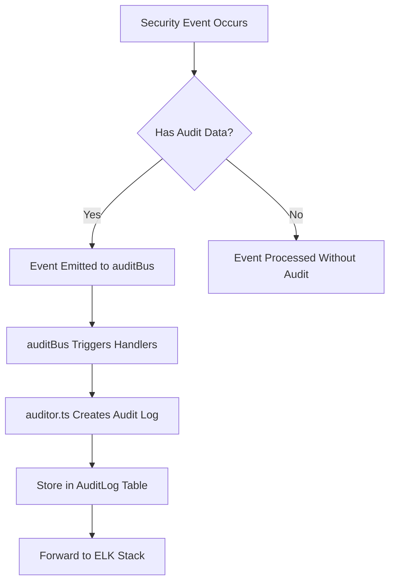
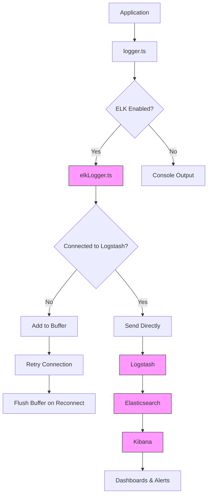
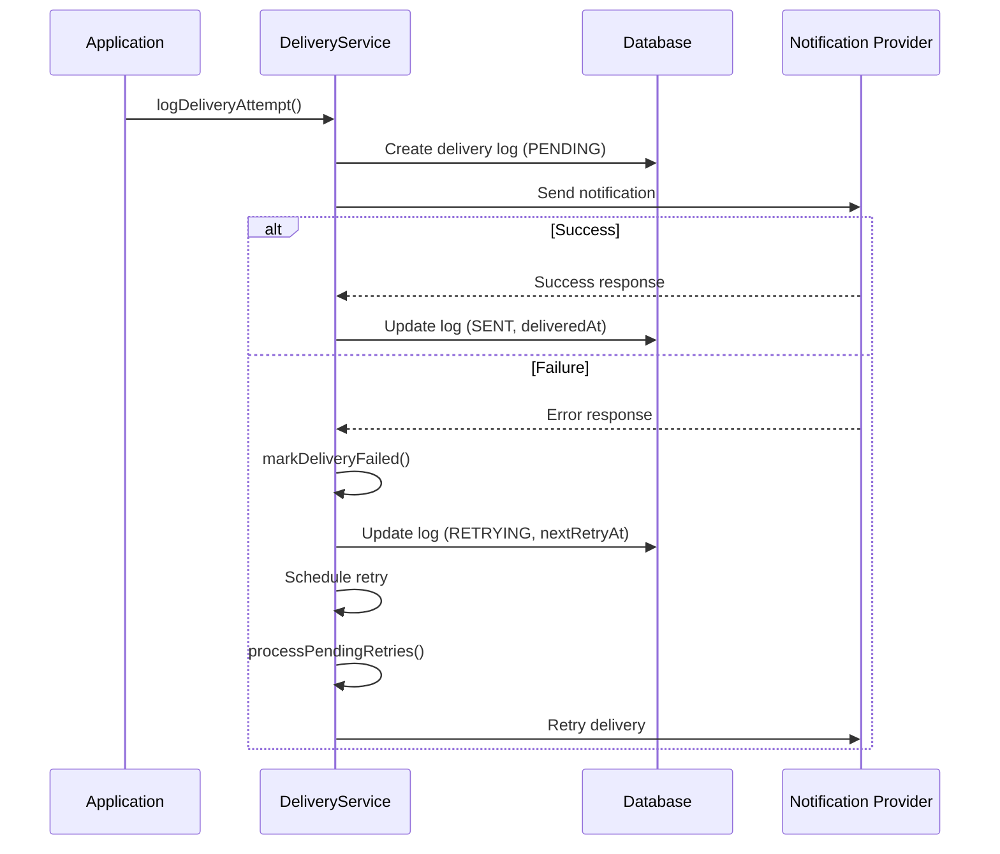
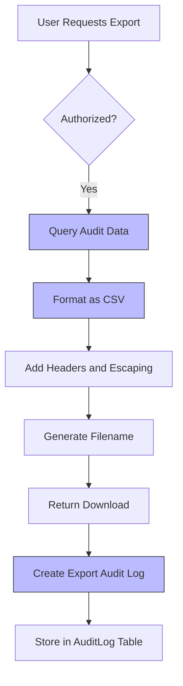
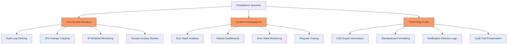

# Compliance Features

<cite>
**Referenced Files in This Document**   
- [auditor.ts](file://src/core/audit/auditor.ts)
- [auditBus.ts](file://src/core/audit/auditBus.ts)
- [elkLogger.ts](file://src/server/elkLogger.ts)
- [logger.ts](file://src/core/logs/logger.ts)
- [deliveryService.ts](file://src/core/notifications/deliveryService.ts)
- [types.ts](file://src/core/audit/types.ts)
- [operations.ts](file://src/core/audit/operations.ts)
- [ipWhitelist.ts](file://src/core/auth/ipWhitelist.ts)
- [twoFactor.ts](file://src/core/auth/twoFactor.ts)
- [ipWhitelistOperations.ts](file://src/core/auth/ipWhitelistOperations.ts)
- [migration.sql](file://migrations/20251117014807_add_logs_audit_notifications_system/migration.sql)
- [migration.sql](file://migrations/20251117150008_add_notification_preferences_and_delivery_log/migration.sql)
- [README.md](file://elk/README.md)
- [levels.ts](file://src/core/logs/levels.ts)
- [retention.ts](file://src/core/logs/retention.ts)
</cite>

## Table of Contents
1. [Introduction](#introduction)
2. [Audit Logging System](#audit-logging-system)
3. [Audit Event Bus Architecture](#audit-event-bus-architecture)
4. [ELK Stack Integration](#elk-stack-integration)
5. [Notification Delivery Logs](#notification-delivery-logs)
6. [Data Export and Regulatory Compliance](#data-export-and-regulatory-compliance)
7. [Common Compliance Scenarios](#common-compliance-scenarios)
8. [Conclusion](#conclusion)

## Introduction
SentinelIQ provides comprehensive compliance features designed to meet regulatory requirements and security standards. The system captures security-relevant events through a robust audit logging mechanism, integrates with the ELK stack for centralized logging and analysis, and maintains detailed notification delivery logs for compliance tracking. This documentation details the implementation of these features, focusing on audit event capture, structured log storage, ELK integration, notification tracking, and data export capabilities that support user access reviews, incident investigations, and third-party audits.

## Audit Logging System

SentinelIQ's audit logging system captures security-relevant events across the platform, including login attempts, 2FA changes, IP whitelist modifications, and session activities. The system is built around the `auditor.ts` module which implements event capture patterns for compliance tracking.

The audit logging system uses a structured data model defined in the database migration `20251117014807_add_logs_audit_notifications_system/migration.sql`, which creates the `AuditLog` table with fields for workspaceId, userId, action, resource, resourceId, description, metadata, ipAddress, and userAgent. This structure enables comprehensive tracking of user activities with contextual information.

Audit events are captured through two primary mechanisms: automatic capture via the event bus and manual capture through direct function calls. The `registerAuditHandler` function in `auditor.ts` subscribes to the event bus to automatically create audit logs when events contain audit data. For scenarios requiring direct audit logging, the `createAuditLog` function provides a standalone interface to create audit entries.



**Diagram sources**
- [auditor.ts](file://src/core/audit/auditor.ts#L1-L81)
- [auditBus.ts](file://src/core/audit/auditBus.ts#L1-L69)

**Section sources**
- [auditor.ts](file://src/core/audit/auditor.ts#L1-L81)
- [types.ts](file://src/core/audit/types.ts#L1-L61)
- [migration.sql](file://migrations/20251117014807_add_logs_audit_notifications_system/migration.sql#L1-L139)

## Audit Event Bus Architecture

The audit event system in SentinelIQ is built on an event-driven architecture using the `auditBus.ts` module as the central event dispatcher. This architecture enables decoupled, scalable event processing that supports both real-time audit logging and potential future compliance features.

The `WorkspaceEventBus` class implements a publish-subscribe pattern where components can register handlers for specific event types or all events. When an event is emitted, the bus executes all relevant handlers in parallel using `Promise.allSettled`, ensuring that failures in one handler don't prevent others from executing. This design provides fault tolerance and performance benefits for compliance-critical operations.

The event bus automatically registers the audit handler during module initialization, creating a seamless integration between application events and audit logging. Events contain a structured payload defined in `types.ts` with fields for workspaceId, userId, eventType, data, audit (containing action, resource, description, and metadata), and context (containing ipAddress and userAgent).

```mermaid
classDiagram
class WorkspaceEventBus {
-handlers : Map[string, EventHandler[]]
+on(eventType, handler)
+onAny(handler)
+emit(event)
}
class EventHandler {
<<Type>>
(event : WorkspaceEvent) => Promise<void>
}
class WorkspaceEvent {
+workspaceId : string
+userId? : string
+eventType : string
+data : Record[string, any]
+audit? : AuditContext
+context? : RequestContext
}
class AuditContext {
+action : string
+resource : string
+resourceId? : string
+description : string
+metadata? : Record[string, any]
}
class RequestContext {
+ipAddress? : string
+userAgent? : string
}
class Auditor {
+registerAuditHandler(eventBus)
+createAuditLog(entry)
}
WorkspaceEventBus --> EventHandler : "uses"
WorkspaceEventBus --> WorkspaceEvent : "emits"
Auditor --> WorkspaceEventBus : "registers handler"
Auditor --> AuditContext : "creates"
```

**Diagram sources**
- [auditBus.ts](file://src/core/audit/auditBus.ts#L1-L69)
- [types.ts](file://src/core/audit/types.ts#L1-L61)
- [auditor.ts](file://src/core/audit/auditor.ts#L1-L81)

**Section sources**
- [auditBus.ts](file://src/core/audit/auditBus.ts#L1-L69)
- [types.ts](file://src/core/audit/types.ts#L1-L61)

## ELK Stack Integration

SentinelIQ integrates with the ELK (Elasticsearch, Logstash, Kibana) stack for centralized logging, retention, and analysis. The integration is implemented in `elkLogger.ts`, which establishes a TCP connection to Logstash for forwarding structured logs to Elasticsearch.

The ELK integration follows a reliable messaging pattern with connection retry logic and message buffering. When the connection to Logstash is unavailable, messages are stored in an in-memory buffer with a maximum size of 1,000 entries. The system implements exponential backoff for reconnection attempts, with a maximum of 3 retries. Upon successful reconnection, buffered messages are flushed to Logstash.

Logs are forwarded in JSON format with a standardized structure that includes timestamp, level, component, message, workspaceId, userId, metadata, environment, error details, requestId, ip, userAgent, and duration. This structured format enables powerful querying and analysis capabilities in Kibana.

The system also implements log retention policies based on severity levels, with different retention periods for different log levels. DEBUG logs are retained for 7 days, INFO for 30 days, WARN for 90 days, ERROR for 180 days, and CRITICAL logs for 365 days. These policies are enforced by the `retention.ts` module which runs periodic cleanup jobs.



**Diagram sources**
- [elkLogger.ts](file://src/server/elkLogger.ts#L1-L270)
- [logger.ts](file://src/core/logs/logger.ts#L1-L107)
- [retention.ts](file://src/core/logs/retention.ts#L1-L80)

**Section sources**
- [elkLogger.ts](file://src/server/elkLogger.ts#L1-L270)
- [logger.ts](file://src/core/logs/logger.ts#L1-L107)
- [README.md](file://elk/README.md#L1-L348)
- [retention.ts](file://src/core/logs/retention.ts#L1-L80)

## Notification Delivery Logs

SentinelIQ maintains comprehensive logs of notification deliveries to track compliance-related alerts and actions. The notification delivery system is implemented in `deliveryService.ts` and includes features for delivery attempt tracking, retry mechanisms, and delivery statistics.

The system creates a `NotificationDeliveryLog` entry for each delivery attempt, capturing the provider (EMAIL, SLACK, DISCORD, WEBHOOK, TELEGRAM, TEAMS), eventType, workspaceId, userId, status (PENDING, SENT, FAILED, RETRYING, MAX_RETRIES_REACHED), attempts, maxAttempts, lastError, nextRetryAt, deliveredAt, and payload. This detailed logging enables auditing of notification delivery success and failure patterns.

The delivery service implements an automated retry mechanism for failed deliveries with configurable retry delays (60, 300, and 900 seconds). After three failed attempts, the delivery status is marked as MAX_RETRIES_REACHED. The system also includes a background job `processPendingRetries` that processes pending delivery retries, ensuring reliable delivery of compliance-critical notifications.

Delivery statistics are available through the `getDeliveryStats` function, which aggregates delivery data by provider and status over a configurable time period (default 7 days). This enables monitoring of notification delivery performance and identification of delivery issues.



**Diagram sources**
- [deliveryService.ts](file://src/core/notifications/deliveryService.ts#L1-L243)
- [migration.sql](file://migrations/20251117150008_add_notification_preferences_and_delivery_log/migration.sql#L1-L71)

**Section sources**
- [deliveryService.ts](file://src/core/notifications/deliveryService.ts#L1-L243)
- [migration.sql](file://migrations/20251117150008_add_notification_preferences_and_delivery_log/migration.sql#L1-L71)

## Data Export and Regulatory Compliance

SentinelIQ provides robust data export capabilities to support regulatory compliance requirements such as GDPR. The system enables export of audit trails in structured formats for retention and analysis, with specific features for compliance scenarios.

The `operations.ts` module in the audit subsystem implements the `exportAuditLogs` function, which generates CSV-formatted audit logs containing Timestamp, User, Action, Resource, Resource ID, Description, and IP Address fields. The exported CSV includes proper escaping of fields with quotes to handle data containing commas or special characters.

For workspace-level data exports, the system implements a data export workflow that captures all relevant data for GDPR compliance, including workspace data, members, audit logs, notifications, and invitations. This is triggered through the workspace event bus with a DATA_EXPORTED action, creating an audit trail of the export itself.

The system also supports export of module-specific data, such as Aegis case reports and Eclipse monitoring data, in both JSON and CSV formats. These exports include metadata about the export process, such as exportedAt timestamp and dataTypes included, providing a complete chain of custody for compliance purposes.



**Diagram sources**
- [operations.ts](file://src/core/audit/operations.ts#L1-L215)
- [DataExportTab.tsx](file://src/client/pages/workspace/settings/tabs/DataExportTab.tsx#L1-L108)

**Section sources**
- [operations.ts](file://src/core/audit/operations.ts#L1-L215)
- [DataExportTab.tsx](file://src/client/pages/workspace/settings/tabs/DataExportTab.tsx#L1-L108)
- [workspace.ts](file://src/client/i18n/locales/workspace.ts#L107-L116)

## Common Compliance Scenarios

SentinelIQ's compliance features support several common scenarios including user access reviews, incident investigations, and third-party audits. These scenarios leverage the audit logging, ELK integration, and data export capabilities to provide comprehensive compliance support.

For user access reviews, administrators can use the audit log filtering capabilities to review all actions performed by specific users, focusing on authentication events, permission changes, and sensitive operations. The system captures 2FA enrollment and changes, IP whitelist modifications, and session activities, providing a complete picture of user access patterns.

In incident investigations, security teams can use the ELK stack integration to correlate events across multiple systems and time periods. Kibana dashboards provide visualizations of error rates, top error components, and workspace activity patterns, enabling rapid identification of anomalous behavior. The structured log format with workspaceId, userId, and requestId enables precise tracing of request flows through the system.

For third-party audits, the system provides CSV exports of audit trails with standardized formatting that can be easily reviewed by auditors. The audit log entries include descriptive text and metadata that provide context for each action, reducing the need for additional explanation. The system also maintains a complete record of notification deliveries, demonstrating that compliance alerts were properly sent and received.



**Diagram sources**
- [auditor.ts](file://src/core/audit/auditor.ts#L1-L81)
- [elkLogger.ts](file://src/server/elkLogger.ts#L1-L270)
- [operations.ts](file://src/core/audit/operations.ts#L1-L215)
- [twoFactor.ts](file://src/core/auth/twoFactor.ts#L1-L98)
- [ipWhitelistOperations.ts](file://src/core/auth/ipWhitelistOperations.ts#L1-L281)

**Section sources**
- [auditor.ts](file://src/core/audit/auditor.ts#L1-L81)
- [elkLogger.ts](file://src/server/elkLogger.ts#L1-L270)
- [operations.ts](file://src/core/audit/operations.ts#L1-L215)
- [twoFactor.ts](file://src/core/auth/twoFactor.ts#L1-L98)
- [ipWhitelistOperations.ts](file://src/core/auth/ipWhitelistOperations.ts#L1-L281)

## Conclusion
SentinelIQ's compliance features provide a comprehensive framework for meeting regulatory requirements and security standards. The system's audit logging captures security-relevant events through an event-driven architecture, storing them in structured formats for retention and analysis. Integration with the ELK stack enables centralized logging with powerful search, visualization, and alerting capabilities. The notification delivery logging system tracks compliance-related alerts with automated retry mechanisms, ensuring reliable delivery of critical notifications. Data export capabilities support regulatory compliance with structured CSV exports of audit trails. Together, these features enable effective user access reviews, incident investigations, and third-party audits, providing organizations with the tools they need to maintain compliance and security.