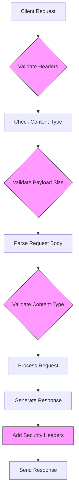
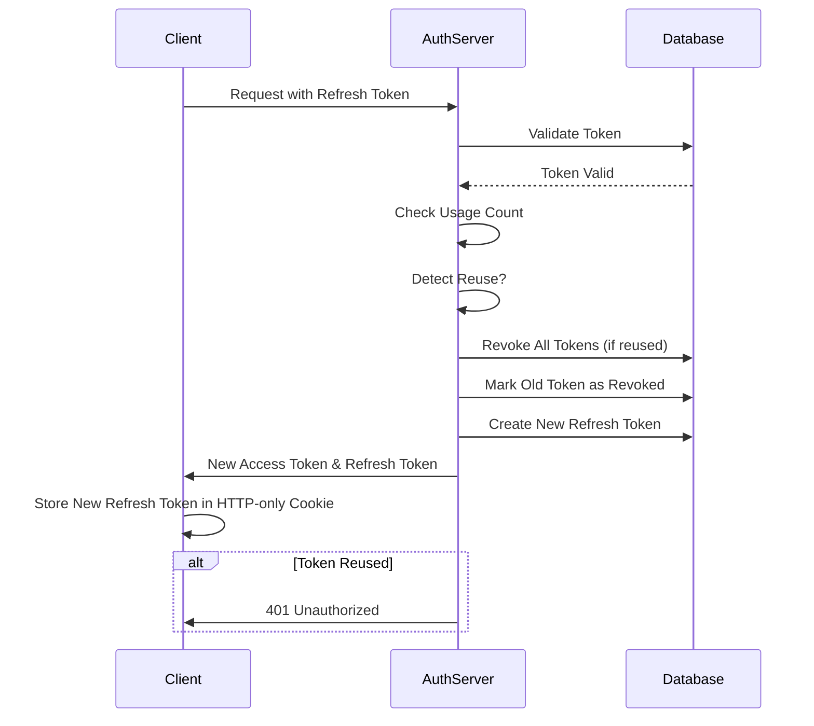
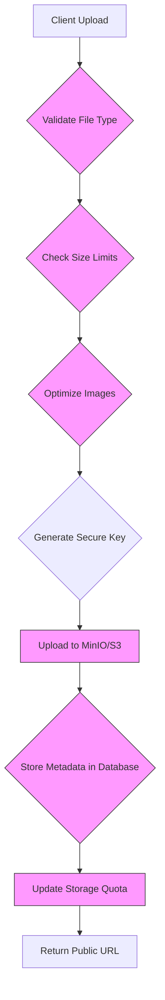
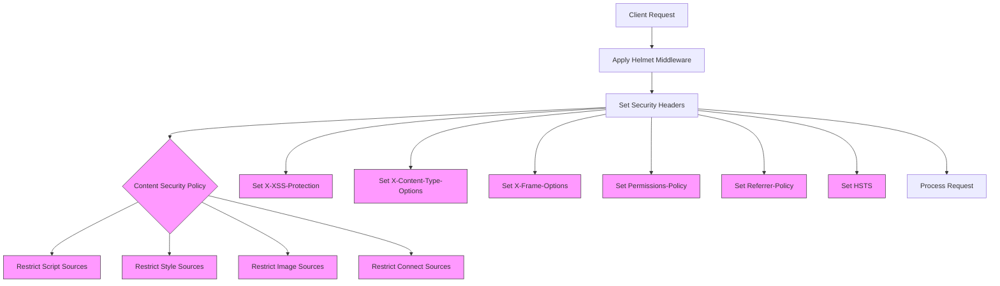

# Data Protection

<cite>
**Referenced Files in This Document**   
- [security.ts](file://src/server/security.ts)
- [middlewareConfig.ts](file://src/server/middlewareConfig.ts)
- [refreshToken.ts](file://src/core/auth/refreshToken.ts)
- [storage.ts](file://src/server/storage.ts)
- [rateLimit.ts](file://src/server/rateLimit.ts)
- [redis.ts](file://src/server/redis.ts)
- [sentry.ts](file://src/server/sentry.ts)
- [upload.ts](file://src/server/api/upload.ts)
- [main.wasp](file://main.wasp)
</cite>

## Table of Contents
1. [Introduction](#introduction)
2. [Secure Transmission Practices](#secure-transmission-practices)
3. [Data-at-Rest Protection Strategies](#data-at-rest-protection-strategies)
4. [Request-Level Protections](#request-level-protections)
5. [Refresh Token Management](#refresh-token-management)
6. [Secure File Storage with MinIO/S3](#secure-file-storage-with-minios3)
7. [Security Headers and XSS/CSRF Protection](#security-headers-and-xsscsrf-protection)
8. [Conclusion](#conclusion)

## Introduction
SentinelIQ implements a comprehensive data protection framework that addresses security across multiple layers: secure transmission, data-at-rest protection, request-level validations, and authentication token management. The system leverages industry-standard security practices and modern cryptographic techniques to protect sensitive information throughout its lifecycle. This document details the specific mechanisms implemented in SentinelIQ to ensure data confidentiality, integrity, and availability, with a focus on HTTPS enforcement, secure cookie attributes, encrypted payloads, database encryption, secure credential storage, request size limits, content-type validation, secure header configurations, refresh token rotation, and integration with MinIO/S3 for secure file storage.

## Secure Transmission Practices
SentinelIQ enforces secure transmission of data through multiple mechanisms that ensure all communications occur over encrypted channels and are protected against common web vulnerabilities. The system implements HTTPS enforcement through HTTP Strict Transport Security (HSTS) with a max-age of 31536000 seconds (1 year), ensuring that all browsers automatically upgrade HTTP requests to HTTPS. This configuration includes the `includeSubDomains` directive to extend protection to all subdomains and the `preload` directive to enable inclusion in browser preload lists.

The application employs secure cookie attributes to protect session and authentication tokens. Cookies are configured with the `HttpOnly` flag to prevent client-side script access, the `Secure` flag to ensure transmission only over HTTPS, and the `SameSite` attribute set to `strict` or `lax` depending on the use case to mitigate Cross-Site Request Forgery (CSRF) attacks. These attributes are implemented across all authentication-related cookies, including refresh tokens stored in HTTP-only cookies.

For encrypted payloads, SentinelIQ uses TLS 1.2 or higher for all communications between clients and servers, as well as between internal services. The system validates certificate chains and supports modern cipher suites while disabling outdated protocols. Additionally, sensitive API endpoints require authentication tokens in the Authorization header, which are transmitted over encrypted channels and have limited lifetimes to reduce the risk of interception and misuse.

**Section sources**
- [security.ts](file://src/server/security.ts#L106-L111)
- [security.ts](file://src/server/security.ts#L180)
- [main.wasp](file://main.wasp#L31-L69)

## Data-at-Rest Protection Strategies
SentinelIQ implements robust data-at-rest protection strategies to safeguard sensitive information stored in databases, caches, and file systems. The system encrypts sensitive fields in the database using application-level encryption for highly sensitive data such as authentication secrets and personal information. Database connections use TLS encryption, and access to the database is restricted through role-based access control and network segmentation.

Credentials are securely stored using industry-standard hashing algorithms with salt. Passwords are hashed using bcrypt with appropriate work factors, while API keys and other secrets are encrypted using AES-256-GCM with keys managed through environment variables and secure key management practices. The system never stores plaintext credentials and implements automatic rotation of cryptographic keys according to security policies.

For ephemeral data storage, SentinelIQ utilizes Redis with password authentication and TLS encryption for transport. Redis is configured to persist data to disk with encrypted snapshots, and the instance is isolated in a private network segment with firewall rules restricting access to authorized services only. The system implements a comprehensive cleanup strategy for temporary data, with automated jobs that remove expired sessions, tokens, and cached information according to defined retention policies.

**Section sources**
- [redis.ts](file://src/server/redis.ts#L18-L24)
- [refreshToken.ts](file://src/core/auth/refreshToken.ts#L13-L15)
- [twoFactor.ts](file://src/core/auth/twoFactor.ts#L13-L19)

## Request-Level Protections
SentinelIQ implements comprehensive request-level protections to prevent various types of attacks and ensure system stability. The system enforces strict body size limits to prevent denial-of-service attacks and resource exhaustion. JSON payloads are limited to 10MB, while raw file uploads are permitted up to 50MB, providing a balance between functionality and security. These limits are enforced at the middleware level before requests reach application logic, preventing excessive resource consumption.

Content-type validation is implemented to ensure that requests contain expected data formats and prevent content spoofing attacks. The system validates MIME types against an allowlist of permitted types for file uploads and verifies that request content-types match the actual payload. This validation occurs early in the request processing pipeline, rejecting malformed or malicious requests before they can be processed by application logic.

Secure header configurations are implemented to enhance browser security and prevent common web vulnerabilities. The system sets `X-Content-Type-Options: nosniff` to prevent MIME type sniffing, `X-Frame-Options: DENY` to prevent clickjacking attacks, and `Permissions-Policy` to restrict access to sensitive browser features such as geolocation, microphone, and camera. These headers are applied consistently across all responses to ensure comprehensive protection.

**Diagram sources **
- [middlewareConfig.ts](file://src/server/middlewareConfig.ts#L17-L48)
- [security.ts](file://src/server/security.ts#L221-L232)

**Section sources**
- [middlewareConfig.ts](file://src/server/middlewareConfig.ts#L17-L48)
- [security.ts](file://src/server/security.ts#L221-L232)
- [validation.ts](file://src/server/validation.ts#L4-L15)

## Refresh Token Management
SentinelIQ implements a sophisticated refresh token management system that enhances security through token rotation, revocation, and secure storage practices. Refresh tokens are cryptographically secure, generated using Node.js's `crypto.randomBytes()` function to produce 64-byte hexadecimal strings with high entropy, ensuring resistance to guessing attacks.

The system implements refresh token rotation, where each time a refresh token is used to obtain a new access token, the old refresh token is invalidated and a new one is issued. This approach limits the window of opportunity for token theft and provides a mechanism to detect token reuse, which may indicate a security breach. When token reuse is detected, the system automatically revokes all refresh tokens associated with the user account as a protective measure.

Refresh tokens are stored in secure HTTP-only cookies with the Secure flag enabled, preventing access via client-side scripts and ensuring transmission only over HTTPS connections. The system limits each user to a maximum of five active refresh tokens, automatically rotating out older tokens when this limit is reached. Expired and revoked tokens are cleaned up by a scheduled job that runs daily, maintaining database efficiency and reducing the attack surface.

**Diagram sources **
- [refreshToken.ts](file://src/core/auth/refreshToken.ts#L77-L138)
- [refreshToken.ts](file://src/core/auth/refreshToken.ts#L143-L154)

**Section sources**
- [refreshToken.ts](file://src/core/auth/refreshToken.ts#L7-L193)
- [main.wasp](file://main.wasp#L31-L69)

## Secure File Storage with MinIO/S3
SentinelIQ integrates with MinIO/S3 for secure file storage, implementing encryption and access controls to protect uploaded assets. The system uses AWS SDK v3 to interface with S3-compatible storage, supporting both MinIO for development and AWS S3 for production environments. All file operations occur over encrypted connections, and credentials are securely managed through environment variables with restricted permissions.

Uploaded files are encrypted at rest using server-side encryption provided by the storage backend. The system implements workspace isolation by structuring file paths with workspace identifiers, ensuring that files are logically separated by tenant. Metadata associated with each file includes workspace and user identifiers, enabling audit trails and access control decisions.

The storage service validates file types against allowlists for images and documents, preventing the upload of executable files or other potentially dangerous content. File size limits are enforced based on type, with images limited to 5MB and documents to 10MB. The system also implements automatic image optimization, converting uploaded images to WebP format with controlled quality settings to reduce file sizes while maintaining visual quality.

**Diagram sources **
- [storage.ts](file://src/server/storage.ts#L102-L216)
- [storage.ts](file://src/server/storage.ts#L229-L259)

**Section sources**
- [storage.ts](file://src/server/storage.ts#L1-L600)
- [upload.ts](file://src/server/api/upload.ts#L1-L100)

## Security Headers and XSS/CSRF Protection
SentinelIQ implements comprehensive security headers and protections against XSS (Cross-Site Scripting) and CSRF (Cross-Site Request Forgery) attacks through the Helmet middleware and additional security measures. The system configures a robust Content Security Policy (CSP) that restricts the sources from which content can be loaded, allowing only trusted domains for scripts, styles, images, and other resources.

The CSP configuration includes directives for default sources, script sources, style sources, font sources, image sources, and connect sources, with specific allowances for essential third-party services like Stripe and Cloudflare. In development environments, additional localhost origins are permitted to support development workflows, while production configurations maintain strict restrictions to minimize the attack surface.

Additional protections include X-XSS-Protection set to "1; mode=block" to enable browser XSS filters, X-Content-Type-Options set to "nosniff" to prevent MIME type sniffing attacks, and X-Frame-Options set to "DENY" to prevent clickjacking. The Permissions-Policy header restricts access to sensitive browser features like geolocation, microphone, and camera, further reducing the potential attack surface.

The system also implements CSRF protection through the use of anti-forgery tokens in forms and state-changing operations, combined with the SameSite cookie attribute to prevent unauthorized cross-origin requests. These measures work together to create multiple layers of defense against common web application vulnerabilities.

**Diagram sources **
- [security.ts](file://src/server/security.ts#L54-L141)
- [security.ts](file://src/server/security.ts#L221-L232)

**Section sources**
- [security.ts](file://src/server/security.ts#L13-L268)
- [main.wasp](file://main.wasp#L80-L83)

## Conclusion
SentinelIQ's data protection mechanisms provide a comprehensive security framework that addresses multiple attack vectors and protects sensitive information throughout its lifecycle. The system implements secure transmission practices through HTTPS enforcement, secure cookie attributes, and encrypted payloads, ensuring that data in transit is protected from eavesdropping and tampering. Data-at-rest protection strategies include encryption of sensitive database fields, secure credential storage, and the use of Redis for ephemeral data with appropriate security configurations.

Request-level protections with body size limits, content-type validation, and secure header configurations defend against denial-of-service attacks, injection vulnerabilities, and other common web threats. The refresh token management system enhances authentication security through token rotation, revocation, and storage in secure HTTP-only cookies, while the integration with MinIO/S3 provides secure file storage with encryption and access controls.

These security measures work together to protect against XSS, CSRF, and injection attacks through multiple layers of defense, including Content Security Policy, input validation, output encoding, and proper session management. The system's architecture prioritizes security by design, with security middleware initialized early in the request processing pipeline and comprehensive logging and monitoring to detect and respond to potential security incidents.

**Section sources**
- [security.ts](file://src/server/security.ts#L245-L268)
- [sentry.ts](file://src/server/sentry.ts#L11-L26)
- [main.wasp](file://main.wasp#L80-L83)