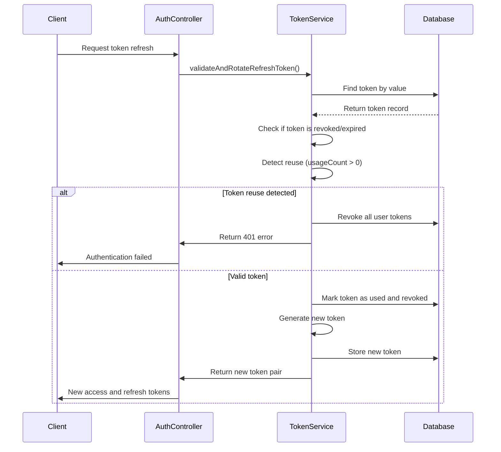
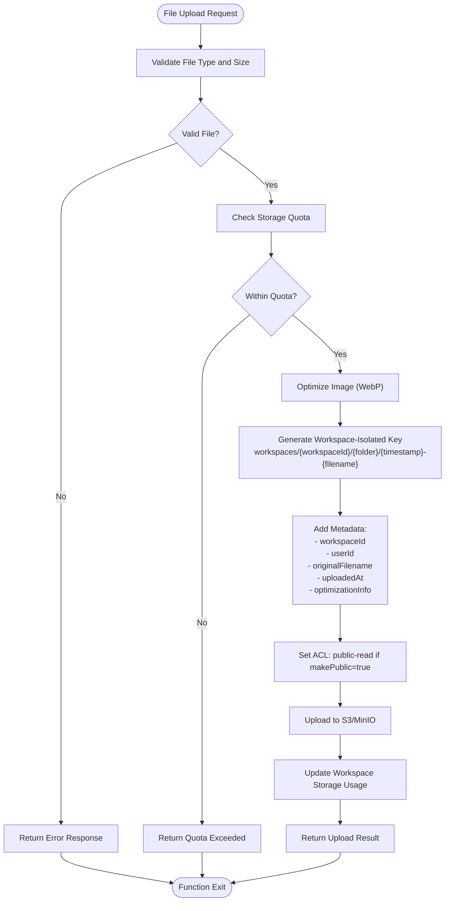
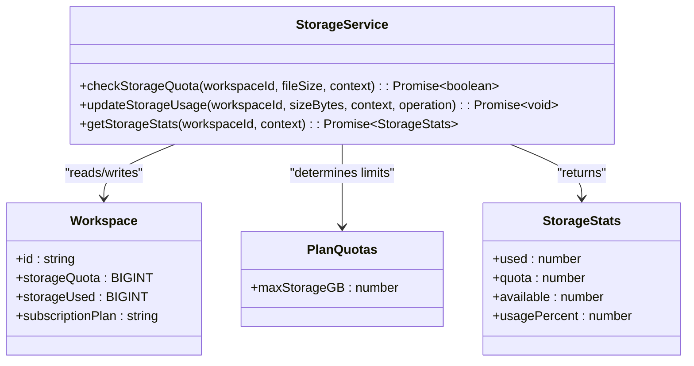
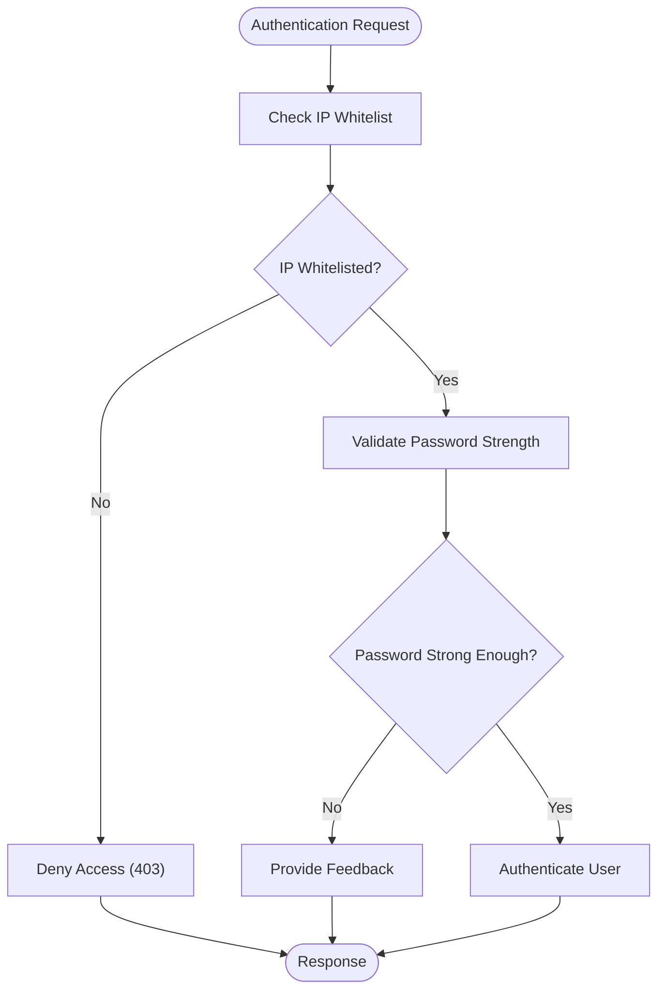

# Data-at-Rest Protection

<cite>
**Referenced Files in This Document**   
- [refreshToken.ts](file://src/core/auth/refreshToken.ts)
- [storage.ts](file://src/server/storage.ts)
- [redis.ts](file://src/server/redis.ts)
- [passwordPolicy.ts](file://src/core/auth/passwordPolicy.ts)
- [ipWhitelist.ts](file://src/core/auth/ipWhitelist.ts)
- [migration.sql](file://migrations/20251117045259_add_refresh_tokens_ip_whitelist_password_policy/migration.sql)
- [migration.sql](file://migrations/20251117142501_add_storage_quota/migration.sql)
</cite>

## Table of Contents
1. [Introduction](#introduction)
2. [Refresh Token Security](#refresh-token-security)
3. [Ephemeral Data Protection with Redis](#ephemeral-data-protection-with-redis)
4. [Secure File Storage with MinIO/S3](#secure-file-storage-with-minios3)
5. [Storage Quota Enforcement](#storage-quota-enforcement)
6. [Security Configuration and Policies](#security-configuration-and-policies)

## Introduction
SentinelIQ implements comprehensive data-at-rest protection strategies to ensure the confidentiality, integrity, and availability of sensitive information. The system employs multiple layers of security controls including cryptographic protection of authentication tokens, secure ephemeral data storage, and robust file storage mechanisms with workspace isolation. This document details the implementation of these security measures, focusing on refresh token management, Redis configuration for ephemeral data, MinIO/S3 integration for file storage, and storage quota enforcement. The architecture ensures that sensitive data is protected through cryptographic hashing, token rotation, password protection, connection security, and strict access controls.

## Refresh Token Security

SentinelIQ implements a robust refresh token system that protects sensitive authentication data at rest through cryptographic hashing and a token rotation mechanism. The system stores refresh tokens in the database with additional security measures to prevent unauthorized access and detect potential security breaches.

The refresh token implementation includes several key security features:
- Cryptographically secure token generation using Node.js crypto module
- Database storage with token values hashed and protected
- Token expiration with a configurable 30-day expiry period
- Limitation of active tokens per user (maximum of 5)
- Comprehensive token rotation on reuse detection
- Automatic cleanup of expired tokens

When a refresh token is reused, the system detects this as a potential security breach and automatically revokes all refresh tokens associated with the user's account. This token rotation mechanism ensures that compromised tokens cannot be used for prolonged unauthorized access.



**Diagram sources**
- [refreshToken.ts](file://src/core/auth/refreshToken.ts#L77-L137)

**Section sources**
- [refreshToken.ts](file://src/core/auth/refreshToken.ts#L1-L193)
- [migration.sql](file://migrations/20251117045259_add_refresh_tokens_ip_whitelist_password_policy/migration.sql#L5-L33)

## Ephemeral Data Protection with Redis

SentinelIQ utilizes Redis for ephemeral data storage with comprehensive security measures including password protection and encrypted connections. The Redis configuration ensures that session data, rate limiting information, and other temporary data are protected against unauthorized access.

The Redis implementation includes the following security features:
- Password authentication using environment variables
- Configurable database selection (DB 0 by default)
- Connection retry strategy with exponential backoff
- Graceful connection handling with proper error logging
- Health check functionality to monitor Redis availability

The system establishes secure connections to Redis with proper error handling and connection lifecycle management. All Redis operations are performed through a singleton client instance that ensures consistent configuration across the application.

```mermaid
classDiagram
class RedisConfig {
+redisUrl : string
+redisPassword : string
+redisDb : number
+retryStrategy : function
+maxRetriesPerRequest : number
}
class RedisClient {
-client : Redis
+getRedisClient() : Redis
+closeRedisConnection() : Promise~void~
+checkRedisHealth() : Promise~boolean~
}
RedisConfig --> RedisClient : "configures"
note right of RedisClient
Singleton pattern ensures
single connection instance
throughout application
end note
```

**Diagram sources**
- [redis.ts](file://src/server/redis.ts#L1-L77)

**Section sources**
- [redis.ts](file://src/server/redis.ts#L1-L77)

## Secure File Storage with MinIO/S3

SentinelIQ implements secure file storage using MinIO/S3 with workspace-isolated keys, metadata tagging, and ACL controls. The StorageService class provides a comprehensive interface for file operations with built-in security and optimization features.

The file storage system incorporates the following security and organizational measures:
- Workspace isolation through key structure: workspaces/{workspaceId}/folder/
- Metadata tagging with workspaceId, userId, and upload information
- ACL controls for public and private file access
- Allowed MIME type validation for security
- File size limits to prevent abuse
- Environment-based bucket selection (development vs production)

The system automatically optimizes images during upload, converting them to WebP format with configurable quality settings. This optimization reduces storage requirements while maintaining visual quality.



**Diagram sources**
- [storage.ts](file://src/server/storage.ts#L98-L215)

**Section sources**
- [storage.ts](file://src/server/storage.ts#L1-L600)

## Storage Quota Enforcement

SentinelIQ implements a comprehensive storage quota enforcement system that tracks usage at the workspace level and prevents overages. The system integrates with the database to maintain accurate storage usage metrics and enforce plan-based limits.

The quota enforcement mechanism includes:
- Database schema with storageQuota and storageUsed fields in the Workspace table
- Real-time quota checking before file uploads
- Automatic storage usage tracking with add/subtract operations
- Detailed storage statistics including usage percentage
- Integration with the subscription plan system to determine quota limits

The system prevents uploads that would exceed a workspace's storage quota and provides detailed statistics for monitoring usage. Storage usage is updated atomically when files are uploaded or deleted, ensuring data consistency.



**Diagram sources**
- [storage.ts](file://src/server/storage.ts#L229-L349)
- [quotas.ts](file://src/core/workspace/quotas.ts#L3-L45)

**Section sources**
- [storage.ts](file://src/server/storage.ts#L229-L349)
- [migration.sql](file://migrations/20251117142501_add_storage_quota/migration.sql#L1-L4)
- [quotas.ts](file://src/core/workspace/quotas.ts#L3-L45)

## Security Configuration and Policies

SentinelIQ implements comprehensive security policies and configurations to protect data at rest and in transit. The system enforces strong password policies, IP whitelisting, and other security controls to prevent unauthorized access.

Key security policies include:
- Password strength validation using zxcvbn library with minimum score requirements
- IP address whitelisting with CIDR notation support
- Regular expression-based validation for IP addresses and CIDR ranges
- Client IP extraction from various proxy headers
- Normalization of IPv6 addresses for IPv4-mapped addresses

The password policy requires a minimum length of 8 characters and a zxcvbn score of at least 3 (strong). The system provides detailed feedback to users about password strength and potential improvements.



**Diagram sources**
- [passwordPolicy.ts](file://src/core/auth/passwordPolicy.ts#L1-L128)
- [ipWhitelist.ts](file://src/core/auth/ipWhitelist.ts#L1-L189)

**Section sources**
- [passwordPolicy.ts](file://src/core/auth/passwordPolicy.ts#L1-L128)
- [ipWhitelist.ts](file://src/core/auth/ipWhitelist.ts#L1-L189)