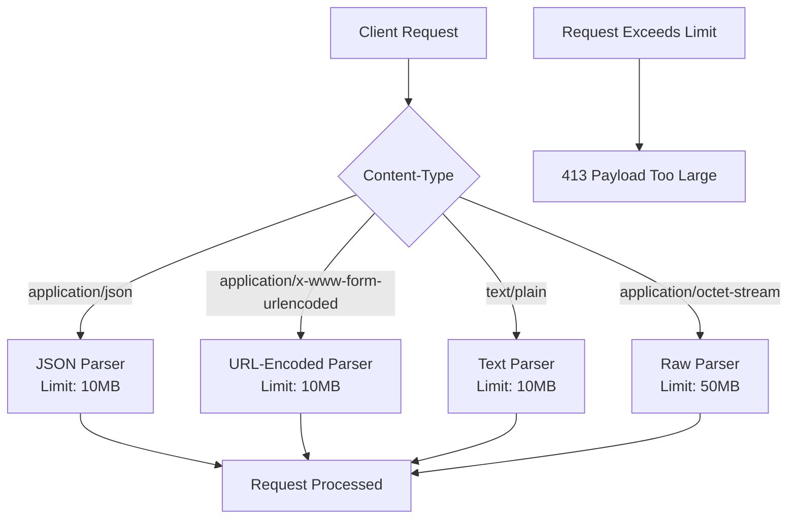
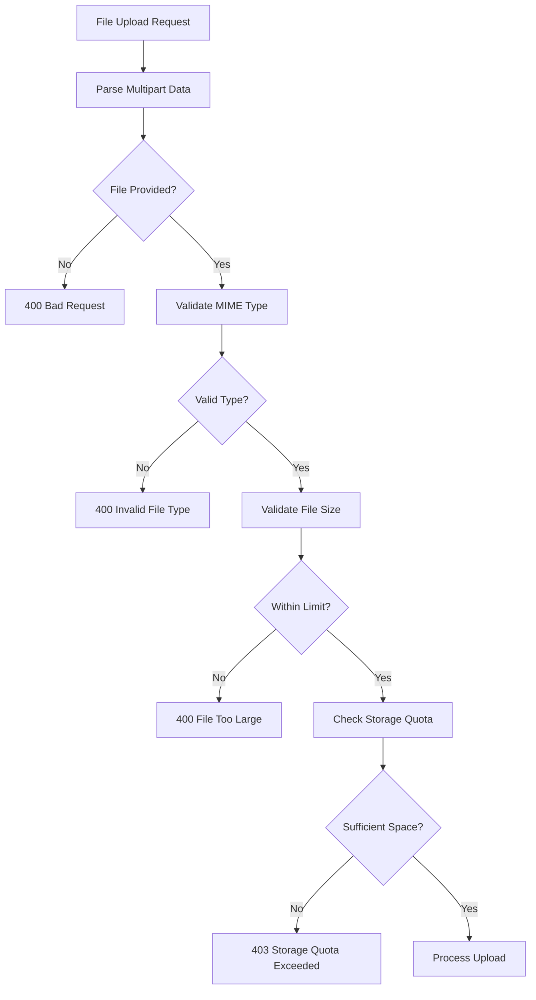
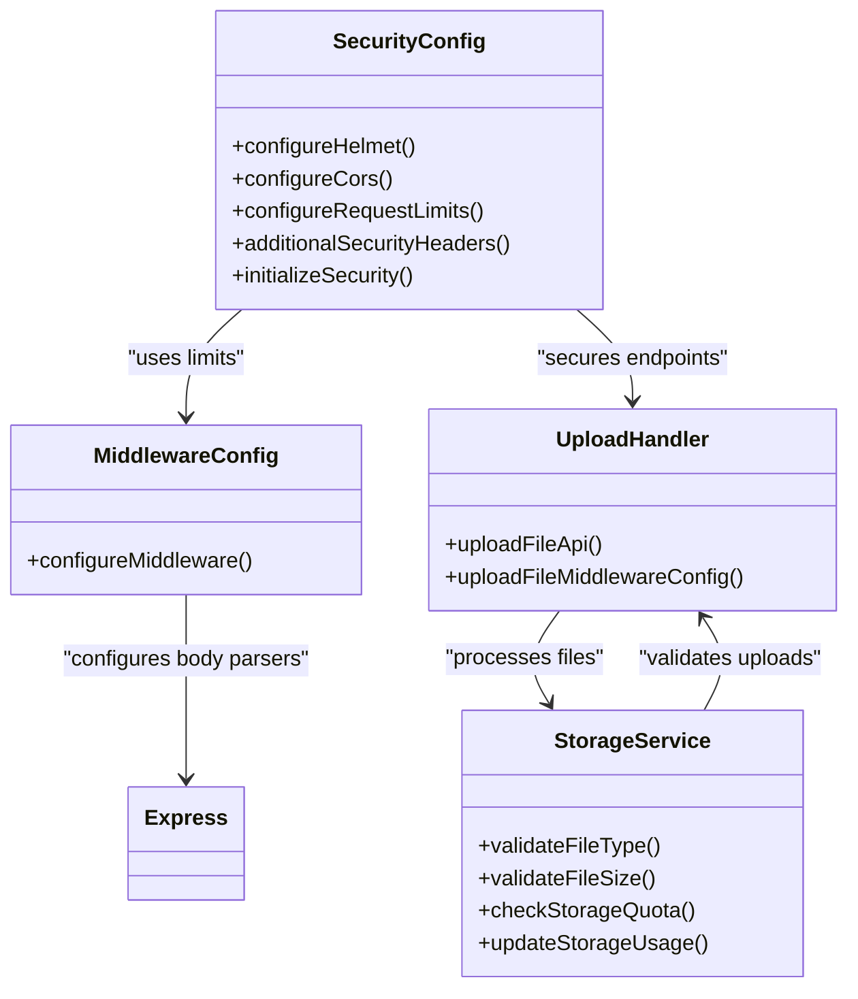

# Request-Level Security

<cite>
**Referenced Files in This Document**   
- [security.ts](file://src/server/security.ts)
- [middlewareConfig.ts](file://src/server/middlewareConfig.ts)
- [storage.ts](file://src/server/storage.ts)
- [upload.ts](file://src/server/api/upload.ts)
</cite>

## Table of Contents
1. [Introduction](#introduction)
2. [Request Size Limits](#request-size-limits)
3. [Content-Type Validation](#content-type-validation)
4. [Secure Header Configurations](#secure-header-configurations)
5. [Implementation Details](#implementation-details)
6. [Security Protection Mechanisms](#security-protection-mechanisms)

## Introduction
SentinelIQ implements comprehensive request-level security protections to safeguard against various attack vectors including Denial of Service (DoS) attacks, MIME sniffing, frame injection, and resource exhaustion. The security framework is built on Express middleware with multiple layers of protection, including request size limits, content-type validation, and secure HTTP headers. These measures are designed to protect both the application and its users by enforcing strict limits on request payloads, validating file types during uploads, and implementing industry-standard security headers.

**Section sources**
- [security.ts](file://src/server/security.ts#L1-L55)

## Request Size Limits
SentinelIQ enforces strict request size limits through Express middleware to prevent DoS attacks and resource exhaustion. The system configures different limits for various content types, ensuring that legitimate requests can be processed while malicious large payloads are rejected. These limits are implemented using Express's built-in body parsing middleware with specific configurations for JSON, URL-encoded, text, and raw data.

The request size limits are configured as follows:
- **JSON payloads**: 10MB limit for API requests containing JSON data
- **URL-encoded payloads**: 10MB limit for form submissions
- **Text payloads**: 10MB limit for plain text content
- **Raw payloads**: 50MB limit for file uploads and binary data

These limits are implemented in the middleware configuration to prevent memory exhaustion attacks and ensure system stability under heavy load.



**Diagram sources**
- [middlewareConfig.ts](file://src/server/middlewareConfig.ts#L17-L47)
- [security.ts](file://src/server/security.ts#L198-L213)

**Section sources**
- [middlewareConfig.ts](file://src/server/middlewareConfig.ts#L17-L47)
- [security.ts](file://src/server/security.ts#L198-L213)

## Content-Type Validation
SentinelIQ implements robust content-type validation mechanisms for file uploads, particularly for image and document types. The system validates both the MIME type and file size to ensure that only permitted file types are accepted, preventing malicious file uploads and potential security vulnerabilities.

For image uploads, the following MIME types are allowed:
- JPEG: image/jpeg, image/jpg
- PNG: image/png
- GIF: image/gif
- WebP: image/webp
- SVG: image/svg+xml

For document uploads, the following MIME types are allowed:
- PDF: application/pdf
- DOC: application/msword
- DOCX: application/vnd.openxmlformats-officedocument.wordprocessingml.document
- XLS: application/vnd.ms-excel
- XLSX: application/vnd.openxmlformats-officedocument.spreadsheetml.sheet

The validation process occurs at multiple levels:
1. Initial validation through multer middleware for multipart form data
2. MIME type verification against allowed types
3. File size validation against maximum limits
4. Workspace storage quota verification



**Diagram sources**
- [upload.ts](file://src/server/api/upload.ts#L119-L162)
- [storage.ts](file://src/server/storage.ts#L509-L518)

**Section sources**
- [upload.ts](file://src/server/api/upload.ts#L119-L162)
- [storage.ts](file://src/server/storage.ts#L48-L64)

## Secure Header Configurations
SentinelIQ implements multiple security headers to protect against common web vulnerabilities. These headers are configured through both Helmet middleware and custom middleware to provide comprehensive protection against MIME sniffing, clickjacking, XSS attacks, and unauthorized access to sensitive features.

The key security headers implemented include:

- **X-Content-Type-Options: nosniff**: Prevents browsers from MIME-sniffing a response away from the declared content type, which helps prevent XSS attacks and data injection.
- **X-Frame-Options: DENY**: Prevents the page from being displayed in a frame, iframe, or object, protecting against clickjacking attacks.
- **X-XSS-Protection: 1; mode=block**: Enables the XSS filter built into most modern web browsers and instructs them to block the page if an XSS attack is detected.
- **Permissions-Policy**: Restricts access to browser features such as geolocation, microphone, and camera, preventing unauthorized access to sensitive user data.

Additionally, the application implements Content Security Policy (CSP) through Helmet middleware, which restricts the sources from which content can be loaded, further reducing the risk of XSS attacks.

```mermaid
flowchart TD
A[Client Request] --> B[Security Headers Middleware]
B --> C[X-Content-Type-Options: nosniff]
B --> D[X-Frame-Options: DENY]
B --> E[X-XSS-Protection: 1; mode=block]
B --> F[Permissions-Policy: geolocation=(), microphone=(), camera=()]
B --> G[Content-Security-Policy]
C --> H[Response to Client]
D --> H
E --> H
F --> H
G --> H
```

**Diagram sources**
- [security.ts](file://src/server/security.ts#L226-L229)
- [security.ts](file://src/server/security.ts#L58-L103)

**Section sources**
- [security.ts](file://src/server/security.ts#L221-L232)
- [security.ts](file://src/server/security.ts#L58-L103)

## Implementation Details
The request-level security protections in SentinelIQ are implemented through a combination of middleware functions and configuration files. The system uses a layered approach to security, with different components handling specific aspects of request validation and protection.

The `configureRequestLimits()` function in security.ts returns an object with size limits for different content types, which is used to configure the Express body parsers. This function defines the 10MB limits for JSON, URL-encoded, and text payloads, and the 50MB limit for raw payloads.

In middlewareConfig.ts, the `configureMiddleware()` function applies these limits by configuring the Express body parsing middleware with the specified size constraints. This ensures that requests exceeding these limits are rejected with a 413 Payload Too Large status code before they can consume excessive server resources.

The `additionalSecurityHeaders` middleware function implements the custom security headers that are not covered by Helmet, including X-Content-Type-Options, X-Frame-Options, X-XSS-Protection, and Permissions-Policy. This middleware is applied to all requests to ensure consistent security header application.



**Diagram sources**
- [security.ts](file://src/server/security.ts#L198-L213)
- [middlewareConfig.ts](file://src/server/middlewareConfig.ts#L17-L47)
- [storage.ts](file://src/server/storage.ts#L509-L518)
- [upload.ts](file://src/server/api/upload.ts#L44-L228)

**Section sources**
- [security.ts](file://src/server/security.ts#L198-L213)
- [middlewareConfig.ts](file://src/server/middlewareConfig.ts#L17-L47)

## Security Protection Mechanisms
SentinelIQ's request-level security measures protect against several types of attacks through a multi-layered defense strategy:

**Resource Exhaustion Protection**: The request size limits prevent DoS attacks by limiting the amount of data that can be sent in a single request. By setting reasonable limits on JSON, URL-encoded, text, and raw payloads, the system prevents attackers from overwhelming server resources with large requests that could consume excessive memory or processing time.

**MIME Sniffing Prevention**: The X-Content-Type-Options: nosniff header prevents browsers from guessing the content type of a response, which could lead to security vulnerabilities if a file is interpreted differently than intended. This is particularly important for preventing XSS attacks that rely on browsers interpreting JavaScript in files that should be treated as images or other non-executable content types.

**Frame Injection Protection**: The X-Frame-Options: DENY header prevents the application from being embedded in iframes, protecting against clickjacking attacks where an attacker could overlay invisible elements on top of the application to trick users into performing unintended actions.

**Feature Access Control**: The Permissions-Policy header restricts access to sensitive browser features such as geolocation, microphone, and camera, preventing unauthorized access to user data and hardware. This ensures that these features can only be accessed when explicitly needed and with user permission.

**File Upload Security**: The content-type validation mechanism ensures that only permitted file types can be uploaded to the system. By validating both the MIME type and file size, and checking against workspace storage quotas, the system prevents malicious file uploads and ensures fair resource usage across workspaces.

These security measures work together to create a robust defense-in-depth strategy that protects SentinelIQ against a wide range of potential threats while maintaining usability for legitimate users.

**Section sources**
- [security.ts](file://src/server/security.ts#L193-L232)
- [middlewareConfig.ts](file://src/server/middlewareConfig.ts#L17-L47)
- [storage.ts](file://src/server/storage.ts#L509-L518)
- [upload.ts](file://src/server/api/upload.ts#L119-L162)