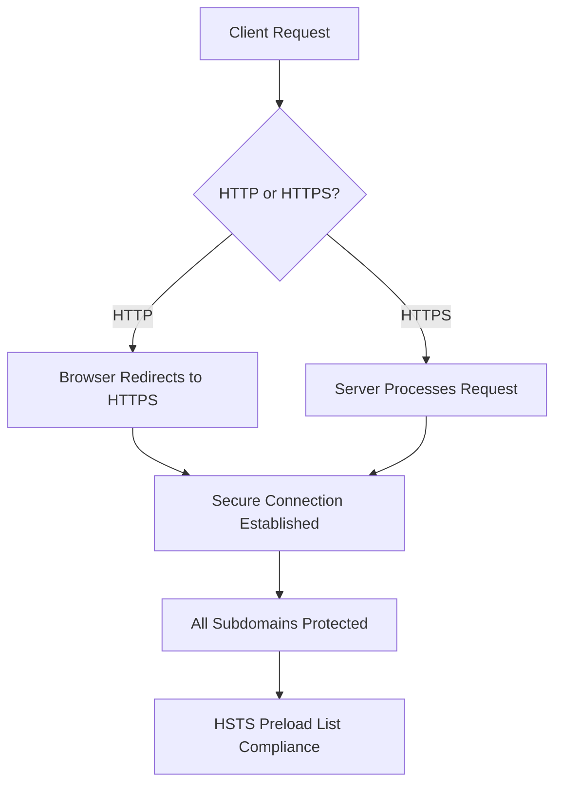
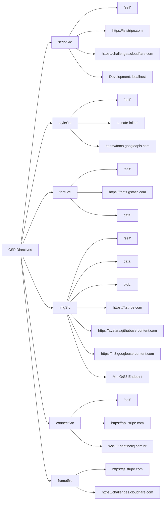
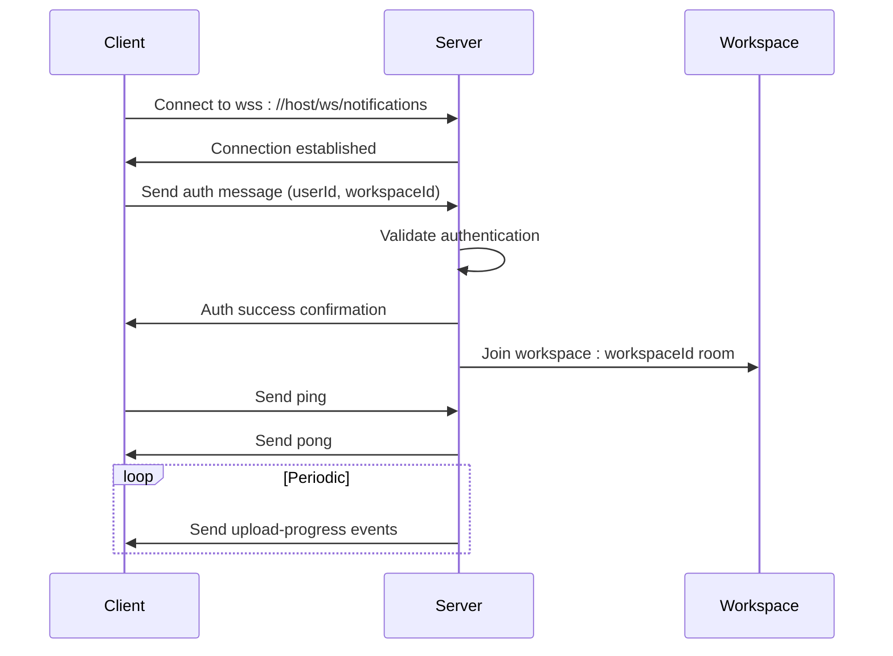

# Secure Transmission

<cite>
**Referenced Files in This Document**   
- [security.ts](file://src/server/security.ts)
- [websocketSetup.ts](file://src/server/websocketSetup.ts)
- [uploadWebSocket.ts](file://src/server/uploadWebSocket.ts)
- [sentry.ts](file://src/server/sentry.ts)
- [useNotifications.ts](file://src/client/hooks/useNotifications.ts)
- [useEclipseRealtime.ts](file://src/client/hooks/useEclipseRealtime.ts)
- [storage.ts](file://src/server/storage.ts)
</cite>

## Table of Contents
1. [Introduction](#introduction)
2. [HTTPS Enforcement with HSTS](#https-enforcement-with-hsts)
3. [Content Security Policy (CSP) Configuration](#content-security-policy-csp-configuration)
4. [Secure Cookie Attributes in Authentication](#secure-cookie-attributes-in-authentication)
5. [WebSocket Secure Connections](#websocket-secure-connections)
6. [CORS Environment-Specific Configurations](#cors-environment-specific-configurations)
7. [Security Implementation Diagram](#security-implementation-diagram)
8. [Conclusion](#conclusion)

## Introduction
SentinelIQ implements comprehensive secure transmission practices to protect data in transit and defend against common web vulnerabilities such as XSS, CSRF, and clickjacking attacks. The system employs multiple layers of security controls including HTTP Strict Transport Security (HSTS), Content Security Policy (CSP), secure cookie attributes, and encrypted WebSocket connections. These measures are systematically configured through the security middleware to ensure consistent protection across all environments while accommodating development requirements.

**Section sources**
- [security.ts](file://src/server/security.ts#L1-L268)

## HTTPS Enforcement with HSTS
SentinelIQ enforces HTTPS through HTTP Strict Transport Security (HSTS) with a comprehensive configuration that ensures all communications occur over encrypted channels. The HSTS policy is implemented via Helmet middleware with a max-age of 31536000 seconds (1 year), instructing browsers to automatically convert HTTP requests to HTTPS for the entire duration.

The implementation includes the `includeSubDomains` directive, which extends the HSTS protection to all subdomains of sentineliq.com.br, ensuring that cookies and other sensitive data cannot be intercepted through less secure subdomains. Additionally, the `preload` directive is enabled, allowing the domain to be included in browser preload lists for maximum protection against SSL stripping attacks.

This HSTS configuration is applied consistently across production environments, with the `upgradeInsecureRequests` directive automatically redirecting insecure requests to HTTPS. During development, this directive is disabled to accommodate local development workflows while maintaining other security protections.

**Diagram sources**
- [security.ts](file://src/server/security.ts#L106-L111)

**Section sources**
- [security.ts](file://src/server/security.ts#L106-L111)

## Content Security Policy (CSP) Configuration
SentinelIQ implements a strict Content Security Policy (CSP) through Helmet middleware to mitigate cross-site scripting (XSS) and other code injection attacks. The CSP configuration defines precise source controls for various content types, allowing only trusted domains while blocking unauthorized execution.

The script source policy (`scriptSrc`) restricts JavaScript execution to the same origin (`'self'`) and includes specific trusted external domains such as `https://js.stripe.com` for payment processing and `https://challenges.cloudflare.com` for CAPTCHA functionality. During development, additional localhost origins are permitted to support Vite's hot module replacement (HMR) with `'unsafe-inline'` and `'unsafe-eval'` directives, which are removed in production.

Style sources (`styleSrc`) are limited to `'self'` and `'unsafe-inline'` to accommodate inline styles, with Google Fonts (`https://fonts.googleapis.com`) explicitly allowed. Font sources (`fontSrc`) include `'self'`, Google Fonts infrastructure (`https://fonts.gstatic.com`), and data URIs for embedded fonts.

Image sources (`imgSrc`) permit content from the same origin, data URIs, blob URLs, Stripe domains, and major avatar providers like GitHub and Google. Notably, the configuration includes dynamic MinIO/S3 endpoint references through `process.env.MINIO_ENDPOINT`, ensuring secure access to stored assets.

The connect source directive (`connectSrc`) is critical for API security, allowing connections to `'self'`, Stripe's API (`https://api.stripe.com`), and secure WebSocket connections (`wss://*.sentineliq.com.br`). During development, WebSocket connections to localhost are permitted for testing purposes.

**Diagram sources**
- [security.ts](file://src/server/security.ts#L59-L96)

**Section sources**
- [security.ts](file://src/server/security.ts#L59-L96)

## Secure Cookie Attributes in Authentication
SentinelIQ employs secure cookie attributes in its authentication flows to protect session integrity and prevent unauthorized access. The system uses Wasp's authentication framework, which automatically configures session cookies with appropriate security attributes.

Authentication cookies are configured with the `HttpOnly` attribute, preventing client-side JavaScript from accessing the cookie and mitigating cross-site scripting (XSS) attacks that attempt to steal session tokens. The `Secure` attribute ensures that cookies are only transmitted over HTTPS connections, preventing exposure through insecure channels.

The `SameSite` attribute is configured to provide protection against cross-site request forgery (CSRF) attacks. While the specific SameSite policy (Strict, Lax, or None) is not explicitly defined in the provided code, Helmet's default configuration typically sets this to 'Lax' or 'Strict' depending on the context, preventing cookies from being sent in cross-site requests.

Session management is further enhanced by the session timeout middleware, which validates session expiration based on workspace configuration. Each workspace can define its own session timeout period, with a default of 30 minutes (1800 seconds) if not configured. The middleware tracks user activity and automatically invalidates sessions after the specified inactivity period, returning a 401 Unauthorized response when expired.

The session timeout implementation uses an in-memory session store during development, with guidance to use Redis in production for multi-instance deployments. Sessions are tracked with last activity timestamps, and periodic cleanup removes expired sessions to maintain system performance.

**Section sources**
- [sessionTimeout.ts](file://src/server/sessionTimeout.ts#L1-L204)
- [sentry.ts](file://src/server/sentry.ts#L15-L16)

## WebSocket Secure Connections
SentinelIQ implements secure WebSocket connections using the `wss://` protocol to encrypt real-time communication between the client and server. The system supports two WebSocket implementations: a native WebSocket server for notifications and a Socket.IO server for upload progress tracking.

The WebSocket security configuration is integrated with the application's authentication system, requiring clients to authenticate after establishing a connection. When a client connects, it sends an authentication message containing the user ID and workspace ID, which the server validates before allowing access to workspace-specific events.

The server-side WebSocket implementation is initialized through the `setupWebSocket` function in `websocketSetup.ts`, which configures both notification and upload WebSockets during server startup. The notification WebSocket uses the native `ws` library and operates on the `/ws/notifications` endpoint, while the upload WebSocket uses Socket.IO and operates on `/socket.io/upload`.

On the client side, WebSocket connections are established using the current page's protocol (determined by `window.location.protocol`). When the page is served over HTTPS, the connection uses `wss://`; when served over HTTP (development), it uses `ws://`. The connection URL is constructed using the current host, ensuring proper routing through load balancers and reverse proxies.

The WebSocket implementation includes several security features:
- Authentication handshake after connection establishment
- Workspace-specific rooms for event isolation
- Connection monitoring and automatic reconnection with exponential backoff
- Ping/pong keepalive messages to maintain connection health
- Proper cleanup on component unmount to prevent memory leaks

**Diagram sources**
- [websocketSetup.ts](file://src/server/websocketSetup.ts#L15-L30)
- [uploadWebSocket.ts](file://src/server/uploadWebSocket.ts#L46-L54)
- [useNotifications.ts](file://src/client/hooks/useNotifications.ts#L39-L80)

**Section sources**
- [websocketSetup.ts](file://src/server/websocketSetup.ts#L1-L30)
- [uploadWebSocket.ts](file://src/server/uploadWebSocket.ts#L1-L219)
- [useNotifications.ts](file://src/client/hooks/useNotifications.ts#L1-L359)
- [useEclipseRealtime.ts](file://src/client/hooks/useEclipseRealtime.ts#L116-L219)

## CORS Environment-Specific Configurations
SentinelIQ implements environment-specific CORS (Cross-Origin Resource Sharing) configurations to allow legitimate cross-origin requests while blocking unauthorized access. The CORS policy is configured through the `configureCors` function in `security.ts`, which dynamically determines allowed origins based on the current environment.

In production, the CORS policy permits requests from the main application domains: `https://sentineliq.com.br`, `https://www.sentineliq.com.br`, and `https://app.sentineliq.com.br`. Additional production domains can be specified through the `CLIENT_URL` environment variable, allowing for custom domain configurations.

During development (`NODE_ENV=development`), the policy allows requests from localhost origins on ports 3000 and 3001, accommodating common development server configurations. The implementation includes special handling for requests with no origin (such as those from mobile apps or Postman), which are permitted in development but blocked in production.

For staging and preview deployments, the `PREVIEW_URL` environment variable can specify additional allowed origins, enabling temporary access for testing environments. The CORS configuration also supports custom client URLs through the `WASP_WEB_CLIENT_URL` environment variable, particularly for the Socket.IO upload WebSocket.

The CORS middleware is configured with credentials support (`credentials: true`), allowing cookies to be included in cross-origin requests. This is essential for maintaining authenticated sessions across different subdomains or deployment environments. The allowed HTTP methods include GET, POST, PUT, DELETE, PATCH, and OPTIONS, covering all standard REST operations.

Exposed headers include `X-Total-Count` and `X-Rate-Limit-Remaining`, providing clients with pagination and rate limiting information without compromising security. The preflight response is cached for 86400 seconds (24 hours) to reduce unnecessary OPTIONS requests and improve performance.

**Section sources**
- [security.ts](file://src/server/security.ts#L149-L190)

## Security Implementation Diagram
The following diagram illustrates the comprehensive security implementation in SentinelIQ, showing how various security measures work together to protect the application.

```mermaid
graph TD
A[Client Browser] --> |HTTPS/wss://| B[SentinelIQ Server]
subgraph Security Layers
B --> C[HSTS Enforcement]
B --> D[CSP Headers]
B --> E[CORS Policy]
B --> F[Secure Cookies]
B --> G[WebSocket Security]
end
C --> H[1 Year Max-Age]
C --> I[includeSubDomains]
C --> J[preload]
D --> K[scriptSrc: self, stripe.com]
D --> L[styleSrc: self, fonts.googleapis.com]
D --> M[imgSrc: self, blob:, S3]
D --> N[connectSrc: self, api.stripe.com, wss://*.sentineliq.com.br]
E --> O[Production: sentineliq.com.br]
E --> P[Development: localhost:3000]
E --> Q[Staging: PREVIEW_URL]
F --> R[HttpOnly]
F --> S[Secure]
F --> T[SameSite]
G --> U[Authentication Handshake]
G --> V[Workspace Isolation]
G --> W[Ping/Pong Keepalive]
B --> X[Session Timeout]
X --> Y[Workspace-Specific]
X --> Z[30min Default]
B --> AA[Request Size Limits]
AA --> AB[JSON: 10MB]
AA --> AC[Raw: 50MB]
style A fill:#f9f,stroke:#333
style B fill:#bbf,stroke:#333
style C fill:#f96,stroke:#333
style D fill:#f96,stroke:#333
style E fill:#f96,stroke:#333
style F fill:#f96,stroke:#333
style G fill:#f96,stroke:#333
```

**Diagram sources**
- [security.ts](file://src/server/security.ts#L1-L268)
- [sentry.ts](file://src/server/sentry.ts#L13-L16)
- [middlewareConfig.ts](file://src/server/middlewareConfig.ts#L17-L48)

## Conclusion
SentinelIQ implements a comprehensive suite of secure transmission practices that collectively protect against XSS, CSRF, and clickjacking attacks. The system enforces HTTPS through HSTS with a 1-year max-age, includeSubDomains, and preload directives, ensuring all communications occur over encrypted channels. The Content Security Policy provides strict source controls for scripts, styles, images, and fonts, with development exceptions for Vite's HMR functionality.

Secure cookie attributes (HttpOnly, Secure, SameSite) are employed in authentication flows to protect session integrity, while WebSocket connections use the wss:// protocol for encrypted real-time communication. The CORS implementation accommodates environment-specific configurations, allowing legitimate cross-origin requests from production, staging, and development origins.

These security measures are initialized in the correct order during server startup, with security middleware applied before other application middleware to ensure protection is in place before any request processing occurs. The implementation balances security with usability, providing robust protection while accommodating legitimate development and integration requirements.

Together, these practices create a defense-in-depth approach to web security, significantly reducing the attack surface and protecting sensitive data in transit across the SentinelIQ platform.