# Security Architecture

<cite>
**Referenced Files in This Document**   
- [passwordPolicy.ts](file://src/core/auth/passwordPolicy.ts)
- [twoFactor.ts](file://src/core/auth/twoFactor.ts)
- [refreshToken.ts](file://src/core/auth/refreshToken.ts)
- [ipWhitelist.ts](file://src/core/auth/ipWhitelist.ts)
- [security.ts](file://src/server/security.ts)
- [sessionTimeout.ts](file://src/server/sessionTimeout.ts)
- [middlewareConfig.ts](file://src/server/middlewareConfig.ts)
- [auditor.ts](file://src/core/audit/auditor.ts)
- [rateLimit.ts](file://src/server/rateLimit.ts)
- [sentry.ts](file://src/server/sentry.ts)
- [sentryMiddleware.ts](file://src/server/sentryMiddleware.ts)
- [twoFactorOperations.ts](file://src/core/auth/twoFactorOperations.ts)
- [ipWhitelistOperations.ts](file://src/core/auth/ipWhitelistOperations.ts)
- [types.ts](file://src/core/audit/types.ts)
- [migration.sql](file://migrations/20251117041409_add_2fa_security_redis/migration.sql)
- [migration.sql](file://migrations/20251117045259_add_refresh_tokens_ip_whitelist_password_policy/migration.sql)
- [migration.sql](file://migrations/20251117165822_add_session_timeout/migration.sql)
</cite>

## Table of Contents
1. [Authentication Flow](#authentication-flow)
2. [Password Policy Enforcement](#password-policy-enforcement)
3. [Two-Factor Authentication (2FA)](#two-factor-authentication-2fa)
4. [Refresh Token Management](#refresh-token-management)
5. [Session Timeout Controls](#session-timeout-controls)
6. [IP Address Whitelisting](#ip-address-whitelisting)
7. [Data Protection and Secure Headers](#data-protection-and-secure-headers)
8. [Web Vulnerability Protection](#web-vulnerability-protection)
9. [Audit Logging and Compliance](#audit-logging-and-compliance)
10. [Threat Modeling and Security Testing](#threat-modeling-and-security-testing)

## Authentication Flow

The authentication flow in SentinelIQ follows a comprehensive security model that incorporates multiple layers of protection. The system implements a token-based authentication mechanism with refresh tokens, two-factor authentication, and IP-based access controls. The authentication process begins with credential validation, followed by optional 2FA verification, and concludes with token issuance. Throughout this flow, the system enforces password policies, tracks login attempts, and maintains detailed audit logs for security monitoring.

The authentication flow is designed to be both secure and user-friendly, providing enterprise-grade security while maintaining a smooth user experience. The system supports both traditional username/password authentication and modern token-based approaches, with all sensitive operations protected by additional security measures.

**Section sources**
- [twoFactor.ts](file://src/core/auth/twoFactor.ts#L1-L98)
- [passwordPolicy.ts](file://src/core/auth/passwordPolicy.ts#L1-L128)
- [refreshToken.ts](file://src/core/auth/refreshToken.ts#L1-L193)

## Password Policy Enforcement

SentinelIQ implements a robust password policy to ensure strong user credentials. The system enforces a minimum password length of 8 characters and requires a strength score of at least 3 out of 4, as determined by the zxcvbn password strength estimator. This approach goes beyond simple character composition rules by analyzing the actual entropy and crack resistance of passwords.

The password validation system includes multiple layers of checks:
- Minimum length verification (8 characters)
- Advanced strength analysis using zxcvbn library
- Character composition requirements (uppercase, lowercase, numbers, special characters)
- Detection of common patterns and weak passwords

The system provides real-time feedback to users during password creation, displaying both a strength label and color-coded indicators to guide users toward creating stronger passwords. Additionally, the system checks for common patterns such as "123", "password", "qwerty", and other easily guessable sequences.

```mermaid
flowchart TD
Start([Password Creation]) --> LengthCheck["Check minimum length (8 chars)"]
LengthCheck --> |Too short| ReturnError["Return 'Password too short'"]
LengthCheck --> |Sufficient length| ZxcvbnAnalysis["Analyze with zxcvbn"]
ZxcvbnAnalysis --> ScoreCheck["Check strength score ≥ 3"]
ScoreCheck --> |Score too low| ProvideFeedback["Show feedback and suggestions"]
ScoreCheck --> |Score sufficient| PatternCheck["Check for common patterns"]
PatternCheck --> |Contains patterns| WarnUser["Warn about weak patterns"]
PatternCheck --> |No patterns| ValidateComposition["Check character composition"]
ValidateComposition --> |Missing requirements| ReturnCompositionError["Return composition requirements"]
ValidateComposition --> |All requirements met| AcceptPassword["Accept password"]
AcceptPassword --> End([Password Set])
ReturnError --> End
ProvideFeedback --> End
WarnUser --> End
ReturnCompositionError --> End
```



**Diagram sources**
- [passwordPolicy.ts](file://src/core/auth/passwordPolicy.ts#L1-L128)

**Section sources**
- [passwordPolicy.ts](file://src/core/auth/passwordPolicy.ts#L1-L128)

## Two-Factor Authentication (2FA)

SentinelIQ implements a comprehensive two-factor authentication system using the TOTP (Time-based One-Time Password) algorithm. The 2FA implementation provides an additional layer of security beyond traditional username and password authentication, significantly reducing the risk of unauthorized access even if credentials are compromised.

The 2FA system includes the following components:
- TOTP-based verification codes generated by authenticator apps
- Backup codes for account recovery
- Account lockout mechanisms after failed attempts
- Secure secret key generation and storage

Users can enable 2FA through a multi-step process that generates a unique secret key and QR code for scanning with authenticator apps like Google Authenticator or Authy. The system also generates 8 backup codes that can be used for account recovery if the user loses access to their authenticator app.

The implementation includes security features such as:
- 6-digit code validation with a 60-second grace period (2 time steps)
- Account lockout after 5 failed attempts for 15 minutes
- Secure storage of the TOTP secret and backup codes
- Protection against brute force attacks


**Diagram sources**
- [twoFactor.ts](file://src/core/auth/twoFactor.ts#L1-L98)
- [twoFactorOperations.ts](file://src/core/auth/twoFactorOperations.ts#L1-L186)

**Section sources**
- [twoFactor.ts](file://src/core/auth/twoFactor.ts#L1-L98)
- [twoFactorOperations.ts](file://src/core/auth/twoFactorOperations.ts#L1-L186)
- [migration.sql](file://migrations/20251117041409_add_2fa_security_redis/migration.sql#L1-L15)

## Refresh Token Management

SentinelIQ implements a secure refresh token system to maintain user sessions while minimizing security risks. The refresh token mechanism allows users to stay authenticated without repeatedly entering credentials, while implementing multiple security controls to prevent misuse.

Key features of the refresh token system include:
- Cryptographically secure token generation using random bytes
- 30-day expiration period for refresh tokens
- Token rotation on each use to detect and prevent replay attacks
- Limit of 5 active refresh tokens per user
- IP address and user agent tracking for each token
- Automatic cleanup of expired tokens

The system implements a token rotation strategy where each time a refresh token is used, it is immediately revoked and replaced with a new one. This approach provides protection against token theft, as any attempt to reuse a previously used token will result in all tokens for that user being revoked.

The refresh token database schema includes fields for token storage, expiration tracking, usage statistics, and client information (IP address and user agent), enabling comprehensive security monitoring and forensic analysis.


**Diagram sources**
- [refreshToken.ts](file://src/core/auth/refreshToken.ts#L1-L193)
- [migration.sql](file://migrations/20251117045259_add_refresh_tokens_ip_whitelist_password_policy/migration.sql#L1-L33)

**Section sources**
- [refreshToken.ts](file://src/core/auth/refreshToken.ts#L1-L193)
- [migration.sql](file://migrations/20251117045259_add_refresh_tokens_ip_whitelist_password_policy/migration.sql#L1-L33)

## Session Timeout Controls

SentinelIQ implements workspace-specific session timeout controls to enhance security by automatically invalidating inactive sessions. This feature allows organizations to configure appropriate timeout values based on their security requirements, with a default of 30 minutes (1800 seconds) for inactive sessions.

The session timeout system tracks user activity and automatically terminates sessions that exceed the configured inactivity threshold. Key features include:
- Workspace-specific timeout configuration
- Real-time activity tracking for each session
- Automatic session invalidation after inactivity
- In-memory session store with periodic cleanup
- Integration with the authentication system

The implementation uses an in-memory session store to track the last activity time for each session. On each authenticated request, the system updates the session's last activity timestamp. If a request is received after the session has timed out, the system returns a 401 Unauthorized response with a specific timeout code.

For production deployments with multiple server instances, the documentation recommends using Redis as a distributed session store instead of the in-memory implementation to ensure consistent session management across all instances.

```mermaid
flowchart TD
A([Request Received]) --> B{Authenticated?}
B --> |No| C[Proceed with request]
B --> |Yes| D{Session active?}
D --> |No| C
D --> |Yes| E{Workspace-specific timeout?}
E --> |No| F[Use default timeout (30 min)]
E --> |Yes| G[Fetch workspace timeout setting]
G --> H[Check last activity time]
H --> I{Inactive time > timeout?}
I --> |No| J[Update last activity]
I --> |Yes| K[Invalidate session]
K --> L[Return 401 Unauthorized]
J --> C
C --> M([Request processed])
L --> M
```

**Diagram sources**
- [sessionTimeout.ts](file://src/server/sessionTimeout.ts#L1-L205)
- [migration.sql](file://migrations/20251117165822_add_session_timeout/migration.sql#L1-L3)

**Section sources**
- [sessionTimeout.ts](file://src/server/sessionTimeout.ts#L1-L205)
- [migration.sql](file://migrations/20251117165822_add_session_timeout/migration.sql#L1-L3)

## IP Address Whitelisting

SentinelIQ provides IP address whitelisting as an enterprise security feature to restrict access to specific IP addresses or ranges. This capability is particularly valuable for organizations with strict security requirements or those operating in regulated industries.

The IP whitelisting system supports multiple formats:
- Individual IP addresses (e.g., 192.168.1.100)
- CIDR notation (e.g., 192.168.1.0/24)
- Wildcard patterns (e.g., 192.168.1.*)

The implementation includes a comprehensive validation system that checks the format of IP addresses and CIDR ranges before adding them to the whitelist. Only workspace owners can modify the IP whitelist, and the feature is restricted to enterprise plan subscribers.

The system integrates with request middleware to enforce IP restrictions on workspace routes. When a request is received, the middleware extracts the client IP address from various headers (X-Forwarded-For, X-Real-IP, etc.) and checks if it matches any entry in the workspace's whitelist. If the IP is not whitelisted, the request is denied with a 403 Forbidden response.


**Diagram sources**
- [ipWhitelist.ts](file://src/core/auth/ipWhitelist.ts#L1-L189)
- [ipWhitelistOperations.ts](file://src/core/auth/ipWhitelistOperations.ts#L1-L281)

**Section sources**
- [ipWhitelist.ts](file://src/core/auth/ipWhitelist.ts#L1-L189)
- [ipWhitelistOperations.ts](file://src/core/auth/ipWhitelistOperations.ts#L1-L281)
- [migration.sql](file://migrations/20251117045259_add_refresh_tokens_ip_whitelist_password_policy/migration.sql#L1-L33)

## Data Protection and Secure Headers

SentinelIQ implements comprehensive data protection measures through secure HTTP headers and request validation. The system uses Helmet.js to configure security headers that protect against various web vulnerabilities and enforce secure communication.

Key security headers implemented include:
- **Content Security Policy (CSP)**: Restricts sources for scripts, styles, images, and other resources
- **HTTP Strict Transport Security (HSTS)**: Enforces HTTPS connections with a 1-year max-age
- **X-Frame-Options**: Prevents clickjacking attacks by disallowing iframe embedding
- **X-Content-Type-Options**: Prevents MIME type sniffing
- **Referrer-Policy**: Controls referrer information sent with requests
- **Permissions-Policy**: Disables access to sensitive browser features

The Content Security Policy is carefully configured to allow necessary third-party services (Stripe, Cloudflare) while blocking unauthorized sources. The policy includes different directives for development and production environments, allowing Vite's development server in development mode while maintaining strict controls in production.

Additionally, the system implements request size limits to prevent denial-of-service attacks:
- JSON payloads: 10MB limit
- URL-encoded data: 10MB limit
- Text data: 10MB limit
- Raw/file uploads: 50MB limit

```mermaid
graph TB
subgraph "Security Headers"
A[CSP] --> B[Restrict script sources]
A --> C[Restrict style sources]
A --> D[Restrict image sources]
A --> E[Restrict connect sources]
F[HSTS] --> G[Enforce HTTPS]
H[X-Frame-Options] --> I[Prevent clickjacking]
J[X-Content-Type-Options] --> K[Prevent MIME sniffing]
L[Referrer-Policy] --> M[Control referrer info]
N[Permissions-Policy] --> O[Disable sensitive features]
end
subgraph "Request Protection"
P[Request Size Limits] --> Q[JSON: 10MB]
P --> R[URL-encoded: 10MB]
P --> S[Text: 10MB]
P --> T[Raw/Files: 50MB]
U[Rate Limiting] --> V[Redis-based tracking]
U --> W[Configurable thresholds]
end
Security Headers --> DataProtection
Request Protection --> DataProtection
```

**Diagram sources**
- [security.ts](file://src/server/security.ts#L1-L268)
- [middlewareConfig.ts](file://src/server/middlewareConfig.ts#L1-L49)

**Section sources**
- [security.ts](file://src/server/security.ts#L1-L268)
- [middlewareConfig.ts](file://src/server/middlewareConfig.ts#L1-L49)

## Web Vulnerability Protection

SentinelIQ implements multiple layers of protection against common web vulnerabilities, following industry best practices and security standards. The system addresses key threats including Cross-Site Scripting (XSS), Cross-Site Request Forgery (CSRF), injection attacks, and other common security risks.

For XSS protection, the system employs a multi-layered approach:
- Content Security Policy (CSP) to restrict script sources
- Automatic escaping of user input in templates
- X-XSS-Protection header to enable browser XSS filters
- Input validation and sanitization for all user-provided data

CSRF protection is implemented through:
- SameSite cookie attributes (Lax by default)
- Anti-CSRF tokens for state-changing operations
- Origin and referer header validation
- CORS policies that restrict cross-origin requests

The system also protects against injection attacks through:
- Parameterized queries and prepared statements for database access
- Input validation using Zod schemas
- Rate limiting to prevent brute force attacks
- Comprehensive input sanitization

Additional security measures include:
- CORS configuration that restricts cross-origin requests to approved domains
- Rate limiting using Redis to prevent abuse
- Secure cookie attributes (HttpOnly, Secure)
- Regular dependency updates to address known vulnerabilities


**Diagram sources**
- [security.ts](file://src/server/security.ts#L1-L268)
- [rateLimit.ts](file://src/server/rateLimit.ts#L1-L85)

**Section sources**
- [security.ts](file://src/server/security.ts#L1-L268)
- [rateLimit.ts](file://src/server/rateLimit.ts#L1-L85)

## Audit Logging and Compliance

SentinelIQ implements comprehensive audit logging to track security events and support compliance requirements. The system captures detailed information about user actions, authentication events, and configuration changes, providing a complete audit trail for security monitoring and forensic analysis.

The audit logging system is built around an event-driven architecture that captures security-relevant events throughout the application. Key features include:
- Automatic logging of user actions and system events
- Detailed context information including IP address and user agent
- Support for filtering and querying audit logs
- Integration with external monitoring systems

Audit logs capture the following information for each event:
- Workspace ID
- User ID (when applicable)
- Action performed
- Resource affected
- Resource ID (when applicable)
- Descriptive text
- Metadata (structured data about the event)
- Client IP address
- User agent string

The system uses an event bus pattern where components emit events with audit data, and a central auditor service persists these events to the database. This decoupled architecture ensures that audit logging does not impact the performance of core application functionality.

The audit system supports compliance with various regulatory requirements by providing tamper-evident logs that can be used for security reviews, incident investigations, and compliance audits.


**Diagram sources**
- [auditor.ts](file://src/core/audit/auditor.ts#L1-L81)
- [types.ts](file://src/core/audit/types.ts#L1-L61)

**Section sources**
- [auditor.ts](file://src/core/audit/auditor.ts#L1-L81)
- [types.ts](file://src/core/audit/types.ts#L1-L61)

## Threat Modeling and Security Testing

SentinelIQ incorporates threat modeling and security testing practices into its development lifecycle to identify and mitigate potential security risks. The system follows a proactive approach to security, addressing threats at multiple levels of the architecture.

The threat modeling process includes:
- Identification of assets and trust boundaries
- Enumeration of potential threats using STRIDE methodology
- Assessment of threat likelihood and impact
- Definition of mitigation strategies for identified risks
- Regular review and update of threat models

Security testing practices include:
- Static application security testing (SAST) of source code
- Dynamic application security testing (DAST) of running applications
- Dependency scanning for known vulnerabilities
- Penetration testing by internal and external security experts
- Regular security code reviews

The system implements several security monitoring and alerting mechanisms:
- Integration with Sentry for error and performance monitoring
- ELK stack (Elasticsearch, Logstash, Kibana) for centralized logging
- Custom security event logging for suspicious activities
- Rate limiting with Redis to prevent abuse
- Account lockout mechanisms after failed login attempts

The security architecture is designed with defense in depth principles, implementing multiple layers of protection so that the compromise of a single control does not lead to system compromise. Security controls are distributed across the application stack, from the database layer to the user interface.


**Diagram sources**
- [sentry.ts](file://src/server/sentry.ts#L1-L114)
- [sentryMiddleware.ts](file://src/server/sentryMiddleware.ts#L1-L89)
- [elk/README.md](file://elk/README.md)

**Section sources**
- [sentry.ts](file://src/server/sentry.ts#L1-L114)
- [sentryMiddleware.ts](file://src/server/sentryMiddleware.ts#L1-L89)