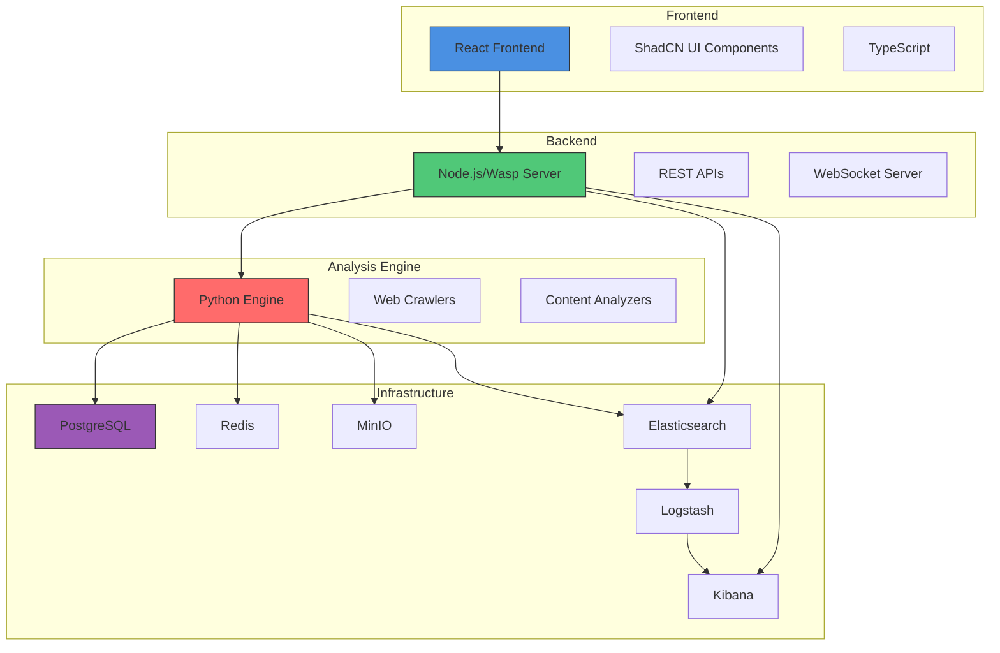
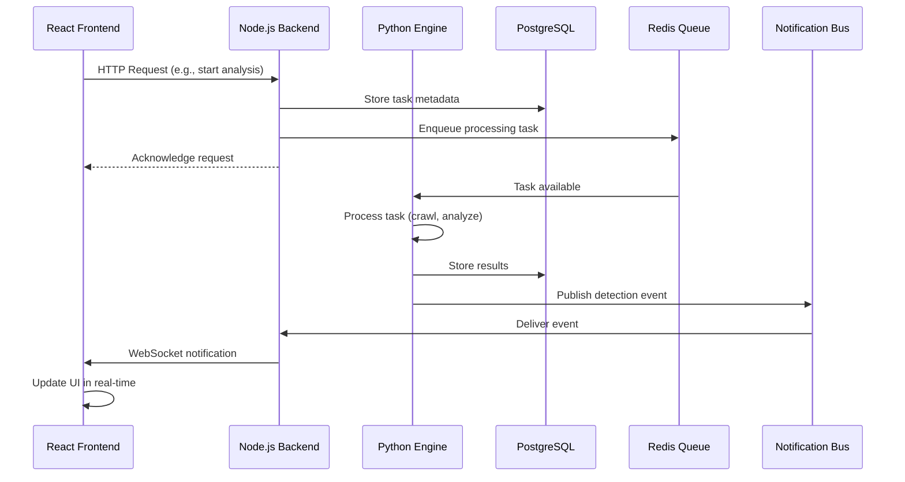
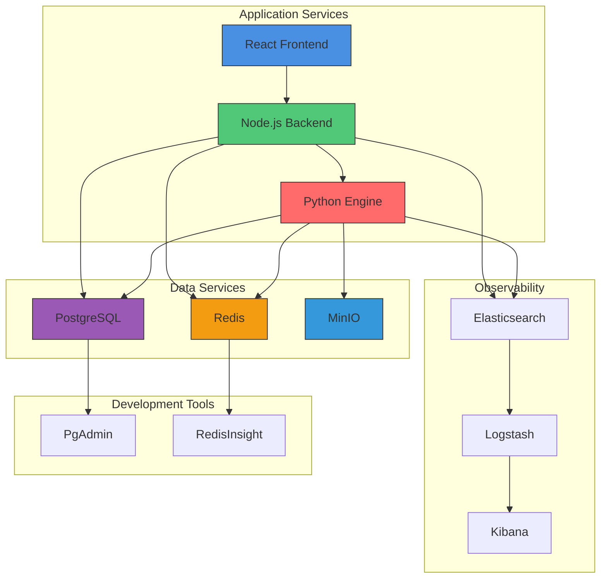
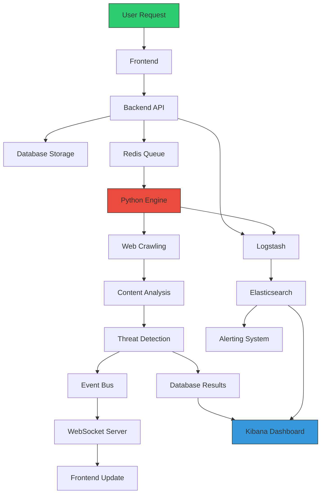

# System Overview

<cite>
**Referenced Files in This Document**   
- [docker-compose.yml](file://docker-compose.yml)
- [services/engine/main.py](file://services/engine/main.py)
- [services/engine/Dockerfile](file://services/engine/Dockerfile)
- [src/client/App.tsx](file://src/client/App.tsx)
- [src/server/websocketSetup.ts](file://src/server/websocketSetup.ts)
- [src/server/uploadWebSocket.ts](file://src/server/uploadWebSocket.ts)
- [src/core/notifications/eventBus.ts](file://src/core/notifications/eventBus.ts)
- [elk/README.md](file://elk/README.md)
- [src/core/modules/eclipse/index.ts](file://src/core/modules/eclipse/index.ts)
- [src/core/modules/aegis/operations.ts](file://src/core/modules/aegis/operations.ts)
</cite>

## Table of Contents
1. [Introduction](#introduction)
2. [Core Capabilities](#core-capabilities)
3. [High-Level Architecture](#high-level-architecture)
4. [Component Interaction](#component-interaction)
5. [Deployment Topology](#deployment-topology)
6. [Data Flow](#data-flow)

## Introduction

SentinelIQ is a comprehensive security intelligence and digital brand protection platform designed to help organizations detect, respond to, and prevent online threats. Built on a modern technology stack, SentinelIQ provides a unified solution for security teams to monitor digital assets, investigate incidents, and protect brand integrity across the internet. The platform combines advanced threat detection capabilities with intuitive user interfaces and robust backend processing to deliver actionable intelligence in real-time.

The system is architected as a multi-tenant SaaS application, allowing multiple organizations to securely operate within isolated workspaces while sharing the same underlying infrastructure. This design enables efficient resource utilization while maintaining strict data separation and compliance with security requirements. SentinelIQ's modular architecture supports extensibility, allowing new capabilities to be added without disrupting existing functionality.

**Section sources**
- [docker-compose.yml](file://docker-compose.yml)
- [src/client/App.tsx](file://src/client/App.tsx)

## Core Capabilities

SentinelIQ delivers several core capabilities through specialized modules that address different aspects of security intelligence and brand protection. The platform's functionality is organized around three primary pillars: threat detection and incident response, brand monitoring, and multi-tenant workspace management.

### Aegis: Threat Detection and Incident Response

The Aegis module serves as SentinelIQ's incident response and threat intelligence system. It provides security teams with tools to detect, investigate, and respond to security incidents across digital assets. Aegis enables users to create and manage security alerts, conduct digital forensics, and maintain chain-of-custody documentation for evidence. The module supports integration with MITRE ATT&CK framework for standardized threat classification and provides timeline visualization of incident progression.

### Eclipse: Brand Monitoring and Protection

The Eclipse module focuses on digital brand protection, monitoring the internet for unauthorized use of intellectual property, trademark violations, and other brand infringements. Eclipse employs web crawling and content analysis techniques to identify potential threats across various online platforms. The system can detect brand mentions, counterfeit products, and phishing sites that impersonate legitimate brands. Users can configure monitoring rules, set confidence thresholds for alerts, and track infringement trends over time.

### Multi-Tenant Workspace Management

SentinelIQ's multi-tenant architecture enables organizations to create isolated workspaces for different departments, clients, or business units. Each workspace operates with its own data isolation, user management, and configuration settings while sharing common platform infrastructure. The system supports workspace branding, ownership transfer, and storage quotas, making it suitable for both internal security teams and managed security service providers.

**Section sources**
- [src/core/modules/aegis/operations.ts](file://src/core/modules/aegis/operations.ts)
- [src/core/modules/eclipse/index.ts](file://src/core/modules/eclipse/index.ts)
- [docker-compose.yml](file://docker-compose.yml)

## High-Level Architecture

SentinelIQ follows a distributed microservices architecture with clear separation between frontend, backend, and analysis components. The system is composed of several interconnected layers that work together to deliver security intelligence capabilities.

**Diagram sources **
- [docker-compose.yml](file://docker-compose.yml)
- [src/client/App.tsx](file://src/client/App.tsx)
- [services/engine/main.py](file://services/engine/main.py)

**Section sources**
- [docker-compose.yml](file://docker-compose.yml)
- [package.json](file://package.json)
- [services/engine/Dockerfile](file://services/engine/Dockerfile)

## Component Interaction

Components within SentinelIQ interact through well-defined interfaces using APIs, WebSockets, and event-driven notifications. This decoupled communication pattern enables scalability and fault tolerance across the system.

### API Communication

The React frontend communicates with the Node.js backend through RESTful APIs for most operations. These APIs handle authentication, data retrieval, and command execution. The backend processes requests, enforces business logic, and interacts with the database and other services as needed.

### Real-Time Notifications

SentinelIQ employs WebSocket connections for real-time updates and notifications. Two separate WebSocket servers handle different types of real-time communication:
- A native WebSocket server for notification delivery
- A Socket.IO server for tracking file upload progress

These real-time channels enable instant updates to the user interface when new alerts are generated, analysis results are available, or system events occur.

### Event-Driven Processing

The system uses an event-driven architecture for asynchronous processing and notifications. When significant events occur (such as new threat detections or system alerts), they are published to an event bus. Various subscribers can then react to these events by sending notifications, updating dashboards, or triggering additional processing workflows.

**Diagram sources **
- [src/server/websocketSetup.ts](file://src/server/websocketSetup.ts)
- [src/server/uploadWebSocket.ts](file://src/server/uploadWebSocket.ts)
- [src/core/notifications/eventBus.ts](file://src/core/notifications/eventBus.ts)
- [services/engine/main.py](file://services/engine/main.py)

**Section sources**
- [src/server/websocketSetup.ts](file://src/server/websocketSetup.ts)
- [src/core/notifications/eventBus.ts](file://src/core/notifications/eventBus.ts)

## Deployment Topology

SentinelIQ is deployed using Docker Compose, which orchestrates multiple containerized services to create a complete development and production environment. The deployment topology includes all necessary infrastructure components for a fully functional security intelligence platform.

### Core Services

The platform relies on several key infrastructure services:
- **PostgreSQL**: Primary relational database for structured data storage
- **Redis**: In-memory data store for caching, session management, and task queuing
- **MinIO**: S3-compatible object storage for file attachments, screenshots, and media
- **ELK Stack**: Elasticsearch, Logstash, and Kibana for log aggregation, analysis, and visualization

### Analysis Engine

The Python-based analysis engine runs as a separate service that consumes tasks from Redis queues. This engine performs web crawling, content analysis, and threat detection. It uses Playwright for browser automation, Tesseract OCR for text extraction from images, and YARA rules for pattern matching in content analysis.

### Development and Monitoring Tools

The deployment includes several auxiliary services for development and monitoring:
- **PgAdmin**: Web-based PostgreSQL administration interface
- **RedisInsight**: GUI for Redis data exploration and management
- **Sentry**: Error tracking and performance monitoring for both frontend and backend

**Diagram sources **
- [docker-compose.yml](file://docker-compose.yml)
- [services/engine/Dockerfile](file://services/engine/Dockerfile)

**Section sources**
- [docker-compose.yml](file://docker-compose.yml)
- [scripts/setup-minio.sh](file://scripts/setup-minio.sh)
- [elk/README.md](file://elk/README.md)

## Data Flow

The data flow in SentinelIQ follows a pipeline pattern from initial request to final analysis and notification. Understanding this flow is essential for comprehending how the system processes security intelligence.

### Analysis Pipeline

1. **Request Initiation**: A user initiates an analysis task through the frontend interface
2. **Task Queuing**: The backend stores task metadata in PostgreSQL and enqueues the task in Redis
3. **Task Processing**: The Python engine polls Redis for tasks and processes them
4. **Web Crawling**: The engine uses Playwright to crawl specified URLs or search results
5. **Content Analysis**: Retrieved content is analyzed using OCR, regex matching, and YARA rules
6. **Result Storage**: Analysis results and detected threats are stored in PostgreSQL
7. **Notification**: Events are published to the notification bus for real-time updates
8. **Visualization**: Results are displayed in the frontend interface with appropriate alerts

### Observability Pipeline

In parallel with the analysis pipeline, all system components generate logs that are collected and processed:
- Application logs are sent to Logstash via TCP/UDP
- Logstash processes and enriches log data before forwarding to Elasticsearch
- Elasticsearch indexes the logs for fast searching and retrieval
- Kibana provides a web interface for log exploration, visualization, and alerting

This comprehensive data flow ensures that all activities within the system are traceable, auditable, and available for security analysis.

**Diagram sources **
- [elk/README.md](file://elk/README.md)
- [services/engine/main.py](file://services/engine/main.py)
- [src/server/websocketSetup.ts](file://src/server/websocketSetup.ts)

**Section sources**
- [elk/README.md](file://elk/README.md)
- [services/engine/main.py](file://services/engine/main.py)
- [src/core/logs/logger.ts](file://src/core/logs/logger.ts)