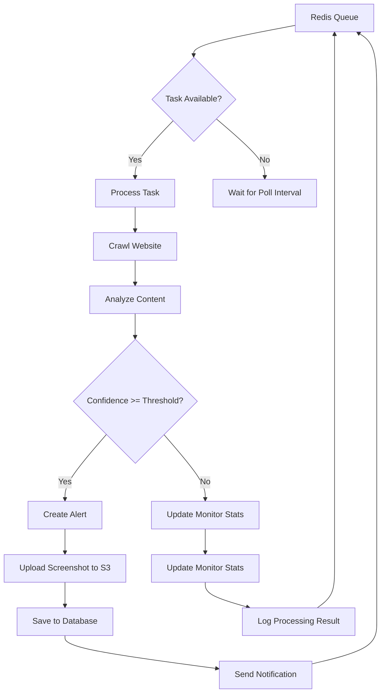
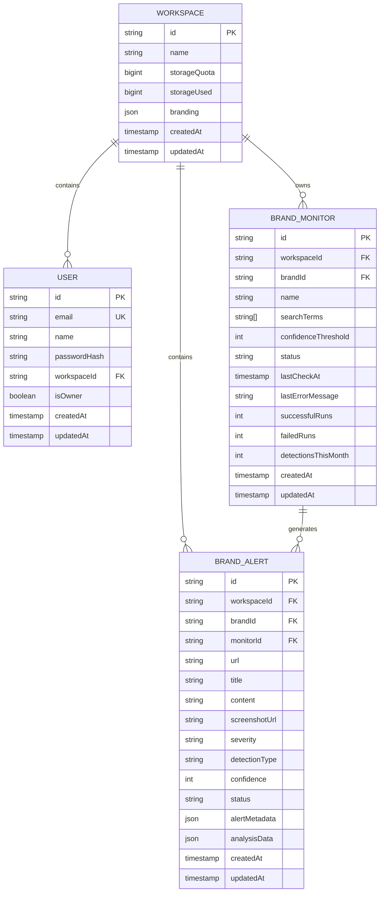
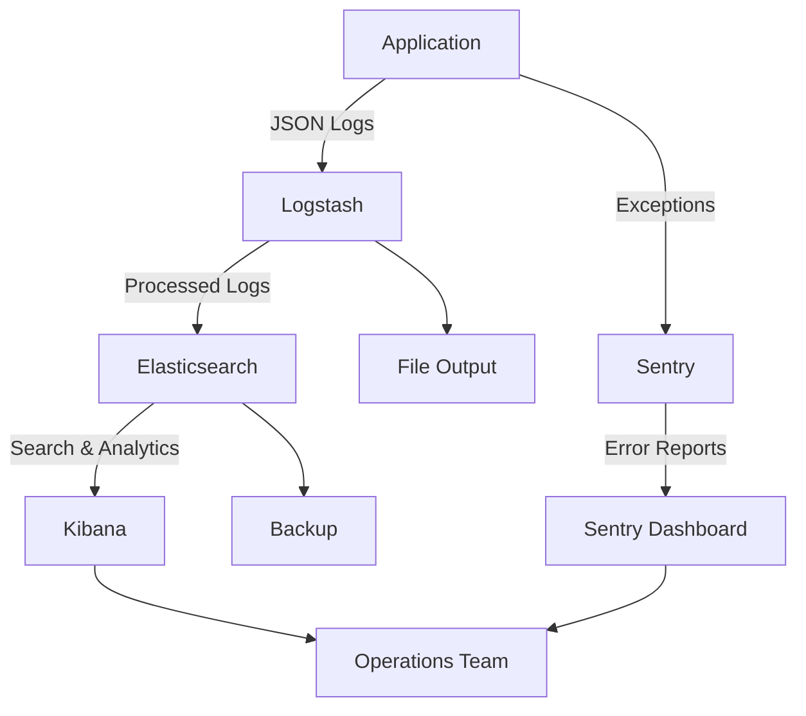

# Technology Stack

<cite>
**Referenced Files in This Document**   
- [package.json](file://package.json)
- [docker-compose.yml](file://docker-compose.yml)
- [tailwind.config.js](file://tailwind.config.js)
- [components.json](file://components.json)
- [sentry.ts](file://src/server/sentry.ts)
- [middlewareConfig.ts](file://src/server/middlewareConfig.ts)
- [elkLogger.ts](file://src/server/elkLogger.ts)
- [storage.ts](file://src/server/storage.ts)
- [vite.config.ts](file://vite.config.ts)
- [main.py](file://services/engine/main.py)
- [requirements.txt](file://services/engine/requirements.txt)
- [elk/README.md](file://elk/README.md)
</cite>

## Table of Contents
1. [Frontend Architecture](#frontend-architecture)
2. [Backend and API Layer](#backend-and-api-layer)
3. [Data Processing Engine](#data-processing-engine)
4. [Database and Storage Systems](#database-and-storage-systems)
5. [Monitoring and Observability](#monitoring-and-observability)
6. [Integration Patterns](#integration-patterns)
7. [Dependency Management](#dependency-management)
8. [Technology Rationale](#technology-rationale)

## Frontend Architecture

The frontend of SentinelIQ is built using a modern TypeScript stack with React as the core UI framework, orchestrated through the Wasp framework. The development environment leverages Vite for fast builds and hot module replacement, providing an efficient developer experience.

React components follow a modular structure with clear separation of concerns, organized into components, hooks, layouts, and pages. The UI leverages ShadCN UI components, which are built on top of Radix UI primitives and Tailwind CSS, providing accessible, customizable, and production-ready components. The component architecture emphasizes reusability and maintainability, with a comprehensive set of UI primitives including dialogs, dropdowns, forms, and data displays.

Tailwind CSS serves as the utility-first CSS framework, configured with custom themes and design tokens that support both light and dark modes. The configuration extends the default theme with custom spacing, typography, colors, and animations, while integrating plugins for forms, typography, and animations. The design system follows a consistent color palette using CSS variables for theming, with support for responsive design across multiple breakpoints.

**Section sources**
- [package.json](file://package.json#L57-L79)
- [tailwind.config.js](file://tailwind.config.js#L10-L292)
- [components.json](file://components.json#L1-L21)
- [vite.config.ts](file://vite.config.ts#L1-L43)

## Backend and API Layer

The backend API layer is implemented using Express.js within the Wasp framework, providing a robust foundation for handling HTTP requests and server-side logic. The server configuration includes comprehensive middleware for security, request parsing, and error handling. Request size limits are configured to prevent denial-of-service attacks, with different limits for JSON (10MB), URL-encoded (10MB), text (10MB), and raw/file (50MB) payloads.

Authentication and authorization are handled through a combination of JWT tokens, refresh tokens, IP whitelisting, and two-factor authentication, with session management and timeout policies for enhanced security. The API layer integrates with various external services including Stripe for payments, Sentry for error tracking, and multiple notification providers (Slack, Discord, Teams, email, webhooks).

WebSocket communication is implemented for real-time features, with separate servers for notifications (using native WebSocket protocol) and file uploads (using Socket.IO). This dual approach allows optimized handling of different real-time use cases while maintaining separation of concerns.

**Section sources**
- [package.json](file://package.json#L40-L53)
- [middlewareConfig.ts](file://src/server/middlewareConfig.ts#L1-L48)
- [sentry.ts](file://src/server/sentry.ts#L1-L113)
- [websocketSetup.ts](file://src/server/websocketSetup.ts#L1-L30)

## Data Processing Engine

The data processing engine is implemented in Python 3.x, specifically designed for web crawling, content analysis, and brand protection monitoring. The engine follows a microservices architecture, running as a separate service from the main Node.js application, allowing for language-specific optimizations and resource isolation.

The engine leverages several key Python libraries:
- **Playwright** for browser automation and screenshot capture
- **Scrapy** for web crawling and data extraction
- **YARA** for pattern matching and threat detection
- **PyTesseract** for OCR processing of images
- **Pandas** and **NumPy** for data analysis and manipulation

The processing workflow follows a queue-based pattern, with tasks consumed from Redis and processed asynchronously. Each task involves crawling target websites, analyzing content for brand infringement, extracting relevant information, and storing results in the PostgreSQL database. The engine supports configurable confidence thresholds for alert generation and integrates with MinIO/S3 for storing screenshots and other binary data.

**Diagram sources**
- [main.py](file://services/engine/main.py#L1-L283)
- [requirements.txt](file://services/engine/requirements.txt#L1-L38)

## Database and Storage Systems

SentinelIQ employs a multi-layered data storage strategy with specialized systems for different use cases. The primary relational database is PostgreSQL 16, serving as the system of record for all structured data including user accounts, workspaces, configurations, and application state. The database schema is managed through Prisma ORM with versioned migrations, ensuring consistent schema evolution across environments.

Redis 7 is used for multiple purposes: as a message queue for the Python data processing engine, for caching frequently accessed data, and for storing session information. The Redis configuration includes persistence through append-only files (AOF) to prevent data loss during restarts.

For object storage, the system uses MinIO (S3-compatible) for storing files, screenshots, and other binary data. The storage service provides features like automatic image optimization, signed URL generation for secure access, storage quota management, and workspace isolation. The service is designed to be compatible with both MinIO (for development and self-hosting) and AWS S3 (for cloud deployments).

**Diagram sources**
- [docker-compose.yml](file://docker-compose.yml#L5-L235)
- [storage.ts](file://src/server/storage.ts#L1-L599)

## Monitoring and Observability

The monitoring and observability stack follows the ELK (Elasticsearch, Logstash, Kibana) architecture, providing comprehensive logging, searching, and visualization capabilities. All application logs are structured as JSON and forwarded to Logstash, which processes and enriches them before indexing in Elasticsearch. Kibana provides a web interface for exploring logs, creating visualizations, and building dashboards.

The logging system captures detailed information including timestamps, log levels, components, workspace IDs, user IDs, request IDs, IP addresses, and custom metadata. Error logs include stack traces and contextual information to facilitate debugging. The system supports log retention policies, with automatic cleanup of logs older than the configured retention period (default 90 days).

In addition to centralized logging, the system integrates Sentry for error tracking and performance monitoring. Sentry captures exceptions, provides stack traces, and tracks error frequency across environments. The integration includes user context, request data, and custom metadata while filtering out sensitive information like authorization headers and cookies.

**Diagram sources**
- [elk/README.md](file://elk/README.md#L1-L347)
- [elkLogger.ts](file://src/server/elkLogger.ts#L1-L269)
- [sentry.ts](file://src/server/sentry.ts#L1-L113)

## Integration Patterns

The integration between Node.js and Python services follows a decoupled, message-based architecture using Redis as the communication channel. This pattern allows the services to be developed, deployed, and scaled independently while maintaining reliable communication.

The Node.js application publishes tasks to a Redis queue when brand monitoring configurations are created or updated. The Python data processing engine consumes these tasks, processes them, and writes results back to the PostgreSQL database. This asynchronous pattern ensures that the main application remains responsive even during intensive data processing operations.

The integration includes several key features:
- **Error handling and retry mechanisms** to ensure reliability
- **Health checks** for both services to detect and recover from failures
- **Graceful shutdown** procedures to prevent data loss
- **Monitoring and logging** to track the flow of data between services
- **Configuration management** through environment variables for different deployment environments

The system also implements a webhook-based integration pattern for notifications, allowing external systems to receive real-time updates about events in the platform. This pattern supports multiple notification channels including email, Slack, Discord, Microsoft Teams, and custom webhooks.

**Section sources**
- [docker-compose.yml](file://docker-compose.yml#L173-L228)
- [main.py](file://services/engine/main.py#L1-L283)
- [redis_client.py](file://services/engine/utils/redis_client.py)

## Dependency Management

Dependency management follows a polyglot approach, with separate strategies for Node.js and Python components. The Node.js application uses npm for package management, with a comprehensive package.json file listing all dependencies and devDependencies. The dependency tree includes over 50 packages, with key libraries including React, Express, Prisma, Tailwind CSS, and various UI components.

The Python data processing engine uses pip with a requirements.txt file to manage dependencies. The requirements are carefully pinned to specific versions to ensure reproducible builds and prevent unexpected breaking changes. The dependency list includes libraries for web crawling, data processing, database access, and cloud storage.

Both systems follow security best practices, with regular dependency updates and vulnerability scanning. The Docker-based deployment ensures consistent environments across development, testing, and production. The docker-compose.yml file defines all service dependencies and their versions, providing a complete picture of the runtime environment.

Version compatibility is carefully managed, with the following key versions:
- Node.js: 18.x (implied by package.json dependencies)
- Python: 3.9+ (required by Playwright and other libraries)
- PostgreSQL: 16
- Redis: 7
- Elasticsearch: 8.11.0
- MinIO: latest stable

**Section sources**
- [package.json](file://package.json#L1-L116)
- [requirements.txt](file://services/engine/requirements.txt#L1-L38)
- [docker-compose.yml](file://docker-compose.yml#L1-L235)

## Technology Rationale

The technology choices for SentinelIQ reflect a careful balance between developer productivity, performance, scalability, and maintainability. The full-stack TypeScript approach with React and Wasp enables rapid development with strong typing and excellent tooling support. Wasp specifically provides a high-level abstraction for full-stack development, reducing boilerplate and allowing developers to focus on business logic.

The decision to use Python for the data processing engine was driven by the rich ecosystem of libraries for web scraping, data analysis, and machine learning. Python's strengths in these domains make it ideally suited for the brand monitoring and content analysis use cases. The separation of the data processing engine from the main application allows for independent scaling and optimization of resource-intensive tasks.

PostgreSQL was chosen as the primary database due to its robust feature set, reliability, and strong support for complex queries and transactions. The integration with Prisma ORM provides a type-safe interface to the database while supporting advanced features like migrations and relationship management.

Redis serves multiple roles in the architecture, demonstrating the principle of using the right tool for the right job. Its in-memory nature makes it ideal for caching and real-time communication, while its data structures support the queue-based processing pattern. The use of Redis for both queuing and caching reduces the number of external dependencies while providing excellent performance.

The ELK stack provides enterprise-grade logging and monitoring capabilities, essential for a security-focused application. The structured logging approach enables powerful search and analysis capabilities, while the integration with Sentry provides complementary error tracking and performance monitoring.

The use of MinIO/S3 for object storage follows cloud-native principles, allowing the application to be deployed in various environments while maintaining consistent storage semantics. The automatic image optimization and storage quota management features enhance both performance and user experience.

Overall, the technology stack reflects a modern, cloud-native architecture that prioritizes scalability, reliability, and developer experience while meeting the specific requirements of a security and brand protection platform.

**Section sources**
- [package.json](file://package.json)
- [docker-compose.yml](file://docker-compose.yml)
- [elk/README.md](file://elk/README.md)
- [README.md](file://README.md)